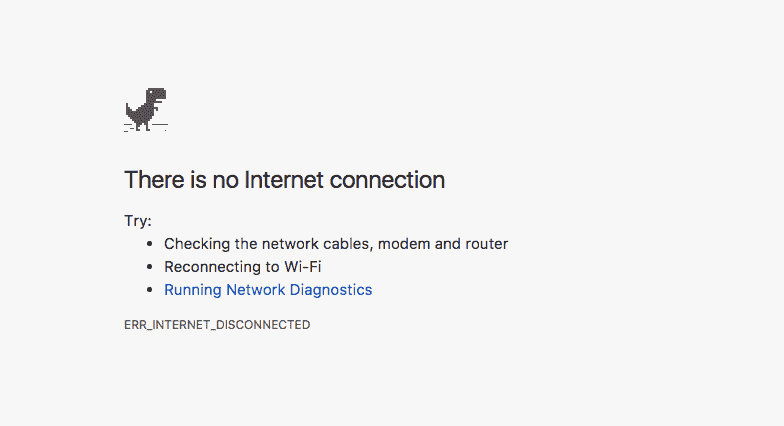

# 服务工作者:进步网络应用背后的小英雄

> 原文：<https://www.freecodecamp.org/news/service-workers-the-little-heroes-behind-progressive-web-apps-431cc22d0f16/>

> 对学习 JavaScript 感兴趣？在 jshandbook.com 获得我的电子书

服务人员是进步网络应用的核心。它们允许缓存资源和推送通知，这是迄今为止让原生应用与众不同的两个主要特征。

服务人员是你的网页和网络之间的一个可编程的代理人，提供拦截和缓存网络请求的能力。这有效地让你**为你的应用**创造了离线优先的体验。

服务工作者是一种特殊的 web 工作者:一个与 web 页面相关联的 JavaScript 文件，它运行在一个工作者上下文中，独立于主线程。这带来了非阻塞的好处——因此计算可以在不牺牲 UI 响应的情况下完成。

因为它在一个单独的线程上，所以它没有 DOM 访问权。它也不能访问本地存储 API 和 XHR API。它只能使用**通道消息 API** 与主线程通信。

服务人员与其他最新的 Web APIs 合作:

*   **承诺**
*   **获取 API**
*   **缓存 API**

并且它们**只在 HTTPS** 协议页面上可用(本地请求除外，本地请求不需要安全连接。这使得测试更加容易。).

### 后台处理

服务工作者独立于与他们相关联的应用程序运行，并且他们可以在不活动时接收消息。

例如，它们可以工作:

*   当您的移动应用程序在背景中**不活动时**
*   当你的移动应用程序关闭甚至不在后台运行时
*   当**浏览器关闭**时，如果应用程序正在浏览器中运行

服务人员非常有用的主要场景有:

*   它们可以用作**缓存层**来处理网络请求，并缓存离线时使用的内容
*   他们可以允许**推送通知**

服务人员只在需要时运行，不使用时就停止运行。

### 离线支持

传统上，网络应用的离线体验非常差。没有网络，移动网络应用程序通常无法运行。另一方面，本地移动应用程序有能力提供工作版本或某种友好的信息。

这不是一个好消息，但这是一个没有网络连接的网页在 Chrome 中的样子:



可能唯一的好处是你可以通过点击恐龙来玩一个免费的游戏——但是很快就会变得很无聊。


不久前，HTML5 AppCache 已经承诺允许 web 应用缓存资源并离线工作。但它缺乏灵活性和令人困惑的行为表明，它对这项工作来说不够好(而且[它已经停产](https://html.spec.whatwg.org/multipage/offline.html#offline))。

服务工作者是离线缓存的新标准。

哪种缓存是可能的？

### 安装期间的预缓存资产

在整个应用程序中重复使用的资产，如图像、CSS、JavaScript 文件，可以在第一次打开应用程序时安装。

这为所谓的**应用外壳架构**提供了基础。

### 缓存网络请求

使用 **Fetch API，**我们可以编辑来自服务器的响应，确定服务器是否不可达，并提供来自缓存的响应。

### 服务人员生命周期

服务人员要完全发挥作用需要经过三个步骤:

*   登记
*   装置
*   激活

### 登记

注册告诉浏览器服务器工作者在哪里，它在后台开始安装。

注册放置在`worker.js`中的服务人员的示例代码:

```
if ('serviceWorker' in navigator) {   window.addEventListener('load', () => {       navigator.serviceWorker.register('/worker.js')     .then((registration) => {       console.log('Service Worker registration completed with scope: ', registration.scope)     }, (err) => {       console.log('Service Worker registration failed', err)    })  })} else {   console.log('Service Workers not supported') }
```

即使多次调用此代码，浏览器也只会在服务人员是新的且以前没有注册过或者已经更新过的情况下执行注册。

#### 范围

`register()`调用还接受一个作用域参数，这个参数是一个路径，它决定了应用程序的哪一部分可以由服务工作者控制。

它默认为包含服务工作者文件的文件夹中包含的所有文件和子文件夹，因此如果您将它放在根文件夹中，它将拥有对整个应用程序的控制。在子文件夹中，它将只控制在该路径下可访问的页面。

下面的例子通过指定`/notifications/`文件夹范围来注册 worker。

```
navigator.serviceWorker.register('/worker.js', {   scope: '/notifications/' })
```

`/`很重要:在这种情况下，页面`/notifications`不会触发服务工作者，而如果范围

```
{ scope: '/notifications' }
```

它会起作用的。

注意:服务人员不能从文件夹中“向上”自己:如果它的文件放在`/notifications`下，它不能控制`/`路径或任何其他不在`/notifications`下的路径。

### 装置

如果浏览器确定某个服务人员已经过时或者以前从未注册过，它将继续安装该服务人员。

```
self.addEventListener('install', (event) => {   //... });
```

这是一个很好的时机来准备服务工作者，以供**初始化缓存使用。**然后**使用**缓存 API** 缓存应用外壳**和静态资产。

### 激活

服务人员成功注册和安装后，第三步是激活。

此时，服务人员将能够处理新的页面加载。

它不能与已经加载的页面进行交互，因此服务人员只有在用户第二次与应用程序交互或重新加载已经打开的页面时才有用。

```
self.addEventListener('activate', (event) => {   //... });
```

此事件的一个很好的用例是清理旧的缓存以及与旧版本相关联的、在服务工作器的新版本中未使用的内容。

### 更新服务人员

要更新一个服务工作者，你只需要改变其中的一个字节。当注册码运行时，它将被更新。

一旦服务人员被更新，它将不可用，直到所有加载了旧服务人员的页面被关闭。

这可以确保已经运行的应用程序/页面不会出现任何问题。

刷新页面是不够的，因为老工人仍在运行，它还没有被删除。

### 获取事件

当在网络上请求资源时，触发**获取事件**。

这为我们提供了在发出网络请求之前查看缓存的能力。

例如，下面的代码片段使用**缓存 API** 来检查请求的 URL 是否已经存储在缓存的响应中。如果是这样，它将返回缓存的响应。否则，它执行获取请求并返回它。

```
self.addEventListener('fetch', (event) => {  event.respondWith(     caches.match(event.request)       .then((response) => {         if (response) {           //entry found in cache           return response         }         return fetch(event.request)       }     )   ) })
```

### 后台同步

后台同步允许传出连接被延迟，直到用户有一个正常工作的网络连接。

这是确保用户可以离线使用应用程序，对其采取行动，并在连接打开时对服务器端更新进行排队的关键(而不是显示无休止的旋转车轮试图获得信号)。

```
navigator.serviceWorker.ready.then((swRegistration) => {   return swRegistration.sync.register('event1') });
```

此代码侦听服务工作器中的事件:

```
self.addEventListener('sync', (event) => {   if (event.tag == 'event1') {     event.waitUntil(doSomething())   } })
```

`doSomething()`回报承诺。如果失败，将安排另一个同步事件自动重试，直到成功。

这也允许应用程序在有可用的工作连接时立即从服务器更新数据。

### 推送事件

服务人员支持 web 应用向用户提供本地推送通知。

推送和通知实际上是两种不同的概念和技术，它们结合在一起提供了我们所知的**推送通知**。推送提供了允许服务器向服务人员发送信息的机制，而通知是服务人员向用户显示信息的方式。

由于服务人员即使在应用程序不运行时也在运行，他们可以监听推送事件的到来。然后，它们要么提供用户通知，要么更新应用程序的状态。

推送事件由后端通过浏览器推送服务发起，就像由 [Firebase](https://flaviocopes.com/firebase-hosting) 提供的服务。

以下是 web worker 如何监听传入推送事件的示例:

```
self.addEventListener('push', (event) => {   console.log('Received a push event', event) 
```

```
 const options = {     title: 'I got a message for you!',     body: 'Here is the body of the message',     icon: '/img/icon-192x192.png',     tag: 'tag-for-this-notification',   } 
```

```
 event.waitUntil(     self.registration.showNotification(title, options)   ) })
```

### 关于控制台日志的说明:

如果你在服务人员中有任何控制台日志语句(`console.log`和好友)，确保你开启了 Chrome Devtools(或同等工具)提供的`Preserve log`功能。

否则，由于服务工作人员在页面加载之前就采取了行动，并且控制台在页面加载之前就被清空了，所以您在控制台中看不到任何日志。

> 对学习 JavaScript 感兴趣？在 jshandbook.com 获得我的电子书