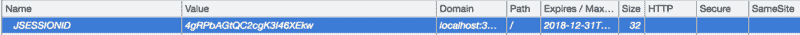
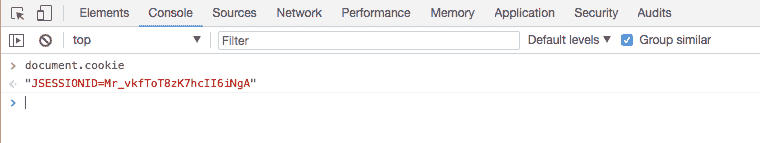
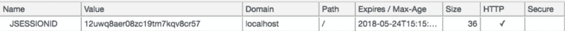
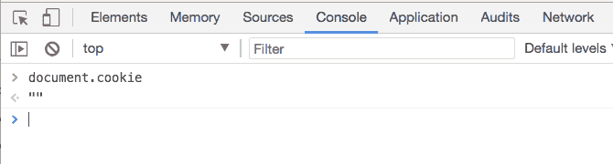
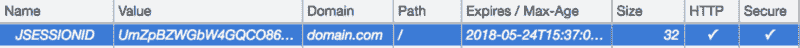

# 什么是会话劫持以及如何阻止它

> 原文：<https://www.freecodecamp.org/news/session-hijacking-and-how-to-stop-it-711e3683d1ac/>

作者:拉梅什·林加帕

# 什么是会话劫持以及如何阻止它


Yummy Cookies

> 这个故事是为初学者和对 cookie(会话 cookie)有基本了解，但不知道如何正确保护它们的人编写的。要做到这一点，你不必成为安全专家。你只需要了解过程，然后你就知道了。

如果你对 cookie 或者它们如何工作没有任何概念，那么请阅读这篇关于[HTTP cookie](https://developer.mozilla.org/en-US/docs/Web/HTTP/Cookies)的文章。

我们开始吧！你有一个了不起的 web 应用程序，为客户提供了很好的服务。这意味着您将有一个**认证**机制来让用户访问您的应用程序。你知道安全有多重要。您在身份验证期间实施了各种安全措施。**太好了！**

认证成功后，您必须为该用户创建一个**会话**。这意味着您实际上正在创建一个 **cookie** ，并将其发送回浏览器。例如，在 Java web 应用程序中，默认情况下，它被称为 **JSESSIONID。**看起来是这样的:



Cookie information from Chrome Dev Console -> Applications -> Cookies

通过使用这个 cookie，只有您的 web 服务器能够识别用户是谁，并相应地提供内容。这饼干看起来很棒。cookie 中没有敏感信息，只有随机 ID(不可猜测)。所以用户是**安全的！**…对吧？

不完全是，让我们仔细看看。


这个 cookie 中有两个属性: **HttpOnly (HTTP)** 和 **Secure。**它们的值为空，表示该 cookie *未启用**。这就是它变得不再安全的原因。***

这就是会话劫持发挥作用的地方。

> **会话劫持**，有时也被称为 cookie **劫持**是利用有效的计算机**会话**——有时也被称为**会话**密钥——来获得对计算机系统中的信息或服务的未授权访问。— [维基百科](https://en.wikipedia.org/wiki/Session_hijacking)

因此，这是窃取客户会话 ID 的行为，通过这种行为，他们可以访问您的 web 应用程序，就好像他们是那个客户一样。

**这可能吗？他们如何获得用户浏览器中的会话 ID？**

是的，有可能。我们之前看到的两个 cookie 属性(或标志)( **HttpOnly** 和 **Secure** )就是原因。

### **HttpOnly 标志**

> JavaScript 的`[**Document.cookie**](https://developer.mozilla.org/en-US/docs/Web/API/Document/cookie)` API 无法访问 cookies 它们只被发送到服务器。例如，持久化服务器端会话的 cookies 不需要对 JavaScript 可用，并且应该设置`HttpOnly`标志。

所以简单来说，如果你没有设置 httpOnly 标志，那么你的 cookie 就可以从前端 JavaScript 代码中读取。

打开任何 cookie 没有设置 httpOnly 标志的网页。然后打开 **Chrome Dev 控制台**，再点击**控制台标签** (Cmd + Shift+ J 或者 Ctrl + Shift+ J)。键入`*document.cookie*`并输入，您将看到类似这样的内容:



document.cookie usage

如您所见，您获得了所有的 cookie 信息。JavaScript 攻击者可以简单地将其发布到他们自己的服务器上以备后用。

您可能想知道他们如何在您的应用程序中编写这些代码。有几种可能。

一种方法是注入一些**不可信的第三方 JS 库**，比如日志、助手工具等。阅读这篇文章 [**我正在从你的网站获取信用卡号码和密码。下面就来说说**](https://hackernoon.com/im-harvesting-credit-card-numbers-and-passwords-from-your-site-here-s-how-9a8cb347c5b5) **。**

另一种方式是利用 [**跨站脚本攻击**](https://www.owasp.org/index.php/Cross-site_Scripting_%28XSS%29) **。我们不打算讨论它的细节，但请记住这是可以做到的。**

#### 那么我们如何解决这个问题呢？

JavaScript 客户机甚至不需要访问会话 cookie。只有服务器需要它。我们应该让它只对服务器开放。在你的 ***set_cookie*** http 响应头中添加一个字( **httpOnly** )即可。像这样:

```
Set-Cookie: JSESSIONID=T8zK7hcII6iNgA; Expires=Wed, 21 May 2018 07:28:00 GMT; HttpOnly
```

通过添加 **httpOnly** 标志，您指示浏览器这个 cookie 不应该被 JavaScript 代码读取。浏览器会处理剩下的事情。这是添加 httpOnly 标志后的样子:



cookie set with httpOnly flag

请注意 HTTP 属性中的勾号。这表明 **httpOnly** 被使能。



这里你可以看到 ***document.cookie*** 没有返回我们的 session cookie。这意味着任何 JS 都不能读取它，包括任何外部脚本。

就这样——还剩一个！

### 安全标志

**secure** 标志指示浏览器 cookie 应该只通过加密连接返回给应用程序，即 HTTPS 连接。

因此，当一个带有标志 **secure、**的 cookie 被发送到浏览器时，当您使用 HTTP 向应用程序发出请求时，浏览器不会在请求中附加这个 cookie。它将仅在 HTTPS 请求中附加它。HTTPS 请求将被加密，因此 cookies 将通过网络安全地发送到您的应用程序。

如何读取 HTTP 请求中的 cookie？

当有人(称为**“中间人”**攻击)正在监控客户网络中的所有流量时，就可以实现这一点。如果请求在 *HTTP 中，他们能够看到明文数据。*

当它通过 *HTTPS* 发送时，所有的数据将从浏览器加密并发送到网络。攻击者将无法获得您发送的原始数据。攻击者也无法解密内容。这就是为什么通过 SSL 发送数据是安全的。

#### 那我们怎么解决呢？

就像 httpOnly 标志一样，你只需要在你的 ***set_cookie*** HTTP 响应头中添加 **secure** 标志即可。像这样:

```
Set-Cookie: JSESSIONID=T8zK7hcII6iNgA; Expires=Wed, 21 May 2018 07:28:00 GMT; HttpOnly; Secure
```

在 Java 中，这可以通过几种方式实现。如果您正在使用 Servlet 3.0 或更高版本，那么您可以在 ***web.xml*** 中配置这些设置，如下所示:

```
<session-config>    <cookie-config>        <http-only>true</http-only>        <secure>true</secure>    </cookie-config> </session-config>
```

如果您的环境不支持，那么您可以手动添加它。例如，使用 Servlets，您可以这样做:

最后，这是设置了两个标志时的样子，



### 结论

因此，当您处理会话 cookie 或任何其他重要的 cookie 时，请确保添加这两个标志。

感谢阅读，**安全快乐！**