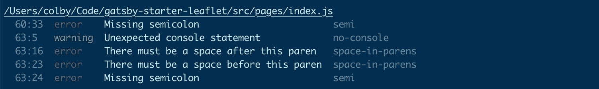

# 如何用良好的编码习惯为你未来的成功做准备

> 原文：<https://www.freecodecamp.org/news/set-future-you-up-for-success-with-good-coding-habits/>

编码前先思考。你有能力让自己未来的生活成为人间天堂或人间地狱。

在这篇文章中，我们将探索你能做些什么来让你未来的自己变得更轻松。

## 重温“现有技术”

我们都经历过。一个项目进行了六个月，你正试图消灭一个 bug，你的发现令人震惊。你可能会问自己，“谁会写这种代码？”

因此，您通过使用显示特定文件更改的`git log -p filename.js`来挖掘您的 [git](https://git-scm.com/) 提交历史，试图看看谁会提出这样的东西。然后你的心就沉下去了——是你写的！


Tituss Burgess shocked

这是任何开发人员的常见场景，无论是有经验的还是新手。如果你还没有遇到这种情况，我保证如果你坚持编码足够长的时间，你会的。

## 更加关注我们的编码习惯

六个月的反思是不可避免的。这是一个很长的时间，你很可能用在项目的其他部分或另一个项目上。很有可能，你已经升级了，这改变了你写代码的方式。

另一方面，有时需要跳出代码来看到更大的画面，更好地了解所有部分是如何组合在一起的。我们自然会在解决方案中陷得太深，在努力解决这些挑战时会变得有点狭隘。

但是不管怎样，虽然代码之旅的一部分仅仅是获得更多的经验和学习更多关于你的技术，但是你可以在早期习惯其他的小习惯，这将帮助你走下去。

所以让我们开始吧。

## 提高代码的可读性

### 挑战是什么？

我们这项技术的部分乐趣在于，你可以用很多方法来做同样的事情。认为一个`if`语句太多行？嗯我们可以把它写成[三元](https://developer.mozilla.org/en-US/docs/Web/JavaScript/Reference/Operators/Conditional_Operator)风格！

```
// Example ternary statement
const isFreezing = temperature <= 32 ? true : false; 
```

但有时这会影响代码的可读性。虽然在一行中它看起来很好，非常简洁，但是想象一下，随着三元组变得越来越复杂，有人将不得不花更多的时间来理解它的意思。

```
const minutes = 30;
const cookie = {
  color: 'black'
};

const cookieStatus = minutes > 20 ? cookie.color === 'black' ? 'burned' : 'done' : 'not done'; 
```

### 我们能做得更好吗？

现在，我想我们大多数人都可以找出这个例子中的`cookieStatus`是什么(剧透:`burned`)。但是想想你花了多少时间才想明白。无论是额外的 1 还是 2，它都迫使你花费额外的认知能量来通读代码。

另一方面:

```
const minutes = 30;
const cookie = {
  color: 'black'
};
let cookieStatus;

if ( minutes <= 20 ) {
  cookieStatus = 'not done';
} else if ( cookie.color === 'black' ) {
  cookieStatus = 'burned';
} else {
  cookieStatus = 'done';
} 
```

不，它可能不像一行三进制语句那样干净或聪明，但是下次你访问它时，你就不用考虑答案是什么了。

当所有的代码更改都在一行 git diff 中时，这也将使 bug 更容易爬上来并通过您的代码审查。

是的，这是一个简单的例子。但是想象一下，在一个具有重要业务逻辑的真实场景中，您可能会经常遇到这些情况。

假设您需要添加另一个条件——三元组只会变得越来越复杂！您只是让调试或扩展变得更加困难，而`if`语句可以以一种易于阅读的方式继续。

值得一提的是，ternaries 和其他快捷方式在代码中可能简单而有效，但是不要滥用这种有效性，最终使事情变得更加困难。

## 保持事物的一致性

### 挑战是什么？

我们都有自己喜欢的编码方式。虽然我认为不在 JavaScript 的末尾加上分号是完全错误的，但是如果没有分号，你可能更喜欢用错误的方式编写代码。

```
// Jim's code style

function MyComponent() {
  function handleOnClick() {
    alert('Click!')
  }
  return (
    <button onClick={handleOnClick}>My Button</button>
  )
}

// Creed's code style

const MyComponent = () => <button onClick={() => alert('Click!')}>My Button</button>;
```

但这并不总是关于你喜欢什么。当与团队一起工作时，每个人对代码应该是什么样子的看法可能会略有不同。你可能同意分号，但不同意空格。

而且谁也没有错(非分号的除外)！无论是支持还是反对，大多数代码风格都有有效的论据，但解决方案并不是每个人都按照自己的方式编写代码。

### 我们能做得更好吗？

保持代码一致对于维护代码健康非常重要。一个典型的目标是“让代码库看起来像是一个人写的。”

关键不在于一个人随心所欲，而在于团队得出了一个结论，那就是他们将使用一套所有人都将遵循的规则。当人们通过代码工作时，拥有这种一致性提供了较少的认知开销。它让每个人都能知道在阅读代码时会发生什么。



Errors from linting code

实现这一点并不困难。有一些工具可以简单地检查这些不一致性，比如 Javascript 的 T2 Eslint T3。更好的是，还有另一个级别的工具，像[漂亮的](https://prettier.io/)，[会帮你修好它](https://www.colbyfayock.com/2019/11/dont-just-lint-your-code-fix-it-with-prettier)！

## 注释您的代码

### 挑战是什么？

不断注释您的代码是将上下文置于复杂逻辑中的一种重要方式。尽管我们都希望我们的代码是自文档化的，但这种情况很少发生。

我们经常发现自己在处理一段毫无意义的代码。即使它本身有意义，我们也可能无法弄清楚它如何适应应用程序的其余部分。

### 我们能做得更好吗？

通过提供一组好的注释，你就为下一个接触代码的人做好了准备，让他们在做出改变之前更好地理解代码在做什么。

```
// DONT CHANGE - WILL STOP MAKING MONEY

const shouldMakeMoney = true;

function makeMoney() {
  if ( shouldMakeMoney ) {
    return noMoney;
  }
  return moreMoney;
} 
```

虽然这是一个愚蠢的例子，但它引出了一个真实的案例。企业越来越依赖于能够维护一个可靠的网站来赚钱。无论是作为一个电子商务企业还是广告巨头，这些网站都依赖于商业逻辑，这些逻辑决定了成本、税收、折扣和其他与数学相关的事情，这些事情我们往往不想去想，但却可能决定互联网业务的成败。

但这不全是关于你工作的公司。触摸旧代码可能会令人害怕。更可怕的是，当它被编写时，你的团队中没有人在旁边，所以没有人知道它是干什么的！


Patton Oswalt hands over mouth

虽然你可能不是下一个接触这些代码的人，但是试着去帮助你未来的朋友，他正在处理下一张涉及这些代码的罚单。因为你也很有可能成为那个人，你会希望你记得它是如何工作的。

## 记录您的解决方案

### 挑战是什么？

文档类似于注释你的代码，但是从不同的角度来看。文档和注释都是为了找到以人类可读的方式描述解决方案的方法，最终提供更多的上下文。但是文档更多的是关于整体解决方案，而不是实现细节。

拥有一个高性能的应用程序是每个人的目标。但是我们是怎么做到的呢？有一个现实的机会，有人将不得不在同一个项目中工作，你就像一个新的团队成员。如果他们不知道它是如何工作的，他们怎么能保持高性能呢？

### 我们能做得更好吗？

无论是向项目介绍新的团队成员，还是尝试与另一个项目团队共享知识，文档都是维护项目的重要部分。这有助于让每个人都在同一页上，所以我们都自信地知道我们在朝着什么方向努力。

例如，如果我们仍然使用我们的业务逻辑来处理我们的电子商务项目，那么将会有代码需要实现的规则。虽然注释可能会提供关于规则如何实现的细节，但是文档会定义这些规则。

```
/**
 * DOCUMENTATION
 * Order Total >= 25: Discount %10
 * Order Total >= 50: Discount %15
 * Order Total >= 100: Discount %20
 * Order Total >= 75: Free Shipping
 */

const orderSubTotal = 84.00;
let orderTotal = orderSubTotal;

// If the order total is under 75, apply shipping discount

if ( orderTotal < 75 ) {
  orderTotal = addShipping(orderTotal);
}

// If the order total reaches a threshold, apply given discount

if ( orderTotal >= 100) {
  orderTotal = applyDiscount(orderTotal, .2);
} else if ( orderTotal >= 50 ) {
  orderTotal = applyDiscount(orderTotal, .15);
} else if ( orderTotal >= 25 ) {
  orderTotal = applyDiscount(orderTotal, .1);
} 
```

这是一个最小的例子，但我们可以看到顶部的规则和我们如何应用它们之间的差异。文档应该清楚地解释规则是什么，但是不应该关心这些规则是如何实现的。

另一方面，注释可能并不关心规则是什么，而是需要以一种有效且符合逻辑的方式实现它们。我们应该能够用业务规则更新代码，例如将最高折扣级别从$100 更改为$80，而不必重新编写代码。

但是文档不仅仅是业务规则——它为任何人提供了一种从更高层次理解你的工作的方式。这可能包括从架构图到核心算法背后的理论的任何东西。

虽然代码可能不是这种细节存在的最佳地方，但它确实是非常重要的信息，可以帮助您在项目中树立信心，并让其他人有机会更多地了解这项工作。

## 创建有效的拉式请求

### 挑战是什么？

拉请求(或者合并请求)是任何开发团队项目生命周期的核心部分。它提供了一种以可消费的方式包装和呈现您的代码的方法，以便您的同行审阅和理解您的工作。

从一个提交到你的网站的下一个版本，有很多可以变成一个拉的请求。仅仅通过阅读提交就能理解大量的上下文。

### 我们能做得更好吗？

拉式请求不需要成为一门艺术。你所做的准备应该有一个主要目标——为你的改变提供背景。至少，它应该回答“是什么”和“为什么”的问题。

我们甚至可以使用像拉请求模板这样的工具来把我们推向正确的方向。定义你想要解释的东西的大纲，人们很可能会遵循这个大纲。这有助于避免一行“closes [ticket]”描述，甚至更糟糕的是，一个空的描述。

对于我的项目，我希望在开始代码审查之前有几个问题得到解答:

*   变化是什么？
*   有什么影响？
*   我如何重现或测试变更？

围绕变更集的一些细节可以为那些审查您的代码的人提供非常需要的上下文。看代码很容易，但如果不知道它如何融入更大的画面，理解它就更难了。

## 用测试强化您的代码

### 挑战是什么？

测试是确保您的代码每次都以相同的方式运行的一种方式。能够证明相同的输入将总是具有相同的输出将有助于为您和您的团队提供更高水平的信心，即您的应用程序不会因为下一个小的更改而崩溃。

没有它们，我们就剩下人为错误，无论你的 QA 工程师有多好(对我的测试人员大喊)，总会有一些东西溜走。这并不是说您的测试将总是捕捉到每个问题，但我们可以使用可用的工具来帮助防止它。

### 我们能做得更好吗？

评论是提供事物如何工作的背景的一种方式，而测试是确保它们工作的一种方式。提供可重复的测试用例有助于加强这一点。

```
function applyDiscount(value, discount) {
  const discountAmount = value * discount;
  return value - discountAmount;
}

expect(applyDiscount(10, .1)).toEqual(.9);
expect(applyDiscount(532151235, .1054)).toEqual(476062494.831); 
```

如果我在上面的`applyDiscount`函数上做手脚，测试很有可能会失败(永远不要说不)。

但是测试不需要很难。有许多工具可以从不同的角度提供帮助。例如，您可以使用 [Jest](https://jestjs.io/) 来运行您的单元测试，或者在上面添加[酶](https://enzymejs.github.io/enzyme/)来测试您的 React 组件。但是你也可以引入 [Cypress](https://www.cypress.io/) 作为一个集成测试解决方案，它将像一个机器人点击你的应用程序一样工作，以确保所有组件实际上一起工作。

还有不同的测试方法。虽然你可能会看到大多数团队在有了工作解决方案后编写他们的测试，但是有些人相信[测试驱动开发](https://en.wikipedia.org/wiki/Test-driven_development)。在代码必须通过测试的地方，他们可能首先编写测试，而不是相反。这是在深入研究之前定义代码需求的好方法。

无论采用哪种方法，都要抓住最有可能突破的点或增加最大商业价值的功能。你将有助于防止潜在的业务损失，甚至更简单，头痛。

## 我们能从中学到什么？

这可能需要消化很多东西，但是作为一名开发人员，它们是成长过程中需要考虑的要点。在你职业生涯的早期开始这些习惯将帮助你自然地建立这些技能，并默认以这种方式工作。

如果你在职业生涯中迟到了，开始永远不会太晚。我们都应该努力成为最好的开发人员，尽最大努力让我们的队友生活得更轻松，因为我们都在一起。

## 想了解更多信息吗？

*   [放下 Javascript -学习 HTML & CSS](https://www.colbyfayock.com/2019/08/put-down-the-javascript-learn-html-css)
*   [如何在 2020 年成为全栈 Web 开发者](https://www.colbyfayock.com/2020/02/how-to-become-a-full-stack-web-developer-in-2020)
*   [什么是 JAMstack，我该如何开始？](https://www.colbyfayock.com/2020/02/what-is-the-jamstack-and-how-do-i-get-started)
*   什么是林挺，它如何为您节省时间？
*   [为什么你应该像在 Instagram 上发帖一样写合并请求](https://www.freecodecamp.org/news/why-you-should-write-merge-requests-like-youre-posting-to-instagram-765e32a3ec9c/)

## 作为一名开发人员，你对自己的成长有什么建议？

在 Twitter 上与我分享！

[](https://twitter.com/colbyfayock)

*   [？在 Twitter 上关注我](https://twitter.com/colbyfayock)
*   [？️订阅我的 Youtube](https://youtube.com/colbyfayock)
*   [✉️注册我的简讯](https://www.colbyfayock.com/newsletter/)