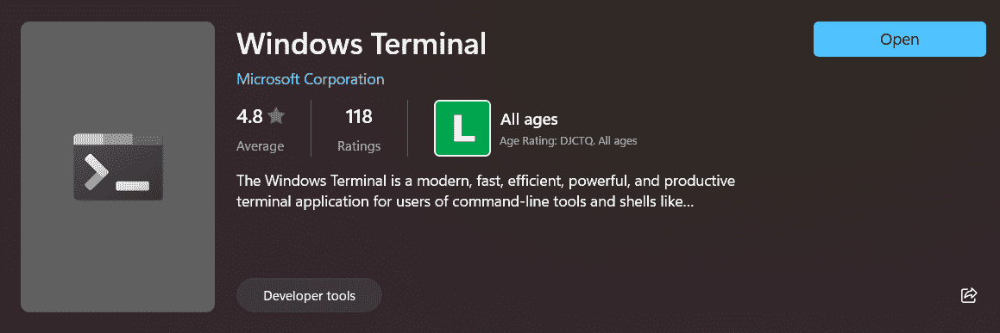
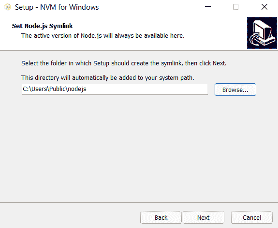
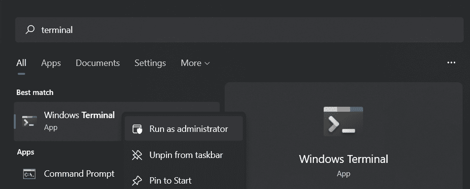
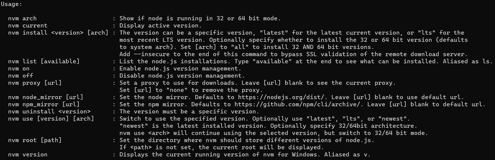

# 如何用 NVM 设置 Node.js 开发的 Windows

> 原文：<https://www.freecodecamp.org/news/set-up-windows-for-nodejs-development-with-nvm/>

因此，您希望在玩游戏、编辑视频、编写 C#桌面应用程序或做其他事情的同一台计算机上使用 JavaScript run-everywhere 平台进行开发。

您还知道有多个 Node.js 版本正在开发中，并且经常会发现一些项目只能在其中的一小部分中运行。

那么这本指南是给你的。因此，让我们为 Node.js 设置一个具有多版本管理的 Windows 机器，同时解决常见的缺陷。

## 如何安装 Windows 终端

如果你使用的是 Windows 11，好消息是:你已经安装了 Windows 终端。如果没有，打开微软商店免费下载。



这是一个硬件加速的选项卡式终端，您可以从中运行 Powershell、CMD 或 WSL 界面。这是使 Windows 开发体验类似于其他主流操作系统的重要一步(有人会说，这一步有点晚了)。

如果您计划在 Windows 上使用 Node.js 或其他方式进行开发，强烈建议您安装此终端。

## 如何为 Windows 安装 NVM

现在不用从官网安装 Node.js，而是安装节点版本管理器，从那里下载节点版本。

如果您已经安装了节点，这应该不是一个大问题，因为 NVM 将覆盖任何与节点相关的环境变量和符号链接。尽管如此，我还是建议你卸载它，因为这个过程会使当前的安装完全无用。

进入 [NVM for windows](https://github.com/coreybutler/nvm-windows) 项目页面，从[发布页面](https://github.com/coreybutler/nvm-windows/releases)下载最新可用版本的`nvm-setup.zip`。

请注意，这与基于 UNIX 的 [NVM](https://github.com/nvm-sh/nvm) 项目不同，尽管它在功能上是等效的。项目本身所披露的“相似，不相同”。

解压文件夹的内容并运行`nvm-setup.exe`。你将被提示同意该项目的使用条款(目前是麻省理工学院的许可)，然后安装程序将询问在哪里安装 nvm。这也将是下载的节点版本及其全局启用的程序包所在的位置。你当前用户下的漫游应用数据文件夹应该完全没问题。

然而，随后会提示您指出保存 Node.js 符号链接的位置，并且(至少在 1.1.8 之前的版本中)有一个问题:*您不能将符号链接保存在包含空格*的路径下，不幸的是，默认安装路径(当前为`C:\Program Files\nodejs`)正好落入这个陷阱。



这是我安装本地 NVM 的地方。这只是一个建议，你可以安装在任何你喜欢的地方(只要路径不包含空格)。我只建议把目标文件夹的名字改成类似于`\nodejs`的名字，这样你就不会丢失安装文件，反正安装文件可以直接从标准卸载程序中删除。

## 如何安装节点和设置 NVM

首先，你需要用管理权限运行 Windows 终端。一种方法是在系统内部搜索中找到终端，用右键单击其图标，然后选择“以管理员身份运行”。



任何时候你在摆弄 NVM 的时候感到困惑，只需在终端键入`nvm`，一个非常简洁的手册就会弹出，解释每个可用的命令及其参数。



让我们确保 NVM 已启用。只需运行:

```
nvm on 
```

然后，让我们安装当前的长期支持版本，别名为`lts`(当前版本为 14.18.1):

```
nvm install lts 
```

安装完成后，我们必须向 NVM 声明我们想要使用的版本:

```
nvm use 14.18.1 
```

太好了！现在，Node.js 特定的命令，比如`node`和`npm`，将被映射到那个节点版本。让我们通过安装纱线卷装管理器来庆祝:

```
npm install -g yarn 
```

安装结束后，让我们检查一下是否一切正常:

```
yarn -v 
```

如果你得到了纱版作为输出，恭喜你！设置完成得很好。

## 如何管理多个 NodeJS 版本

现在我们有了 LTS 版本，如果不使用不同的版本，有一个版本管理器有什么好处呢？让我们也安装最新的节点版本，别名为`latest`(目前是 16.11.1):

```
nvm install latest 
```

如果您想检查本地安装的版本，请运行

```
nvm list 
```

以获得您系统中可用的列表。要更改当前版本，只需再次运行 nvm use，这次指向新安装的版本:

```
nvm use 16.11.1 
```

请注意，如果您再次运行`yarn -v`，您将不会收到版本号，因为 yarn 目前没有安装到您的本地 16.11.1。*每个安装的版本都是完全独立的，包括访问全球软件包*。

恭喜您，您现在是一名遵循本地化版本管理最佳实践的有组织的 Windows Node.js 开发人员。

## 如何解决常见问题

### 我通过 npm/yarn 下载真的很慢。

首先，确保你连接的网络被 Windows 归类为“私有”，因为 Windows 防火墙对公共网络非常挑剔。

如果问题仍然存在，在你的杀毒软件中将 nvm 目录(如果你保留默认值，应该是`C:\Users\<your_user_name>\AppData\Roaming\nvm`)列入白名单。

### 在 node 中运行东西(例如传输一个 Typescript 项目)真的很慢。

Windows 使用 NTFS 文件系统，这在处理涉及大量小文件的任务时特别糟糕。节点项目因许多不同的模块依赖于许多不同的其他模块而臭名昭著，所以这个问题更难缓解。

如果没有固态硬盘，你最好的选择是在 Linux 的 Windows 子系统上设置节点，以防执行速度太慢。

### 我在一些 NVM 命令中得到 145 退出代码。

看一看本教程的*安装用于 Windows 的 NVM*部分，尤其是关于符号链接位置的部分。

您必须将 NVM 安装在带有空格的目录路径中。所以只需卸载 NVM 并重新运行`nvm-setup.exe`，这一次确保没有选择的路径包含空白。

## 结论

如果您可以从命令行安装版本并在它们之间切换(记住，您需要有管理权限才能在版本之间切换)，那么剩下的一切就取决于您作为 JavaScript(或 TypeScript)开发人员了。

如果你需要安装一个代码编辑器，为了方便起见，我推荐 Visual Studio Code，Sublime Text 3 作为 VSCode 的轻量级替代，或者如果你觉得有时间和精力去学习一项新技能，我推荐 [vim](https://www.freecodecamp.org/news/vim-windows-install-powershell/) 。