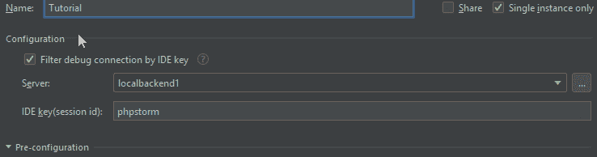

# 如何在 PHP 中设置本地调试环境

> 原文：<https://www.freecodecamp.org/news/set-up-xdebug-phpstorm-in-php5-7-6a8386304fc6/>

最近我开始更多地关注 PHP，我需要建立一个本地调试环境。由于没有很多关于如何做的教程，我遇到了一些关于如何设置和运行的问题。

通过结合几个教程，在几个论坛上花了几个小时，我想出了这篇文字。我正在开发的应用程序运行在一个摇晃的流浪盒子里。它不时崩溃，所以我不得不重做这个设置，因此我知道这个设置工作:)。

> 本教程的目标是让 Xdebug 在您的服务器上运行，然后将 PhpStorm 指向 Xdebug。

让我们开始吧。

#### 先决条件

如果你的服务器上没有安装 Xdebug，但使用的是 PHP7，你可以使用官方 Xdebug 网站[这里](https://xdebug.org/wizard.php)的定制安装说明来安装。

然而，由于我的项目使用的是 PHP5，我不得不采用传统的方式:*在论坛上查找*。

在本教程中，我将假设你已经安装了 Xdebug。

### 入门指南

首先，您需要找到 xdebug.so 文件在服务器上的位置。将该位置复制到某个地方，因为您稍后会用到它。

```
locate xdebug.so
```

现在您需要在您的服务器中导航到一个位置:/etc/php5/apache2/conf.d/如果不存在，请创建一个。您可以使用诸如 touch、vim、vi、nano 等命令创建一个。

你可以看到我的项目是用 PHP5 制作的，所以根据你的 PHP 版本改变你的文件夹名称/位置。

现在打开 20-xdebug.ini 文件并将其粘贴到:

```
zend_extension=”location to your xdebug.so file”
xdebug.remote_enable=1
xdebug.remote_port=9000
xdebug.remote_host=”your localhost address”
xdebug.remote_autostart=1
xdebug.remote_connect_back=0
xdebug.remote_handler=”dbgp”
xdebug.remote_mode=req
xdebug.remote_cookie_expire_time=-9999
xdebug.remote_log=”/tmp/xdebug.log”
xdebug.var_display_max_depth=15
xdebug.profiler_enable=0
xdebug.idekey=”phpstorm”
```

从下面编写的 20-xdebug.ini 文件的解释中，您会看到其中一些设置是不需要的，或者它们被设置为默认值。我将这些值保存在 20-xdebug.ini 文件中，因为知道这些值是有好处的。

#### **20-xdebug . ini 文件说明:**

*   xdebug.remote_enable —控制 xdebug 是否应尝试联系调试客户端，该客户端正在监听设置中设置的主机和端口
*   Xdebug . remote _ port—Xdebug 尝试在远程主机上连接的端口。默认值为 9000。
*   xdebug.remote_host —选择运行调试客户端的主机。默认值为 localhost。
*   xdebug.remote_autostart —当此设置设置为 1 时，xdebug 将尝试启动远程调试会话并尝试连接到客户端。
*   xdebug.remote_connect_back —如果启用，将忽略 [xdebug.remote_host](https://xdebug.org/docs/all_settings#remote_host) 设置，xdebug 将尝试连接到发出 HTTP 请求的客户端。默认值为 0。
*   xdebug . remote _ handler——可以是选择旧的 [PHP 3 风格调试器](http://www.php.net/manual/en/debugger.php)输出的‘PHP 3 ’,启用类似 gdb 调试器接口的‘gdb ’,或者是‘dbgp’—[调试器协议](http://xdebug.org/docs-dbgp.php)。DBGp 协议是唯一受支持的协议。默认值为 dbgp。
*   xdebug.remote_mode —选择何时启动调试连接。该设置可以有两个不同的值:req-Xdebug 将在脚本启动后立即尝试连接到调试客户端。jit — Xdebug 只会在出现错误时尝试连接到调试客户端。
*   xdebug . remote _ cookie _ expire _ time—此设置可用于增加(或减少)远程调试会话通过会话 cookie 保持活动的时间。默认值为 3600。
*   xdebug.remote_log —如果设置为某个值，它将用作记录所有远程调试器通信的文件的文件名。
*   xdebug.var_display_max_depth —控制当变量通过 [xdebug_var_dump()](https://xdebug.org/docs/all_functions#xdebug_var_dump) 、 [xdebug.show_local_vars](https://xdebug.org/docs/all_settings#show_local_vars) 或通过[函数跟踪](https://xdebug.org/docs/execution_trace)显示时，数组元素和对象属性的嵌套层数。默认值为 3。
*   xdebug.profiler_enable —启用 xdebug 的探查器，该探查器在[配置文件输出目录](https://xdebug.org/docs/all_settings#profiler_output_dir)中创建文件。默认值为 0。
*   xdebug.idekey —控制哪个 IDE 键 xdebug 应该传递给 DBGp 调试器处理程序。默认值基于环境设置。

保存文件并重新启动 Apache 服务器:

```
sudo service apache2 restart
```

### Xdebug 和 PhpStorm

首先，您需要打开 PhpStorm 并选择 Run > Edit Configuration。在那里，您应该选择+(添加新配置)并选择“PHP 远程调试”。

将配置的名称从“未命名”更改为其他名称。出于显而易见的原因，我选择了“教程”这个名字；)然后勾选“按 IDE 键过滤调试连接”。


选择服务器按钮(…)，然后选择+(添加新服务器)。

*   将您的服务器重命名为更舒缓的名称。在本例中，我选择了“localbackend1”。
*   在主机字段中输入您的本地主机。将调试器设置为 Xdebug。
*   选择“使用路径映射”并指向应用程序的文件夹。

点击应用。您将返回到上一个窗口，在那里您将看到 IDE 键是可编辑的，现在您需要输入一个键。我总是放“phpstorm”或者类似的东西。



您会注意到 IDE 键“phpstorm”已经在您的 20-xdebug.ini 文件中:

```
xdebug.idekey=”phpstorm”
```

您还应该选择“仅单个实例”,因为这将阻止您启动同一个项目的多个实例。

点击申请，瞧！

您已经完成了设置！

### **测试和包装**

现在你完整了。您应该在 PhpStorm 的右上角看到我们创建的教程配置。


您可以通过在项目中设置断点来测试它。点击教程配置窗口中的“bug”按钮，然后运行你的应用程序。

这就是全部，如果一切正常，你应该点击断点。

记住，没有什么比在调试时看到运行时值更好的了。

感谢您的阅读！查看更多类似的文章，以及我在 Github 个人资料上制作的其他有趣的东西:[https://github.com/GoranAviani](https://github.com/GoranAviani)