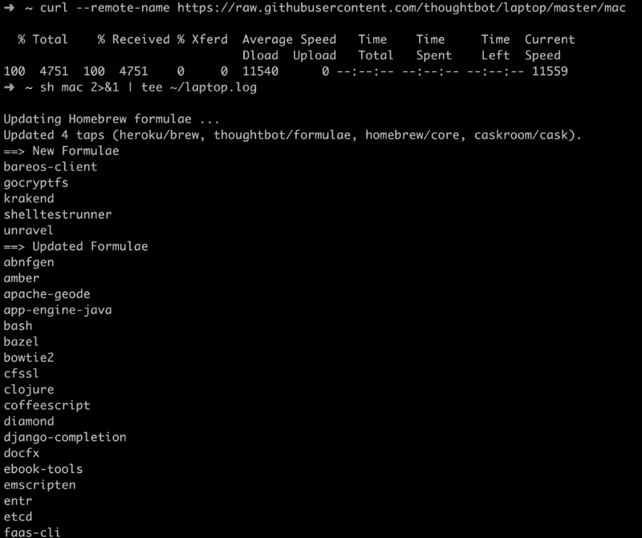

# 使用 Thoughtbot 的笔记本脚本设置您的 macOS 开发环境

> 原文：<https://www.freecodecamp.org/news/set-up-your-macos-development-environment-using-thoughtbots-laptop-script-e6bf9b2e03dd/>

可能阻止我们改变甚至考虑改变我们的工作环境的事情之一是，我们必须完成所有已经为软件开发设置好的安装和配置。

幸运的是，这种*疼痛*是有治疗方法的。 *Laptop* 是一个脚本，让你的 macOS 机器为网络和移动开发做好准备。



脚本设置由以下部分组成:

1.  macOS 工具:

*   用于管理操作系统库的自制软件。

2.Unix 工具:

*   [丰富的 Ctags](http://ctags.sourceforge.net/) 用于索引文件以完成 vim 标签
*   用于版本控制的 Git
*   用于传输层安全(TLS)的 OpenSSL
*   用于管理公司和个人网站文件的 RCM
*   [银色搜索器](https://github.com/ggreer/the_silver_searcher)用于在文件中查找东西
*   [Tmux](http://tmux.github.io/) 用于保存项目状态和在项目间切换
*   [Watchman](https://facebook.github.io/watchman/) 用于监视文件系统事件
*   作为你的外壳

3.Heroku 工具:

*   用于与 Heroku API 交互的 Heroku CLI 和[奇偶校验](https://github.com/thoughtbot/parity)

4.GitHub 工具:

*   [Hub](http://hub.github.com/) 用于与 GitHub API 交互

5.图像工具:

*   [ImageMagick](http://www.imagemagick.org/) 用于裁剪和调整图像大小

6.测试工具:

*   [Qt 5](http://qt-project.org/) 通过[水豚网络工具包](https://github.com/thoughtbot/capybara-webkit)进行无头 JavaScript 测试

7.编程语言、包管理器和配置:

*   [ASDF](https://github.com/asdf-vm/asdf) 用于管理编程语言版本
*   管理 Ruby 库的 Bundler
*   [Node.js](http://nodejs.org/) 和 [NPM](https://www.npmjs.org/) ，用于运行应用和安装 JavaScript 包
*   Ruby 稳定，适合编写通用代码
*   [Yarn](https://yarnpkg.com/en/) 用于管理 JavaScript 包

8.数据库:

*   [Postgres](http://www.postgresql.org/) 用于存储关系数据
*   [Redis](http://redis.io/) 用于存储键值数据

它的安装非常简单，可以很快完成。

首先，您需要下载脚本:

```
curl --remote-name https://raw.githubusercontent.com/thoughtbot/laptop/master/mac
```

您应该在运行脚本之前检查它:

```
less mac
```

然后，您可以执行下载的脚本:

```
sh mac 2>&1 | tee ~/laptop.log
```

最后，您可以查看日志:

```
less ~/laptop.log
```

安装时间应该不到 15 分钟(取决于您的机器)。

撰写本文时支持的 macOS 版本有:

*   macOS Mavericks (10.9)
*   苹果公司约塞米蒂(10.10)
*   马科斯埃尔卡皮坦(10.11)
*   马科斯塞拉(10.12)

根据笔记本电脑的[描述](https://github.com/thoughtbot/laptop)，旧版本的 macOS 可能会工作，但不会定期测试。

Laptop 是一个开源项目，由 [Thoughtbot](https://thoughtbot.com/?utm_source=github) 发起和维护。你可以查看更多关于它和它的实现的信息，也有机会通过访问它的 GitHub [页面](https://github.com/thoughtbot/laptop)为它做出贡献。

*本文最初发表在我的博客上，[FatosMorina.com](http://www.fatosmorina.com/set-macos-development-environment-using-thoughtbots-laptop-script/)*