# 如何设置基本的 Ember.js 应用程序

> 原文：<https://www.freecodecamp.org/news/setting-up-a-basic-ember-js-app-c9323760c675/>

作者:李美玲| ladyleet

# 如何设置基本的 Ember.js 应用程序


所以，你想试试恩伯，嗯？本文将介绍如何构建一个基本的应用程序。

这是我们要做的:

1.  设置 ember-cli
2.  创建新的应用程序
3.  使用 m materialize-CSS 进行样式化
4.  创建组件
5.  涵盖 Ember 路由器的基本使用
6.  探索用于数据迭代的“each”助手

首先，你应该安装 ember-cli。几乎所有应用程序都是用 ember-cli 构建的。你很少会找到一个不是的。

这是 Ember 和 Ember 社区的一个主要好处——他们比 Angular 和 React 更依赖约定而不是配置。他们将此作为自己的优势之一，使其成为希望构建大规模应用程序的公司的流行框架。

成为传统允许 ember 开发社区标准，例如 ember-cli-deploy story，一个关于 Ember 数据的强大故事，以及社区能够通过 ember addon 生态系统做出的大量贡献。(看看[emberaddons.com](http://emberaddons.com)

在 Ember.js 网站上，你可以找到简单的安装说明，甚至是一个小小的快速入门指南！

继续安装 ember-cli 开始使用:

```
$ npm install -g ember-cli
```

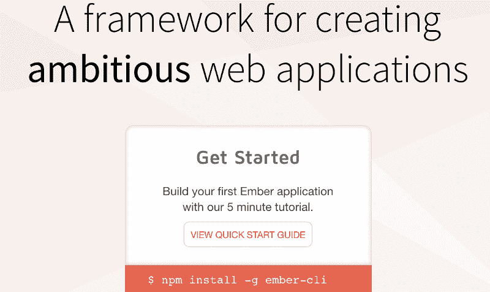

### 创建新的应用程序

这就像 1–2–3 一样简单！只需*加入新<项目 na* me >就会为你生成一份申请。

```
ember new yolobrolo
```

您将看到 ember-cli 创建了相当多的文件。

主要地，你应该注意到 Ember 创造了:

*   application.hbs (handlebars，这是您的 html 文件)
*   app.js
*   router.js
*   package.json
*   鲍尔. json
*   试验

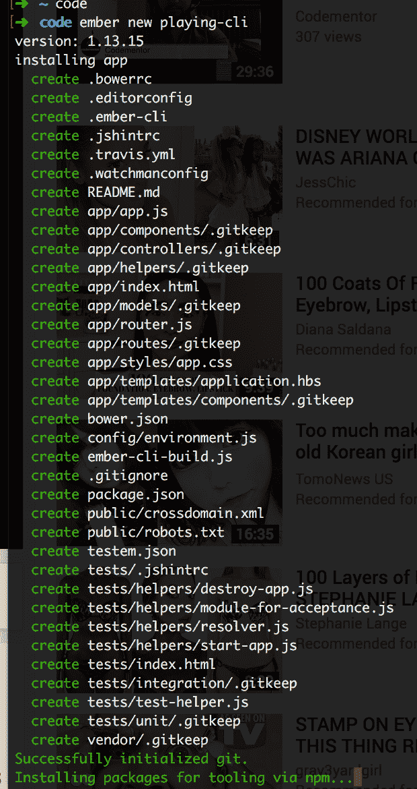

哇哦！现在，如果你打开你的 IDE，你应该看到一个 Ember 应用程序的结构。

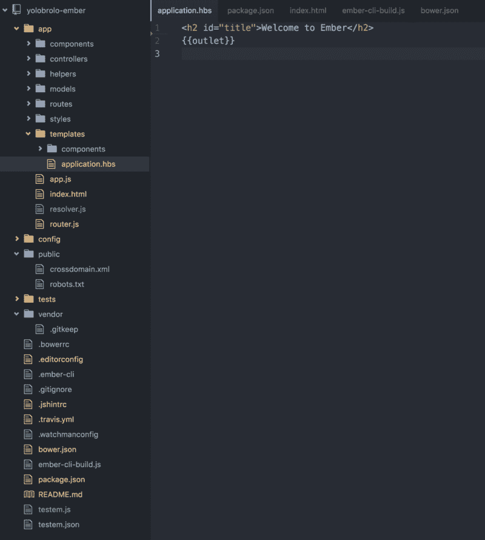

### 安装 Materialize-CSS

如果你想知道，我喜欢材料设计和物化-css。

因此，如果您想使用我通常使用的样式，请运行下面的命令。

```
npm install materialize-css
```

然后，将这些行添加到您的 index.html 文件中

```
<!-- Compiled and minified CSS -->  <link rel="stylesheet" href="https://cdnjs.cloudflare.com/ajax/libs/materialize/0.97.7/css/materialize.min.css">
```

```
<!--Import Google Icon Font-->      <link href="http://fonts.googleapis.com/icon?family=Material+Icons" rel="stylesheet">
```

```
<!-- Compiled and minified JavaScript -->  <script src="https://cdnjs.cloudflare.com/ajax/libs/materialize/0.97.7/js/materialize.min.js"></script>
```

完成后，关闭服务器并重启。你的字体应该变成机器人:

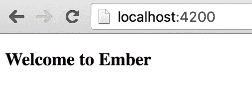

Before you install materialize-css

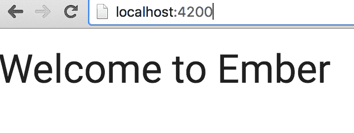

After you install materialize-css

### 创建组件

Ember 像当今大多数 JavaScript 框架一样，热爱组件。因此，让我们创建我们需要的组件:一个可以连接路由器的导航栏！我们使用 materialize-css 给我们的导航条。

要创建一个组件，您需要做的就是:

```
ember g component <component-name>
```

确保组件的名称中有一个破折号，因为这是约定。

以下是 ember-cli 为我生成的文件。它创造了:

*   组件名称. hbs
*   组件名称. js
*   添加集成测试

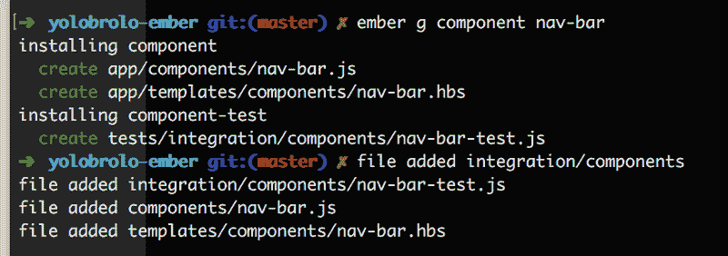

这就是我漂亮的导航条的样子。


如果你喜欢，这里是默认代码:

```
<nav>    <div class="nav-wrapper">      <a href="#" class="brand-logo center">Logo</a>      <ul id="nav-mobile" class="left hide-on-med-and-down">        <li><a href="#">Videos</a></li>        <li><a href="#">About</a></li>      </ul>    </div>  </nav>
```

每当你需要一次又一次地重用一段代码时，最好是把它做成一个组件。:)

### 使用 Ember 的路由器

我想我在 Angular 2 中玩了这么多之后，对 Ember 的路由器习以为常了。

事实上，我认为我通常认为路由器是理所当然的，但是我的朋友杰伊·菲尔普斯告诉我们为什么我们应该关心它。

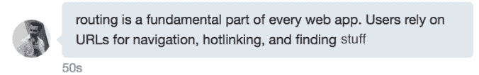

以下是 Ember 路由器工作原理的基本概述。

首先，您应该注意到有一个 router.js 文件，其中定义了您的所有路由。此外，在您的 application.hbs 文件中，有{{outlet}}，它输出您指定路由器接收的任何内容。

在我的应用程序中，我想创建 2 条简单的路线——一个关于页面和一个视频页面。

要创建新路由，请在 ember-cli 中运行此命令。

```
ember g route <route-name>
```

Ember 将生成:

*   你的路线
*   你的路线
*   更新 router.js 文件
*   创建一个单元测试。

您可以从命令行看到所有的神奇之处:

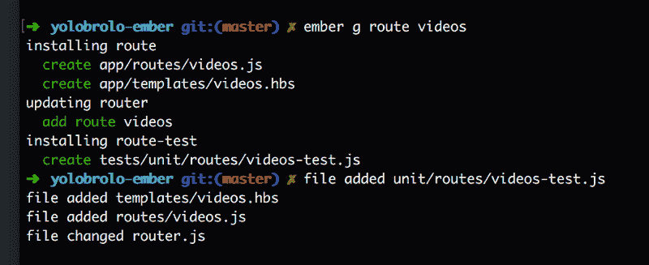

我喜欢 router.js 文件自动为我更新的方式。您甚至可以从命令行创建嵌套路由。Ember.js 指南非常棒，这里有一个[链接](https://guides.emberjs.com/v2.7.0/routing/)指向路由器能做的一切。

我在下面的截图中做的一件事是定义我的默认路线。我只是简单地将路由路径指定为/。其他一切都是用 CLI 为我预先生成的。

```
this.route(‘videos’, { path:’/’ });
```

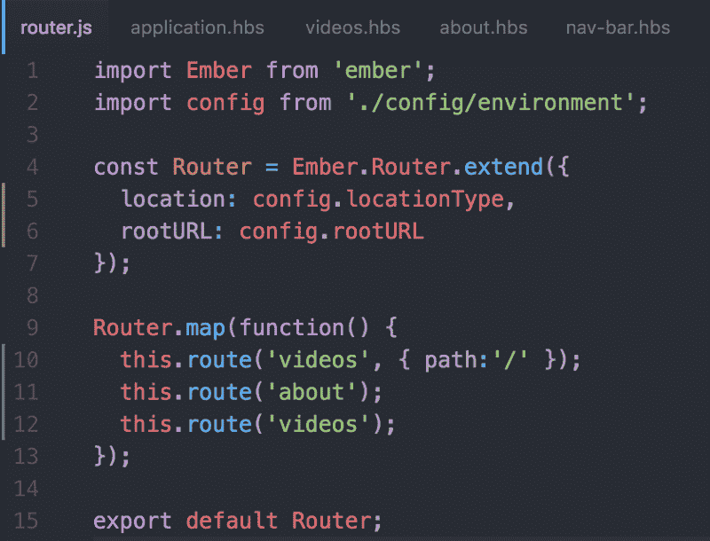

### 配置 Ember 路由器的输出

让我们研究一下 application.hbs 文件。这是路由器输出的地方。

实际上，我在 application.hbs 文件中添加的仅有的东西之一是导航栏和页脚。我为其他一切创造路线。

目前我的 application.hbs 文件是这样的。

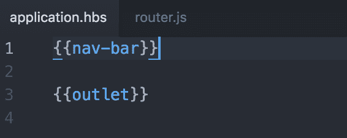

现在，进入我的导航栏组件，我将获得关于页面和视频的路径。

Ember 使用{{link-to}}助手在路线之间转换。

下面是语法的样子:

```
{{#link-to ‘videos’}}Videos{{/link-to}}
```

{{link-to}}助手取代了一个

这是我整个导航条的截图。

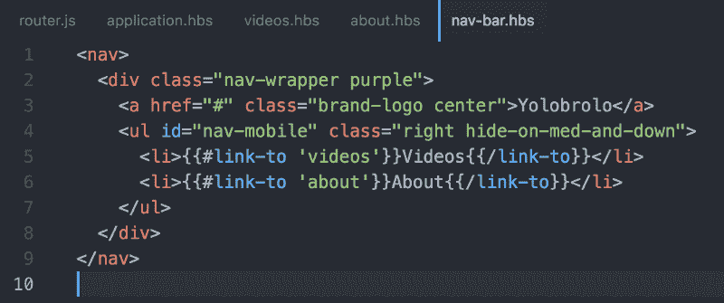

现在您知道如何使用路由器的最基本功能了！

### 使用 Each 助手迭代数据

我有一个视频路线，我想在页面上显示一组 YouTube 视频。我将创建一个简单的视频卡组件，我将迭代并显示在视频页面上。

这是一个视频卡的样子:


Ember 的部分优点是所有的助手都允许你在应用程序中做很酷的事情。

Ember 的{{each}}助手相当于 Angular 1 中的 ng-repeat 指令和 Angular 2 中的*ngFor 指令。

每个助手和一般助手的完整成员文档在这里是。

下面是一段 YouTube 视频的代码:

```
<div class=”row”> <div class=”col s12 m6 l4"> <div class=”card-panel center-align”> <div class=”purple-text”> <p>Title</p> </div> <div class=”video-container”> <iframe width=”853" height=”480" src=”https://www.youtube.com/embed/peNV2yJRMLo?rel=0" frameborder=”0" allowfullscreen></iframe> </div> <div class=”purple-text”> With Taras Mankovski </div> </div> </div></div>
```

布置好之后，我意识到我想要迭代 3 个数据——标题、YouTube 视频链接和视频中的人物。

因此，我需要在 component.js 文件的数组中定义我的数据，如下所示:

```
model: [{ title: “Ember DND Helper”, people: “Taras Mankovski”, videoLink: “peNV2yJRMLo?rel=0” },{ title: “Dependency Injection in Angular 2”, people: “Patrick J. Stapleton”, videoLink: “46WovCX8i-I?rel=0” },{ title: “Angular CLI”, people: “Mike Brocchi”, videoLink: “BmZLpNRNnZo” },{ title: “Angular Material 2 Spelunking & Issue Submission”, people: “Ben Lesh”, videoLink: “3gNsyL7wpXU” }]});
```

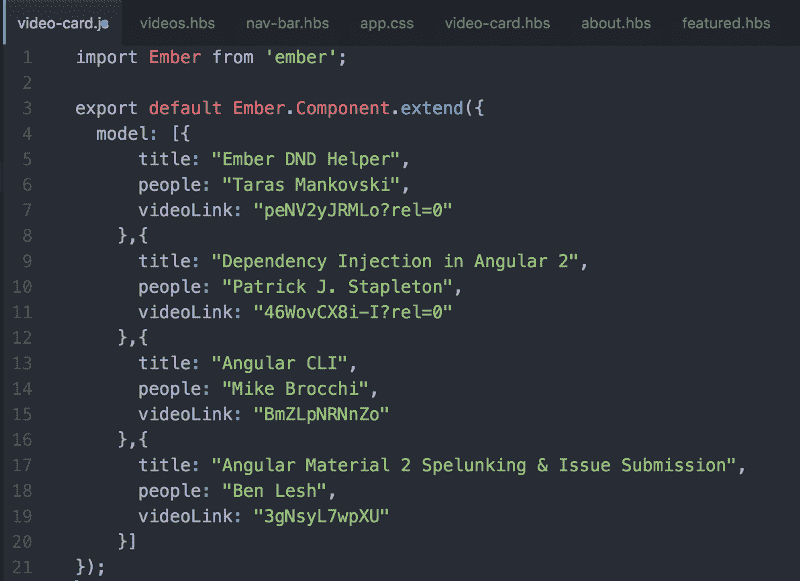

然后，我终于可以使用{{each}}助手来迭代我的数据了。

如下所示，用{{each}}帮助器包装内容，定义模型和局部变量:

```
{{#each model as |video|}} CONTENT {{/each}}
```

然后，将您希望动态的内容片段替换为 handlebars 和 localVariable.x，如下所示:

```
{{video.title}}
```

```
src="https://www.youtube.com/embed/{{video.videoLink}}"
```

```
{{video.people}}
```

下面是该代码的全部内容:

```
<div class=”row”> {{#each model as |video|}} <div class=”col s12 m6 l4"> <div class=”card-panel center-align”> <div class=”purple-text”> <p>{{video.title}}</p> </div> <div class=”video-container”> <iframe width=”853" height=”480" src=”https://www.youtube.com/embed/{{video.videoLink}}" frameborder=”0" allowfullscreen></iframe> </div> <div class=”purple-text”> With {{video.people}} </div> </div> </div> {{/each}}</div>
```

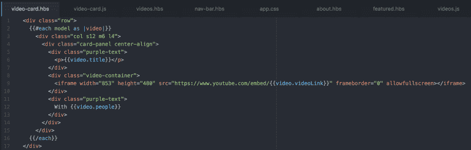

以下是使用{{each}}帮助程序的最终结果。

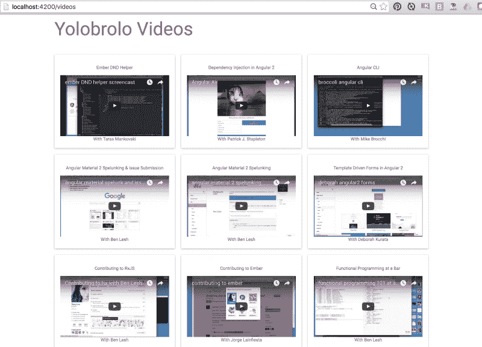

### **部署到 Heroku**

从前有一个叫托尼科的人。tonycoco 使得在 Heroku 上部署 ember 应用程序变得非常简单。如果你想看这个，这是他的 github 回购。

首先，您应该安装 Heroku Toolbelt 并与您的 Heroku 帐户关联。

然后，要部署到 Heroku，您所要做的就是将您的更改提交给 master 和 push。

```
$ heroku create — buildpack https://github.com/tonycoco/heroku-buildpack-ember-cli.git
```

```
$ git push heroku master
```

等待它完全展开。

进入你的 [Heroku 应用仪表板](https://dashboard.heroku.com/apps)。将应用程序更新为您想要的名称(以匹配您的应用程序)。

现在更改 Heroku 远程名称以匹配您的。git/config 文件。

然后， *git 再按一次 heroku master* ，你应该就一切就绪了！

在这种情况下，这个应用程序部署:[http://yolobrolo-ember-1.herokuapp.com/](http://yolobrolo-ember-1.herokuapp.com/)

Yolo！好好享受吧。希望你尝试烬，并享受它。

### **看我一步一步地构建它**

哦，还有，为了你的观看目的，你可以在 YouTube 上的 yolobrolo 观看我制作的这个[。](https://www.youtube.com/watch?v=-Ury2S9Y-4Q)