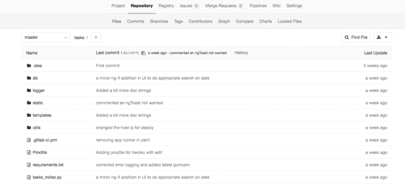
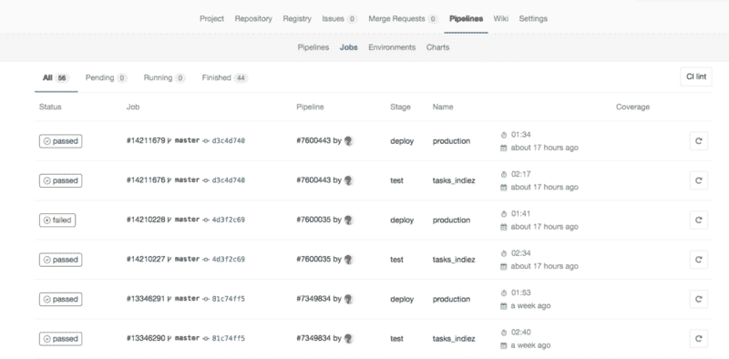
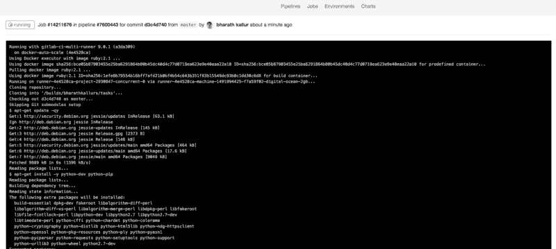
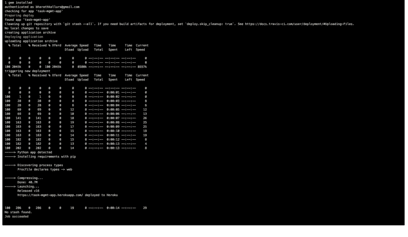

# 在 GitLab 上设置 CI/CD，以便在 Heroku 上部署 Python Flask 应用程序

> 原文：<https://www.freecodecamp.org/news/setting-up-a-ci-cd-on-gitlab-for-deploying-a-python-flask-application-on-heroku-e154db93952b/>

最近，我遇到了在 Heroku 上部署 Python Flask web 应用程序的挑战。该应用程序的代码托管在 GitLab 中。

Heroku 支持从 GitHub、Dropbox 以及常见的 Heroku git 部署应用程序。我已经很久没有用过 Heroku 了。我想知道是否可以直接从我的 GitLab 库部署代码，而不是使用上面提到的任何资源。

我找不到任何关于将 GitLab 存储库中的应用程序部署到 Heroku 的信息或文档。我在 GitLab 上浏览了一下，发现除了帮助测试和构建你的项目，GitLab CI 还可以帮助[将](https://docs.gitlab.com/ce/ci/environments.html)你的应用部署到你的托管基础设施上。我现在被激起了兴趣。

在我深入研究如何部署该应用程序之前，我想解释一下使用 GitLab 或 GitHub 的好处，因为使用 Heroku Git 可以轻松完成任务。

1.  **更简单的代码维护**——有了像 GitHub 和 GitLab 这样的代码库托管服务，代码的维护就很容易了。
2.  **定制管道**——使用 GitLab，我们可以编写自己的 [yaml](http://yaml.org/) 文件，并包含运行我们的应用程序所需的库。
3.  **为了更好的理解持续集成和持续开发(CI/CD)** -对于初学者，这个设置帮助你理解测试- >版本控制- >代码维护- >应用部署的编码工作流程。

以下是将 GitLab 中托管的应用程序部署到 Heroku 所需的步骤。这里的步骤假设你已经很好的理解了 Python、Flask、版本控制、GitLab 和 Heroku。这篇文章对刚刚起步的人也很有帮助。我尽可能简单地让事情开始运行。

### 将项目上传到 GitLab

1.  创建一个 Python 虚拟环境供我们使用。进入虚拟环境。
2.  在您的机器上创建一个示例 Python Flask 应用程序。
3.  验证一切运行正常。
4.  从主应用程序文件夹中运行命令`pip freeze > requirements.` txt，获取运行应用程序的所有要求。
5.  创建一个 Procfile，Heroku 使用它来声明 Heroku 平台上的应用程序运行哪些命令。Procfile 通常由用于运行应用程序的 web 服务器组成。在我们的例子中，让我们使用 Gunicorn，默认的 Python WSGI HTTP 服务器。Procfile 的内容将是`web: gunicorn <name of the app.py file>:<` app-name >，其中 app-name 通常是“app”。将该文件放在主应用程序文件夹中。
6.  现在登录(或注册)GitLab 并创建一个项目。当你这样做的时候，你会得到一套标准的说明，关于如何将你的开发机器上的代码“链接”到 GitLab 项目。只需遵循命令，然后就可以在这个项目中执行 git push 或 git pull。这是一个有点复杂的步骤，你的最后一个语句应该看起来像`git push -u origin master`。完成后，刷新 GitLab 上的项目页面，您应该会看到所有代码都出现在 GitLab 中。



Project repository in GitLab

### 连接 GitLab 和 Heroku

1.  登录 [Heroku 门户网站](https://www.heroku.com)并创建一个应用程序。给它一个好听的名字和运行时选择。
2.  现在，在开发机器上的 my_app 文件夹中，创建一个名为。gitlab-ci.yaml "(注意“.”)在一开始)。
3.  这个 yaml 文件将具有以下结构。

```
my_app_file_name:
 script:
 — apt-get update -qy
 — apt-get install -y python-dev python-pip
 — pip install -r requirements.txt
 — export MONGOHQ_URL=$MONGO_URL

production:
 type: deploy
 script:
 — apt-get update -qy
 — apt-get install -y ruby-dev
 — gem install dpl
 — dpl — provider=heroku — app=task-mgmt-app — api-key=$HEROKU_SECRET_KEY
 only:
 — master
```

1.  将 my_app_file_name 更改为 flask 应用程序的文件名。您需要在项目变量中设置 HEROKU_SECRET_KEY 变量。你将在 Heroku 仪表盘中获得这把钥匙。要在你的 GitLab 项目中设置它，进入 ****设置> CI/CD 管道**** 并搜索 ****秘密变量。**** 在 yaml 中使用这些变量时，我们需要在变量前面加上‘$’符号。最好不要与任何人共享密钥，并限制在项目中对它们的访问。
2.  你就快到了。运行命令`git add .gitlab-ci.yml`、`git commit -m <msg>`和`git push -u origin master`。现在，您将在 GitLab 存储库中看到该文件。
3.  在 GitLab“我的仪表板”页面，点击 ****管道>作业**** 可以看到已经开始运行的作业。
4.  如果您在应用程序中使用数据库，您可能希望通过将详细信息放入。gitlab-ci.yaml 文件。请查看[此处](https://gitlab.com/bharathkallurs/tasks/blob/master/.gitlab-ci.yml)的示例。我已经在我的应用程序中使用了 MongDB。Heroku 提供给你的应用程序添加一组免费的库/应用程序。有一个 [mLab 链接](https://devcenter.heroku.com/articles/mongolab)用于添加 MongoDB。



Jobs list in the Pipeline



A running job. Screenshot related to my_app_file_name in yaml.



Successful App deploy on Heroku

耶！现在，您已经成功地将 GitLab 与 Heroku 集成到 CI/CD 配置中。在您的存储库中进行所有您想要的代码更改，将其推送到 GitLab 项目，并在每次有代码推送时看到一个作业开始。对于当前的设置，我使用了 GitLab 的公共运行器，这里有[和](http://gitlab.com/ci)。您可以设置一个定制的 GitLab runner 并设置适当的配置。

### 有用的链接:

1.  [创建 heroku remote](https://devcenter.heroku.com/articles/git#creating-a-heroku-remote)
2.  [从 Heroku 上的 GitLab 设置 CI/CD](https://docs.gitlab.com/ce/ci/examples/test-and-deploy-python-application-to-heroku.html)
3.  任务管理应用库:GitLab，部署在 Heroku 上