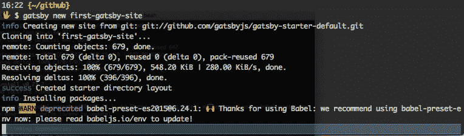
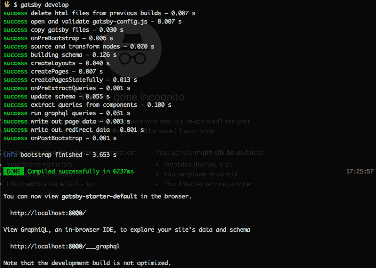
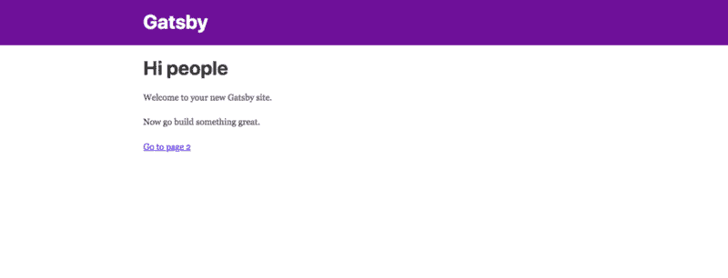
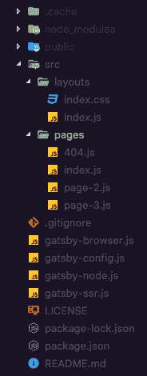
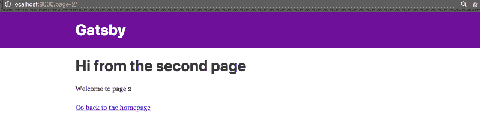
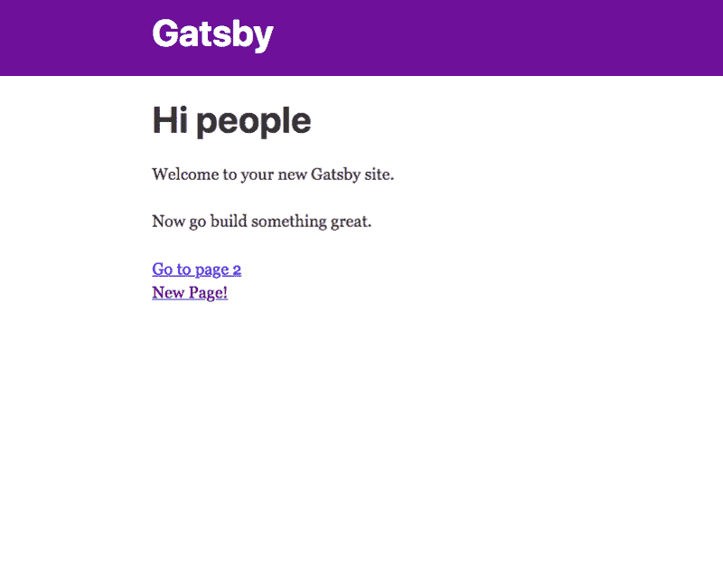
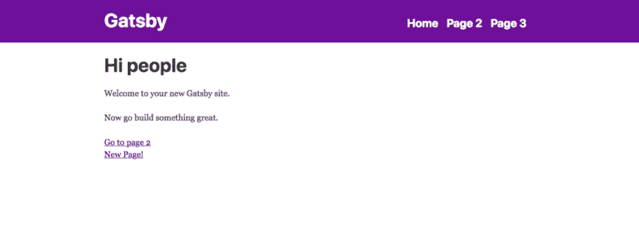

# Gatsby.js:如何设置和使用 React 静态站点生成器

> 原文：<https://www.freecodecamp.org/news/setting-up-and-getting-used-to-gatsby-1fc27985ae8a/>

Gatsby 是 React 的一个静态站点生成器，上个月发布了它的第一个主要版本。这是一个工具，不仅为你搭建项目(或网站)，而且声称这些网站的性能很快。如果您决定使用 Gatsby，您将会享受到 React.js、Webpack 等最新 web 技术的强大功能。

有很多现代范例，盖茨比在幕后照顾它的开发者，开始建立和启动他们的项目。关于 Gatsby，我喜欢的另一个很酷的事情是它不断增长的数据插件生态系统。它允许开发人员使用 GraphQL 将数据直接提取到 Gatsby 生成的应用程序中。

以下是使用盖茨比的一些好处:

*   HTML 代码是在服务器端生成的
*   插件生态系统可轻松扩展
*   预配置的基于 Webpack 的构建系统(无需打破你的头)
*   速度优化。Gatsby 只加载关键的部分，这样你的站点可以尽可能快地加载。一旦加载完毕，Gatsby 就会预取其他页面的资源，这样点击网站的速度就会快得令人难以置信。
*   基于目录结构的自动路由。(不需要单独的路由/导航库)

如果您了解 React 的本质，那么通过阅读本教程，您肯定可以很快开始使用 Gatsbyjs。我并不是要求你精通 React，只是要求你熟悉它的概念。如果您想更新这方面的知识或了解更多信息，我推荐以下链接:

*   [脸书官方](https://reactjs.org/)
*   [React Express(不是 server Express.js)](http://www.react.express/)

介绍够了。让我们开始吧。

### 安装 Gatsby CLI

我们将使用`npm`来安装我们的第一个和基本的工具，我们需要设置任何 Gatsby 项目。也可以用`yarn`。在您的终端中，请执行以下命令:

```
npm install --global gatsby-cli
```

如果命令给出权限错误，您可能需要在命令的开头添加`sudo`。

要开始一个新的网站，直接进入你想要的项目。在您的系统上选择一个位置，在那里您可能存储所有处于初始阶段的游戏场或应用程序，然后存储在终端中:

```
gatsby new first-gatsby-site
```

您可以随意命名您的项目，我这样命名只是为了简洁。



完成项目的安装和设置。然后将目录更改为新创建的文件夹。从命令行运行`gatsby develop`，查看您的站点在 [http://localhost:8000](http://localhost:8000/) 上实时运行。



在您的浏览器窗口中，默认的 Gatsby.js 应用程序如下所示:



保持该命令运行，因为它支持热重装。现在，我们对项目所做的任何更改都将直接反映出来，而无需刷新页面。

目前，我们的应用程序包含两个页面。因此，最低限度的路由已经为我们做了。在深入研究代码并对其进行任何修改之前，我们需要理解项目结构。然后，您可以通过在未来的项目中操作它来利用它。

### 深入研究项目结构



每个 Gatsby 项目至少包含这些文件。您可能熟悉一些目录，如`node_modules,` `public`，它在部署时提供服务。它还包含`package.json,`，其中包含任何现代 Javascript 应用程序的元数据。

我们的主要焦点和关注点在目录`src`和文件`gatsby-config.js.`中，它们包含关于我们当前应用程序的元数据和其他重要信息。

在`src/`里面有两个子目录:`layouts/`和`pages/`。

`layouts/`包含另外两个文件:`index.css`和`index.js`。这些是我们应用程序的起点。

```
import React from "react";
import PropTypes from "prop-types";
import Link from "gatsby-link";
import Helmet from "react-helmet";

import "./index.css";

const Header = () => (
  <div
    style={{
      background: "rebeccapurple",
      marginBottom: "1.45rem"
    }}
  >
    <div
      style={{
        margin: "0 auto",
        maxWidth: 960,
        padding: "1.45rem 1.0875rem"
      }}
    >
      <h1 style={{ margin: 0 }}>
        <Link
          to="/"
          style={{
            color: "white",
            textDecoration: "none"
          }}
        >
          Gatsby
        </Link>
      </h1>
    </div>
  </div>
);

const TemplateWrapper = ({ children }) => (
  <div>
    <Helmet
      title="My First Gatsby Site"
      meta={[
        { name: "author", content: "amanhimself" },
        { name: "keywords", content: "sample, something" }
      ]}
    />
    <Header />
    <div
      style={{
        margin: "0 auto",
        maxWidth: 960,
        padding: "0px 1.0875rem 1.45rem",
        paddingTop: 0
      }}
    >
      {children()}
    </div>
  </div>
);

TemplateWrapper.propTypes = {
  children: PropTypes.func
};

export default TemplateWrapper;
```

`Header`组件包含了当前作为应用程序头部的样式和标记。它通过应用程序中的主要布局组件`TempplateWrapper`反映在每个页面上。这当然意味着这个组件可以用于显示导航菜单(我们一会儿就要做)或页脚。

你看到的标签是盖茨比让我们的访问者从一页导航到另一页的方式。用于在 HTML 中附加标题信息的库。它目前由 JSX 生成。你可以在这里的[官方文档上了解这个有用的、对初学者友好的库。](https://github.com/nfl/react-helmet)

请注意`{children()}`道具。这是一个在 JSX 代码中执行的函数，用于确定要呈现的子组件的确切位置。

### 主应用程序页面

我们的第二个相关目录`pages/`包含构建我们应用程序的其余页面。它们是简单反应组分。让我们看看这个目录中的`index.js`文件，它目前是我们应用程序的主页。

```
import React from "react";
import Link from "gatsby-link";

const IndexPage = () => (
  <div>
    <h1>Hi people</h1>
    <p>Welcome to your new Gatsby site.</p>
    <p>Now go build something great.</p>
    <Link to="/page-2/">Go to page 2</Link>
  </div>
);

export default IndexPage;
```

同样，你会在`page-2.js`中找到代码。如果在我们的浏览器窗口中，我们试图导航到第二个页面，请注意第二个页面加载时网站的 URL。



它与文件名相同。我们还使用 Gatsby 中的`Link`标签导航回主页。

让我们给我们的站点添加另一个页面。在`pages`目录中，创建一个新文件`page-3.js`。

```
import React from "react";
import Link from "gatsby-link";

const ThridPage = () => (
  <div>
    <h1>Third Page</h1>
    <p>This is my first Gtasby site</p>
    <Link to="/page-2/">Back to Page 2</Link>
    <br />
    <Link to="/">Go back to the homepage</Link>
  </div>
);

export default ThridPage;
```

现在，让我们将指向新页面的链接添加到主页。打开`index.js`文件:

```
import React from "react";
import Link from "gatsby-link";

const IndexPage = () => (
  <div>
    <h1>Hi people</h1>
    <p>Welcome to your new Gatsby site.</p>
    <p>Now go build something great.</p>
    <Link to="/page-2/">Go to page 2</Link>
    <br />
    <Link to="/page-3">New Page!</Link>
  </div>
);

export default IndexPage;
```



这在我们的页面上正确呈现。请注意目录中的`404.js`文件。当找不到所需的 URL 时，将呈现该文件。更多信息可以在[官方盖茨比文件](https://www.gatsbyjs.org/docs/add-404-page/)中阅读。

现在让事情变得更有趣一点。让我们在布局的`Header`组件中添加一个导航菜单。

### 添加导航菜单

打开`layouts/index.js`并在`Header`组件中添加以下代码:

```
const Header = () => (
  <div
    style={{
      background: "rebeccapurple",
      marginBottom: "1.45rem"
    }}
  >
    <div
      style={{
        margin: "0 auto",
        maxWidth: 960,
        padding: "1.45rem 1.0875rem"
      }}
    >
      <h1 style={{ margin: 0 }}>
        <Link
          to="/"
          style={{
            color: "white",
            textDecoration: "none"
          }}
        >
          Gatsby
        </Link>
        <ul style={{ listStyle: "none", float: "right" }}>
          <li style={{ display: "inline-block", marginRight: "1rem" }}>
            <Link
              style={{
                color: "white",
                textDecoration: "none",
                fontSize: "x-large"
              }}
              to="/"
            >
              Home
            </Link>
          </li>
          <li style={{ display: "inline-block", marginRight: "1rem" }}>
            <Link
              style={{
                color: "white",
                textDecoration: "none",
                fontSize: "x-large"
              }}
              to="/page-2"
            >
              Page 2
            </Link>
          </li>
          <li style={{ display: "inline-block", marginRight: "1rem" }}>
            <Link
              style={{
                color: "white",
                textDecoration: "none",
                fontSize: "x-large"
              }}
              to="/page-3"
            >
              Page 3
            </Link>
          </li>
        </ul>
      </h1>
    </div>
  </div>
);
```

如果保存文件，结果会立即反映在主页和每个页面上。



### 配置文件

[https://gist.github.com/dfbefb5a09c93f1816198d9db253dd6c](https://gist.github.com/dfbefb5a09c93f1816198d9db253dd6c)

我们关注的最后一个重要文件是根文件夹中的`gatsby-config.js`。这个文件可以包含站点的元数据和附加信息，比如我们使用`npm`命令安装的插件。但是，它们的使用范围和关注点仅限于使用 Gatsby CLI 生成的项目。默认情况下会安装插件`gatsby-plugin-react-helmet`。

这里列出了插件的完整列表。

### 我们静态站点的部署

到目前为止，我们已经开发出了一个最小的静态站点来满足这个演练的目的。我想关注的最后一步是部署。我将使用 GitHub 页面进行部署。

要在 GitHub 页面上部署项目，请确保您当前的工作目录被初始化为 git 存储库并托管在 GitHub 上。如果这样很好，让我们添加一个名为`gh-pages`的模块作为开发依赖项。

```
npm install --save-dev gh-pages
```

在`package.json`中添加部署脚本:

```
"scripts": {
  "deploy": "gatsby build --prefix-paths && gh-pages -d public",
}
```

在`gatsby.config.js`中添加报告的路径名前缀，例如:

```
module.exports = {
  siteMetadata: {
    title: `Gatsby Default Starter`
  },
  pathPrefix: `/first-gatsby-site`,
  plugins: [`gatsby-plugin-react-helmet`]
};
```

路径前缀见[公文](https://www.gatsbyjs.org/docs/path-prefix/)。

现在，从您的终端运行:

```
npm run deploy
```

**太好了！**您的网站现在在`[https://username.github.io/project-name/](https://username.github.io/project-name/.)` [上线。](https://username.github.io/project-name/.)

你可以在这个 [GitHub Repo](https://github.com/amandeepmittal/first-gatsby-site) 找到这个项目的完整代码

如有更多问题，请在 Twitter 上联系我，或者在我的 T2 网站上阅读更多关于我的信息。