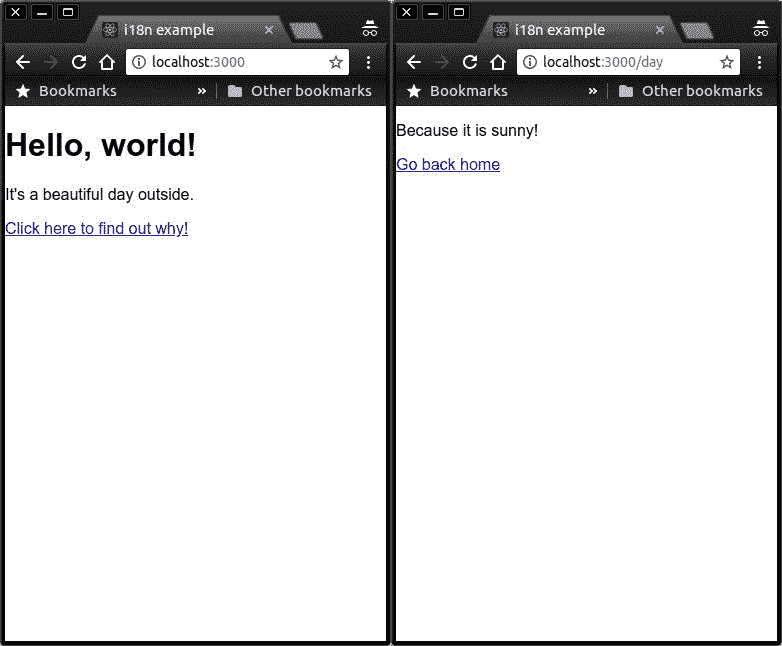
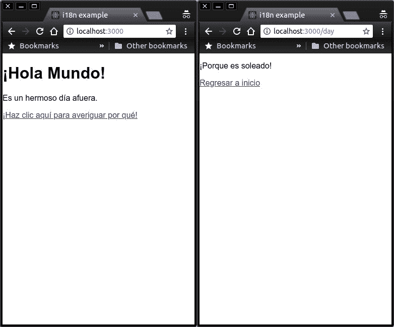

# 如何从头到尾在 React 中设置国际化

> 原文：<https://www.freecodecamp.org/news/setting-up-internationalization-in-react-from-start-to-finish-6cb94a7af725/>

这篇文章将使用`react-intl`来帮助你从`create-react-app`到建立一个完整的、翻译的 web 应用程序的框架！

我在写这篇文章的时候提交了代码，所以你可以查看我的提交历史，很容易地看到我的代码是如何从头到尾发展的。


Photo by [Artem Bali](https://unsplash.com/photos/v6kii3H5CcU?utm_source=unsplash&utm_medium=referral&utm_content=creditCopyText) on [Unsplash](https://unsplash.com/search/photos/globe?utm_source=unsplash&utm_medium=referral&utm_content=creditCopyText)

### 什么是国际化？

假设您决定点击这篇文章的链接，那么您可能至少对国际化(i18n)有所了解。从 W3 网站的[中直接删除:](https://www.w3.org/International/questions/qa-i18n)

> “国际化是指产品、应用程序或文档内容的设计和开发，**使**针对不同文化、地区或语言的目标受众的本地化变得容易。”

作为一名开发人员，您希望您的内容易于被全球各类人阅读和使用。我想每个人都同意这一点。但我知道你在想什么:

“为我自己的文化/地区/语言的人开发一个 web 应用程序已经够难了！我没有时间和精力做 i18n！”

我看你已经记下行话了。希望这篇文章能帮助你认识到为你的项目设置 i18n 并不像看起来那么困难或者耗时。

### react-intl 做什么和不做什么

如果你是 i18n 的新手，你可能会有一些关于你认为像`react-intl`这样的库应该做什么和不应该做什么的想法。

**它确实:**

*   帮你把所有分散的内容聚合起来，这样以后就可以很容易地翻译了
*   除了日期、数字等之外，还帮助您处理翻译文本
*   提供一种将翻译导入应用程序的简单方法

**它没有:**

*   为你翻译你的内容
*   告诉您如何找到用户想要的区域设置
*   修复你在过去几个小时里一直在处理的那个无关的 bug(糟糕，对吗？)

好了，让我们开始吧！

### 设置示例项目

```
$ npx create-react-app i18n-example
```

我将添加 react router 来展示`react-intl`如何处理多个页面。

```
$ cd i18n-example && npm install react-router-dom
```

我的示例应用程序将有三个 React 组件:一个主页、一个子页面和一个导入子页面的组件。请参见下面的文件结构和页面:

```
/src
  /components
    Weather.js
  /pages
    Home.js
    Day.js
```



到目前为止项目的状态可以在这里找到[。](https://github.com/austintackaberry/i18n-example/commit/d792a3fa673e1985340900a728ee6479e79118db)

### 设置`react-intl`

现在，好戏开始了。我们将安装`react-intl`并开始工作！

```
$ npm install react-intl
```

`react-intl`背后的主要目标是允许对 i18n 的支持，同时最小化对正常编码流程的影响。当然，你的网络应用程序中的很多地方都有内容。段落、表格和标题中有文本、数字和日期。

如果必须要建一个 i18n 库，你会怎么做？你的网络应用程序中到处都是这些零碎的内容。你希望所有的东西都能被容易地翻译。如果你要把你的内容给翻译，你不会把你的代码给他们，然后说“祝你好运，开始工作吧。”

你会想办法把你所有的内容放在一个文件里，然后给他们一个文件。他们会把它翻译成另一种语言，比如从英语翻译成西班牙语，然后给你一个包含所有西班牙语内容的文件。

好的，很好。所以你这么做了，但是现在你必须把西班牙语的内容放在那个文件里，然后把它重新分发到原来的位置。你如何以编程方式做到这一点？也许你应该给每一点内容分配 id，这样你就不会忘记每一点内容的原始位置。

差不多就是这样了！

第一步是将您的应用程序包装在`<IntlProvid` er >组件中:

```
<IntlProvider>
  <App />
</IntlProvider>
```

现在，您需要为`react-intl`确定最终将被翻译的内容。在我的应用程序的主页上，我有这样一段话:

```
<p>It is a beautiful day outside.</p>
```

我需要告诉`react-intl`这是我想要翻译的内容，并给它一个 id，以便它可以跟踪这些内容及其原始位置:

```
<FormattedMessage
  id="Home.dayMessage"
  defaultMessage="It's a beautiful day outside."
/>
```

默认情况下，文本将在一个`<sp`和一个>中输出，所以如果我们希望它仍然是一个段落，我们将需要把它放在原始的`<p>`中。

```
<p>
  <FormattedMessage
    id="Home.dayMessage"
    defaultMessage="It's a beautiful day outside."
  />
</p> 
```

我现在将对我的 web 应用程序中的所有内容执行此操作。

项目到目前为止的状态可以在这里找到[。](https://github.com/austintackaberry/i18n-example/commit/f85d4d4f6c029a2fa9b29beaf25fcae3de5e6d12)

### 添加 babel-plugin-react-intl

现在我们已经设置好了一切，您可能想知道如何轻松地将所有内容聚合到一个文件中。但是，出于调试目的，为每个 React 组件准备单独的 JSON 文件可能会有所帮助。你猜怎么着，有一个巴别塔插件！

```
$ npm install babel-plugin-react-intl
```

这个插件将复制您的`src`目录，但是它没有您的 React 组件文件，而是包含消息内容和 id 的 json 文件。您的`src`目录中的每个组件文件一个。当你运行`npm run build`时，它会这样做。

现在我们需要从 create-react-app 中弹出，这样我们就可以将新插件添加到我们的 babel 配置中。确保提交所有更改，然后执行:

```
$ npm run eject
```

现在，我们需要在我们的项目根目录中添加一个`.babelrc`文件，内容如下:

```
{
  "presets":["react-app"],
  "plugins": [
    ["react-intl", {
      "messagesDir": "./public/messages/"
    }]
  ]
}
```

既然 babel 可以使用我们刚刚添加的新插件，我们可以进入下一步:生成那些 JSON 文件。

```
$ npm run build
```

一旦您运行这个，您应该注意到您有一个`public/messages/src`目录，它看起来是您原来的`src`目录的克隆，除了您所有的组件文件实际上都是 JSON 文件。

```
/messages
  /src
    /components
      Weather.json
    /pages
      Home.json
      Day.json
```

现在，让我们来看看其中一个 Home.json 的内容:

```
[
  {
    "id": "Home.header",
    "defaultMessage": "Hello, world!"
  },
  {
    "id": "Home.dayMessage",
    "defaultMessage": "It's a beautiful day outside."
  },
  {
    "id": "Home.dayLink",
    "defaultMessage": "Click here to find out why!"
  }
]
```

项目到目前为止的状态可以在这里找到[。](https://github.com/austintackaberry/i18n-example/commit/5eec540f62ace18e3b34a48ef94599c6f1820470)

### 组合 JSON 文件

它做了我们认为会做的事。以这种结构组织我们的内容可能会有所帮助，但最终我们会希望它在一个文件中，并且我们需要它来包含我们将进行的任何翻译。

现在我们需要编写一个脚本来完成这项工作。谢天谢地，`react-intl`的人们用[这个剧本](https://github.com/yahoo/react-intl/blob/master/examples/translations/scripts/translate.js)给了我们一个好的起点。

```
import * as fs from "fs";
import { sync as globSync } from "glob";
import { sync as mkdirpSync } from "mkdirp";
import last from "lodash/last";

const MESSAGES_PATTERN = "./public/messages/**/*.json";
const LANG_DIR = "./public/locales/";
const LANG_PATTERN = "./public/locales/*.json";

// Try to delete current json files from public/locales
try {
  fs.unlinkSync("./public/locales/data.json");
} catch (error) {
  console.log(error);
}

// Merge translated json files (es.json, fr.json, etc) into one object
// so that they can be merged with the eggregated "en" object below

const mergedTranslations = globSync(LANG_PATTERN)
  .map(filename => {
    const locale = last(filename.split("/")).split(".json")[0];
    return { [locale]: JSON.parse(fs.readFileSync(filename, "utf8")) };
  })
  .reduce((acc, localeObj) => {
    return { ...acc, ...localeObj };
  }, {});

// Aggregates the default messages that were extracted from the example app's
// React components via the React Intl Babel plugin. An error will be thrown if
// there are messages in different components that use the same `id`. The result
// is a flat collection of `id: message` pairs for the app's default locale.

const defaultMessages = globSync(MESSAGES_PATTERN)
  .map(filename => fs.readFileSync(filename, "utf8"))
  .map(file => JSON.parse(file))
  .reduce((collection, descriptors) => {
    descriptors.forEach(({ id, defaultMessage }) => {
      if (collection.hasOwnProperty(id)) {
        throw new Error(`Duplicate message id: ${id}`);
      }
      collection[id] = defaultMessage;
    });

    return collection;
  }, {});

// Create a new directory that we want to write the aggregate messages to
mkdirpSync(LANG_DIR);

// Merge aggregated default messages with the translated json files and
// write the messages to this directory
fs.writeFileSync(
  `${LANG_DIR}data.json`,
  JSON.stringify({ en: defaultMessages, ...mergedTranslations }, null, 2)
);
```

我们需要对它进行一点修改，因为按照现在的情况，这个脚本会生成一个假的翻译。我们不希望这样，因为这不实际。

我们比那更好！我们想让它读一个真正的翻译！

我们将使用的脚本如下:

我们需要将这个文件保存在我们的`scripts`目录中，然后编辑`package.json`以便它实际运行脚本。

在此之前，我们需要做一些事情，以便我们的 ESNext 代码能够被理解。首先，我们需要添加`babel-cli`来确保脚本被编译。

```
$ npm install --save-dev babel-cli
```

接下来，我们需要将`env`预置添加到我们的`.babelrc`中，使其看起来像这样:

```
{
  "presets":["react-app", "env"],
  "plugins": [
    ["react-intl", {
      "messagesDir": "./public/messages/"
    }]
  ]
}
```

最后，我们需要编辑我们的`package.json`,以便它运行我们的脚本:

```
{...
  "scripts": {
    "build:langs": "NODE_ENV='production' babel-node
      scripts/mergeMessages.js",
    "build": "npm run build:langs && node scripts/build.js",
    ...
  },
  ...
}
```

注意，我们在`npm run build`之前运行 mergeMessages 脚本。这是因为我们希望在构建脚本将最终的`data.json`文件复制到`/build`之前，在`/public`目录中生成该文件。

好了，现在当我们运行`npm run build`时，我们应该看到`build/locales/data.json`，它将我们所有的 JSON 文件合并成一个文件。

项目到目前为止的状态可以在这里找到[。](https://github.com/austintackaberry/i18n-example/commit/47fe4a87b74f1318337ee13f459725cb45124149)

### 开始翻译的时间到了

现在，我们已经创建了一个脚本，它将把我们的默认消息和我们的翻译聚集到一个文件中，让我们进行一些翻译吧！对于这个例子，我们将翻译成西班牙语。我们刚刚创建的脚本将从`/public/locales`中读取所有的`*.json`文件，因此我们需要将新的翻译文件命名为`/public/locales/es.json`，并添加以下内容:

```
{
  "Weather.message": "¡Porque es soleado!",
  "Day.homeLink": "Regresar a inicio",
  "Home.header": "¡Hola Mundo!",
  "Home.dayMessage": "Es un hermoso día afuera.",
  "Home.dayLink": "¡Haz clic aquí para averiguar por qué!"
}
```

现在当我们运行`npm run build`时，我们的 mergeMessages 脚本将在`/public/locales`中创建一个`data.json`文件，然后它将被复制到`/build/locales`。我们最终的`data.json`文件将如下所示:

```
{
  "en": {
    "Weather.message": "Because it is sunny!",
    "Day.homeLink": "Go back home",
    "Home.header": "Hello, world!",
    "Home.dayMessage": "It's a beautiful day outside.",
    "Home.dayLink": "Click here to find out why!"
  },
  "es": {
    "Weather.message": "¡Porque es soleado!",
    "Day.homeLink": "Regresar a inicio",
    "Home.header": "¡Hola Mundo!",
    "Home.dayMessage": "Es un hermoso día afuera.",
    "Home.dayLink": "¡Haz clic aquí para averiguar por qué!"
  }
}
```

我们快到了！最后一步是，如果用户的浏览器设置是西班牙语，则动态加载西班牙语版本的文本。我们需要编辑`index.js`来读取浏览器语言设置，然后将这些信息和正确的翻译一起发送给`<IntlProvider` / >，最终发送给我们的应用程序。

我们最终的`index.js`看起来是这样的:

```
import React from "react";
import ReactDOM from "react-dom";
import "./index.css";
import App from "./App";
import registerServiceWorker from "./registerServiceWorker";
import { BrowserRouter } from "react-router-dom";
import { IntlProvider, addLocaleData } from "react-intl";
import en from "react-intl/locale-data/en";
import es from "react-intl/locale-data/es";

import localeData from "./../build/locales/data.json";

addLocaleData([...en, ...es]);

// Define user's language. Different browsers have the user locale defined
// on different fields on the `navigator` object, so we make sure to account
// for these different by checking all of them
const language =
  (navigator.languages && navigator.languages[0]) ||
  navigator.language ||
  navigator.userLanguage;

// Split locales with a region code
const languageWithoutRegionCode = language.toLowerCase().split(/[_-]+/)[0];

// Try full locale, try locale without region code, fallback to 'en'
const messages =
  localeData[languageWithoutRegionCode] ||
  localeData[language] ||
  localeData.en;

ReactDOM.render(
  <IntlProvider locale={language} messages={messages}>
    <BrowserRouter>
      <App />
    </BrowserRouter>
  </IntlProvider>,
  document.getElementById("root")
);
registerServiceWorker();
```

(大量抄袭[普瑞蒂·卡西雷迪](https://www.freecodecamp.org/news/setting-up-internationalization-in-react-from-start-to-finish-6cb94a7af725/undefined)的要旨[此处](https://gist.github.com/iam-peekay/5a4e9431c9c785d3e62e584503619ecc#file-reactintl9-js)的代码)

我们需要做的另一件小事是编辑我们的 webpack 配置，以允许在`src`和`node_modules`之外导入。

现在，如果我们将浏览器设置更改为西班牙语，我们应该会看到我们的内容被翻译成西班牙语！



项目的最终状态可以在[这里](https://github.com/austintackaberry/i18n-example)找到。