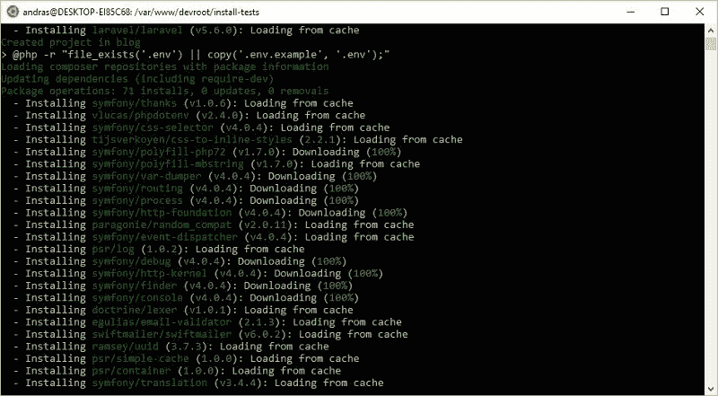
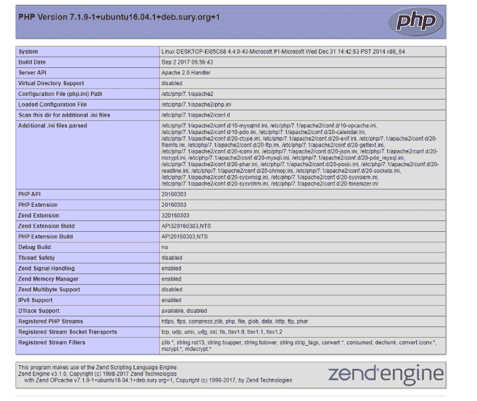
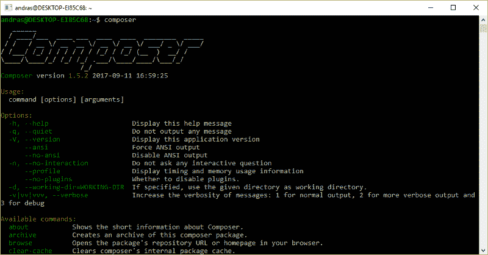

# 如何在 Linux 的 Windows 子系统上建立 PHP 开发环境(WSL)

> 原文：<https://www.freecodecamp.org/news/setup-a-php-development-environment-on-windows-subsystem-for-linux-wsl-9193ff28ae83/>

依安第斯山脉

# 如何在 Linux 的 Windows 子系统上建立 PHP 开发环境(WSL)



Windows 上的 PHP 开发有一些缺点。但是，微软现在为在 Windows 上工作的 PHP 开发人员提供了一个很好的选择:Linux 的 Windows 子系统(WSL)。WSL 是一个兼容层，用于在 Windows 10 上本地运行 Linux 二进制可执行文件(ELF 格式)。微软表示:

> “这主要是开发人员的工具，尤其是 web 开发人员和那些从事开源项目的人员”。

我们可以直接在 Windows 上运行 Linux 环境，而没有虚拟机的开销。

**注:**本文并非只针对 Windows 内部人士。这些方法也适用于 Windows 10 的最新稳定版本。

在本教程中，我们将在 WSL 上搭建一个 LAMP 栈(Ubuntu 16.04，Apache，PHP 7.1，MariaDB)进行开发。您可以用类似的方法设置其他堆栈(例如，LEMP 堆栈)。

### 先决条件

在开始阅读本指南之前，您需要具备以下条件:

*   带有[创建者更新](https://support.microsoft.com/en-us/help/4028685/windows-get-the-windows-10-creators-update)或更高版本的 64 位版本的 Windows 10。
*   熟悉 Linux/bash(如果你想熟悉命令行，你可以阅读[这个数字海洋教程](https://www.digitalocean.com/community/tutorials/an-introduction-to-the-linux-terminal))。

### 步骤 1:在 Windows 上安装 bash

首先，您需要在计算机上安装 WSL。

你可以从微软商店安装更多的 Linux 发行版(Ubuntu，openSUSE，SUSE Linux Enterprise Server 12)。但是，在本教程中，我们将在 Ubuntu，**上设置灯堆栈，因此您需要选择 Ubuntu** 。

微软有一个很棒的关于如何安装 WSL 的教程，[请按照文章](https://docs.microsoft.com/en-us/windows/wsl/install-win10)的说明来做。

如果您已经在 Windows 上的 Ubuntu 上成功安装了 Bash，那么让我们安装并配置一个简单的 LAMP 堆栈用于开发。

### 步骤 2:安装 Apache HTTP 服务器

我们想安装 Apache 的最新稳定版本，但是官方的 Ubuntu 库不包含最新版本。

我们需要为 Apache 包添加一个 PPA。个人软件包档案(PPA)是一个允许第三方开发者为 Ubuntu 构建和发布软件包的仓库。Ondřej 苏尔的 PPA 为 Ubuntu 提供了最新的 Apache/PHP 包。

要添加 PPA，请在 WSL bash 中运行以下命令:

```
sudo add-apt-repository ppa:ondrej/apache2
```

配置 PPA 后，更新本地程序包索引:

```
sudo apt-get update
```

安装 Apache:

```
sudo apt-get install apache2
```

为您的 web 应用程序创建一个项目文件夹。该文件夹应该在 WSL 文件系统之外。我建议你使用你的文档文件夹。

以下命令将在您的文档目录中创建一个服务器文件夹。请用您的 Windows 用户名替换您的 WINDOWS 用户名。

```
sudo mkdir /mnt/c/Users/YOUR WINDOWS USERNAME/Documents/server
```

创建指向所选文件夹的符号链接。

```
sudo ln -s /mnt/c/Users/YOUR WINDOWS USERNAME/Documents/server /var/www/devroot
```

打开 Apache 默认虚拟主机配置文件:

```
sudo nano /etc/apache2/sites-enabled/000-default.conf
```

将文档根目录修改为“/var/www/devroot”，它指向 WSL 文件系统之外的项目文件夹。将`ServerName`设置为`localhost`(如果端口 80 被 Windows 应用程序保留，用未使用的端口替换 80):

```
<VirtualHost *:80>        ServerName localhost        ServerAdmin webmaster@localhost        DocumentRoot  /var/www/devroot      <Directory /var/www/>        Options Indexes FollowSymLinks        AllowOverride All        Require all granted      </Directory>        ErrorLog ${APACHE_LOG_DIR}/error.log        CustomLog ${APACHE_LOG_DIR}/access.log combined</VirtualHost>
```

完成后，按 Ctrl-O 保存文件，并按 Enter 确认。用 Ctrl-X 退出。

打开您喜欢的 WINDOWS 编辑器/IDE，在您的项目文件夹(C:\Users\ **您的 Windows 用户名** \Documents\server)中创建一个“index.html”文件，内容如下:

```
<!DOCTYPE html><html lang="en"><head>  <meta charset="utf-8">  <title>It works!</title></head>&lt;body>  <h1>It works!</h1></body></html>
```

启动 Apache HTTP 服务器:

```
sudo service apache2 start
```

在你的浏览器中打开 [http://localhost/](http://localhost/) ，你应该会看到“它工作了”的标题。

不要忘记启用您所必需的 Apache 模块。例如，您可以启用 mod_rewrite:

```
sudo a2enmod rewritesudo service apache2 restart
```

### 步骤 3:安装 MariaDB 服务器

添加包含最新 MariaDB 包的 repo:

```
sudo apt-get install software-properties-common
```

```
sudo apt-key adv --recv-keys --keyserver hkp://keyserver.ubuntu.com:80 0xF1656F24C74CD1D8
```

```
sudo add-apt-repository 'deb [arch=amd64,i386,ppc64el] http://ams2.mirrors.digitalocean.com/mariadb/repo/10.2/ubuntu xenial main'
```

安装 MariaDB:

```
sudo apt-get updatesudo apt-get install mariadb-server
```

在安装过程中，系统会提示您创建 root 密码。选择一个安全的密码并记住它，因为您以后会需要它。

启动 MariaDB:

```
sudo service mysql start
```

运行以下脚本(这将更改一些不太安全的默认选项):

```
mysql_secure_installation
```

### 步骤 4:安装 PHP

为最新的 PHP 添加 PPA:

```
sudo add-apt-repository ppa:ondrej/phpsudo apt-get update
```

安装 PHP 7.1 软件包:

```
sudo apt-get install php7.1 libapache2-mod-php7.1 php7.1-mcrypt php7.1-mysql php7.1-mbstring php7.1-gettext php7.1-xml php7.1-json php7.1-curl php7.1-zip
```

我们必须重启 Apache:

```
sudo service apache2 restart
```

在项目文件夹中创建一个 info.php 文件，内容如下:

```
<?phpphpinfo();
```

在浏览器中打开[http://localhost/info . PHP](http://localhost/info.php)。如果 PHP 工作正常，您应该会看到以下内容:



### 步骤 5:安装 phpMyAdmin

phpMyAdmin 是 MySQL 和 MariaDB 的免费开源管理工具。

有了 phpMyAdmin，您可以使用 web 界面轻松地创建/管理您的数据库。

```
sudo apt-get install phpmyadmin
```

*   当第一个提示出现时，按空格键、Tab 键，然后按 Enter 键选择 Apache。
*   当要求使用 dbconfig-common 设置数据库时，选择 yes。
*   提供您的 MariaDB root 密码
*   为 phpMyAdmin 应用程序本身选择一个密码

启用必要的 PHP 扩展:

```
sudo phpenmod mcryptsudo phpenmod mbstring
```

重新启动 Apache:

```
sudo service apache2 restart
```

现在您可以通过以下 URL 访问 phpMyAdmin:[http://localhost/phpMyAdmin/](http://localhost/phpmyadmin/)
您可以使用在安装 MariaDB 时设置的 root 用户名和 root 密码登录。

### 步骤 6:安装 Composer

Composer 是 PHP 的一个包管理器。它允许您安装/更新项目所依赖的库。如果你是一个 PHP 开发人员，你可能会使用 composer。

访问 [Composer 的下载页面](https://getcomposer.org/download/)，按照命令行安装部分的说明进行操作。Composer 安装成功后，您可以全局安装它:

```
sudo mv composer.phar /usr/local/bin/composer
```

现在，可以通过键入以下命令从任何位置运行它:

```
composer
```



### 步骤 7:安装 Git:

Git 是一个版本控制系统，主要用于源代码管理。[在这里了解更多关于 Git 的信息](https://git-scm.com/doc)。

您可以通过运行以下命令来安装它:

```
sudo apt-get install git
```

在使用 Git 之前(如果你不熟悉的话)，请阅读[如何在 Ubuntu 16.04 教程](https://www.digitalocean.com/community/tutorials/how-to-install-git-on-ubuntu-16-04)中的“如何设置 Git”一节。

### 步骤 8:自动启动 WSL 上的灯(可选)

WSL 目前不支持后台任务。当您关闭 Bash 时，您的服务(Apache 和 MariaDB)将会停止。

【Windows Insider 注意:从 Windows Insider Build 17046 开始，WSL 现在支持后台任务(更多详细信息，可以阅读下面的博文:[WSL 中的后台任务支持](https://blogs.msdn.microsoft.com/commandline/2017/12/04/background-task-support-in-wsl/)，但是服务的自动启动仍然不可用。

不幸的是，自动启动服务有点困难。

让我们配置自动启动！

我们需要在不输入密码的情况下启动服务。

**在你开始使用这个**之前，请先看看下面的教程[如何在 Ubuntu 和 CentOS 上编辑 Sudoers 文件](https://www.digitalocean.com/community/tutorials/how-to-edit-the-sudoers-file-on-ubuntu-and-centos)。

运行以下命令:

```
sudo visudo -f /etc/sudoers.d/services
```

将以下内容复制并粘贴到编辑器中，然后保存:

```
%sudo ALL=(root) NOPASSWD: /usr/sbin/service *%wheel ALL=(root) NOPASSWD: /usr/sbin/service *
```

这使我们能够在不使用密码的情况下启动服务(如 Apache 和 MariaDB)。

以管理员身份启动命令提示符(不是 bash ),并运行:

```
SchTasks /Create /SC ONLOGON /TN "Start WSL LAMP" /TR "c:\Windows\System32\bash.exe -c 'sudo service apache2 start; sudo service mysql start; cd ~; bash'"
```

以上命令创建了一个在您登录 Windows 时自动运行的任务。它执行以下操作:

*   启动 Apache
*   启动 MariaDB
*   将目录更改为您的主目录

不要忘记:当你关闭终端窗口时，服务将会停止，你应该手动重启它们！

### 步骤 9:添加测试域(可选)

当您处理更多的 web 应用程序时，多个测试域将会很有帮助。例如，如果您正在开发 myapp.com，您可以在 [http://myapp.t](http://myapp.dev) est/而不是 [http://localhost/myapp](http://localhost/myapp) 上访问本地开发版本。

在下面，您可以用您的 web 应用程序的名称替换“myapp”。
在项目目录中为您的 web 应用程序创建一个文件夹:

```
sudo mkdir /mnt/c/Users/YOUR WINDOWS USERNAME/Documents/server/myapp
```

将虚拟主机文件添加到 Apache:

```
sudo nano /etc/apache2/sites-available/myapp.test.conf
```

将以下配置保存到新文件中(不要忘记用应用程序的名称替换 myapp)。

```
<VirtualHost *:80>
```

```
ServerName myapp.test
```

```
ServerAdmin webmaster@localhost DocumentRoot /var/www/devroot/myapp
```

```
<Directory /var/www/> Options Indexes FollowSymLinks AllowOverride All Require all granted </Directory>
```

```
ErrorLog ${APACHE_LOG_DIR}/error.log CustomLog ${APACHE_LOG_DIR}/access.log combined
```

```
</VirtualHost>
```

启用新网站:

```
sudo a2ensite myapp.test
```

重新启动 Apache:

```
sudo service apache2 restart
```

最后，在 Windows 上以管理员权限启动记事本或您最喜欢的编辑器/IDE(**以管理员身份运行**)并打开**主机**文件。它位于**c:\ windows \ system32 \ drivers \ etc**文件夹中。

将下面一行添加到文件的末尾并保存它:

```
127.0.0.1 myapp.test
```

现在，您可以在[http://myapp.test/](http://myapp.test/)域上访问您的 web 应用程序。
你也可以用同样的方法添加更多的测试域。

#### 结论

WSL 不替代流浪汉或码头工人，而且是实验性的。WSL 目前不支持自动启动服务，这是目前最大的问题之一。然而，Linux 的 Windows 子系统是开发人员在 Windows 上使用原生 Linux shell 的一个很好的选择。我觉得你应该试一试！