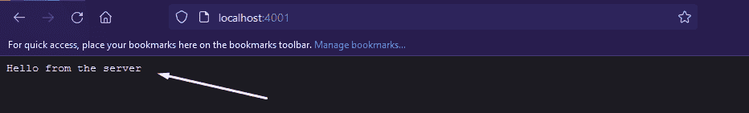
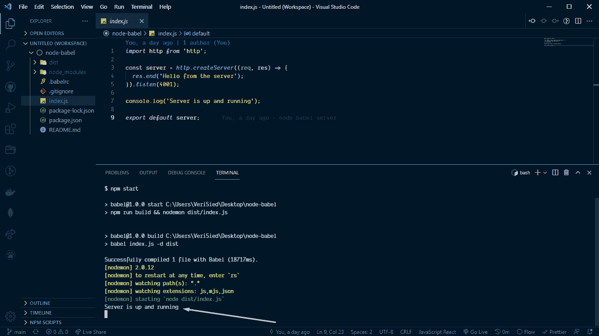

# 如何在 Node.js 中设置 Babel

> 原文：<https://www.freecodecamp.org/news/setup-babel-in-nodejs/>

Node.js 是目前最流行的后端技术之一。它友好、健壮、维护良好，不会很快消失。

为了帮助您学习如何有效地使用它，在本文中，我们将使用 Node 创建一个简单的服务器，并在代码中配置 Babel。

但是在我们深入构建我们的服务器之前，让我们了解一下 Babel 是什么。

## 巴别塔是什么？

Babel 是一个 JavaScript 编译器。这是一个流行的工具，可以帮助您使用 JavaScript 编程语言的最新特性。

## Node.js 中为什么要用 Babel？

你是否曾经打开过一个用 Node.js/Express 构建的后端回购程序——你首先看到的是 ES6 导入和导出语句以及其他一些很酷的 ES6 语法功能？

巴贝尔让这一切成为可能。记住，Babel 是一个流行的工具，可以让你使用 JavaScript 的最新特性。今天，许多框架使用 Babel 来编译它们的代码。

例如，如果没有 Babel 这样的编译器的帮助，Node 无法使用 ES6 导入和导出语句以及 ES6 语法的其他一些很酷的功能。

因此，在本教程中，我将向您展示如何快速设置您的节点应用程序，以兼容大多数 ES6 语法。

很棒吧？让我们开始吧。

## 先决条件

本教程假设您具备以下条件:

*   Node.js 的基础知识
*   安装在计算机上的节点
*   您选择的任何代码或文本编辑器

## 入门指南

让我们设置一个我们将在本教程中使用的基本节点应用程序。

创建一个新文件夹。对于本教程，我将调用我的节点-巴别塔。现在将文件夹添加到工作区，并打开您的终端。

让我们为我们的应用程序初始化并创建一个 package.json 文件:

```
npm init
```

该命令将显示一些设置步骤，我们希望保持不变。所以在整个设置过程中按回车键就可以了。

完成后，创建一个名为“index.js”的新文件，作为我们的入口。

### 如何设置和安装 Babel

现在，我们将安装来自 Babel 家族的三个软件包，它们是:

```
@babel/cli, @babel/core and @babel/preset-env
```

要安装，我们使用下面的命令来安装软件包:

```
npm install --save-dev @babel/cli @babel/core @babel/preset-env
```

我们想使用 **- save-dev** 来安装它们，作为模块开发的依赖项。

所以一旦你完成了安装，创建一个名为**的新文件。babelrc** 用于配置 babel。

```
touch .babelrc
```

这个文件将包含我们想要添加到 Babel 的所有选项。所以现在，让我们使用我通常在应用程序开发中使用的设置。您可以复制它并添加到您的:

```
{
  "presets": [
    ["@babel/env", {
      "targets": {
        "node": "current"
      }
    }]
  ],
  "plugins": [
    "@babel/plugin-proposal-class-properties",
    "@babel/plugin-proposal-object-rest-spread"
  ]
}
```

上面的配置是我用来告诉 Babel 的，是的，我不仅想使用我的导入和导出语句，还想使用 ES6 的类特性以及 rest 和 spread 操作符。

太棒了是吗？我们继续吧。

### 如何设置简单的服务器

现在打开我们之前创建的“index.js”文件，添加以下代码以生成一个简单的服务器:

```
import http from 'http';

const server = http.createServer((req, res) => {
  res.end('Hello from the server');
}).listen(4001);

console.log('Server is up and running');

export default server;
```

使用上面的示例代码，我们的服务器将监听端口 4001，然后在我们访问该端口时向我们发送“Hello from the server”响应。

### Package.json 脚本配置。

我们现在有一个简单的服务器。要运行它，我们必须在运行 Node 之前传输我们的代码。为此，打开 **"package.json"** 文件并添加这个构建和启动脚本:

```
 "scripts": {
+   "build": "babel index.js -d dist",
    "start": "npm run build && node dist/index.js"
  } 
```

很好，那么让我们用这个命令启动我们的服务器:

```
npm start
```

当您访问 localhost:4001 时，应该会得到这个响应



## 如何使用 Nodemon 来观察和重启你的服务器

为了防止在您修改应用程序时自己重启服务器，我们需要安装 nodemon。您可以使用以下命令将 nodemon 安装到您的应用程序中，将其作为 dev 依赖项安装:

```
npm install --save-dev nodemon 
```

然后我们重新配置我们的 package.json 脚本:

```
 "scripts": {
    "build": "babel index.js -d dist",
    "start": "npm run build && nodemon dist/index.js"
  } 
```

太棒了，现在这是我们的节点应用程序的最终代码，当你运行“npm start”来启动你的服务器时，你应该会得到什么。



正如你从上图中看到的，我们的服务器已经启动并运行。现在，您可以利用 es6 语法中的 import 和 export 语句以及 es6 提供的其他出色特性，如节点应用程序中的 rest 和 spread 操作符。

## 结论

在本教程中，我们学习了如何使用 Babel 在我们的节点应用程序中使用令人敬畏的 ES6 语法。

请注意，您可以在中添加更多配置。babelrc 文件。它并不局限于我们在本教程中的内容——所以请随意调整或更改它。

你可以在这里找到示例代码:[https://github.com/Veri5ied/node-babel](https://github.com/Veri5ied/node-babel)

黑客快乐！