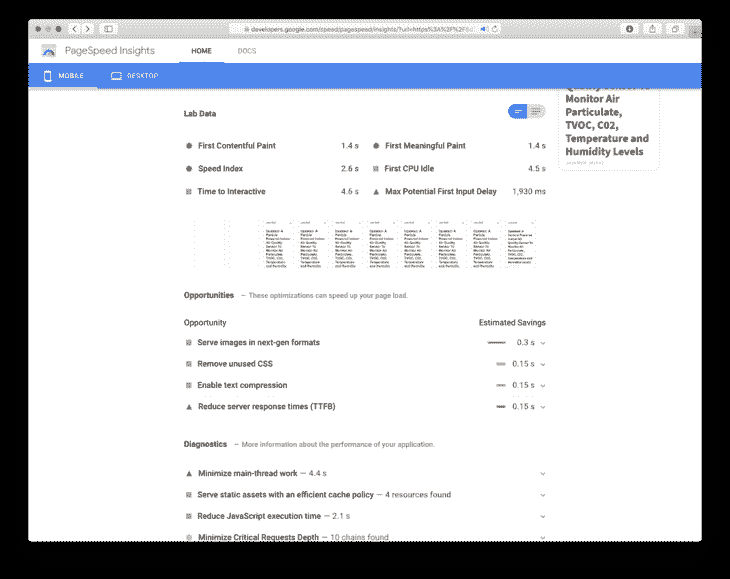
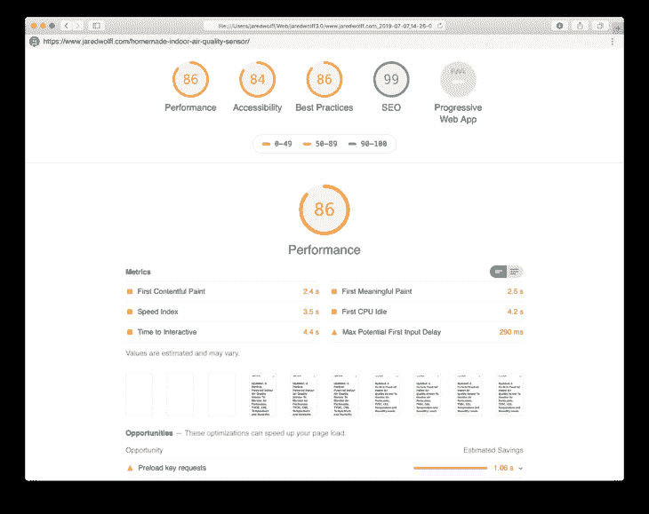
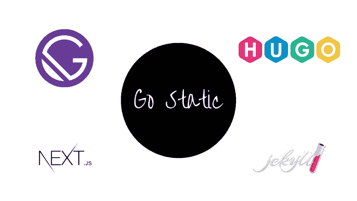
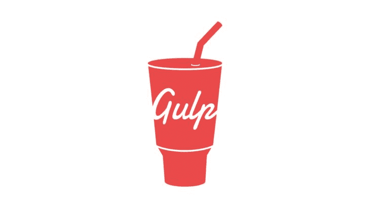

# 提高网站速度的 7 种有效方法

> 原文：<https://www.freecodecamp.org/news/seven-ways-to-optimize-your-site-for-speed/>

**这篇文章最初来自我在[www.jaredwolff.com](https://www.jaredwolff.com/seven-ways-to-optimize-your-site-for-speed/)的博客。**

网页排名取决于你提供内容的速度。

你需要优化以获得第一名。作为一个额外的好处，你的访客会感谢你。(或者甚至没有注意到——这是一件好事！)

在这篇文章中，我向你展示了如何优化你的网站速度。

让我们开始吧。

## 获取基线

首先，让我们对你的站点进行采样。

谷歌的 PageSpeed insights 工具应该是你的第一站。使用后，你会知道你的网站是否同时为移动和桌面优化。

谷歌的速度测试基于你的页面呈现内容的速度。也就是说，他们测量你的网站吸引访问者眼球所需要的时间。等待时间越长，分数越低。

这是我博客上[这一页](https://www.jaredwolff.com/homemade-indoor-air-quality-sensor/)的截图。



这张截图是优化了几个大问题之后拍的。我抛弃了 Disqus ，内嵌了我的 CSS 和 Javascript。移动设备的性能从 50/100 的范围上升到 90/100。还不错！

我对 Pagespeed Insights 的一个主要抱怨是它有多慢。

喜欢..难以忍受的缓慢。

解决办法？

*灯塔。*

### 使用灯塔

[Lighthouse](https://github.com/GoogleChrome/lighthouse) 是一个`npm`包，你可以安装在你的电脑上。这基本上是 Pagespeed 的见解，但类固醇。(Pagespeed Insights 基于灯塔)

当您在本地运行它时，您将保留从测试中生成的任何信息。(不过，我肯定 Chrome 会给家里打电话告知你正在做的事情..？)

以下是开始的方法:

1.  要安装，您可以运行:

    ```
     npm install -g lighthouse 
    ```

    还要确保你安装了某个版本的谷歌浏览器。我用的是 [Chrome Canary。](https://www.google.com/chrome/canary/)

2.  然后你可以运行它并得到这样的报告

    ```
     lighthouse https://www.jaredwolff.com --view 
    ```

    `--view`将导致报告在您的默认网络浏览器中打开。这是一份来自之前同一页面的报告:

    

它不仅包括性能，还包括可访问性、最佳实践和 SEO 建议。

缺点是你必须一页一页地运行这个测试。我建议你使用有大量内容的样本页面。这样你就在测试你网站最差的部分。一旦你解决了最糟糕的问题，你的整个网站将会有一个性能提升！

## 进入静态



还记得网站是 100% HTML & CSS 的时候吗？

在过去的几年里，我们从纯 HTML 发展到 Ruby On Rails，慢慢地我们又回来了。

原因？

速度。

每当你访问一个运行 Flask、Ruby on Rails 或类似软件的网站时，它都会这样:

1.  请求一个页面
2.  服务器把你的网站拼凑在一起
3.  服务器小型化和 gzip
4.  服务器将内容发送回浏览器

这本身，并不需要很长时间。当你把它乘以 1000 或 1000 的 10 倍时，你就开始遇到问题了。

如果你把所有的*拼接*一次会怎么样？

这就是静态生成网站的优势。

让我们来看看它是如何工作的:

### 静态站点生成器是如何工作的？

静态站点生成器是模板和样式的集合。它们可以组合在一起生成不同的内容。

作为后端，静态站点生成器使用 markdown 和(有时)JSON。

到了编译的时候，模板就组装好了。降价被转换成 HTML，然后注入到模板中。结果呢？丰富的“动态外观”页面的输出目录。(如果你在我的网站上，就像你现在正在阅读的一样！)

就我个人而言，我的博客是由 Hugo 提供支持的。我也涉猎过[中间人](https://middlemanapp.com)和[哲基尔](https://jekyllrb.com)。无论你在寻找什么，你都有可能找到一个静态站点生成器来满足你的需求！Netlify 有一个很好的静态站点生成器列表，按受欢迎程度排序。点击此处查看。

### 插件丰富

静态站点生成器不再仅仅编译站点。他们优化，缩小和调整图像大小。这种内置功能是考虑静态生成站点的另一个原因。利用这些资源，你的网站会变得更快。

例如，最初我使用`highlight.min.js`来突出显示代码。自从发现 Hugo 内置的语法高亮，我就放弃了`highlight.min.js`。Hugo 将 CSS 注入到代码块的 HTML 中。留下格式良好的(静态)页面！

## 嵌入 Javascript 和 CSS


正如我在前面提到的，当您必须加载任何额外的内容时，您的性能会受到影响。

最近，Hugo 能够将文件中的内容复制到最终的 HTML 代码中。这对 CSS 和 Javascript 之类的东西来说太棒了。这样，所有的东西都构建到了 HTML 文件中。不需要额外的获取！

例如，我把我的完整的`stye.css`文件放在站点的头部。这样，所有的样式都可以立即应用。

```
<!-- Css -->
{{- $style := resources.Get "/css/style.css" -}}
<style>
  {{ ( $style | minify ).Content | safeCSS }}
</style> 
```

在页脚，我将缩小的`lazysizes.min.js`导出到一个`<script>`标签中。重要的是，这是尽快加载，因为它决定了网站的其余部分将如何加载。

```
<!-- Lazy Load Script -->
{{- $lazysizes := resources.Get "/js/lazysizes.min.js" -}}
<script>
  {{ ( $lazysizes | minify ).Content | safeJS }}
</script> 
```

**边注:**`style.css`和`lazysizes.min.js`都位于`assets`下我的主主题文件夹中。Hugo 使用`assets`文件夹来寻找这些文件。如果你有一个 Hugo 网站，并且想嵌入你的 css 和 javascript，我推荐你[看看这个资源。](https://gohugo.io/hugo-pipes/bundling/#readout)

**边注 Numero Dos:** 正如你在上面看到的，我在使用 Hugo 内置的`minify`函数来嵌入项目。javascript 已经被缩小了，但是`style.css`还没有。还有另一种编程方式来缩小你所有的资产。我将在**优化使用 Gulp** 部分对此进行更深入的探讨。

## 使用内置的功能

您现在可能已经注意到，导入 javascript 可能会造成损失。将它用于网站的每个功能可能会导致糟糕的性能！

例如，我们可以使用 javascript 库进行表单验证。但是有没有更好的办法呢？

(是)

您可以使用 HTML5 标签，如`required`并使用`pattern`在浏览器中进行验证。如果你想要一个例子，请查看我网站上的[联系表](https://www.jaredwolff.com/about/)。


你看到的所有验证都是在浏览器中完成的。没有额外的 javascript。装货没有延误。？

这里有一个很好的资源:[https://CSS-tricks . com/form-validation-part-1-constraint-validation-html/](https://css-tricks.com/form-validation-part-1-constraint-validation-html/)Chris 也有一个详细的关于普通 javascript 验证的分步部分。如果你愿意，你可以走得更远。

## 组织代码

javascript 和 css 放在哪里会影响性能。例如，我把我的 javascript 和 CSS 放在战略位置。主样式表在`<head>`中，其他的在页脚或内嵌在 HTML 中。类似地，javascript 大多位于页面底部。这样，所有重要的东西都会先被加载。

下面是我如何组织 javascript 的一个例子:

```
...
</footer>
...

<script src="https://code.jquery.com/jquery-3.4.1.min.js"   integrity="sha256-CSXorXvZcTkaix6Yvo6HppcZGetbYMGWSFlBw8HfCJo="   crossorigin="anonymous"></script>
<script src="https://cdn.jsdelivr.net/npm/js-cookie@2/src/js.cookie.min.js"></script> 
```

我鼓励你去试验，看看是什么提高了你的站点性能。如果你可以不使用某些 javascript 库，我强烈建议你不要使用它们！

## 惰性装载


延迟加载是延迟加载不在视图中的资产的有效方法。这改善了谷歌所说的“互动时间”体验。一个额外的好处是，如果访问者不向下滚动，图像不会被加载。从而为高流量网站节省带宽和资金。

惰性加载以 javascript 的形式出现。有几个图书馆:

*   [lazy sizes](https://github.com/aFarkas/lazysizes)(⭐️11k)——似乎是这个部门最受欢迎的。它比一些替代品更大。我一直在测试它在延迟加载 iframes 和 javascript 内容方面的有用性，这些内容并不是立即需要的。例如，我在这篇文章中为[的谷歌文档图表嵌入了一个 iframe。在同一篇文章中，我还在文章的末尾偷懒加载了](https://www.jaredwolff.com/homemade-indoor-air-quality-sensor/#live-example)[的 Youtube 视频。](https://www.jaredwolff.com/homemade-indoor-air-quality-sensor/#you-did-it)
*   [Layzr.js](https://github.com/callmecavs/layzr.js) (⭐️ 5.5k) -仅用于图像
*   洛扎德(⭐️5.4k)——做懒汉做的一切。这个库专注于使用交叉点观察器 API。而 Lazysizes 同时使用交叉点观察器 API 和
*   yall(⭐️800)——这个库也专注于使用交叉点观察器 API。

### 设置延迟加载

设置起来极其简单。我会告诉你如何使用`lazysizes`

1.  将文件包含在 HTML 中

    ```
     <script src="lazysizes.min.js" async=""></script> 
    ```

    (或者，如果你使用 Hugo，就像我在**嵌入 Javascript 和 CSS** 中所做的那样，将它直接注入到你的 HTML 中)

2.  将`lazyload`类添加到您正在懒惰加载的内容中

3.  将`src`标签更改为`data-src`

### 观看魔术

当有人访问你的站点时，懒惰加载器开始监视用户在哪里。当访问者滚动时，它会加载标记有`lazyload`类的待查看内容。

下面是一个嵌入在 [this page](https://www.jaredwolff.com/homemade-indoor-air-quality-sensor/#you-did-it) 的 Youtube 视频示例:

```
<iframe class="lazyload" width="700px" height="400px" data-src="https://www.youtube.com/embed/IR2W0GmRKk8" frameborder="0" allow="accelerometer; autoplay; encrypted-media; gyroscope; picture-in-picture" allowfullscreen></iframe> 
```

这阻止了 iframe 的加载，直到用户滚动到附近。不错！

## 使用 Gulp 优化



不是所有的东西都能被哲基尔或者雨果优化。那么你能做什么呢？

输入`gulp`

是我优化 Hugo 网站的首选工具。对于`gulp`，有许多很好支持的插件。他们可以做任何事情，从优化图像到缩小 HTML。

以下是我最喜欢的一些:

`gulp-uglify` -缩小并压缩 javascript。我现在只有一个 javascript 库适用于这个。如果你的项目大量使用 Javascript，一定要研究一下`gulp-uglify`

缩小 HTML。您还可以使用它来缩小内联 Javascript 和 CSS。

对我来说，这可能是最有用的 gulp 插件。现在我正在调整它的大小，转换成 jpg 格式，然后再转换成渐进式 jpeg 格式。它相对较快，当与`gulp-cache`结合使用时，只需做一次！这可能看起来很复杂，但输出产生的图像大小是 Lighthouse 喜欢的。

### 例子

如果你好奇的话，这里有我的`imagemin`的`gupfile.js`片段

```
gulp.task("resize", function() {
  return gulp
    .src(["content/**/**/*.+(png|jpg|jpeg|gif)"])
    .pipe(cache(imagemin([
      imagemingm.resize({width: 720}),
      imagemingm.convert('jpg'),
      imageminmozjpeg({quality: 80})
    ],{
    verbose: true
    }), {
      fileCache: new Cache({ tmpDir: path.join(process.env.PWD, 'node_modules'), cacheDirName: '.cache' })
    }))
    .pipe(gulp.dest("public/"));
}); 
```

一些需要注意的重要事项

*   我使用了`**`来表示目录名的通配符值。根据图像的深度，您可能需要在路径中添加更多的`**/`。这对于我典型的`/contents/post-name/images/image-file.jpg`之路很有效
*   设置其他不附带`gulp-imagemin`的插件可能会令人困惑。例如，`imageminmozjpeg`是单独导入的。我把它放在我的文件的顶部，就像这样:`var imageminmozjpeg = require('imagemin-mozjpeg');`
*   最后，你可以看到我在这里使用了`gulp-cache`。取决于你在哪里建立你的站点，你可能不需要定义任何选项。我的网站使用 Netlify。让`gulp-cache`工作的唯一方法是将`tmpDir`和`cacheDirName`定义到`node_modules`文件夹中。这样，当您的网站建立后，您的缓存将被重新加载。没有调整图像大小，如果我们没有必要！

通过使用`gulp-cache`，我的构建和部署时间从 10 分钟减少到了大约 60 秒。？用缓存大小的微小增加来换取计算时间绝对是值得的。另外，我肯定 Netlify 对此很高兴！

## 取下调味瓶


当有便利时，总会有权衡。

这就是我在继续使用谷歌分析和 Disqus 等服务时的发现。尤其是迪斯克斯，有一种把我逼入绝境的趋势。(曾经在使用 Disqus 的网站上查看过您的 Javascript 调试控制台吗？你会明白为什么..)

我最近写了一篇关于如何从 [Disqus 转换到自托管 Commento](https://www.jaredwolff.com/how-to-setup-worry-free-blog-comments-in-less-than-20-simple-steps/) 的教程。进行转换有两个好处:

1.  你可以控制你的网站内容。没有第三方服务可能明天就消失。(你要保证你的内容有备份！[为服务](https://www.commento.io)付费而不是托管的一个好处)。
2.  您将获得性能提升！我已经测试了前后的结果。Disqus 是网络和 CPU 使用的主要障碍。
    Commento，轻量级，资源使用量最小。静态生成网站的完美伴侣！

作为一个网站所有者，质量和速度完全取决于你的网站功能。记住，可能有更好的选择。没有必要把你的灵魂卖给谷歌、Disqus 或者任何人，如果你不需要的话！

## 现场审计

在我结束这篇文章的时候，我想留给你一个更方便的工具。

Serpstat 的 **现场审计**工具。

我用它来定期抓取我的网站。它对于捕捉所有类型的错误都非常有用。例如，就在最近，它捕捉到了一些被破坏的图像。我做了一些编辑，一切都恢复正常了！


如果你想让你的网站没有错误，没有什么比 Serpstat 这样的网站审计工具更好的了！

## 你永远不会结束

你没看错。你永远不会结束。

为一个积极开发的站点提高性能是永无止境的。尽管你尽了最大的努力，你还是可能在优化图像和延迟加载上花费数天时间。归根结底，有多少是值得的？这个问题我自己也还在努力回答！

我希望这篇文章对你有用。你最大的收获是什么？有我没有提到的优化技巧吗？请在下面的评论中发表意见！