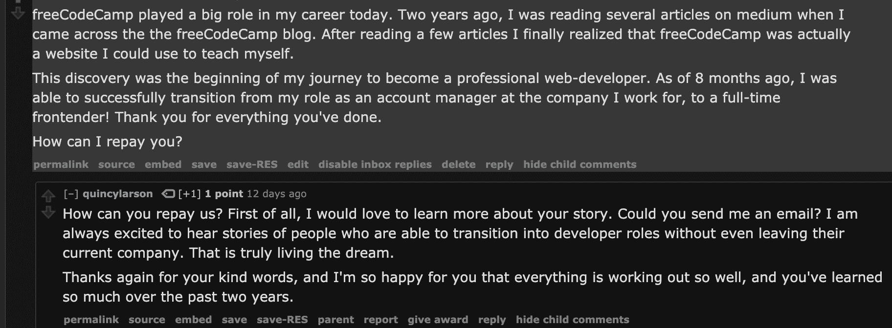
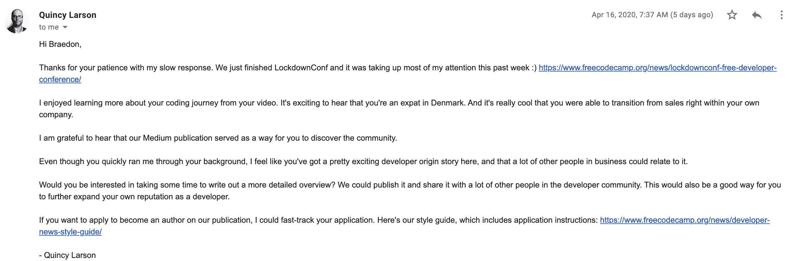
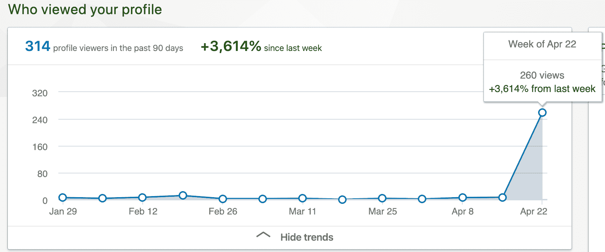
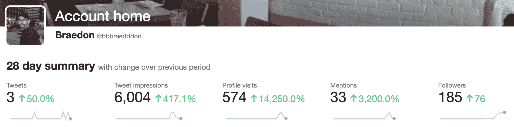

# 亲爱的开发者:请分享你的故事。我们都可以从彼此的编码之旅中学习。

> 原文：<https://www.freecodecamp.org/news/share-your-developer-journey/>

我很幸运地在 freeCodeCamp 出版物上分享了我从销售过渡到 web 开发的故事:[我如何在 16 个月内从销售过渡到前端开发人员](https://www.freecodecamp.org/news/how-i-went-from-sales-to-frontend-developer-in-16-months/)。

我偶然发现了这个机会。在 Reddit 上，我看到昆西在 freeCodeCamp subreddit 上发布了关于他即将发行的 AMA 的消息。回复不多，所以我想早点投稿会很有趣！我很快发现这些问题应该在 [Hashnode](https://hashnode.com/post/ama-im-quincy-larson-the-teacher-who-founded-freecodecamp-ask-me-anything-ck8ifuyqe02uxz3s1sujiulam) 的一个帖子中提出。

我的问题没有多大分量，所以我没有创建一个帐户并重新发布。然而，几个小时后，我看到了一个橙色的小信封，这是我很少在 Reddit 上看到的。昆西回答道！

Quincy's reply on Reddit - April 8, 2020

freeCodeCamp 创始人想听听我的故事？这感觉非常令人兴奋。人们开始寻找他的电子邮件地址，这并不像人们想象的那样容易找到。

经过几次有针对性的谷歌搜索，我找到了一个我认为可能有用的地址，并开始了我的草稿。当给我一个任务时，我通常不喜欢浪费时间，所以我没有想好要写什么，而是拍了一个视频:

[https://www.youtube.com/embed/ixwUxOudDQI?feature=oembed](https://www.youtube.com/embed/ixwUxOudDQI?feature=oembed)

第二天，所以我知道我必须耐心等待我的回复。我的销售本能开始发挥作用，我给自己设定了一个第二天跟进的任务，这样我的视频就不会迷失在电子邮件的海洋中。我不知道我期待的是什么。不努力坚持到底是很愚蠢的！

我的坚持没有被忽视，一天清晨，我的收件箱里有一封回信:

差不多两年前，我写了一篇简短的文章，回忆了我在自由代码营的头两周。它的本意是帮助我保持对进度负责，然而，它现在成了我开始学习时的时间戳。文章的第一行是，

我最喜欢读的东西之一是那些已经成名的开发人员如何开始他们的编码之旅的故事。

有机会在让我起步的同一个平台上分享我自己的故事是一种绝对不可思议的感觉。每当我想起它，我就哽咽。

不到 10 分钟，我就提交了成为该出版物作者的申请。那天我的每一分钟空闲时间都用来写我的故事，在那天晚上 22:12，我把我的第一稿发给了可爱的博客编辑审阅。

Abbey 很快分享了她的反馈，我在第二天匆忙实施了这个反馈。那天下午晚些时候，她给我写了回信，我的故事发表了将近 20 分钟，这让我大吃一惊。

## 我的故事上线了

作为一个几乎从不在社交媒体上发帖的人，与我平时的不活跃相比，看着分析指数攀升当然很有趣。

此外，作为 freeCodeCamp 出版物的一名新作者，我现在被授权查看 google analytics，不仅是我的帖子，还有整个网站。我喜欢这种类型的东西，所以我没有浪费时间，然后四处打探。

我很难在谷歌分析中找到任何超级有趣的东西，尽管追踪有多少人在积极查看我的文章，以及随着时间的推移它获得了多少页面浏览量很有趣:

Pages views from April 12 - 20, 2020

我在 Linkedin 上收到了几十个连接请求，个人资料浏览者也大幅增加。即使升级到 premium，我发现除了每个人都可以使用的图表之外，可用的数据非常有限:

Linkedin profile views, January - April 2020

Twitter 可能是最有趣的。我不知道他们有一个易于访问的分析应用程序可供探索。看到我在过去 28 天里发了多少条推文，而我的个人资料的访问量却增长了 14，000%，这实在是太可笑了:

Twitter account summary for April 2020

看着数字攀升当然很有趣，但最终，这些只是虚荣的衡量标准。分享我的故事的真正影响很难衡量。

## 我真正学到的是

我完全被那些给我写了详细周到的私信，感谢我的分享的人所打动。

我从来没有预料到，我过去作为一名销售人员的生活的愚蠢故事现在成为那些现在和我两年前处于几乎相同情况的人的动力来源。这让我后悔没有写出每一个帮助我保持足够动力不放弃的作者的故事。

我认为你在旅程中的位置并不重要，无论是大型全球科技公司的高级软件架构师还是 web 开发训练营第一个模块的学生。我敢肯定，有一些人需要你的洞察力和经验来保持足够高的精神状态，不要放弃。

像 [#LearnInPublic](https://twitter.com/hashtag/learninpublic) 这样的倡议拥有如此庞大的追随者，因为对他人经验的渴望是绝对无法满足的。这可能让人觉得多一篇博文、一条推文或一段视频不会有什么不同，然而，这与事实相去甚远。

我注意到信息之间有一个共同的主题。尽管有时感觉有无限量的资源和社区平台可用，但仍然存在对建议、指导、课程和学习工具的巨大需求。

## 你能提供什么帮助

你可以通过许多方式提供直接帮助。写下你的经历可能是最低的进入门槛。在 Medium 上做账几乎不需要任何努力，他们庞大的受众群肯定会有助于发行。

也许写作不一定是你的事。制作短小精悍的视频可以节省他人几个小时的挫败感。我很喜欢使用 [Loom](https://www.loom.com/) 作为一种简单的录制截屏方式。他们处理上传，给你一个平台来编辑视频，并允许你使视频互动。如果你想把你的视频放在 YouTube 上，从他们的仪表盘上下载你的内容也非常容易。

制作视频可能有点令人生畏，可能你根本没有可用的设备来实现这一点。对大多数人来说，绝对严重缺乏良师益友。像[编码蔻驰](https://codingcoach.io/)这样的平台当然有助于填补空白，但令人难以置信的是，很少有人知道这是一个选项！

如果不是一对一，你更喜欢一对多的设置，有许多组织，如 [Hack Your Future](https://www.hackyourfuture.net/) ，总是在寻找志愿者导师来帮助教授他们免费的 web 开发项目。他们甚至开源了他们的[课程](https://github.com/HackYourFuture/curriculum)！也许你的使命是在你自己的社区开办一所免费的编码学校。

整个技术社区都是围绕着免费的在线资源和开源软件建立起来的，用于学习和开发。回馈给同一个社区的人数少得可怜。

请考虑如何开始一小步一小步地分享你的经验和知识，这样其他人也可以像你一样从中受益。

别见外！如果你有任何问题，请随时写信，[给我发邮件推荐你最喜欢的书，](mailto:braedongough@gmail.com) [在 Linkedin 上联系我](https://www.linkedin.com/in/braedon-gough-ba92a048/)或[在 twitter 上关注我](https://twitter.com/bbbraedddon)！