# 与 React Native 共享元素转换

> 原文：<https://www.freecodecamp.org/news/shared-element-transition-with-react-native-159f8bc37f50/>

作者纳伦德拉·谢蒂


# 与 React Native 共享元素转换

在这篇文章中，我将讨论如何用 React Native 实现 iOS 和 Android 的共享元素转换。

我已经把代码贴在了 GitHub 上，如果你想直接进入的话，你可以看看。

### 目的

让我们看看我们将要构建什么。下面是一个照片网格的例子，我们将添加一个共享元素过渡。这样，我们可以在网格和我们选择的照片的详细信息页面之间平滑过渡。


这是一种更加顺畅和持续的体验。

### 方法

在我们建立这个之前，让我告诉你这个系统是如何工作的。由于 React Native 不支持真正的共享元素，当我们说我们正在两个屏幕之间进行共享元素转换时，我们在技术上并不共享任何元素。相反，每个屏幕都有自己独立的元素。

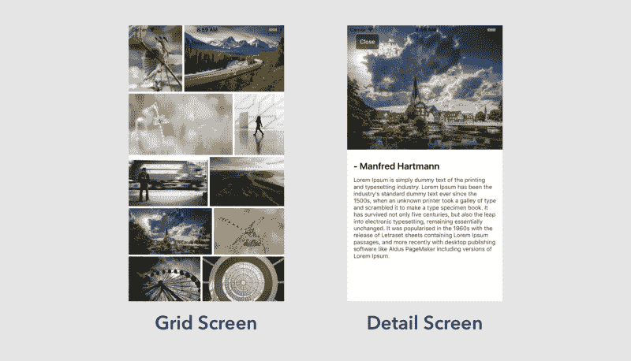

我所做的是在这两个元素之间传递关于共享元素的信息——比如它的位置和大小。

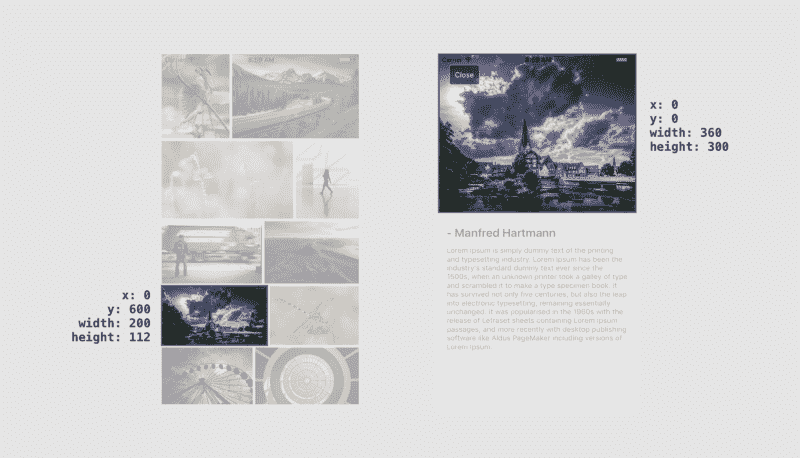

当详细信息屏幕启动时，其背景设置为透明，并隐藏其所有元素。然后，它将共享元素的属性更改为传递的属性，然后使其可见。然后它会自动回复到自然状态。随着过渡的进行，窗口背景和其余非共享元素会慢慢淡入，直到它们完全不透明。

因此，虽然该元素在技术上并不共享，但烟雾和镜子的巧妙把戏让它们看起来是共享的。

现在我们已经了解了这个过程是如何工作的，让我们一步一步地了解如何共享模拟元素，以及我们如何控制动画。

#### 步骤 1:进入和退出动画

我这里有两个屏幕:网格和细节。在网格屏幕中，我们可以通过单击网格中的一个图像来启动详细信息屏幕。然后，我们可以通过点击后退按钮返回到网格屏幕。


当我们从网格屏幕转到细节屏幕时，我们有机会运行两组过渡动画——网格屏幕的退出过渡和细节屏幕的进入过渡。

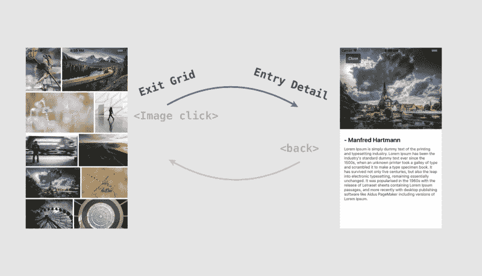

让我们看看如何实现这一点。

没有任何过渡，这就是应用程序的外观。点击单个图像将带您进入详细信息屏幕。

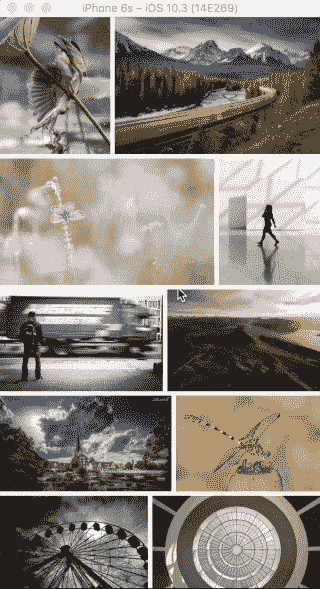

让我们给第一个网格屏幕添加一个退出过渡。这里我们使用了一个简单的淡出过渡，使用了`Animated` api，它将网格屏幕容器的不透明度属性从 1 插值到 0。

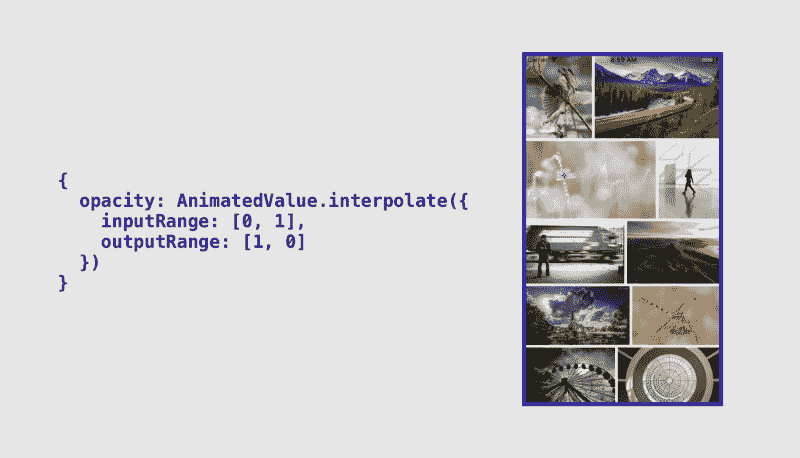

现在我们已经完成了，下面是它的样子:

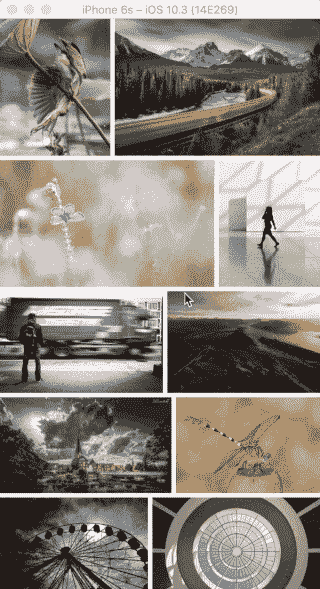

不算太坏。我们看到，当我们移至详细信息屏幕时，网格逐渐消失。

现在让我们添加另一个过渡到细节屏幕的内容。让我们将文本从底部滑入该位置。

这是通过给文本容器的`translateY`属性分配一个插值的`Animated`值来实现的。

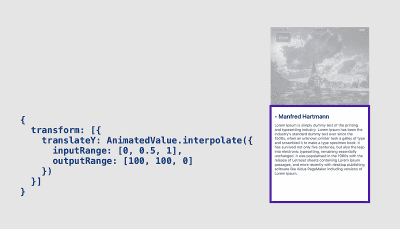

这是它的样子:

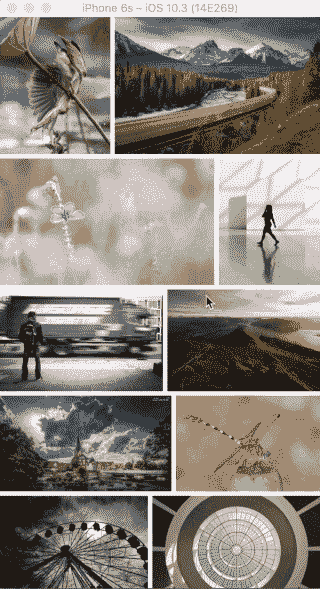

嗯，标题和描述滑得很好，但图像突然出现。这是因为我们的过渡并不特别针对图像。我们会尽快解决这个问题。

#### 步骤 2:共享元素的过渡层

我们现在添加一个过渡层，它出现在过渡期间，并且只包含共享元素。

单击网格中的图像时会触发该层。它从网格屏幕和细节屏幕接收关于共享元素的信息，比如它的位置和大小。

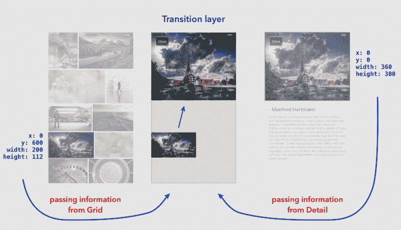

#### 步骤 3:过渡层中的动画

我们在过渡层中有关于共享元素的源和目的位置的信息。我们只需要激活它们。

让我们首先根据源位置和大小设置元素，然后将它动画到目标位置。这可以通过两种方式实现。让我们来看看他们两个。

#### 通过在宽度、高度、顶部和左侧进行插值

这是一种简单的方法。如果我们想让一个元素从一个尺寸改变到另一个尺寸，从一个位置改变到另一个位置，我们修改元素的宽度、高度、顶部和左侧样式属性。

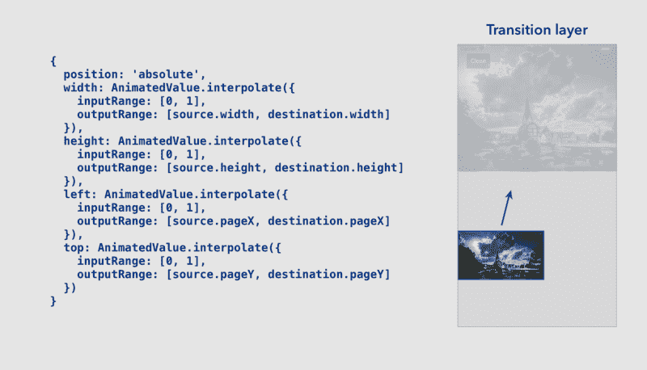

这是它的样子:

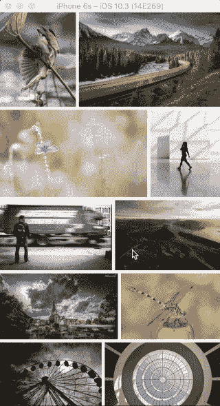

### **性能分析**

当使用动画时，我们声明一个表示我们想要执行的动画的节点图，然后使用一个驱动程序使用预定义的曲线更新动画值。

以下是动画制作步骤的详细说明以及它发生的位置:

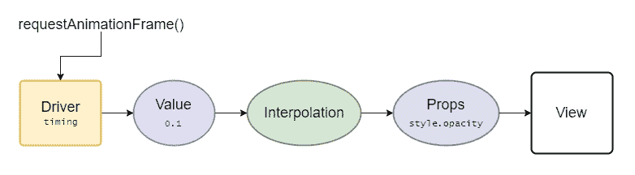

[https://facebook.github.io/react-native/blog/2017/02/14/using-native-driver-for-animated.html](https://facebook.github.io/react-native/blog/2017/02/14/using-native-driver-for-animated.html)

*   JavaScript:动画驱动程序使用`requestAnimationFrame`在每一帧上执行，并使用它基于动画曲线计算的新值更新它驱动的值。
*   JavaScript:计算中间值，并将其传递给一个附属于`View`的 props 节点。
*   JavaScript:使用`setNativeProps`更新`View`。
*   JavaScript 到本机桥。
*   本机:`UIView`或`android.View`被更新。

如您所见，大部分工作都发生在 JavaScript 线程上。如果被阻止，动画将跳过帧。它还需要在每一帧上通过 JavaScript 到本机桥来更新本机视图。

这个问题可以用`useNativeDriver`来解决。这将所有这些步骤移到本机。

由于 Animated 会生成动画节点的图形，因此它只能在动画开始时序列化并发送到 native 一次。这消除了回调 JavaScript 线程的需要。本机代码可以直接在每一帧的 UI 线程上更新视图。

主要的限制是我们只能激活非布局属性。像`transform`和`opacity`这样的东西可以工作，但是像上面使用的 flexbox 和 position 属性就不行。

#### 对变换进行插值并使用 useNativeDriver

现在让我们使用变换制作动画。这将需要一些数学计算的规模，x 和 y 的位置。

使用这种实现，如果我们从一个较小的图像缩放到一个较大的图像，图像将像素化。因此，我们将渲染较大的图像，然后将其缩小到其初始大小，然后将其动画放大到自然大小。

我们可以用这样一行 JavaScript 代码获得起始比例值:

```
openingScale = sourceDimension.width / destinationDimension.width;
```

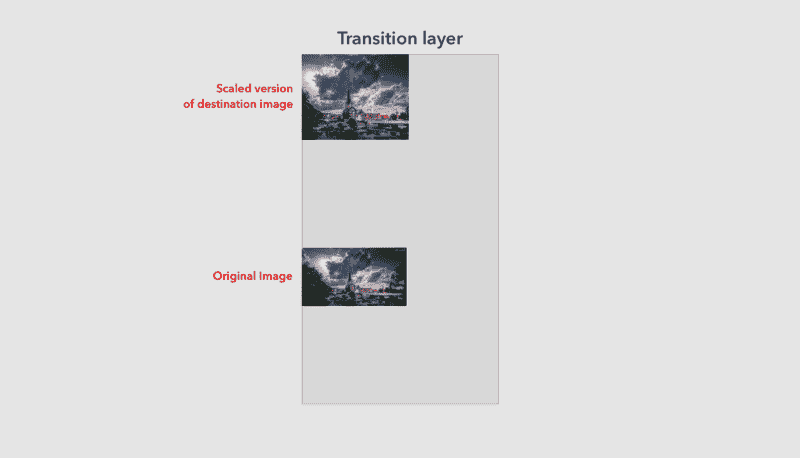

你会看到缩放后的图像和原始图像看起来不一样，这是因为源图像和目标图像的纵横比不同，所以为了解决这个问题，我们将根据目标尺寸使用源图像的纵横比来渲染图像。

```
const sourceAspectRatio = source.width / source.height;const destAspectRatio = destination.width / destination.height;
```

```
if (aspectRatio - destAspectRatio > 0) {  // Landscape image  const newWidth = aspectRatio * destination.height;  openingScale = source.width / newWidth;} else {  // Portrait image  const newHeight = destination.width / aspectRatio;  openingScale = source.height / newHeight;}
```

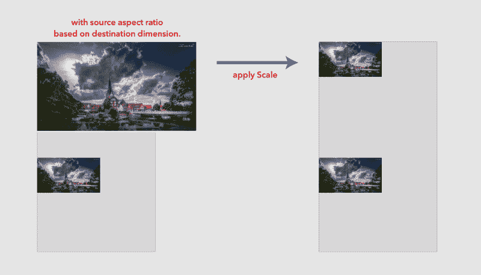

现在比例是正确的，我们需要根据目标图像获得新的位置。这可以通过目标位置减去旧尺寸和新尺寸之间的差的一半来计算。这相当于:

```
if (aspectRatio - destAspectRatio > 0) {  // Landscape image  destination.pageX -= (newWidth - destinationWidth) / 2;} else {  // Portrait image  destination.pageY -= (newHeight - destinationHeight) / 2;}
```

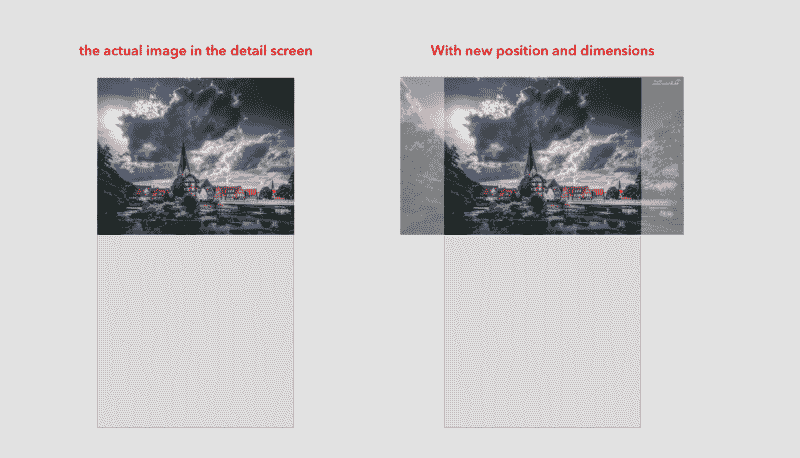

太完美了！我们现在有了过渡图像的正确尺寸和位置。

现在我们需要计算动画图像的平移位置。我们将从中心缩放图像，因此考虑到我们只是移动照片的中心，我们需要应用我们的平移。所以我们只做一些相对简单的数学计算，取源位置加上源维度的一半。这将等同于:

```
const translateInitX = source.pageX + source.width / 2;const translateInitY = source.pageY + source.height / 2;
```

```
const translateDestX = destination.pageX + destination.width / 2;const translateDestY = destination.pageY + destination.height / 2;
```

我们现在可以通过源图像和目标图像的中心之间的差异来计算平移位置

```
const openingInitTranslateX = translateInitX - translateDestX;const openingInitTranslateY = translateInitY - translateDestY;
```

有了这个找到的开始比例和转换值，我们就可以使用`Animated` api 制作动画了。

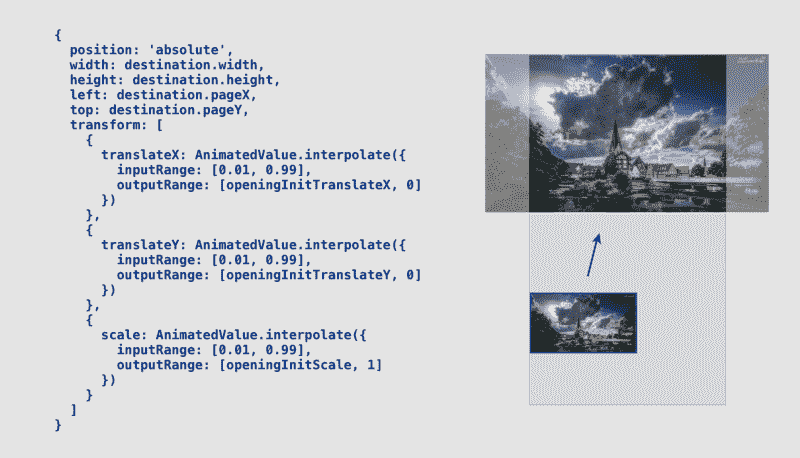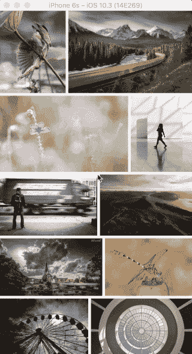

就是这样。我们现在有过渡工作。我们现在可以使用`useNativeDriver`，因为我们现在只动画非布局属性。

#### 步骤 4:在过渡期间隐藏源图像和目标图像

在之前的 gif 中，我们看到在转场过程中，被点击的图像仍然在同一个位置，目标图像在转场完成之前就出现了。

让我们在转换过程中隐藏源图像和目标图像，这样看起来被点击的图像就是细节屏幕的动画。

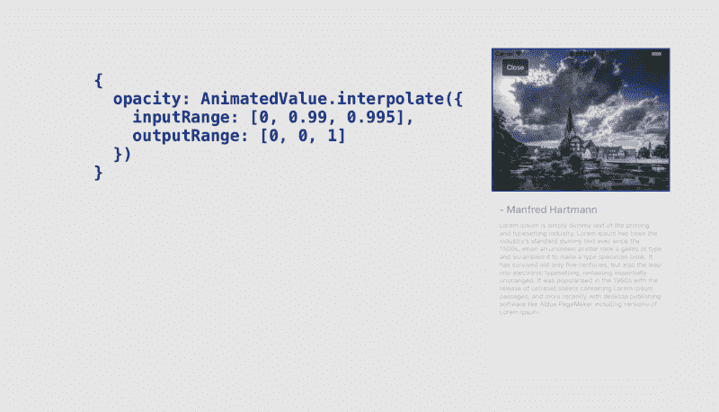

现在让我们看看输出。

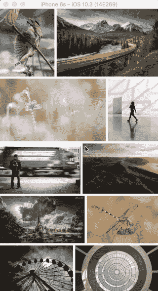

#### 第五步:处理后退按钮

在使用`Animated.timing()`转换到详细屏幕的过程中，我们将`AnimatedValue`从 0 更改为 1。所以当点击返回按钮时，我们只需将`AnimatedValue`从 1 改为 0

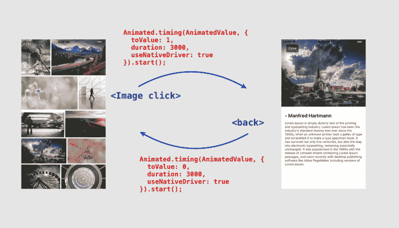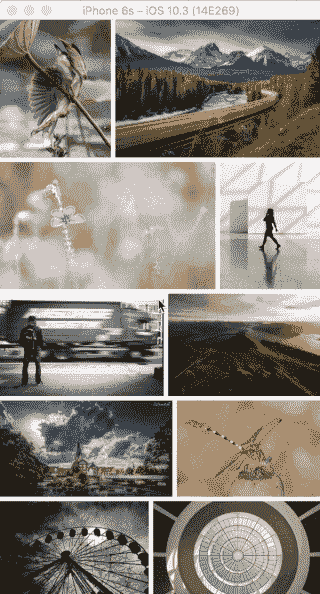

就是这样。你可以在 [Github](https://github.com/narendrashetty/photo-gallery-RN) 上查看代码，在 [Expo](https://expo.io/@narendrashetty/photo-gallery) 上试用演示。

[**narendrashetty/photo-gallery-RN**](https://github.com/narendrashetty/photo-gallery-RN)
[*通过在 GitHub 上创建一个帐户来为 photo-gallery-RN 的发展做出贡献。*github.com](https://github.com/narendrashetty/photo-gallery-RN)[**世博会图片库**](https://expo.io/@narendrashetty/photo-gallery)
[*一个空荡荡的新项目* expo.io](https://expo.io/@narendrashetty/photo-gallery)

也检查一下[埃里克·维森特](https://www.freecodecamp.org/news/shared-element-transition-with-react-native-159f8bc37f50/undefined)的[在共享元素跃迁](https://www.twitch.tv/ericvicenti)上的广播。

感谢你花时间阅读这篇文章。如果你觉得这很有用，请鼓掌并分享。你可以在推特上联系我 [@narendra_shetty](https://twitter.com/narendra_shetty) 。