# 初学者的 Shell 脚本——如何在 Linux 中编写 Bash 脚本

> 原文：<https://www.freecodecamp.org/news/shell-scripting-crash-course-how-to-write-bash-scripts-in-linux/>

Shell 脚本是 Linux 中进程自动化的一个重要部分。脚本帮助您在文件中编写一系列命令，然后执行它们。

这可以节省您的时间，因为您不必一次又一次地编写某些命令。您可以高效地执行日常任务，甚至可以安排它们自动执行。

您还可以设置某些脚本在启动时执行，例如在启动新会话时显示特定消息或设置某些环境变量。

脚本的应用和用途数不胜数，所以让我们深入研究一下。

在本文中，您将了解到:

1.  什么是 bash shell？
2.  什么是 bash 脚本，如何识别它？
3.  如何创建您的第一个 bash 脚本并执行它。
4.  shell 脚本的基本语法。
5.  如何查看系统的计划脚本？
6.  如何通过 cron 作业调度来自动化脚本。

最好的学习方法是通过练习。我强烈建议你使用 [Replit](https://replit.com/~) 来跟进。您可以在几分钟内访问正在运行的 Linux shell。

## Bash Shell 简介

Linux 命令行是由一个叫做 shell 的程序提供的。多年来，shell 程序已经发展到可以满足各种选择。

不同的用户可以被配置成使用不同的 shells。但是大多数用户更喜欢使用当前默认的 shell。许多 Linux 发行版的默认 shell 是 GNU Bourne-Again Shell (bash)。Bash 被 Bourne shell ( `sh`)继承。

当您第一次启动 shell 时，它使用位于`.bashrc`或`.bash_profile`文件中的启动脚本，这允许您定制 shell 的行为。

当一个 shell 被交互使用时，它会在等待用户命令时显示一个`$`。这被称为 shell 提示符。

`[username@host ~]$`

如果 shell 以 root 用户身份运行，提示符将变为`#`。超级用户 shell 提示符如下所示:

`[root@host ~]#`

Bash 非常强大，因为它可以简化某些用 GUI 很难有效完成的操作。请记住，大多数服务器没有 GUI，最好学会使用命令行界面(CLI)的强大功能。

## 什么是 Bash 脚本？

bash 脚本是写在文件中的一系列命令。这些由 bash 程序读取和执行。程序逐行执行。

例如，您可以使用命令行导航到某个路径，创建一个文件夹并在其中生成一个进程。

您可以通过将命令保存在 bash 脚本中并运行它来执行相同的步骤。您可以多次运行该脚本。

## 如何识别 Bash 脚本？

### 文件扩展名为`.sh`。

根据命名约定，bash 脚本以`.sh`结尾。然而，bash 脚本可以在没有`sh`扩展的情况下运行得非常好。

### 脚本以一声巨响开始。

脚本也用`shebang`标识。Shebang 是遵循 bash shell 路径的`bash #`和`bang !`的组合。这是脚本的第一行。Shebang 告诉 shell 通过 bash shell 来执行它。Shebang 只是 bash 解释器的一个绝对路径。

以下是 shebang 语句的一个示例。

```
#! /bin/bash
```

bash 程序的路径可以不同。我们将在后面看到如何识别它。

### 执行权

脚本对执行它们的用户具有执行权限。

执行权由`x`表示。在下面的例子中，我的用户对文件`test_script.sh`拥有`rwx`(读、写、执行)权限


### 文件颜色

可执行脚本以不同于其他文件和文件夹的颜色出现。

在我的例子中，具有执行权限的脚本显示为绿色。

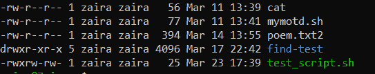

## 如何创建您的第一个 Bash 脚本

让我们在 bash 中创建一个输出`Hello World`的简单脚本。

### 创建一个名为 hello_world.sh 的文件

```
touch hello_world.sh
```

### 找到 bash shell 的路径。

```
which bash
```


在我的例子中，路径是`/usr/bin/bash`，我将把它包含在 shebang 中。

### 编写命令。

我们将`echo`“你好世界”带到控制台。

我们的脚本将如下所示:

```
#! usr/bin/bash
echo "Hello World"
```

使用您选择的文本编辑器编辑文件`hello_world.sh`，并在其中添加以上几行。

### 向您的用户提供执行权限。

使用以下命令修改文件权限并允许执行脚本:

```
chmod u+x hello_world.sh
```

`chmod`为特定用户修改文件的现有权限。我们正在给用户`u`添加`+x`。

### 运行脚本。

您可以通过以下方式运行脚本:

`./hello_world.sh`

`bash hello_world.sh`。

**下面是输出:**

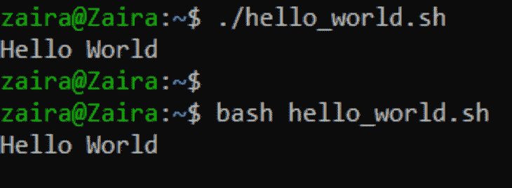

Two ways to run scripts

## Bash 脚本的基本语法

就像任何其他编程语言一样，bash 脚本遵循一组规则来创建计算机可以理解的程序。在这一节中，我们将研究 bash 脚本的语法。

### 如何定义变量

我们可以使用语法`variable_name=value`来定义一个变量。要获得变量的值，请在变量前添加`$`。

```
#!/bin/bash
# A simple variable example
greeting=Hello
name=Tux
echo $greeting $name 
```

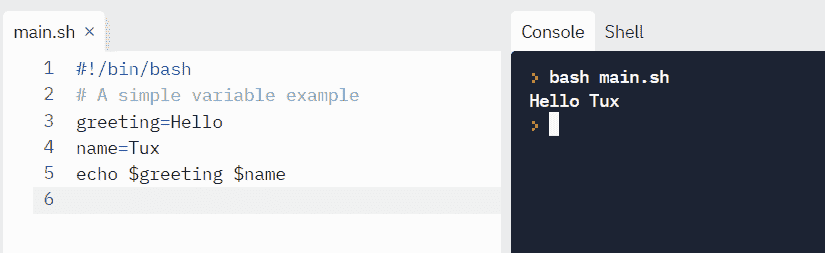

Tux 也是 Linux 吉祥物企鹅的名字。


Hi, I am Tux.

### 算术表达式

下面是 bash 支持的用于数学计算的运算符:

| 操作员 | 使用 |
| --- | --- |
| + | 添加 |
| - | 减法 |
| * | 增加 |
| / | 分开 |
| ** | 求幂 |
| % | 系数 |

让我们运行几个例子。

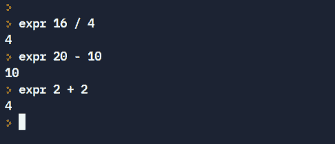

Note the spaces, these are part of the syntax

也可以使用以下语法计算数值表达式并将其存储在变量中:

`var=$((expression))`

让我们试一个例子。

```
#!/bin/bash

var=$((3+9))
echo $var 
```

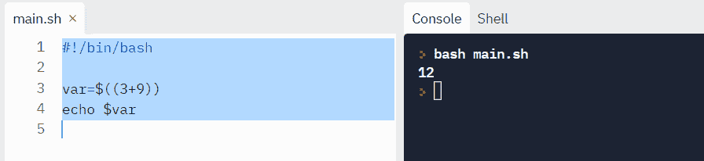

使用上述方法无法正确计算分数，分数会被截断。

对于**的小数计算**，我们可以使用`bc`命令得到输出到特定的小数位数。`bc` (Bash Calculator)是一个命令行计算器，支持计算到一定数量的小数点。

`echo "scale=2;22/7" | bc`

其中`scale`定义了输出中所需的小数位数。

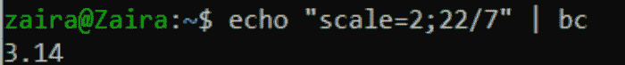

Getting output to 2 decimal places

### 如何读取用户输入

有时，您需要收集用户输入并执行相关操作。

在 bash 中，我们可以使用`read`命令获取用户输入。

```
read variable_name
```

要用自定义消息提示用户，请使用`-p`标志。

`read -p "Enter your age" variable_name`

**举例:**

```
#!/bin/bash

echo "Enter a numner"
read a

echo "Enter a numner"
read b

var=$((a+b))
echo $var 
```

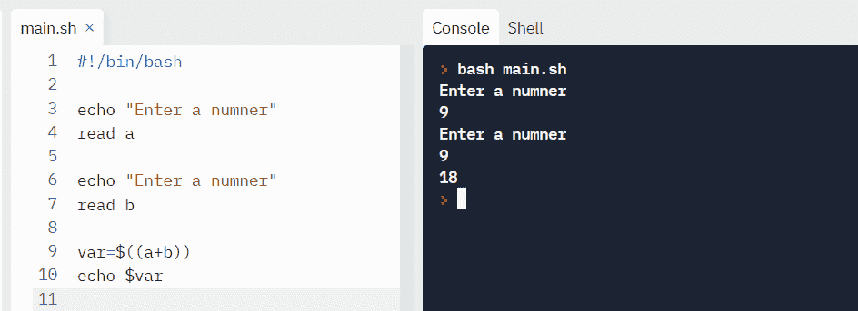

### 数字比较逻辑运算符

比较用于检查语句的计算结果是`true`还是`false`。我们可以使用下面显示的运算符来比较两个语句:

| 操作 | 句法 | 说明 |
| --- | --- | --- |
| 平等 | 以 1 -eq 表示，以 2 表示 | num1 等于 num2 吗 |
| 大于等于 | 一格二格 | num1 是否大于等于 num2 |
| 大于 | 1 -gt 乘以 2 | num1 是否大于 num2 |
| 小于等于 | 一号二号 | num1 是否小于等于 num2 |
| 不到 | 在 1 -lt 在 2 | num1 是否小于 num2 |
| 不等于 | 一对二 | num1 不等于 num2 吗 |

**语法**:

```
if [ conditions ]
    then
         commands
fi
```

**举例**:

让我们比较两个数字，找出它们之间的关系:

```
read x
read y

if [ $x -gt $y ]
then
echo X is greater than Y
elif [ $x -lt $y ]
then
echo X is less than Y
elif [ $x -eq $y ]
then
echo X is equal to Y
fi 
```

输出:

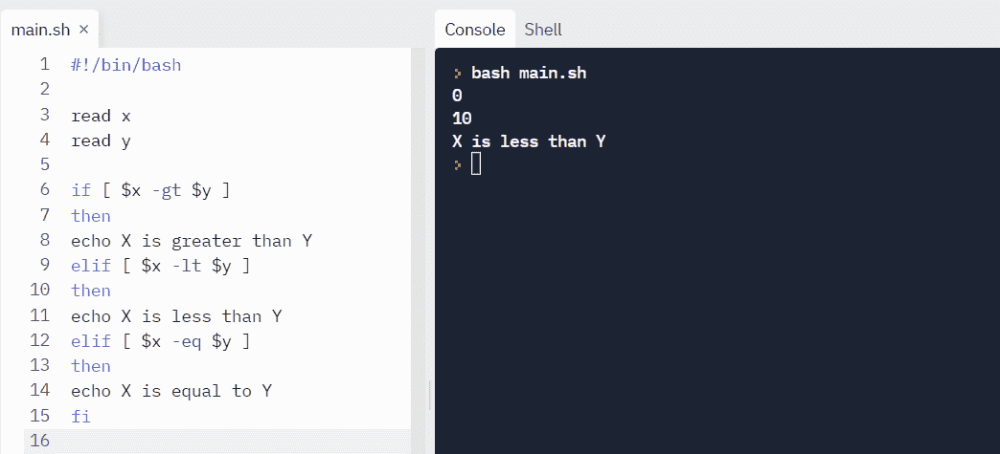

### 条件语句(决策)

条件是评估为布尔表达式(`true`或`false`)的表达式。为了检查条件，我们可以使用`if`、`if-else`、`if-elif-else`和嵌套条件句。

条件语句的结构如下:

*   `if...then...fi`报表
*   `if...then...else...fi`报表
*   `if..elif..else..fi`
*   `if..then..else..if..then..fi..fi..`(嵌套条件句)

**语法**:

```
if [[ condition ]]
then
	statement
elif [[ condition ]]; then
	statement 
else
	do this by default
fi
```

为了创建有意义的比较，我们也可以使用 AND `-a`和 OR `-o`。

下面的语句翻译成:如果`a`大于 40 而`b`小于 6。

`if [ $a -gt 40 -a $b -lt 6 ]`

**例**:我们通过读取三角形各边的长度来找出三角形的类型。

```
read a
read b
read c

if [ $a == $b -a $b == $c -a $a == $c ]
then
echo EQUILATERAL

elif [ $a == $b -o $b == $c -o $a == $c ]
then 
echo ISOSCELES
else
echo SCALENE

fi
```

**输出**:

测试案例#1


测试案例#2

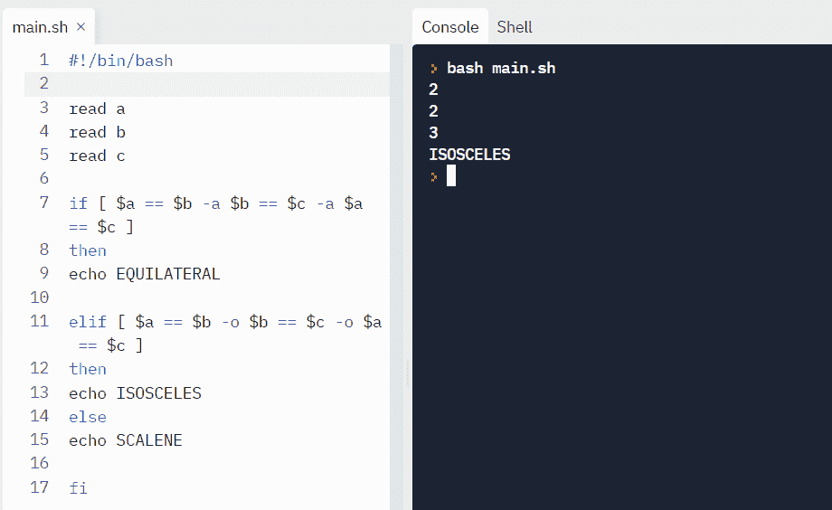

测试案例#3

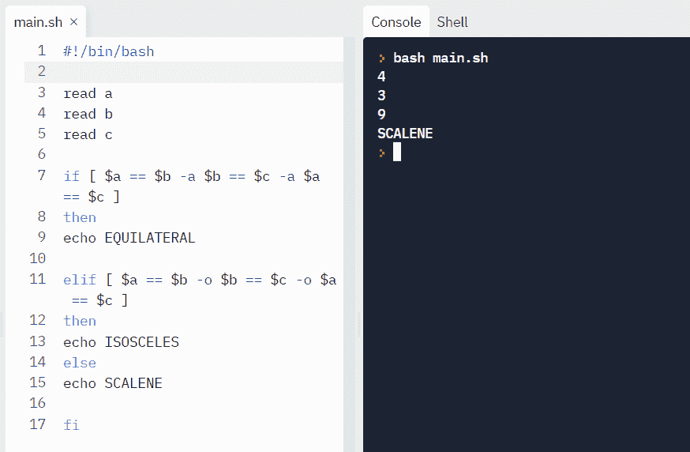

### 循环和跳过

For 循环允许您执行特定次数的语句。

#### 用数字循环:

在下面的例子中，循环将迭代 5 次。

```
#!/bin/bash

for i in {1..5}
do
    echo $i
done
```

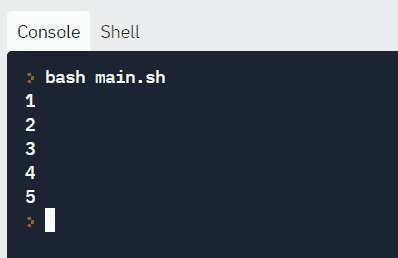

#### 用字符串循环:

我们也可以遍历字符串。

```
#!/bin/bash

for X in cyan magenta yellow  
do
	echo $X
done
```

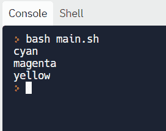

#### While 循环

While 循环检查条件并循环，直到条件保持`true`。我们需要提供一个计数器语句来增加计数器，以控制循环的执行。

在下面的例子中，`(( i += 1 ))`是递增`i`值的计数器语句。

**举例:**

```
#!/bin/bash
i=1
while [[ $i -le 10 ]] ; do
   echo "$i"
  (( i += 1 ))
done 
```

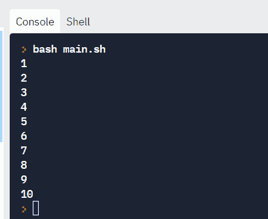

### 读取文件

假设我们有一个如下所示的文件`sample_file.txt`:

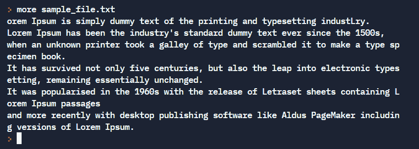

我们可以逐行读取文件，并在屏幕上打印输出。

```
#!/bin/bash

LINE=1

while read -r CURRENT_LINE
	do
		echo "$LINE: $CURRENT_LINE"
    ((LINE++))
done < "sample_file.txt"
```

**输出:**

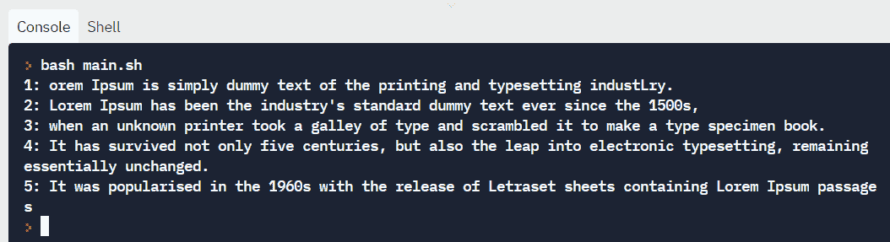

Lines with line number printed

### 如何使用反勾号执行命令

如果需要在脚本中包含复杂命令的输出，可以将语句写在反勾号内。

#### 语法:

在哪里= ' t0 '

**示例**:假设我们想要获得名称中带有`tmpfs`的挂载点列表的输出。我们可以编写这样一个语句:`df -h | grep tmpfs`。

为了将它包含在 bash 脚本中，我们可以用反斜杠将它括起来。

```
#!/bin/bash

var=`df -h | grep tmpfs`
echo $var
```

输出:

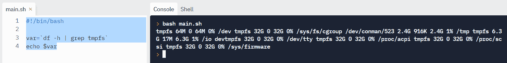

### 如何从命令行获取脚本的参数

可以在执行时给脚本提供参数。

`$@`代表参数的位置，从 1 开始。

```
#!/bin/bash

for x in $@
do
    echo "Entered arg is $x"
done
```

像这样运行:

`./script arg1 arg2`

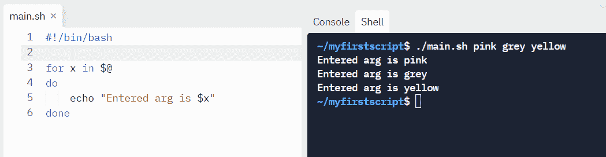

## 如何通过 cron 作业调度来自动化脚本

Cron 是存在于类 Unix 系统中的作业调度实用程序。您可以计划每天、每周、每月或在一天中的特定时间执行作业。Linux 中的自动化严重依赖于 cron 作业。

下面是调度 crons 的语法:

```
# Cron job example
* * * * * sh /path/to/script.sh
```

这里，`*`代表分别代表分钟小时天月工作日。

下面是一些调度 cron 作业的例子。

| 日程安排 | 预定值 |
| --- | --- |
| 5 0 * 8 * | 八月 00:05。 |
| 5 4 * * 6 | 周日凌晨 4 点 05 分。 |
| 0 22 * * 1-5 | 周一至周五每天 22:00。 |

你可以在这篇[博客](https://www.freecodecamp.org/news/cron-jobs-in-linux/)帖子中详细了解 cron。

## 如何检查系统中的现有脚本

### 使用 crontab

`crontab -l`列出特定用户已经预定的脚本。

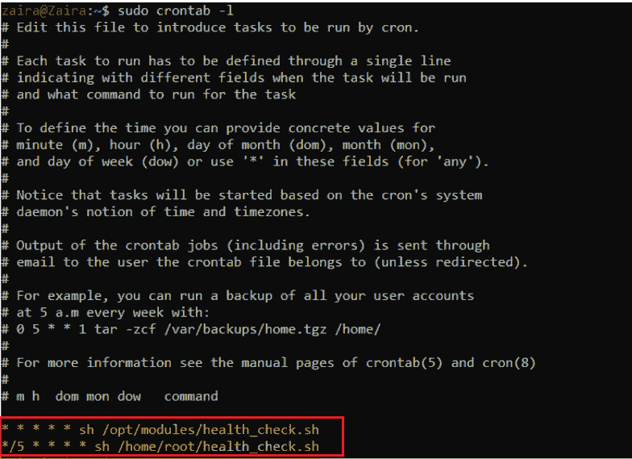

My scheduled scripts

### 使用查找命令

`find`命令有助于根据特定模式定位文件。由于大多数脚本以`.sh`结尾，我们可以像这样使用 find 脚本:

```
find . -type f -name "*.sh"
```

`

在哪里，

*   `.`代表当前目录。您可以相应地更改路径。
*   `-type f`表示我们正在寻找的文件类型是基于文本的文件。
*   `*.sh`告诉匹配所有以`.sh`结尾的文件。

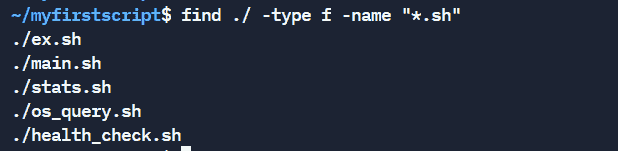

如果你有兴趣详细阅读 find 命令，请查看[我的另一篇文章](https://www.freecodecamp.org/news/how-to-search-for-files-from-the-linux-command-line/)。

## **结束**

在本教程中，我们学习了 shell 脚本的基础知识。我们研究了可以帮助我们编写有意义的程序的例子和语法。

你从这个教程中学到的最喜欢的东西是什么？在 [Twitter](https://twitter.com/hira_zaira) 上告诉我！

你可以在这里阅读我的其他帖子[。](https://www.freecodecamp.org/news/author/zaira/)

[宏向量-www.freepik.com 创建的工作向量](https://www.freepik.com/vectors/work)