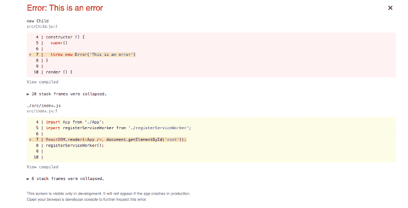
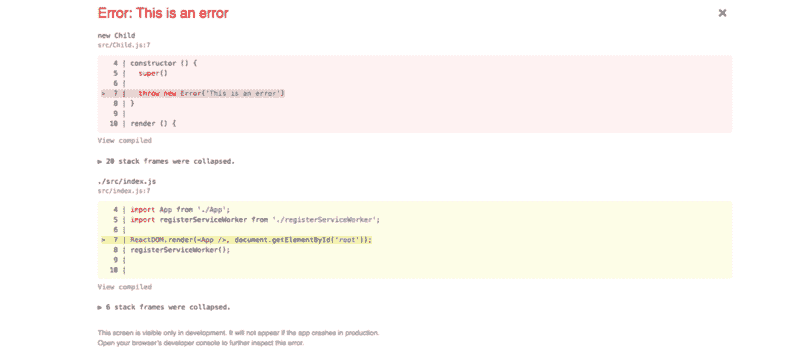

# 关注 React 16 中的错误边界

> 原文：<https://www.freecodecamp.org/news/shining-a-spotlight-on-error-boundaries-in-react-16-caed07453b22/>

梅·卡波奇

# 关注 React 16 中的错误边界


React 16 比之前的 React 版本有更好的错误处理。如果一个组件内部发生了错误，它会"[破坏 React 的内部状态](https://reactjs.org/blog/2017/07/26/error-handling-in-react-16.html)"然后，我们会以“神秘的”错误信息结束，或者只是一个空白的屏幕。React 缺乏一种方式来表达和雄辩地处理这些错误。

得益于错误边界，React 16 改变了这一点。[React 文档](https://reactjs.org/blog/2017/07/26/error-handling-in-react-16.html)解释了它们的工作原理:

> 错误边界是 React 组件，**捕捉子组件树中任何地方的 JavaScript 错误，记录这些错误，并显示回退 UI** 而不是崩溃的组件树。

我开发了一个真实的场景，可以描述错误边界是如何工作的:

### 真实的生活场景

想象你是一个游泳池边的父母，你有一个孩子。游泳池代表 app，你代表父组件，你的孩子代表子组件。

还有一个救生员，他代表一个错误边界组件。

在游泳池，您的孩子正和他们的朋友一起从跳水板上跳下，(任何第三方，如用户、库或 HTTP 请求)。


当你的孩子从跳水板上掉下来，撞到她的腿时，你正在晒黑。

如果没有救生员，你永远不会知道是什么导致你的孩子摔倒。她的朋友推她了吗？木板滑吗？她突然失去知觉了吗？

因为这是 React 16，救生员一直看着一切接踵而至。救下你的孩子后，救生员可以告诉你到底发生了什么。在这种情况下，她的朋友把她推下跳板。

现在，很容易判断到底是什么导致了错误。拥有游泳池的机构(开发商)现在可以通过确保每次只有一个人站在跳水板上来轻松降低未来的风险。

### 步骤 1:使用 create-react-app 启动 React 应用程序

我们将从使用 create-react-app 构建 React 应用程序开始。如果你以前没有做过，我写了一份[备忘单](https://gist.github.com/maecapozzi/41e249c24e683647babf451c675b22c8)，你可以照着做。如果您需要更多的指导，您可以遵循[教程:如何在 React 中发出 HTTP 请求，第 1 部分中的说明。](https://hackernoon.com/tutorial-how-to-make-http-requests-in-react-part-1-f7afa3cd0cc8)

一旦你设置好你的应用程序并知道它在本地运行，我们就可以开始实际的编码了。

### 步骤 2:开始构建组件

我已经删除了许多`create-react-app`包含的样板代码，所以我的`App.js`文件看起来像这样:

```
import React, { Component } from 'react'import './App.css'
```

```
class App extends Component {  render () {    return (      <div className='App'>              <h1>Hello World</h1>      </div>        )  }}
```

```
export default App
```

您可以随意将我的代码复制/粘贴到您的`App.js`文件中，这样我们可以确保我们在同一页上！当你在浏览器中查看时，你应该会看到用大字写的“Hello World”。

创建一个名为`Parent.js`的新文件，并将这段代码复制/粘贴到该文件中:

```
import React from 'react'import Child from './Child'
```

```
const Parent = () =&gt; (  <div>    <h1>Parent</h1>    <Child />  </div>)
```

```
export default Parent
```

然后，创建另一个名为`Child.js`的文件，并将这段代码复制/粘贴到那个文件的**中:**

```
import React, { Component } from 'react'
```

```
class Child extends Component {  constructor () {    super()  }
```

```
 render () {    return (      <div>        <h3>Child</h3>      </div>    )  }}
```

```
export default Child
```

通常，如果我要构建这样的组件，我会使用无状态的功能组件。我没有这样做的唯一原因是，为了举例，我想在构造函数中抛出一个错误。

现在，让我们将`Parent`组件导入到`App.js`文件中，并显示在页面上。您的`App.js`文件将如下所示:

```
import React, { Component } from 'react'import Parent from './Parent'
```

```
import './App.css'
```

```
class App extends Component {  render () {    return (      <div className='App'>        <Parent />      </div>    )  }}
```

```
export default App
```

在您的屏幕上，您应该会看到:


### 步骤 3:在子组件中抛出一个错误

现在，我将在我们的`Child`组件的构造函数中抛出一个错误，这样我们可以看到当我们没有使用错误边界时，当我们得到这种错误时会发生什么。

在`Child.js`中，将`throw new Error('This is an error')`添加到您的`constructor`功能中。

```
constructor () {  super()   throw new Error('This is an error')}
```

如果我们刷新页面，我们将在开发中看到这样的错误消息:



如果我们通过点击右上角的“x”来删除错误，我们看到的只是一个空白屏幕！

### 步骤 4:构建一个错误边界组件

下面是一个错误边界组件的示例:

```
import React, { Component } from 'react'  class ErrorBoundary extends Component {  constructor (props) {    super(props)    this.state = { hasError: false }  }
```

```
 componentDidCatch (error, info) {    this.setState({ hasError: true })  }
```

```
 render () {    if (this.state.hasError) {      return <h1>Something went wrong.</h1>    }
```

```
 return this.props.children  }}
```

```
export default ErrorBoundary
```

让我们来看看这个组件是如何工作的:

1.  在构造函数中，我在`state`上设置了一个名为`hasError`的属性。我把它初始化为`false`。
2.  我使用的是`componentDidCatch`生命周期方法，它有两个参数，`error`和`info`。
    如果`componentDidCatch` 被触发，我将`hasError`的状态设置为`true`。
3.  在`render`方法中，我说`if hasError`是`true`，让用户知道`**Something went wrong**`
    `Else`，继续照常操作。

### 4.设置误差边界

最后，我们需要在抛出错误的组件周围设置错误边界。

在这种情况下，`Child`组件抛出错误，所以我们需要在它周围设置边界，在`Parent`组件内部。

```
import React from 'react'import Child from './Child'import ErrorBoundary from './ErrorBoundary'
```

```
const Parent = props =&gt; (  <div>    <h1>Parent</h1>    <ErrorBoundary>      <Child />    </ErrorBoundary>  </div>)
```

```
export default Parent
```

现在，如果我们刷新页面，我们将在开发中看到这个错误，就像我们以前做的那样:



不同之处在于，如果我们单击错误，我们会在页面上看到以下内容:


那比只是一个黑屏好多了！

如果你有任何问题，请在下面的评论区告诉我。

？我 ***如果你喜欢这个帖子，*** m ***请务必在媒体上关注我， f [在推特上关注我，](https://twitter.com/MCapoz)并在论坛上支持我！？***