# 鞋盒——我的虚拟手绘现场乐队

> 原文：<https://www.freecodecamp.org/news/shoebox-my-virtual-hand-drawn-hand-coded-live-band-454368d0e66f/>

迈克尔·福里斯特

# 鞋盒——我的虚拟手绘现场乐队

我写了这首歌，然后为“虚拟现场表演”制作了这个实时动画引擎，所以我的歌可以由一些有趣的风格化角色来播放。在这个为期 12 个月的项目中，我手工编码和手绘了几乎所有的元素。上面的视频是结果的第一次渲染，但我已经设计了系统，以便可以使用不同的歌曲和动画，而不会有太多的麻烦。主要是 CoffeeScript 和 three.js。

### **调研+布置舞台**

首先在 YouTube 上看了几场现场表演，看看他们是如何被点燃和拍摄的。

Video research

我听了我的专辑(尚未发行)中的所有歌曲，以确定如果一支乐队演奏它们，我需要什么样的乐器，并设计了一个有四个区域的舞台——歌手(我)、鼓手、贝斯手和合成器/键。后面有一个器官。

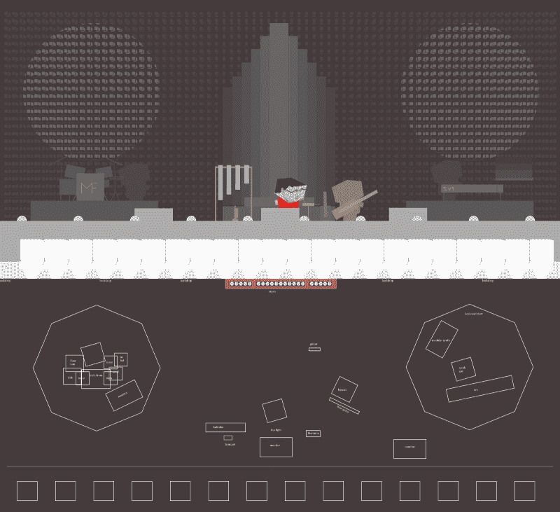

Layout for large stage

这个舞台开始感觉有点太大了，所以我决定为我的第一个视频做一个小一点的。

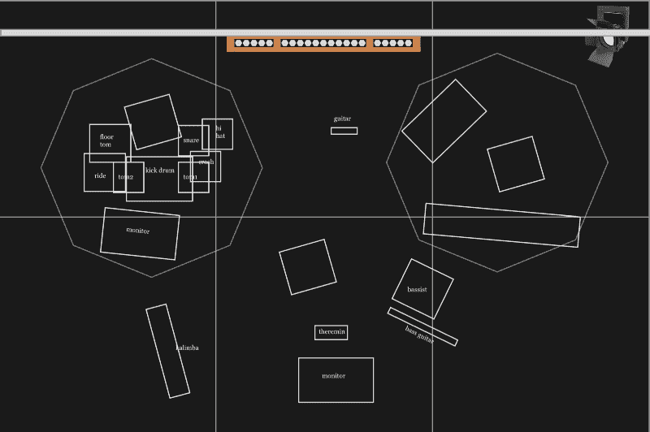

Half size stage

### **模拟仪器**

我将我的大多数模型定义为一张折叠的薄片，每边有两个透明的“脸颊”。

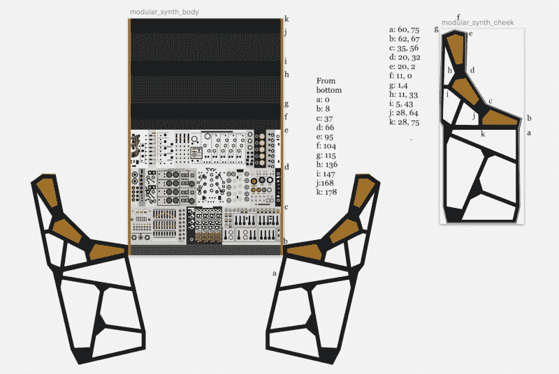

这意味着我可以用少量的代码来描述一个乐器。

我希望这些东西是可打印的，所以我为每件乐器创建了详细的矢量艺术作品。这是模块合成器作品的特写。

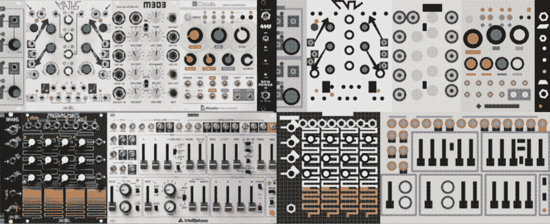

Photograph vs my drawing on pixel grid

这里有一把吉他。

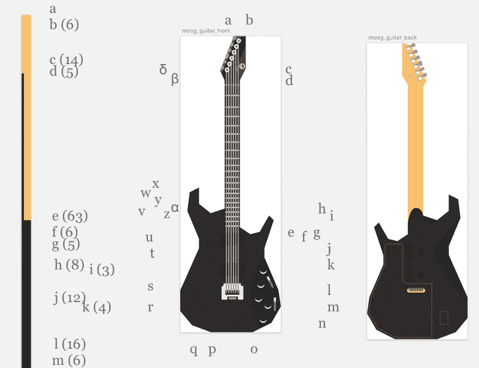

Moog Guitar drawing

如你所见，一切都是手绘和手工编码的。我不是在瞎搞。dae 文件或二进制文件格式(除了图像之外)。

所有这些纹理都进入了一个大的手工纹理图谱。

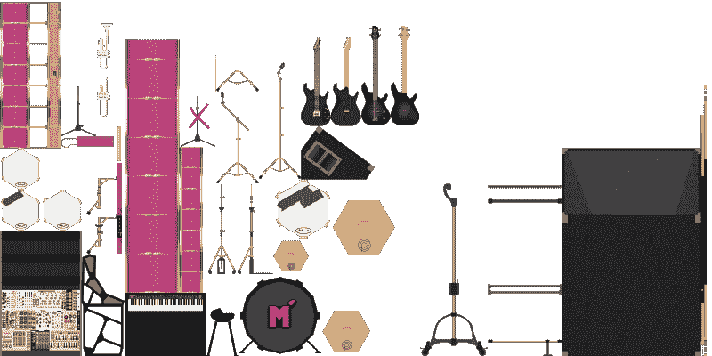

Texture atlas for all the instruments I created — laid-out by hand

我描述了图集中每个元素的坐标偏移，并使用相同的数据将纹理映射到 3d 模型上。

### **乐队建模**

Original Michael Forrest cubee by Ann Forrest

几年前，我姐姐给我做了一个小小的纸板剪纸，所以我从她的作品开始。

我决定让我的乐队由另外三个角色组成:一只合成器上的青蛙，一只贝司上的叫巴里的山魈和一只打鼓的《我的世界》牛。

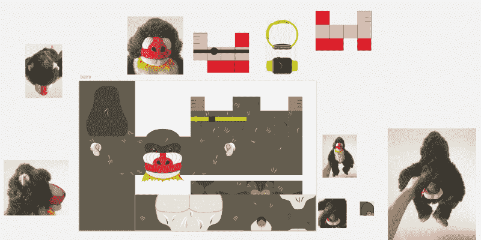

Drawing Barry

我认为巴里的脚给了我最大的麻烦

Barry’s feet

我用最少的代码构造了这些字符，指定了它们的布局——它们实际上只是基本的盒子。

之后我添加了面部图层——注意上面和下面的透明区域，允许突出的胡须等等。

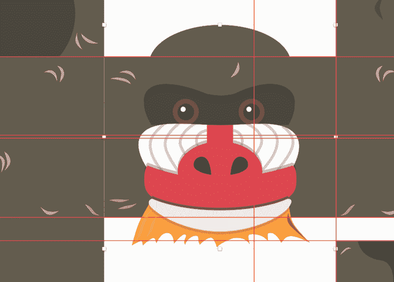

四个乐队成员的纹理在一个图谱中，每个乐队成员之间唯一不同的是其在图谱中的垂直偏移。

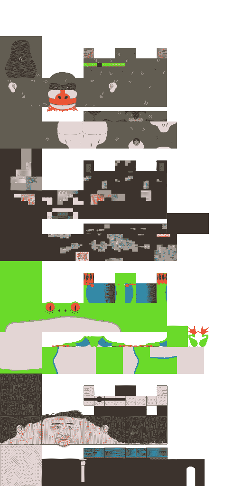

Texture atlas for the band members

### **灯**

为了制作一场引人注目的舞台表演，我首先需要学习如何点亮舞台。我做了一些研究，挑选了一种风格和一些颜色。

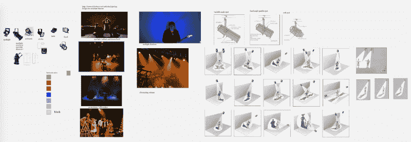

Lighting research and chosen colour scheme

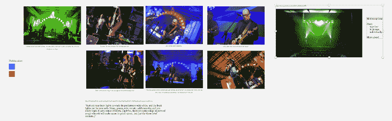

我模拟了照明围栏和索具。当我以车床为原型时，并没有太多的工作。

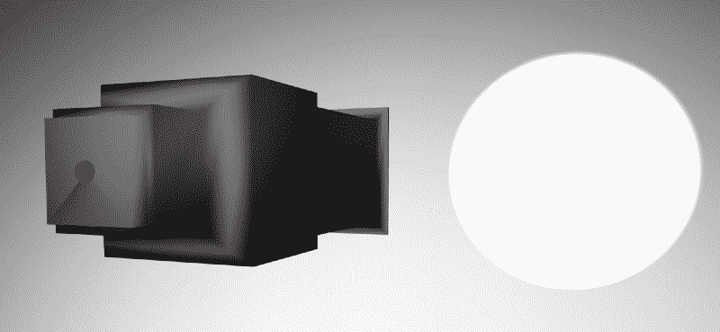

Spotlight model

### **映射出一首歌**

我需要绘制一首歌曲的结构来定义所有我想要的镜头移动、灯光和动画。

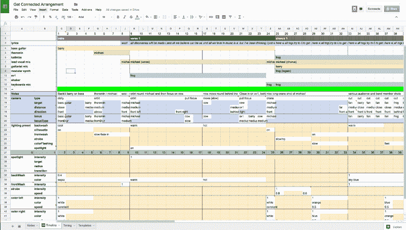

我编写了脚本，将这个电子表格中的数据转换成我可以用代码处理的东西。这是安排的最终数据文件。考虑到它所做的工作量，这并不算什么。

这基本上是表现一首歌曲所需的所有数据。

### **制作乐队动画**

我想要最少的数据，但自然的运动。我认为我需要一个多点触摸工具来捕捉动画，但一旦我开始定义它们，我意识到我可以单独摆每个部分的姿势来一步一步地将动画放在一起。下面是我快速演示我的动画工具的视频。

我将这些动画保存到一个数据库中，并生成了一个 JSON 文件，可以被前端代码引用。

**控制器**

有三个主要的控制器负责一场演出——摄像机、动画和灯光。

摄像机控制器将不同的“镜头”类型解释为空间坐标，并基于所提供的最少信息为摄像机制作动画。

例如，下面是如何描述相机的“环绕”运动。

所以我们从`bar 69`开始，在`8 bars`期间，我们从`michael`的`front-left`轨道运行到`front/right/above`，保持`1000`个单位的距离。(为了让某些事情更简单，我选择了基于像素测量的单位，但事后看来，使用米会更好)。

照明控制器有一个“轨迹”用于每个灯光(或灯光的逻辑分组)，然后在配置文件中分别定义每个灯光。这是逆光灯的配置——我只是想定义条数和颜色或颜色过渡。

我的动画工具让我创建命名的动画循环。我在我的配置文件中引用了它们的名字，然后用它来为歌曲中的每个角色选择合适的动画。

这是巴里为整首歌制作的动画:

因此，以第二个项目为例，我们对从第 25 小节开始的 16 个小节使用名为`“barry chorus”`的动画。我们指定他将持有这些动画的`bassGuitar`。被某人弹奏是乐器的一个功能，所以吉他知道它需要移动到哪里才能被巴里弹奏。

### **GL 着色器**

我希望视频有一些像样的电影摄影，对我来说最重要的相机效果是在镜头中有一些景深效果(即背景和前景中的东西应该不在焦点上)。

我的着色器非常粗糙，但它的要点是，我们首先生成一个深度图，这样我们就知道场景中的所有东西离摄像机有多远。然后，我们使用这些信息来相应地模糊图像的区域。

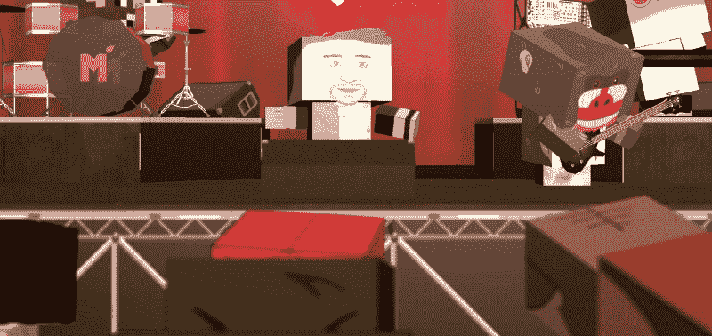

See how the audience is out of focus

另一个重要的效果是体积照明。灯光需要看起来像是在烟雾中闪耀，让它看起来像是一场演出。这是我的场景中着色器技术的大致范围。(名字有点偏离——注意，我最后用了多个“假太阳”，所以每个光都有自己的)。

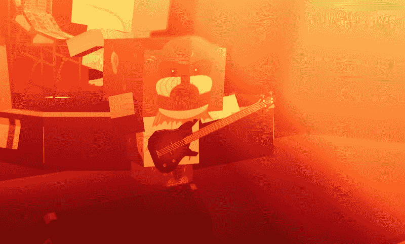

Volumetric lighting effects

### **观众**

我最初创建了一个系统，让我的 Twitch 粉丝成为我的观众(通过面部检测将他们的脸放在身体上)，但这感觉不太适合 YouTube 视频，所以我去了 Cubeecraft.com，这是整个风格的最初灵感。我挑选了任何能引起我共鸣的东西，包括斯潘塞和守望者角色。这些都是手工制作的，所以我把它们过滤成具有相似布局的，并发现我可以在 Sketch 中的角色之间复制和粘贴切片，以快速生成文件。

我使用 TexturePacker 来生成纹理。通过做同样的事情，而不是手工编码每个顶点映射，可能会节省我很多时间。

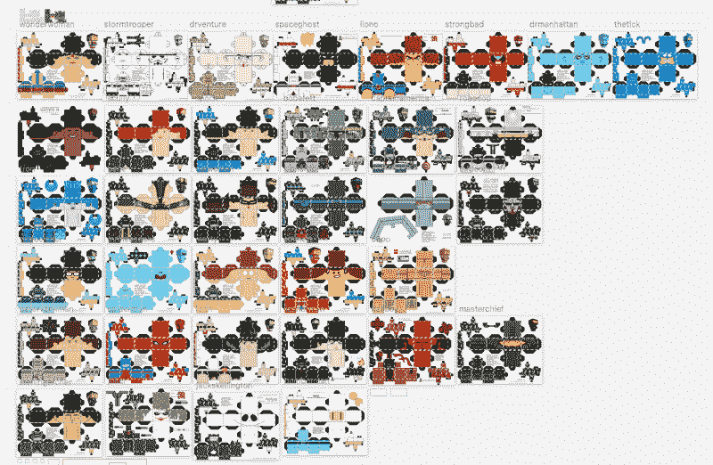

defining slices for each model

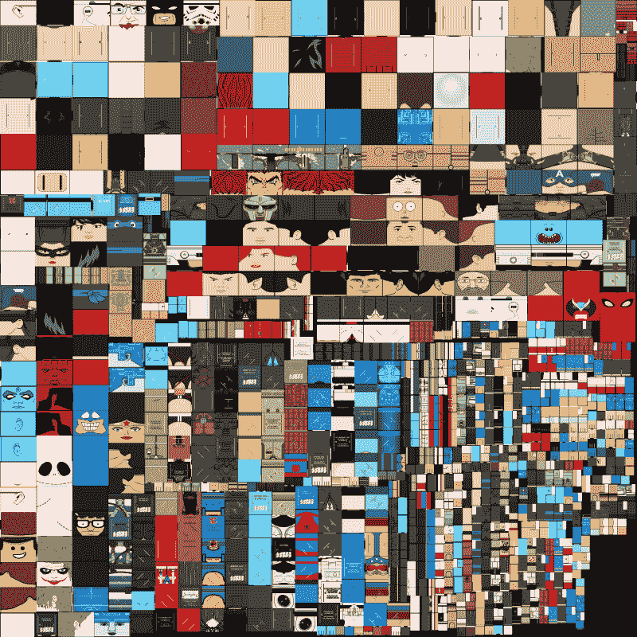

Texture atlas for all the cubeecraft characters

### **渲染**

我用了一些东西，决定用 CCapture 来制作 4K(非实时)渲染——花了大约半个小时来渲染最终的视频。我在 Apple Motion 中再次将它与音频同步，并使用 Final Cut Pro 添加了介绍和输出。

### **结果(再次)**

### **视频演示之外的功能**

这个视频渲染只是一种可能输出。我渲染出了一个 360°的视频(虽然我做得很匆忙，没有让立体照明正常工作，所以看起来不太对)。

我把这个东西放在一个服务器上，但是我还没准备好发布它，直到我想出一个好办法让它互动。我可以把我的实时表演插入其中，这样它就可以和我的半即兴现场表演同步了。它在我的 iPhone 上运行，所以它可以很好地与谷歌 Cardboard 风格的耳机配合使用。

除了你在这里看到的，我还模拟了其他乐器，我有很多声音反应的东西，我还没有展示出来(令人难以置信的是，这似乎也适用于移动设备)。当我意识到这个系统越来越多的可能性时，最难做的事情之一就是控制范围。

### **疑问？**

我真的很匆忙地完成了这个解释——我想先指出主要的元素，然后再对每件事进行更详细的说明。

你想知道更多关于什么的信息？我计划在未来的视频系列中进行更深入的探讨，所以了解人们想了解更多的东西会很有帮助。

如果你被这个项目作为产品的潜力所鼓舞。就我个人而言，我可以想象它是介于录音和现场表演之间的一种易于使用的音乐发布媒体，尤其是如果你把它接入 Twitch 这样的服务。

### 喜欢这首歌吗？

如果你喜欢这音乐，来脸书的 T1，T2 的 Twitter T3 和/或 T4 的 SoundCloud T5 找我吧。