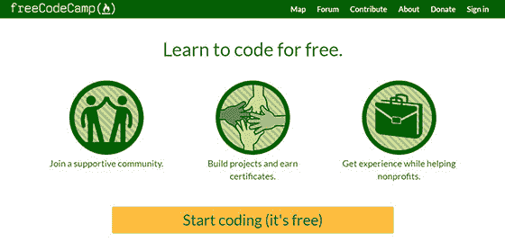

# 昆西·拉森的简短采访:了解创办自由代码营的老师

> 原文：<https://www.freecodecamp.org/news/short-interview-with-quincy-larson/>

凯尔的简短介绍:

昆西不是一个需要介绍的人，但是如果你不太了解他，他负责通过[自由代码营](https://www.freecodecamp.org/)帮助超过 100 万程序员进入 web 开发的世界。

我问了他一些实际问题，我想你会发现他的回答很有帮助。

昆西来了，不再耽搁:

* * *

## 你是如何开始 Web 开发的？

当我 30 多岁时还是一名学校主管时，我注意到我的许多老师和管理人员花了大量时间将数据输入电脑。

所以我想“我怎样才能把他们从电脑中解放出来，让他们有更多的时间与学生互动？”

我选择了一些基本的编程工具来自动完成 Excel 和网页上的任务。(我对编码一窍不通。我不得不请妻子帮忙做一些基本的事情，比如配置我们的无线路由器。)

在这之后，我能够为我的团队自动化许多机械的后台任务。当我看到我的基本编码的结果——更快乐的老师和学生——时，我开始确信我应该学习更多的编程。

由于 web 开发是最常见的软件开发形式，而且它有最低的进入门槛和最好的学习资源，所以我直接进入了它。

因为 web 开发正在逐渐包含移动开发，甚至 VR，所以我计划在未来一段时间内继续从事 web 开发。

## 你是如何以及为什么创办 FreeCodeCamp 的？

我的编码之旅是孤独的。我和尽可能多的开发人员混在一起，但是我不知道还有谁在学习编码。

其他人已经编码多年，他们已经忘记了学习编码有多难。所以我一直觉得孤独，像个骗子。

我的编码之旅也非常曲折。我走了很多死胡同，学到了我从来没用过的工具。我花了几天时间走错了方向。我应该从第一个月就开始构建项目，但是我没有真正构建任何东西，直到我通过书籍和课程工作了几个月。

每当我遇到其他人，他们在大学之外成功地学会了自己编程，他们的经历同样令人沮丧。那时我才知道——不仅仅是我——在职业生涯中期学习编程存在固有的挑战。

我想到了所有那些将从学习编码中受益的人，他们中的许多人都和我有着相似的情况——有家庭和工作，太忙而不能放下一切专注于学习编码，并且可能太缺乏资源而不能回到大学。

所以从第一天起，我就知道这个项目需要尽可能的方便和容易使用。这意味着自定进度、基于浏览器、免费。

我用了几天时间构建了 freeCodeCamp 的基本原型，推出了它，并尽我所能通过博客和推特来宣传它。

不可思议的是，人们开始在 freeCodeCamp 的聊天室里闲逛并互相帮助。他们中的一些人开始为开源项目做贡献，我们也从那里开始成长。

## 在你的职业生涯中，有什么事是你后悔的，你本可以改变的？

我后悔在职业生涯中花了这么多时间专注于做眼前的具体任务，而不是退一步问自己:

“我能想出一个自动化的方法吗？如果是这样，就时间投资而言，自动化值得吗？”

一些任务不值得自动化的时间投资，但是很多任务是值得的。

在你自动化了这些任务之后，你之前花在这些任务上的时间将一去不复返。

所以现在每当我面对一项新任务时，我都会用这些术语来思考。

## 除了技术技能之外，你会推荐开发人员具备哪些技能？

****沟通技巧**** 。作为一名在职开发人员，如果你有一半的时间花在编码上，你应该觉得自己很幸运。这么多的软件开发是计划和沟通，这意味着会议。

书面交流技能 尤其重要，因为很多软件开发都是远程进行的。从问题到提交消息，再到代码审查，所有的事情都需要你非常清楚如何沟通这些事情。

建立这种技能的最好方法是将 ****贡献给开源**** 。这是一个很好的方式来与已经存在的团队交流，了解他们需要什么帮助，并交流您所做的代码更改。

## 有没有你会推荐的顶级编程语言，为什么？

JavaScript。软件在吃世界，JavaScript 在吃软件。JavaScript 正逐年变得越来越占主导地位，没有人知道最终什么会取代它。

如果你没有非常好的理由去学习一门新语言(比如你的工作要求你维护一个非 JavaScript 代码库)，我的拙见是专注于更好地学习 JavaScript。

我已经在这里写了更多关于这个话题的文章。

## 你能给自由网页开发者/设计师什么建议？

比起软件开发，自由职业者更看重销售和沟通技巧。

这需要完全不同的技能。我们已经发表了很多关于自由职业的文章和视频教程。

其中一个我强烈推荐观看的是这个 36 分钟的视频:

[https://www.youtube.com/embed/fsTzLgra5dQ?feature=oembed](https://www.youtube.com/embed/fsTzLgra5dQ?feature=oembed)

## 你对未来 5-10 年的网页开发有什么预测？

开发者已经在使用网络开发工具构建虚拟现实体验，我认为这一趋势将会继续。

这里有一个我们最近发布的视频，展示了网络虚拟现实的力量:

[https://www.youtube.com/embed/jhEfT9YjLcU?feature=oembed](https://www.youtube.com/embed/jhEfT9YjLcU?feature=oembed)

我还对无服务器、对话式界面和将更多事情卸载到客户端感到兴奋，比如客户端机器学习。

这里有一个 web 应用程序，它使用客户端计算机视觉和机器学习来玩石头剪刀布。

这些事情才刚刚开始。

## 对于刚开始从事网站开发的人，你有什么建议？

1.每天编码。

2.和其他编程人员一起出去玩。

3.关注如何构建事物(工程决策)而不是“构建什么”(商业决策)。

4.你使用的工具并不重要。只要使用你觉得舒服的工具就可以了。以后可以学习新的工具。

5.贡献开源。

* * *

凯尔的结论:

再次感谢 Quincy 接受采访，我希望这篇简短的问答文章对你的 web 开发之旅有所帮助。