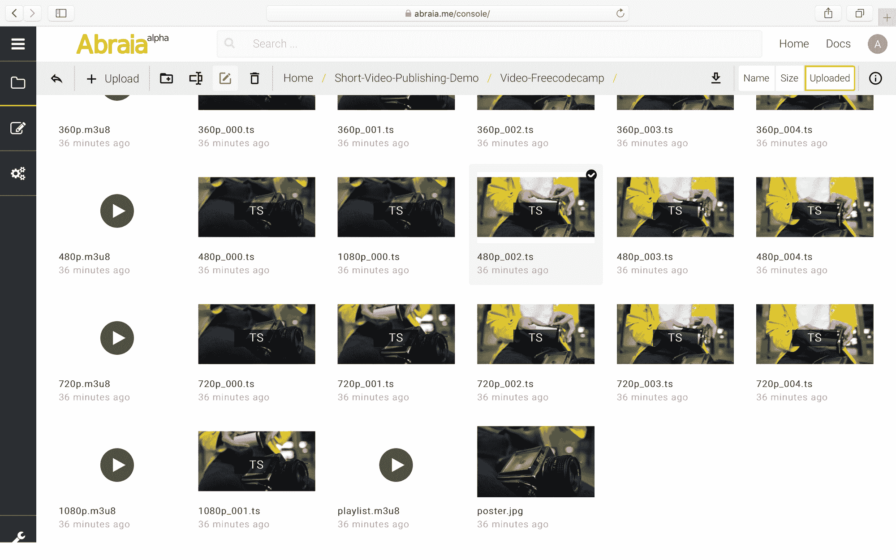
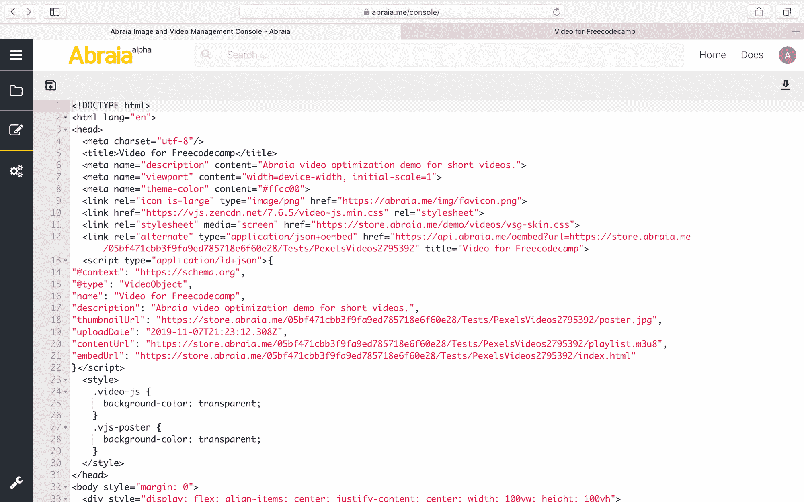
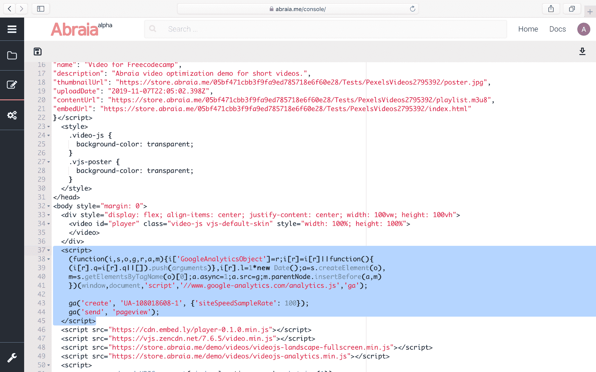
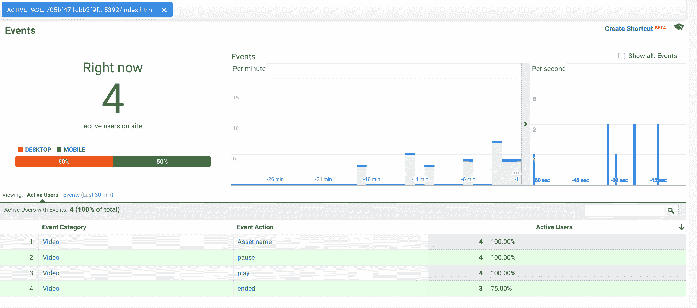

# 如何为网络和电子商务部署完整的视频发布渠道

> 原文：<https://www.freecodecamp.org/news/short-videos-in-web-and-ecommerce-workflows/>

*从 ffmpeg、云视频转码到 HLS、交付、播放器、Video.js、分析。*

征服社交网络后，视频正在通过网络业务传播。作为一名为全球几家最大的时尚电子商务网站工作的媒体顾问，我可以有把握地说，视频无处不在的趋势几乎是不可阻挡的。

在这篇文章中，我回顾了在 web 工作流中发布短格式视频时要考虑的主要方面。我对开源资源进行了评论，这些开源资源使内部解决方案成为可能，如 ffmpeg 或 Video.js。此外，我还使用了一个例子，即[abria 的视频优化和发布演示](https://abraia.me/video/)——专门为时尚电子商务的短视频量身定制。

[https://store.abraia.me/05bf471cbb3f9fa9ed785718e6f60e28/Short-Video-Publishing-Demo/Workflow/index.html](https://store.abraia.me/05bf471cbb3f9fa9ed785718e6f60e28/Short-Video-Publishing-Demo/Workflow/index.html)

Example of video publishing workflow

它提供了对创建的资源的完全访问:视频播放器的块、播放列表和 html 代码。这有助于快速了解完整管道的内部工作原理。

内容应该有助于追求内部处理和发布渠道，或者挑选出最佳的服务组合。

## 体验质量(QoE)和其他业务相关问题。

有两个密切相关的主要问题。担心用户带宽膨胀，这会损害 UX 和参与度；担心视觉质量差，会潜在地损害品牌形象。

这两个对立因素之间的平衡决定了 QoE。保持较高的 QoE 需要提供尽可能好的 T2 质量，没有再缓冲或延迟效果或明显的页面速度下降。

当然，还有其他重要的问题

*   定制观看体验，以匹配企业品牌
*   传送更高带宽内容的成本增加
*   以及债务方面的额外负担

...仅举几个例子。

## 首选:渐进与自适应比特率(ABR)。

关于[视频格式选择](https://www.freecodecamp.org/news/video-formats-for-the-web/)，有两个具有重要含义的主要选项:逐行视频和 ABR。

使用普通的 HTML5 代码，渐进视频可以像图像一样被传送和消费。此外，H264 编码的渐进式 mp4 视频具有跨浏览器和系统的普遍支持。所以，它们是最简单的方法。

然而，如果 QoE 是一个主要问题，我们应该选择 ABR。更具体地说，是针对 HLS——同样是 H264 编码——这是一个受到广泛支持的选项。

有了 **HLS** ，在大多数情况下，我们将能够保持视频每秒的**比特——比特率——在连接容量限制**之内。这避免了重新缓冲、延迟或阻塞其他内容。在 HLS 中，视频可以以不同的比特率获得，并且被分成片段。这使得客户可以根据网络速度随时请求可承受的最佳质量。唯一的警告是，我们需要在前端使用一个播放器(基本上是一段 JavaScript)。在应用程序中，这更容易，因为 iOS 和 Android 都支持该协议。

## 管道和工作流程

也就是说，让我们看看网络视频优化和交付管道需要什么。管道应该处理高质量的原始视频，并使其适合网络。它还应该满足品牌对可视化的要求，并将视频事件整合到网站的分析中。

总之，我们的管道应解决以下问题:

*   内容管理
*   转码和优化
*   交付
*   形象化
*   分析学

最终，管道应该允许一个类似于社交视频平台的工作流程——你上传一个视频，然后获得一个像这个一样的[链接，以嵌入或分享到其他地方——但要符合我们业务的所有定制要求。](https://store.abraia.me/05bf471cbb3f9fa9ed785718e6f60e28/Short-Video-Publishing-Demo/Video-Freecodecamp/index.html)

为了保持这篇文章的简短和重点突出，我将跳过内容管理问题，这基本上是我们处理所有资源的方式，包括协作媒体编辑和批准工作流。接下来，我将介绍视频发布渠道中的主要优化和交付要素。

## 转码和优化

为了让渐进式视频更具响应性，我们可以基于断点创建不同分辨率和质量的版本来消费，类似于图像。

在内部方案中，这个操作可以通过 ffmpeg 轻松完成[。这是一个开源工具，可以非常有效地执行大小调整、压缩和许多其他操作。例如，要将 4K 视频缩放至具有良好视觉质量的全高清，您只需使用:](https://medium.com/abraia/video-transcoding-and-optimization-for-web-with-ffmpeg-made-easy-511635214df0)

```
ffmpeg -y -i input.mp4 -vf scale=1920:-2 -c:v libx264 -crf 22 -profile:v high -pix_fmt yuv420p -color_primaries 1 -color_trc 1 -colorspace 1 -movflags +faststart -an output.mp4
```

或者，使用云平台，操作应该是不需要动脑筋的，尽管在许多情况下，我们会失去对质量设置和可能的断点的有效控制。

**HLS** 的编码有点复杂。首先，**我们必须定义一个编码阶梯**。阶梯的每一步都有不同的比特率，从最高到最低。他们分别设置最高和最低质量。

对于阶梯中的每个比特率，我们还必须设置分辨率，再次从最大到最小。理想情况下，我们应该使用专门针对视频内容调整的比特率来优化带宽的使用。当自动完成时，**在每个视频的基础上**，这被称为**每个标题编码**。

我们必须用定义好的分辨率和比特率对视频进行编码，然后将每一段视频切割成块。我们还必须决定组块的持续时间。也就是说，HLS 根据当前的网络速度重新协商质量请求的频率。我们可以用 ffmpeg 或云服务完成所有的编码。

让我们看看为我们的例子生成的文件。我们有一个包含所有块的文件夹(。ts 扩展名)，以及播放列表(. m3u8 扩展名)。



播放列表包含关于可用节目的所有信息。接下来，我们可以看到主播放列表的内容:阶梯——比特率和分辨率——以及相对的播放路径。

```
#EXTM3U
#EXT-X-VERSION:3
#EXT-X-STREAM-INF:BANDWIDTH=3374012,RESOLUTION=1920x1080
1080p.m3u8
#EXT-X-STREAM-INF:BANDWIDTH=1836580,RESOLUTION=1280x720
720p.m3u8
#EXT-X-STREAM-INF:BANDWIDTH=1002050,RESOLUTION=856x480
480p.m3u8
#EXT-X-STREAM-INF:BANDWIDTH=649329,RESOLUTION=640x360
360p.m3u8
```

Example of master playlist for HLS

也就是说，对于每个重现，我们都有一个额外的播放列表，其中包含有关持续时间和到相应组块的路由的信息。我们还需要一张海报来作为缩略图，并在连接非常慢或 HLS 兼容性问题的情况下得到覆盖。在我们的例子中，所有的资源都在同一个文件夹中，所以到每个资源的路径仅仅是名称。

## 交付

**视频应该通过 CDN** 传送。如果您的转码效果不佳，许多用户可能会遇到页面加载缓慢的问题。但至少如果你使用 CDN，你不会因为服务器无法处理负载而关闭你的网站。我见过一些大网站，当他们决定在主页上使用视频时，他们的峰值流量增加了一倍多。因此，视频，无论是渐进式还是 HLS，都应该作为静态文件由 CDN 缓存和交付。

如果你用的是视频发布的云平台，应该是有保障的。任何像样的网站都至少通过一个 CDN 提供视频传输。如果你需要覆盖像中国这样的一些国家，你需要研究每一个特定的平台和使用的 CDN，因为他们中的一些不在那里工作。

## 形象化

虽然对于渐进式视频，HTML5 足以确保可视化，但在 HLS 的情况下，我们需要一个支持 HLS 的 JavaScript 播放器。

有许多商业选择，但也有质量非常高的开源替代方案。一个很好的例子就是 **Video.js** 。它在浏览器中有广泛的支持，只是受限于对[媒体源扩展 API](https://caniuse.com/#search=media%20source) 的依赖。它使用皮肤和灵活的配置带来了高度的定制，例如允许您使用自动播放或不同的视频控制。

播放器可以插入到页面代码中，也可以作为 iframe 嵌入到 html 静态代码中。

回到我们的例子，当我们发布视频时，我们创建一个 [html 资源](https://store.abraia.me/05bf471cbb3f9fa9ed785718e6f60e28/Tests/PexelsVideos2795392/index.html)，它有一个默认设置的 Video.js 播放器。内容 url 应该指向主播放列表，缩略图指向从视频中提取的海报图像。



在这种情况下，html 资源还添加了 **oembed 兼容性**。除了在浏览器中直接访问这个 html -或者一个不同的我们复制/粘贴播放器代码的 html-来播放[视频](https://store.abraia.me/05bf471cbb3f9fa9ed785718e6f60e28/Tests/PexelsVideos2795392/index.html)，我们可以把它嵌入到内容管理系统(CMS)中。例如，当我为 freeCodeCamp 写这篇文章时。

[https://store.abraia.me/05bf471cbb3f9fa9ed785718e6f60e28/Short-Video-Publishing-Demo/Embedding/index.html](https://store.abraia.me/05bf471cbb3f9fa9ed785718e6f60e28/Short-Video-Publishing-Demo/Embedding/index.html)

## 分析学

在短视频中，典型的感兴趣分析是播放视频的用户比率**，完整观看视频的用户比率，或者播放失败的比率**。

同样，有许多商业选择。然而，在许多情况下，像谷歌分析(Google Analytics)这样的广泛免费选项可能就足够了。如果我们使用的是 Video.js，我们只需要用 GA 对 html 资源进行检测，就像对任何其他网页一样。回到我们的例子，我们可以在创建的可编辑 HTML 中看到它。



要跟踪 GA 中的视频使用，我们只需跟踪播放器中的视频事件。例如:

```
 player.analytics({
      defaultVideoCategory: 'Video',
      events: [{
        name: 'play',
        label: 'Video-Freecodecamp',
        action: 'play',
      }, {
        name: 'pause',
        label: 'Video-Freecodecamp',
        action: 'pause',
      }, {
        name: 'ended',
        label: 'Video-Freecodecamp',
        action: 'ended',
      }, {
        name: 'error',
        label: 'Video-Freecodecamp',
        action: 'error',
      }]
    });
```

然后，在 GA 中，我们可以看到正在发生的事件。这个截屏显示了我自己的实时活动——使用两个设备和浏览器——在为本文创建的视频示例上。



## 摘要

我回顾了视频发布管道涉及的主要方面，从代码转换到交付、可视化和分析。我提到了不同资源的潜在用途，包括两个著名的开源项目，如 ffmpeg 和 Video.js。

我使用我们的[视频发布演示](https://abraia.me/video/)用一个简单的例子来支持这个解释。它提供了对所创建资源的完全访问。您将能够下载、修改和使用测试中的资源。你可以自由地使用它，用你选择的短视频重复这个过程。

记得从高质量的视频开始。这里的例子基于来自 [@cottonbro](https://www.pexels.com/@cottonbro) 的 9 秒 4k 视频。总的来说，我希望这篇文章能让我对视频发布的定制部署有一个大致的了解。