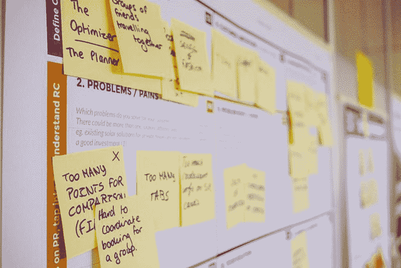
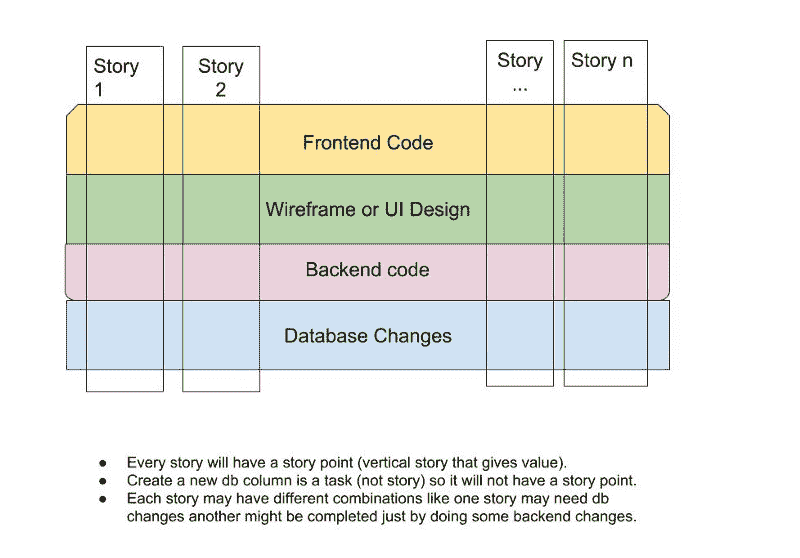

# 表明你的开发过程仅仅在纸上是敏捷的——以及如何修正它

> 原文：<https://www.freecodecamp.org/news/signs-that-your-development-process-is-agile-only-on-paper-and-how-to-fix-it-f6c05b24337f/>

敏捷来自实践，而不是纸上谈兵。使用吉拉不会让你的软件开发过程变得敏捷。说我们做“scrum”不是敏捷。

敏捷就是拥有敏捷的思维方式，并每天付诸实践。它是关于思考你向客户提供的价值以及如何做得更好。

这篇文章将揭示你的实践不是真正敏捷的五个标志，以及如何解决这些问题。迹象和解决方案将涉及多个角色，如产品经理、软件工程师等等。

Agile board image from [Unsplash](https://unsplash.com/photos/zoCDWPuiRuA)

### TLDR；

*   如果你写的文档超过 5 页，你可以改进。
*   应该对准备发展和完成有一个明确的定义。
*   故事/问题应基于交付给客户的价值，而不仅仅是技术方面。
*   一个月发布一次新版本的软件，说我们敏捷应该是犯罪。
*   不关心团队不是敏捷的正确做法。

现在让我们来看一下这些迹象，它们解释了为什么纸船敏捷实践行不通，以及如何修复它们。

### 超过 5 页的文档

将会有大的特征(史诗)，它们必须被解释。这并不意味着你可以写 50 页的文档。如果一份文件超过 5 页，许多团队成员将不会阅读它。接受这个事实。

> 在一个美丽的周一早晨，你收到一份 30 页的备忘录，内容是公司希望我们开发的新功能。你会通读吗？答案是否定的

你可能会浏览一遍，以便在会议中通过，仅此而已。文件很快就会过时。当需求改变时，没有人会费心去更新文档。

#### 解决办法

撰写少于或等于 5 页的文档。让它简洁而精确。开始为流程创建视觉辅助工具来解释它。创建实体模型，并使用像 Balsamiq 这样的工具。用每个人都能理解的方式表达需求，而不需要阅读。然后根据需要，创建一个 UI 设计并进行讨论。然后用代码实现它。

### “准备开发”和“完成”的定义不明确

“准备开发”和“完成”的明确定义对于团队的成功至关重要。没有这些或者有不清楚的会妨碍团队的表现。

> 软件工程师应该清楚什么时候可以开始开发这个故事。完成也一样。

当故事被创造出来但描述不存在的时候，它准备好发展了吗？当我将它部署到生产环境并将我的任务移动到“完成”栏时，它就完成了吗？如果有这样的困惑，这是一个需要解决的问题。

#### 解决办法

逐点明确“准备好的定义”和“完成的定义”。这将有助于您衡量和提高团队的绩效。这也将有助于所有相关人员以同样的方式理解这些事情的意义。

### 故事基于技术方面，而不是对客户的价值

敏捷软件开发总是关于向客户交付价值。工作软件形式的价值，而不是一堆文档。

假设有这样一个故事，“作为客户服务经理，我需要知道是谁创建了退款，以便我可以在将来跟踪和审计退款”。例如，这个任务可能需要在退款表中添加一个“created_by”字段。但是这不应该导致“story”显示“在退款表中添加 created_by 字段”。当然，它可以是作为主要故事一部分的任务/子任务。主要的故事提供了价值，但是这个数据库任务是辅助这个过程的。

A story has value and points, tasks are part of a story.

#### 解决办法

对史诗、故事和任务有清晰的定义和界限。每个故事都应该向客户传递一些价值(如上图所示)。如果你在跟踪 Scrum，你也会有像团队速度这样的故事点。需要技术任务。然而，只有适当数量的技术任务才能为客户带来价值。

> 这里最重要的是“始终关注交付给客户的价值”。

### 每月发布一次新版本的软件

这里首先要考虑的是:

> 部署是一项技术任务，发布新的软件版本是一项业务活动。

[部署不是发布](https://geshan.com.np/blog/2018/10/deployment-is-not-release/)。如果你不能做出这种区分，那就有问题需要解决。最重要的是，如果你几乎每个月都不发布一个新版本，那你就做错了敏捷。[尽早发布经常发布](https://en.wikipedia.org/wiki/Release_early,_release_often)是尽早获得反馈的极好方法。有了早期的反馈，您可以在下一个版本中进行一系列新的更改，使软件变得更好。

这可能不适用于移动应用程序，因为它们可能需要很长的供应商审批流程。对于 web 应用程序，一天多次部署和发布应该是一种常态。

#### 解决办法

构建一种文化和技术流程，允许您一天多次部署和/或发布到生产环境中。

> 实施良好的代码质量和优秀的软件工程实践。遵循久经考验的最佳实践，如代码审查、自动化测试、CI/CD、[日志记录](https://geshan.com.np/blog/2015/08/importance-of-logging-in-your-applications/)、监控和[自动化部署](https://geshan.com.np/blog/2015/08/the-best-automated-deployment-tool-the-one-that-fits-your-needs/)。

叫它 DevOps，SRE 或平台工程——随你怎么叫。但是，只要您愿意，就可以无所畏惧地执行和部署。

### 对团队激励不够谨慎

软件开发是一项团队运动。如果一名队员受伤，该队会掩护该队员。如果一个团队成员缺乏某些技能，团队会弥补并帮助向该团队成员传授该技能。一个反思如何使过程更好的自组织团队是敏捷的核心。

> 团队动力和快乐的团队成员对高生产率至关重要。

如果你被当成故事执行者，没有发言权，没有改进的空间，这是一个很大的不好的迹象。

#### 解决办法

建立持续改进的文化。反思已经完成的事情以及如何改进流程。例如，如果做 60%的新特性和 40%的 bug 效果不好，就找一个更好的比例。开展团队活动和提升团队精神的事情。

### 结论

纸上的敏捷和实践中的敏捷是两回事。不要让你的敏捷软件过程像瀑布模型一样披着所谓的敏捷外皮。保持敏捷，修正这些迹象，以获得高水平的团队产出和出色的绩效。

> 应该实施敏捷来解决人员和沟通问题，从而稳定技术问题。

你可以在 geshan.com.np 阅读更多我的博客文章。