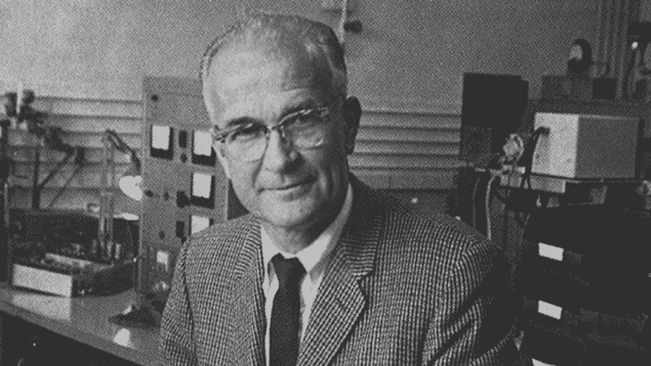
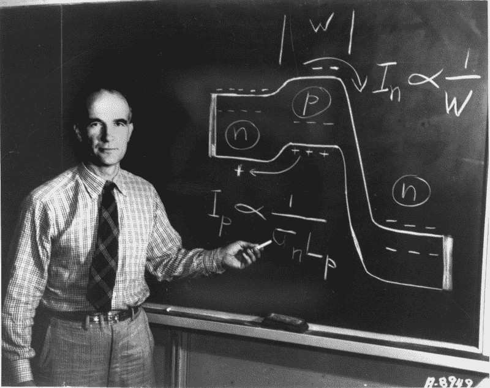
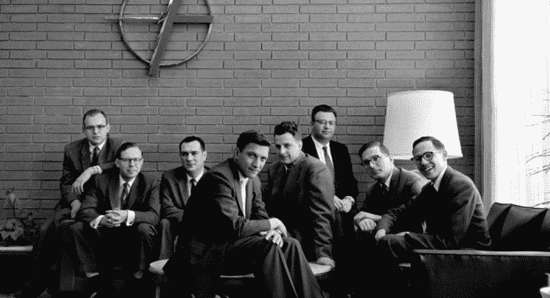

# 硅谷最聪明的失败者

> 原文：<https://www.freecodecamp.org/news/silicon-valley-s-smartest-loser-f0c3fac753d8/>

马克·曼

# 硅谷最聪明的失败者

#### 每个成功故事的背后都有一个错失的机会。对于每一个做出伟大成就的企业家来说，总有其他人有机会却没有抓住。硅谷就是建立在这样一个失败的事业上，他的名字叫威廉姆·肖克利。

在与硅谷同名的类金属成为集成电路的首选材料之前，物理学家们一直在使用一种叫锗的不太活泼的物质来制造半导体。肖克利就是其中之一，他聪明地想到用硅来代替。

肖克利因发明晶体管而获得了 1956 年的诺贝尔奖。与它所取代的电子真空管相比，晶体管是一种更小、更便宜、更有效的控制电路板上电流的方式。尽管其他科学家在这项发明的关键方面发挥了更大的作用，肖克利领导了这个小组并完善了设计。随之而来的恶名为他赢得了创办自己的公司肖克利半导体实验室所需的资金支持，他的目标是制造硅晶体管，以取代已经用于许多设备的锗晶体管。他能够利用自己的科学明星身份吸引八位非常有才华的物理学家和工程师来帮助他，包括后来创立英特尔的罗伯特·诺伊斯和戈登·摩尔。

Shockley made the same mistake that startup founders often do: he equated innovation and entrepreneurship.

团队中的每个人都是自己领域的天才，但当他们来到肖克利的实验室时，没有一个人真正知道如何制造晶体管。因此，他们开始举办学习班，互相教授半导体理论。该小组很快发现他们喜欢一起工作，并被商业化硅半导体的挑战所吸引。

与此同时，肖克利对硅晶体管失去了兴趣。他想找到下一个重大突破，并保持他作为一流科学家的声誉，而不是浪费时间完善现有技术。然而，他的员工认识到他们所做的事情的商业潜力，他们渴望从研究科学家转变为生产工程师。

肖克利犯了初创公司创始人经常犯的错误:他把创新和企业家精神等同起来。“他认为只要做好科学，你就一定会有一个盈利的公司，”最初的团队成员之一汉斯·奎瑟说。肖克利的员工为 20 世纪最重要的发明——微芯片——奠定了基础，但他缺乏培养他们的工作和将技术商业化的承诺和专注。肖克利想要新的东西，而不是花时间让硅晶体管可靠地用于大规模生产。

然而，肖克利和他的团队之间的紧张关系超越了相互冲突的野心。肖克利把他的物理学家同事当作走狗，而不是合作伙伴。当时占主导地位的商业文化是严格的等级制度，肖克利像一个偏执的暴君一样管理着他的实验室。当一名女职员在开门时被针扎了一下，肖克利开始确信有人恶意地把针留在了那里。他开始强迫员工接受测谎仪测试，直到他们集体拒绝。

可以预见的是，肖克利和他的团队的关系瓦解了，团队开始在其他地方寻找工作。当时，没有创业文化这种东西，也没有任何风险投资来支持它。但是，尽管他们没有产品和管理经验，也没有进行过正式的市场调查，这八名团队成员知道他们想团结在一起，所以他们决定创办自己的公司。

最终，他们联系了一家总部位于纽约的名为 Fairchild Camera and Equipment 的公司，并在当时被称为心之欢乐谷的田野和农场中成立了自己的子公司，距离肖克利的实验室只有一英里半的路程。他们称之为飞兆半导体，但肖克利称他们为“叛国八人组”

None of them actually knew how to build transistors when they arrived at Shockley’s lab, so they started holding study sessions to teach each other semiconductor theory.

尽管他对肖克利的忠诚使他推迟了几个月才加入其他人的行列，但诺伊斯最终成为了这个团体的领袖。诺伊斯在创造力上至少与肖克利不相上下，但在气质上却与他相反。正如摩尔所描述的那样，肖克利是“好胜且有争议的”，诺伊斯是迷人且有风度的。他拒绝肖克利自上而下的领导风格，并鼓励每个人分享他们的想法和合作。

该小组找到了大规模生产硅晶体管的方法，并将第一批出售给了 IBM，但当诺伊斯想到在一片硅片上印刷完整的电路板时，变革的时刻到来了。本质上，他把三维的东西变成了二维的。另一位名叫杰克·基尔比的科学家几个月前也提出了集成电路的想法，但他使用的是锗，而不是硅。诺伊斯的版本更高效、更可靠，他身边有合适的人让它成为可行的产品。于是，微芯片诞生了。

该小组在将微芯片推向市场时面临许多挑战。他们必须学习如何生长硅晶体，将扩散从一个危险的过程转变为一个稳定的过程，并建造停止-重复照相机，用于将晶体管和其他半导体器件应用到晶片上。但最有助于他们成功的是平面工艺的发明。该技术允许该公司在一块板上制造许多芯片，这使他们能够以更低的利润率生产更高的产量，并最终赢得市场。

Fairchild 成立不到六个月就实现了盈利。三年后，公司的年收入超过了 2000 万美元。在十年内，当他们发明集成电路时，飞兆的年销售额达到 9000 万美元。该公司还建立了一种扩散模式，这将成为硅谷文化的标志。在 12 年内，飞兆的员工成立了 30 多家新公司。今天，湾区大约 70%的上市公司直接追溯到飞兆半导体，超过 400 家公司的根源在叛逆八人。据估计，所有这些分支的总价值超过一万亿美元。

然而，肖克利半导体没能幸免于失去最好的员工。在他们离开后的几个月内，肖克利关闭了公司。他的余生都在斯坦福大学教书。

肖克利的问题不是智力上的。(至少，一开始不是；在晚年，他痴迷于优生学和种族主义进化论。)事实上，和他一起工作的人都对他的天才心存敬畏。原始团队的另一名成员杰伊·拉斯特(Jay Last)表示，肖克利可以“看到电子”。摩尔说，肖克利拥有令人难以置信的“物理直觉”但是如果你忽略了你周围的其他天才，天才就没什么价值了。仙童半导体公司在肖克利半导体公司失败的地方取得了成功——硅谷所有其他半导体公司也失败了或只能勉强维持边缘产品——因为诺伊斯鼓励每个人做出贡献，并平等对待他们的所有想法。

不幸的是，飞兆位于纽约的母公司未能从诺伊斯身上学到任何东西，该集团再次反抗自上而下的管理风格，他们认为这损害了他们将新产品商业化的能力。但是这次他们没有同时离开。他们一个接一个地开始了自己的公司，包括诺伊斯，他和摩尔一起创立了英特尔。在那里，他促成了泰德·霍夫发明的微处理器，再次证明:不管你有多聪明，都要听听你周围其他聪明人的意见。帮助每个人成功是值得的。

本文以标题 [*错过硅谷最大突破*](http://www.sitebuilderreport.com/blog/the-genius-who-missed-silicon-valleys-biggest-breakthrough) 的天才首次出现在[网站建设者报告](http://www.sitebuilderreport.com)上。