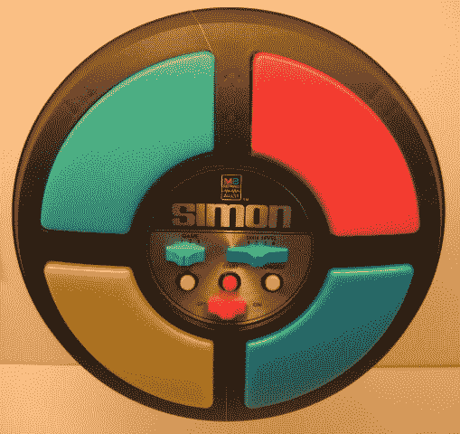

# 西蒙 JavaScript 游戏教程

> 原文：<https://www.freecodecamp.org/news/simon-javascript-game-tutorial/>

在这个 JavaScript 游戏教程中，您将学习如何使用 JavaScript、HTML 和 CSS 创建一个 Simon 游戏。JavaScript 的每一行都有解释。

我给出了一步一步的说明来重现这个经典的游戏。

你可以在 freeCodeCamp.org YouTube 频道上观看视频(1 小时观看)。

[https://www.youtube.com/embed/n_ec3eowFLQ?feature=oembed](https://www.youtube.com/embed/n_ec3eowFLQ?feature=oembed)