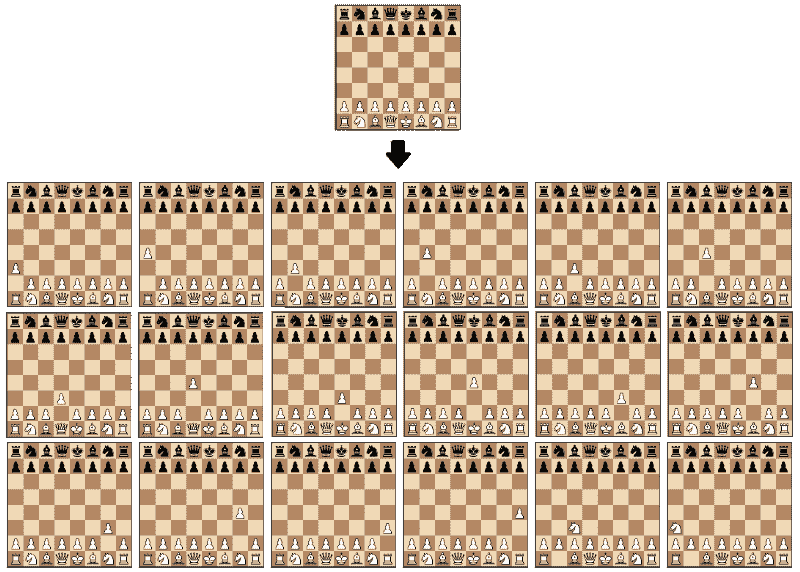
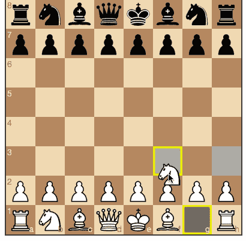
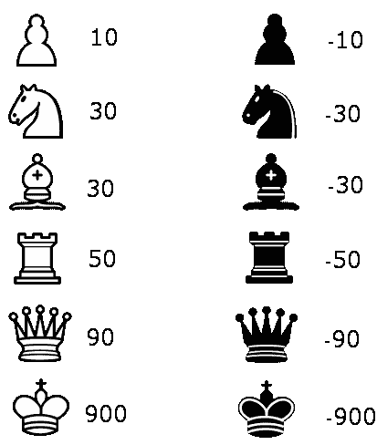
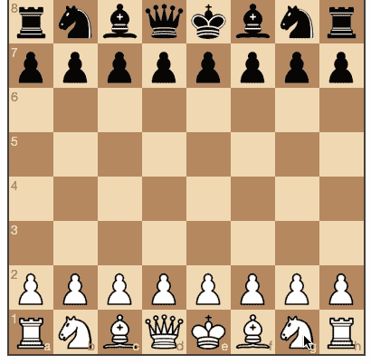
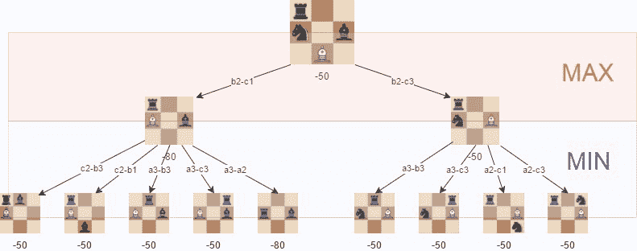
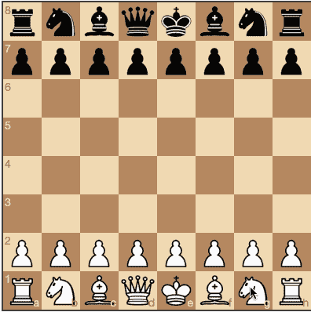
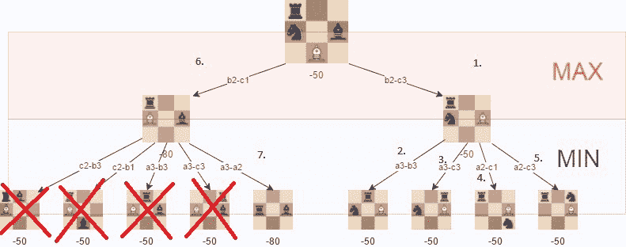
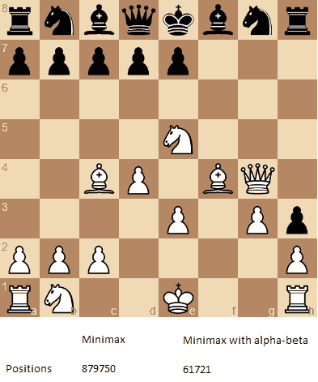
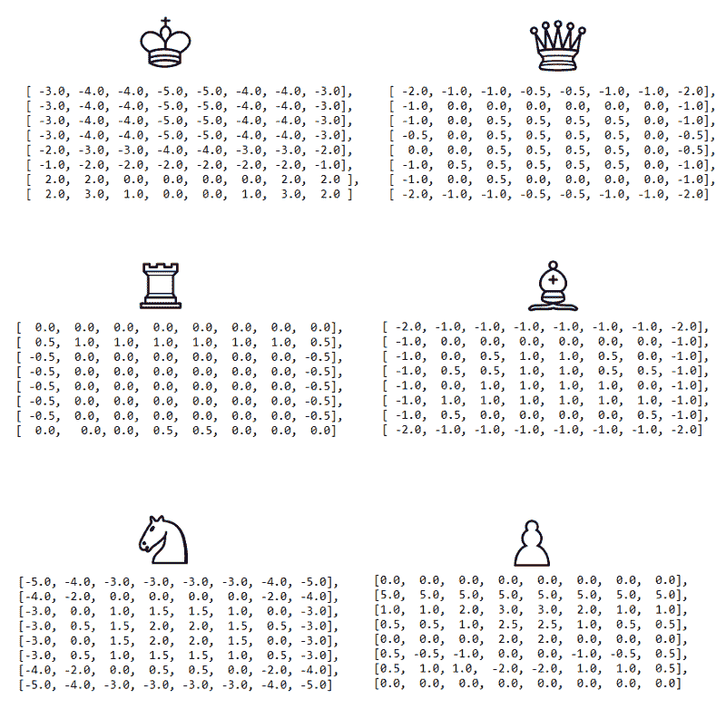
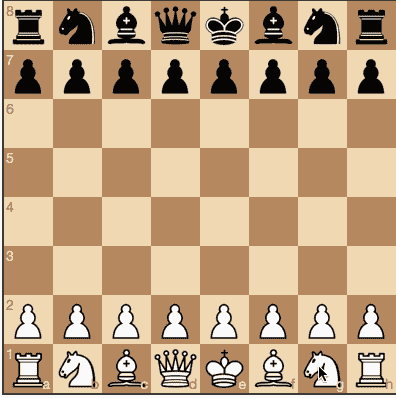

# 一步一步的指南来建立一个简单的国际象棋人工智能

> 原文：<https://www.freecodecamp.org/news/simple-chess-ai-step-by-step-1d55a9266977/>

劳拉·哈特金斯

# 一步一步的指南来建立一个简单的国际象棋人工智能

让我们探索一些基本概念，这将有助于我们创建一个简单的国际象棋人工智能:

*   移动生成
*   董事会评估
*   极大极小
*   和阿尔法贝塔修剪。

在每一步，我们都会用这些久经考验的国际象棋编程技术来改进我们的算法。我将演示每一个如何影响算法的游戏风格。

你可以在 [GitHub](https://github.com/lhartikk/simple-chess-ai) 这里查看最终的 AI 算法。

### 步骤 1:移动生成和纸板可视化

我们将使用 [chess.js](https://github.com/jhlywa/chess.js) 库生成棋步，使用[棋盘. js](https://github.com/oakmac/chessboardjs/) 可视化棋盘。走法生成库基本实现了国际象棋的所有规则。在此基础上，我们可以计算给定董事会状态下的所有合法移动。

A visualization of the move generation function. The starting position is used as input and the output is all the possible moves from that position.

使用这些库将帮助我们只关注最有趣的任务:创建找到最佳走法的算法。

我们首先创建一个函数，从所有可能的移动中返回一个随机移动:

虽然这个算法不是一个非常可靠的棋手，但它是一个很好的起点，因为我们实际上可以和它对弈:

Black plays random moves. Playable on [https://jsfiddle.net/lhartikk/m14epfwb/](https://jsfiddle.net/lhartikk/m14epfwb/)4

### 第二步:职位评估

现在我们来试着了解一下在某个位置上哪边更强。最简单的方法是使用下表计算棋盘上棋子的相对强度:

通过评估功能，我们能够创建一个算法来选择给出最高评估的移动:

唯一切实的改进是，我们的算法现在可以捕捉到一块碎片。

Black plays with the aid of the simple evaluation function. Playable on [https://jsfiddle.net/lhartikk/m5q6fgtb/1/](https://jsfiddle.net/lhartikk/m5q6fgtb/1/)

### 步骤 3:使用极大极小值搜索树

接下来，我们将创建一个搜索树，算法可以从中选择最佳的移动。这是通过使用 [Minimax](https://en.wikipedia.org/wiki/Minimax) 算法来完成的。

在该算法中，所有可能移动的递归树被探索到给定的深度，并且在树的结束“叶子”处评估位置。

之后，我们根据要移动的是白棋还是黑棋，将子节点的最小值或最大值返回给父节点。(也就是说，我们试图最小化或最大化每个级别的结果。)

A visualization of the minimax algorithm in an artificial position. The best move for white is **b2-c3**, because we can guarantee that we can get to a position where the evaluation is **-50**

有了 minimax，我们的算法开始理解国际象棋的一些基本战术:

Minimax with depth level 2\. Playable on: [https://jsfiddle.net/k96eoq0q/1/](https://jsfiddle.net/k96eoq0q/1/)

极大极小算法的有效性很大程度上取决于我们能够达到的搜索深度。这是我们将在下一步改进的地方。

### 第四步:阿尔法-贝塔修剪

[Alpha-beta](https://en.wikipedia.org/wiki/Alpha%E2%80%93beta_pruning) 剪枝是 minimax 算法的一种优化方法，允许我们忽略搜索树中的一些分支。这有助于我们更深入地评估极大极小搜索树，同时使用相同的资源。

阿尔法-贝塔剪枝基于这样的情况:如果我们发现一个移动导致比先前发现的移动更糟糕的情况，我们可以停止评估搜索树的一部分。

alpha-beta 修剪不会影响极大极小算法的结果，只会使它更快。

如果我们碰巧先去**那些导致好棋的路径**，阿尔法-贝塔算法也会更有效。

The positions we do not need to explore if alpha-beta pruning isused and the tree is visited in the described order.

有了 alpha-beta，极大极小算法得到了显著提升，如下例所示:

The number of positions that are required to evaluate if we want to perform a search with depth of 4 and the “root” position is the one that is shown.

跟随[此链接](https://jsfiddle.net/Laa0p1mh/3/)尝试 alpha-beta 改进版的象棋 AI。

### 步骤 5:改进评价功能

初始评估函数非常简单，因为我们只计算在板上找到的材料。为了改善这一点，我们在评估中加入了一个考虑到棋子位置的因素。例如，棋盘中心的骑士比棋盘边缘的骑士更好(因为它有更多的选择，因此更活跃)。

我们将使用最初在[国际象棋编程 wiki](https://chessprogramming.wikispaces.com/Simplified+evaluation+function) 中描述的略微调整版本的方块表。

The visualized piece-square tables visualized. We can decrease or increase the evaluation, depending on the location of the piece.

通过下面的改进，我们开始得到一个可以下一些“像样”棋的算法，至少从一个普通玩家的角度来看是这样的:

Improved evaluation and alpha-beta pruning with search depth of 3\. Playable on [https://jsfiddle.net/q76uzxwe/1/](https://jsfiddle.net/q76uzxwe/1/)

### 结论

即使是简单的下棋算法的优势也在于它不会犯愚蠢的错误。尽管如此，它仍然缺乏战略理解。

用我在这里介绍的方法，我们已经能够编写一个下棋算法，可以玩基本的国际象棋。最终算法的“人工智能部分”(不包括移动生成)只有 200 行代码，这意味着基本概念实现起来非常简单。你可以在 [GitHub](https://github.com/lhartikk/simple-chess-ai) 上查看最终版本。

我们可以对算法做进一步的改进，例如:

*   [移动顺序](https://chessprogramming.wikispaces.com/Move+Ordering)
*   更快的[移动代](https://chessprogramming.wikispaces.com/Move+Generation)
*   以及[残局](https://chessprogramming.wikispaces.com/Endgame)具体评测。

如果你想了解更多，请查看[国际象棋编程维基](https://chessprogramming.wikispaces.com/)。对于探索我在这里介绍的这些基本概念之外的内容，这是一个很有帮助的资源。

感谢阅读！