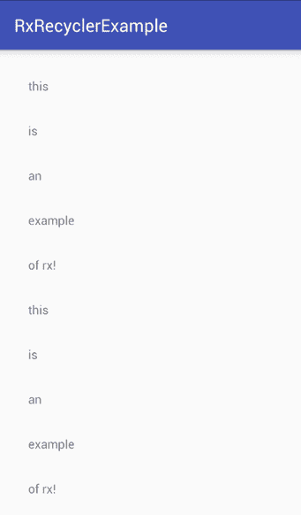
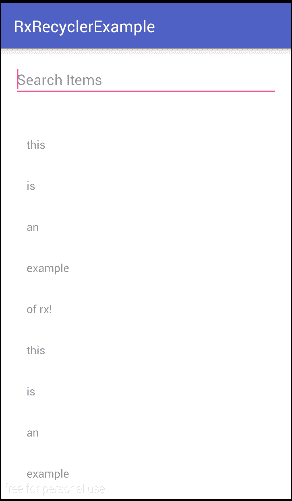
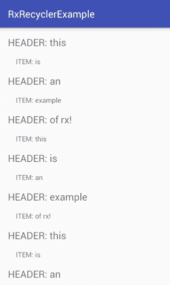

# 通过 Rx 和数据绑定简化 RecyclerView 适配器

> 原文：<https://www.freecodecamp.org/news/simplifying-recyclerview-adapters-with-rx-databinding-f02ebed0b386/>

艾哈迈德·里兹万

# 通过 Rx 和数据绑定简化 RecyclerView 适配器


我最近想更深入地了解 Rx。所以我用 Rx 和 RecyclerView 适配器进行了实验，结果非常有趣！

考虑到 Rx，我着手完成三件事:

1.  创建一个 RecyclerView 适配器，它应该是**泛型**——一个适配器类来管理它们！
2.  它应该以 Rx 流的形式返回**绑定**！
3.  还应该有一个支持多项**类型**的选项！

现在，你可能会想:这真的没有必要。我的意思是，为什么在 RecyclerAdapters 中首先使用 Rx？为什么需要绑定作为接收流呢？

这倒是真的。我个人认为，将 Rx 集成到 RecyclerView 适配器中，而不是使用简单的回调或委托，是一个很好的实验。所以这是一种实验。


所以我写了一个名为[**Rx recycleradapter**](https://github.com/ahmedrizwan/RxRecyclerAdapter)的库来让 Rx 与适配器一起工作。让我们来分析一下它是如何简化使用**和**回收适配器的。

#### RxDataSource 简化了 RxRecyclerAdapter 的使用

假设您有一个想要显示的漂亮的字符串数组列表:

```
//Dummy DataSetdataSet = new ArrayList<>();dataSet.add("this");dataSet.add("is");dataSet.add("an");dataSet.add("example");dataSet.add("of rx!");
```

你可以这么做:

1.  通过将其添加到 build.gradle 中来启用数据绑定

```
dataBinding {      enabled = true}
```

2.为项目创建布局文件:

```
&lt;?xml version="1.0" encoding="utf-8"?>&lt;layout xmlns:android="http://schemas.android.com/apk/res/android"        xmlns:tools="http://schemas.android.com/tools">    <LinearLayout        android:layout_width="match_parent"        android:layout_height="match_parent"        android:orientation="vertical"        android:padding="@dimen/activity_horizontal_margin">        <;TextView android:id="@+id/textViewItem"                  android:layout_width="match_parent"                  android:layout_height="wrap_content"                  tools:text="Recycler Item"/>    </LinearLayout></layout>
```

3.创建一个 **RxDataSource** 的实例，告诉它数据集类型是什么:

```
RxDataSource&lt;String> rxDataSource = new RxDataSource<>(dataSet);
```

4.用 LayoutBinding 合成然后强制转换调用 bindRecyclerView(传入 RecyclerView 和布局)。由于强制转换，viewHolder 可以推断出绑定的类型。

```
rxDataSource  .map(String::toLowerCase)  .repeat(10)  .&lt;ItemLayoutBinding>bindRecyclerView(recyclerView,                               R.layout.item_layout)  .subscribe(viewHolder -> {         ItemLayoutBinding b = viewHolder.getViewDataBinding();         b.textViewItem.setText(viewHolder.getItem());  });
```

输出将是…



注意，调用 observer ion(androidschedulers . main thread())在这里是不必要的，因为您已经在主线程上了。当您调用它时，它会导致流中大约 20–30 毫秒的延迟，这会降低您的帧速率。

现在举一个更实际的例子。

假设您想要动态更新数据集。假设您想要搜索数据集并筛选出特定的结果。这是如何做到的:

```
RxTextView.afterTextChangeEvents(searchEditText).subscribe(event -> {  rxDataSource.updateDataSet(dataSet)       .filter(s -> s.contains(event.view().getText()))      .updateAdapter();});
```

结合 [RxBindings](https://github.com/JakeWharton/RxBinding) (因为 RxBindings 很牛逼)，我注册了 textChange 事件。当事件发生时，我用**基本数据集更新数据集！**

这很重要，因为当我调用像 *filter* 、 *map* 等方法时，RxDataSource 会改变它的 dataSet 实例。所以过滤需要在**原始数据集**上进行，而不是在改变的数据集上进行。然后…砰！



我确实遇到了一些限制——其中之一是，在数据集与数据源绑定之后，您不能更改数据集的类型。所以像 *map* 和 *flatmap* 这样的函数不能返回不同类型的数据集。但是我还没有遇到过需要能够在运行时更改数据集的情况。

#### RxRecyclerAdapter 简化了拥有多种项目类型的情况

现在，假设您想要在 RecyclerView 中包含多个项目类型，例如一个标题和一个项目类型。然后你会:

1.  创建指定所有布局的 **ViewHolderInfo** 列表

```
List<ViewHolderInfo> vi = new ArrayList<>();vi.add(new ViewHolderInfo(R.layout.item_layout, TYPE_ITEM)); vi.add(new ViewHolderInfo(R.layout.item_header_layout, TYPE_HEADER)); 
```

2.像前面一样创建 **RxDataSource** 的实例:

```
RxDataSource<String> rxDataSource = new RxDataSource<>(dataSet);
```

3.撰写并调用 **recyclerView** 中传入的 bindRecyclerView、**viewmolderinfo**列表和 **getItemViewType** 的实现:

```
rxDataSource.bindRecyclerView(recyclerView, viewHolderInfoList,    new OnGetItemViewType() {      @Override public int getItemViewType(int position) {        if (position % 2 == 0) {          return TYPE_HEADER; //headers are even positions        }        return TYPE_ITEM;      }    }  ).subscribe(vH -> {    //Check instance type and bind!    final ViewDataBinding b = vH.getViewDataBinding();    if (b instanceof ItemLayoutBinding) {      final ItemLayoutBinding iB = (ItemLayoutBinding) b;      iB.textViewItem.setText("ITEM: " + vH.getItem());    } else if (b instanceof ItemHeaderLayoutBinding) {      ItemHeaderLayoutBinding hB = (ItemHeaderLayoutBinding) b;      hB.textViewHeader.setText("HEADER: " + vH.getItem());    }  });
```

```
/* and like before, you can do this as well    rxDataSource.filter(s -> s.length() > 0)               .map(String::toUpperCase)              .updateAdapter();*/
```

现在**recycle view**看起来会像这样:



### 关于实现的一点点

#### 出版主题

前言→我主要利用了 [**PublishSubjects**](http://reactivex.io/documentation/subject.html) ，以及 **generics** 来创建适配器。

发布主体是一种可观察对象，它可以同时是*可观察对象*和*观察者*。

因为它是一个观察者，所以它可以订阅一个或多个观察值。而且因为是可观测的，所以可以通过重新发射的方式穿过它所观测的项目，也可以发射新的项目。

#### 中间部分

内部有两个适配器，如果你想也可以直接访问: **RxAdapter** 和 **RxAdapterForTypes** 。

对于这两个，我创建了一个通用的 **ViewHolder** 实现，它将布局与一个 ViewDataBinding 实例绑定在一起:

```
public class SimpleViewHolder<T, V extends ViewDataBinding> extends RecyclerView.ViewHolder {    private V mViewDataBinding;    public V getViewDataBinding() {        return mViewDataBinding;    }    public T getItem() {        return mItem;    }    private T mItem;    protected void setItem(final T item) {        mItem = item;    }    public SimpleViewHolder(final View itemView) {        super(itemView);        mViewDataBinding = DataBindingUtil.bind(itemView);    }}
```

然后我创建了 rx adapter——它有两个泛型:

```
RxAdapter&lt;DataType, LayoutBinding extends ViewDataBinding>
```

我为我的视图持有者创建了一个 [PublishSubject](http://reactivex.io/RxJava/javadoc/rx/subjects/PublishSubject.html) ，在 onBindViewHolder 中我调用 onNext。viewHolder 包含项目本身:

```
@Overridepublic void onBindViewHolder(final SimpleViewHolder<T, V> holder, final int position) {    holder.setItem(mDataSet.get(position));    mPublishSubject.onNext(holder);}
```

最后，我创建了一个方法 asObservable，它将 publishSubject 作为可观察对象返回，以便您可以订阅它:

```
public Observable<SimpleViewHolder> asObservable(){    return mPublishSubject.asObservable();}
```

但是等等，RxDataSource 呢？这只是 Rx 可观测量的包装。它的主要目的是为您提供两个适配器和 Rx 方法的抽象。它基本上把一切都联系在一起。

当我说它是一个包装器时，这意味着你只能得到与 recyclerAdapter 相关的**方法，比如*过滤器*、*映射*、*获取*、*第一个*、*重复*等等。它没有给出与线程或调度程序有关的方法。**

因为这门课很简单。你可以在这里查看 RxDataSource [**的代码。**](https://github.com/ahmedrizwan/RxRecyclerAdapter/blob/master/rxrecycler-adapter/src/main/java/com/minimize/android/rxrecycleradapter/RxDataSource.java)

差不多就是这些了…我希望这篇文章对你有用。一定要试一试 RxAdapter。如果你有任何问题(或建议)，请提出来！


编码快乐！