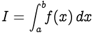
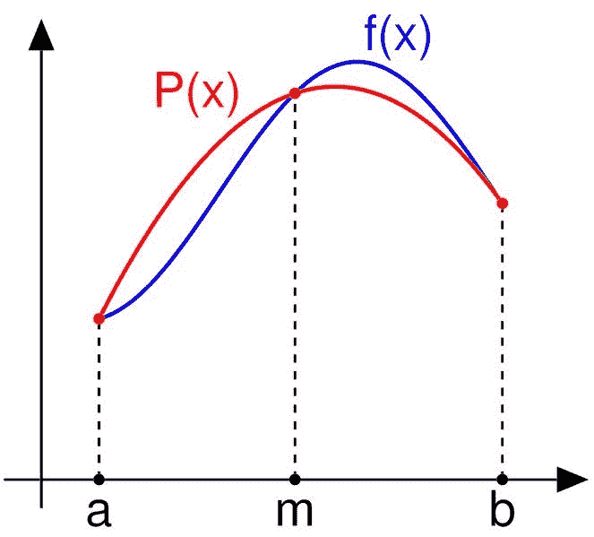
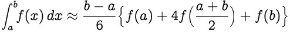
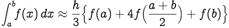
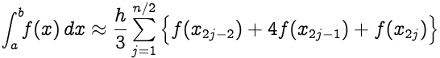
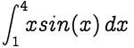
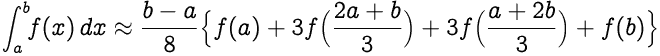
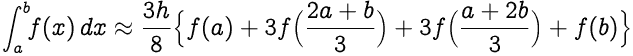
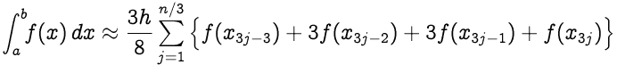

# 辛普森法则:公式及其工作原理

> 原文：<https://www.freecodecamp.org/news/simpsons-rule/>

辛普森法则是一种数值积分方法。换句话说，它是定积分的数值近似。

辛普森法则如下:



在里面，

*   `f(x)`被称为*被积函数*
*   `a` =积分下限
*   `b` =积分上限

## 辛普森 1/3 法则



如上图所示，被积函数`f(x)`用二阶多项式近似；二次插值函数为`P(x)`。

近似值如下:



将`(b-a)/2`替换为`h`，我们得到，



可以看到，上面的表达式中有一个`1/3`的因子。这就是为什么，它被称为 ****辛普森 1/3 法则**** 。

如果一个函数是高度振荡的，或者在某些点缺少导数，那么上述规则可能无法产生精确的结果。

处理这个问题的一个常见方法是使用*复合辛普生法则*方法。为此，将`[a,b]`分解成小的子区间，然后对每个子区间应用辛普森法则。然后，将每次计算的结果相加，得出整个积分的近似值。

如果区间`[a,b]`被分割成`n`个子区间，并且`n`是偶数，则复合辛普森法则用以下公式计算:



其中 ****x [j] = a+jh**** 为 ****j = 0，1，…，n-1，n**** 同****h =(b-a)/n****；特别是****x[0]= a****和****x[n]= b****。

### C++中的示例:

为了逼近下面给出的积分值，其中 n = 8:



```
#include<iostream>
#include<cmath>
using namespace std;

float f(float x)
{
	return x*sin(x);	//Define the function f(x)
}

float simpson(float a, float b, int n)
{
	float h, x[n+1], sum = 0;
	int j;
	h = (b-a)/n;

	x[0] = a;

	for(j=1; j<=n; j++)
	{
		x[j] = a + h*j;
	}

	for(j=1; j<=n/2; j++)
	{
		sum += f(x[2*j - 2]) + 4*f(x[2*j - 1]) + f(x[2*j]);
	}

	return sum*h/3;
}

int main()
{
	float a,b,n;
	a = 1;		//Enter lower limit a
	b = 4;		//Enter upper limit b
	n = 8;		//Enter step-length n
	if (n%2 == 0)
		cout<<simpson(a,b,n)<<endl;
	else
		cout<<"n should be an even number";
	return 0;
}
```

## 辛普森 3/8 法则

辛普森 3/8 法则类似于辛普森 1/3 法则，唯一的区别是，对于 3/8 法则，插值函数是三次多项式。尽管 3/8 法则多使用了一个函数值，但它的精确度是 1/3 法则的两倍。

辛普森的 3/8 法则指出:



将`(b-a)/3`替换为`h`，我们得到，



n 个区间的辛普森 3/8 法则(n 应为 3 的倍数):



其中 ****x [j] = a+jh**** 为 ****j = 0，1，…，n-1，n**** 同****h =(b-a)/n****；特别是****x[0]= a****和****x[n]= b****。