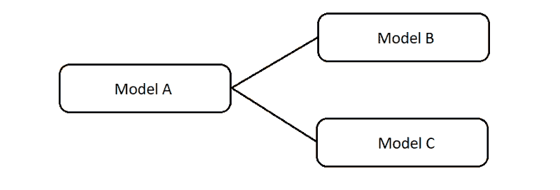

# Rails 中单表继承与多态关联:找到适合你的

> 原文：<https://www.freecodecamp.org/news/single-table-inheritance-vs-polymorphic-associations-in-rails-af3a07a204f2/>

由 haley mnatzaganian

# Rails 中单表继承与多态关联:找到适合你的


Photo by [Sanwal Deen](https://unsplash.com/photos/GJCWj-n3h4E?utm_source=unsplash&utm_medium=referral&utm_content=creditCopyText) on [Unsplash](https://unsplash.com/?utm_source=unsplash&utm_medium=referral&utm_content=creditCopyText)

如果您曾经创建过具有多个模型的应用程序，那么您必须考虑在这些模型之间使用什么类型的关系。

随着应用程序复杂性的增加，很难决定模型之间应该存在哪些关系。

经常出现的一种情况是，您的几个模型需要访问第三个模型的功能。Rails 给了我们两种方法来处理这个事件，分别是**单表继承**和**多态关联。**



**在单表继承(STI)中，**很多子类继承一个超类，所有数据都在数据库的同一个表中。超类有一个“类型”列来决定一个对象属于哪个子类。

在**多态关联**中，一个模型“属于”几个使用单一关联的其他模型。每个模型，包括多态模型，在数据库中都有自己的表。

让我们来看看每种方法，看看我们什么时候会使用它们。

### **单表继承**

知道 STI 何时合适的一个好方法是当你的模型有**共享数据/状态**的时候。共享行为是可选的。

让我们假设我们正在创建一个应用程序，列出在当地经销商处出售的不同车辆。这家经销店出售汽车、摩托车和自行车。

(我知道经销商不卖自行车，但请耐心听我说一分钟——你会明白我的意思。)

对于每辆车，经销商希望跟踪价格、颜色以及车辆是否被购买。这种情况是 STI 的完美候选，因为我们对每个类使用相同的数据。

我们可以用颜色、价格和购买的属性创建一个超类`Vehicle`。我们的每个子类都可以从`Vehicle`继承，并且都可以一次性获得相同的属性。

我们创建车辆表的迁移可能如下所示:

```
class CreateVehicles < ActiveRecord::Migration[5.1]  def change                               create_table :vehicles do |t|                                   t.string :type, null: false                               t.string :color                                   t.integer :price                                  t.boolean :purchased, default: false                                                          end                           end                       end
```

我们为超类创建`type`列是很重要的。这告诉 Rails 我们正在使用 STI，并且希望`Vehicle`及其子类的所有数据都在数据库的同一个表中。

我们的模型类如下所示:

```
class Vehicle < ApplicationRecordend
```

```
class Bicycle < Vehicleend
```

```
class Motorcycle < Vehicleend
```

```
class Car < Vehicleend
```

这种设置非常好，因为`Vehicle`类中的任何方法或验证都是与其每个子类共享的。我们可以根据需要向任何子类添加独特的方法。它们相互独立，行为没有横向共享。

此外，因为我们知道子类共享相同的数据字段，所以我们可以对不同类的对象进行相同的调用:

```
mustang = Car.new(price: 50000, color: red)harley = Motorcycle.new(price: 30000, color: black)
```

```
mustang.price=> 50000
```

```
harley.price=> 30000
```


Umm, where can I find this dealership? ([source](https://www.flickr.com/photos/bagogames/14870700349))

#### **添加功能**

现在，假设经销商决定收集更多关于车辆的信息。

对于`Bicycles`，她想知道每辆自行车是公路自行车、山地自行车还是混合动力自行车。对于`Cars`和`Motorcycles`，她想记录马力。

所以我们创建了一个迁移，将`bicycle_type`和`horsepower`添加到`Vehicles`表中。

突然间，我们的模型不再完美地共享数据字段。任何`Bicycle`对象都不会有`horsepower`属性，任何`Car`或`Motorcycle`都不会有`bicycle_type`(希望——我一会儿会讲到这一点)。

然而，我们表中的每辆自行车都有一个`horsepower`字段，每辆汽车和摩托车都有一个`bicycle_type`字段。

这是事情变得棘手的地方。这种情况下可能会出现一些问题:

1.  我们的表将有很多空值(在 Ruby 的情况下是`nil`),因为对象将有不适合它们的字段。当我们向模型中添加验证时，这些`nulls`会导致问题。
2.  随着表的增长，如果不添加过滤器，我们在查询时会遇到性能开销。对某个`bicycle_type`的搜索会查看**表中的每一项**——不仅是`Bicycles`，还有`Cars`和`Motorcycles`。
3.  事实上，没有什么可以阻止用户向错误的模型中添加“不合适的”数据。例如，拥有一些知识的用户可以创建一个`horsepower`为 100 的`Bicycle`。我们需要验证和良好的应用程序设计，以防止无效对象的创建。

所以，我们可以看到，STI 确实有一些缺陷。对于模型共享数据字段并且不太可能改变的应用程序来说，这是非常好的。

**STI 优点:**

*   易于实施
*   DRY —使用继承和共享属性保存复制的代码
*   允许子类在必要时拥有自己的行为

**STI CONS:**

*   伸缩性不好:随着数据的增长，表会变得很大，可能难以维护/查询
*   添加新模型或偏离共享字段的模型字段时需要小心
*   (有条件的)如果没有进行验证，则允许创建无效对象
*   (条件)如果表中存在许多空值，则可能难以验证或查询

### 多态关联

通过多态关联，一个模型可以用一个关联`belong_to`几个模型。


It’s morphin’ time. ([source](https://www.flickr.com/photos/bagogames/14916041475))

当几个模型彼此没有关系或不共享数据，但与多态类有关系时，这是很有用的。

举个例子，让我们想想像脸书这样的社交媒体网站。在脸书，个人和团体都可以分享帖子。

个人和组是不相关的(除了两者都是一种类型的用户)，所以他们有不同的数据。一个组可能有像`member_count`和`group_type`这样不适用于个人的字段，反之亦然)。

如果没有多态关联，我们会得到这样的结果:

```
class Post  belongs_to :person  belongs to :groupend
```

```
class Person  has_many :postsend
```

```
class Group  has_many :postsend
```

通常，为了找出谁拥有某个概要文件，我们查看列`foreign_key`。`foreign_key`是用于在相关模型的表中查找相关对象的 id。

然而，我们的 Posts 表将有两个竞争的外键:`group_id`和`person_id`。这可能会有问题。

当试图找到一个帖子的所有者时，我们必须检查两个列来找到正确的 foreign_key，而不是依赖一个。如果我们遇到两列都有值的情况会怎么样？

多态关联通过将这个功能压缩到一个关联中来解决这个问题。我们可以这样表示我们的类:

```
class Post  belongs_to :postable, polymorphic: trueend
```

```
class Person  has_many :posts, as :postableend
```

```
class Group  has_many :posts, as :postableend
```

Rails 命名多态关联的约定使用“-able”和类名(`:postable`代表`Post`类)。这使得在你的关系中哪个类是多态的变得很清楚。但是您可以为您的多态关联使用任何您喜欢的名称。

为了告诉我们的数据库我们正在使用多态关联，我们为多态类使用了特殊的“type”和“id”列。

`postable_type`列记录文章属于哪个模型，而`postable_id`列跟踪拥有对象的 id:

```
haley = Person.first=> returns Person object with name: "Haley"
```

```
article = haley.posts.firstarticle.postable_type=> "Person"
```

```
article.postable_id=> 1 # The object that owns this has an id of 1 (in this case a      Person)
```

```
new_post = haley.posts.new()# Automatically fills in postable_type and postable_id using haley object
```

多态关联只是两个或更多的 belongs _ to 关联的组合。因此，在使用两个具有 belongs_to 关联的模型时，您可以采取相同的方式。

注意:多态关联与 has_one 和 has_many 关联一起工作。

```
haley.posts# returns ActiveRecord array of posts
```

```
haley.posts.first.content=> "The content from my first post was a string..."
```

一个区别是从一个帖子“向后”访问它的所有者，因为它的所有者可能来自几个类中的一个。

要快速做到这一点，您需要[向多态类](http://guides.rubyonrails.org/association_basics.html#polymorphic-associations)添加一个外键列和一个类型列。您可以使用`postable`找到帖子的所有者:

```
new_post.postable=> returns Person object
```

```
new_post.postable.name=> "Haley"
```

此外，Rails 在多态关系中实现了一些安全性。只有作为关系一部分的类才能作为`postable_type`包含进来:

```
new_post.update(postable_type: "FakeClass")=> NameError: uninitialized constant FakeClass
```

#### 警告

多态关联伴随着一个巨大的危险信号:**数据完整性受损**。


By Scott Adams from [http://dilbert.com/](http://dilbert.com/)

在正常的 belongs_to 关系中，我们在关联中使用外键进行引用。

然而，它们的力量不仅仅是形成一个链接。外键还通过要求外键表中引用的对象确实存在来防止引用错误。

如果有人试图用引用空对象的外键创建一个对象，他们将得到一个错误。

不幸的是，由于我们讨论过的的[原因，多态类不能有外键。我们使用`type`和`id`列来代替外键。这意味着我们失去了外键提供的保护。](https://medium.com/p/af3a07a204f2#6a54)

Rails 和 ActiveRecord 在表面上帮助了我们，但是任何直接访问数据库的人都可以创建或更新引用空对象的对象。

例如，检查这个 SQL 命令，其中创建了一个帖子，即使与它相关联的组并不存在。

```
Group.find(1000)=> ActiveRecord::RecordNotFound: Couldn't find Group with 'id'=1000
```

```
# SQLINSERT INTO POSTS (postable_type, postable_id) VALUES ('Group', 1000)=> # returns success even though the associated Group doesn't exist
```

幸运的是，正确的应用程序设置可以防止这种情况发生。因为这是一个严重的问题，所以您应该只在包含数据库时使用多态关联。如果其他应用程序或数据库需要访问它，您应该考虑其他方法。

**多态关联优点:**

*   易于扩展数据量:信息分布在多个数据库表中，以最大限度地减少表膨胀
*   易于扩展模型的数量:更多的模型可以很容易地与多态类相关联
*   DRY:创建一个可以被许多其他类使用的类

**多态联想 CONS**

*   随着数据的增长，更多的表会使查询变得更加困难和昂贵。(查找在特定时间范围内创建的所有帖子需要扫描所有相关的表)
*   不能有外键。`id`列可以引用任何相关的模型表，这会降低查询速度。它必须与`type`柱配合工作。
*   如果你的表非常大，那么大量的空间被用来存储`postable_type`的字符串值
*   您的数据完整性受到威胁。

### 如何知道使用哪种方法

当谈到用例时，STI 和多态关联有一些重叠。虽然不是“树状”模型关系的唯一解决方案，但它们都有一些明显的优点。

`Vehicle`和`Postable`的例子都可以用其中一种方法实现。然而，有几个原因清楚地表明了在每种情况下哪种方法是最好的。

在决定这些方法是否符合您的需求时，有四个因素需要考虑。

1.  **数据库结构。STI 对关系中的所有类只使用一个表，而多态关联对每个类使用一个表。随着应用程序的增长，每种方法都有自己的优缺点。**
2.  **共享数据或状态。**如果你的模型有许多共同的属性，STI 是一个很好的选择。否则多态关联可能是更好的选择。
3.  **未来的担忧。**考虑您的应用程序可能会如何变化和发展。如果您正在考虑 STI，但认为您将添加偏离共享结构的模型或模型字段，您可能需要重新考虑您的计划。如果你认为你的结构可能会保持不变，STI 将*通常*更快的查询。
4.  **数据完整性。**如果数据不被包含(一个应用程序使用您的数据库)，多态关联可能是一个糟糕的选择，因为您的数据会受到损害。

### **最终想法**

STI 和多态关联都不是完美的。它们都有优点和缺点，这使得一个或另一个更适合与许多模型联系在一起。

我写这篇文章是为了教会自己这些概念，就像教会别人一样。如果有任何不正确的地方或任何你认为应该提及的观点，请在评论中分享来帮助我和其他人！

**如果您学到了什么或发现这很有帮助，请点击**？**按钮以示支持！**