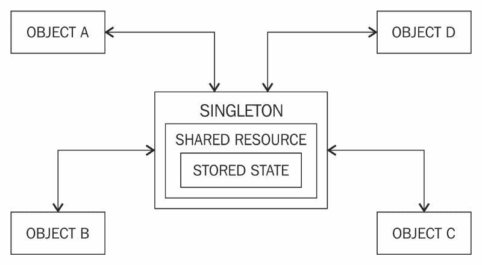
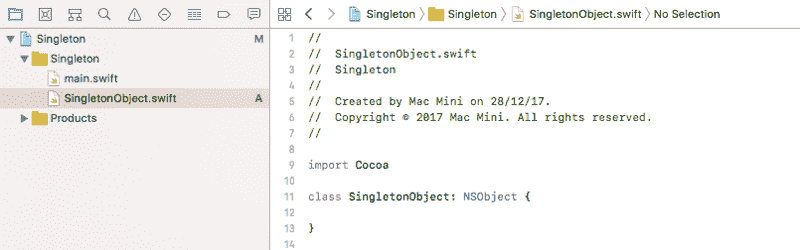

# 让我们来看看单例设计模式的优缺点

> 原文：<https://www.freecodecamp.org/news/singleton-design-pattern-pros-and-cons-e10f98e23d63/>

作者纳夫迪普·辛格

# 让我们来分析一下单体设计模式的优缺点



> 设计模式是解决复杂软件问题的概念性工具。这些模式是简单而优雅的解决方案，随着时间的推移而发展，可能已经被普遍接受为解决某些设计挑战的最佳方式。— *我，在我的电子书中*用 Swift 4 进行反应式编程

### 单一设计模式

Singleton 模式将共享资源封装在一个唯一的类实例中。该实例仲裁对资源和存储相关状态信息的访问。类方法提供了对这个实例的引用，所以不需要传递引用。任何可以访问 Singleton 的类头的对象都可以使用 Singleton。

这种设计模式定义了只能有一个实例的类的结构。单体封装了一个独特的资源，并使其在整个应用程序中随时可用。资源可以是硬件、网络服务、持久性存储或任何可以被建模为唯一对象或服务的东西。

Cocoa touch 的一个例子是运行 iOS 应用程序的物理设备。对于一个正在执行的 app 来说，只有一个 iPhone 或者 iPad，只有一块电池和一块屏幕。UIDevice 在这里是一个单例类，因为它提供了一个与底层功能交互的通道。在唯一资源具有可写配置的情况下，这种差异会导致诸如竞争条件和死锁之类的问题。因为它们是唯一的，所以单例充当了一种控制，确保对共享资源的有序访问。

> 单例通常可以被建模为应用程序中的服务器，它接受发送、存储或检索数据的请求，并配置资源状态。

### 履行

单例模式的实现通常使用工厂方法创建一个对象，这个实例/对象在大多数情况下被称为共享实例。因为对实例的访问是通过类方法传递的，所以不需要创建对象。让我们看看代码中的单例实现。

对于这个例子，我们使用了**命令行工具** Xcode 模板来创建一个项目，并将其命名为 Singleton。我们的 Singleton 类叫做 **SingletonObject** ，这是我们作为普通的 Cocoa 类创建的，它是 **NSObject** 的子类。到目前为止，项目设置如下所示:



然后我们添加了一个名为 **sharedInstance** 的类方法，如前所述，因为这是类如何使 Singleton 可用的方法。它的返回值是 **SingleObject** 类型，如下所示:

```
func sharedInstance() -> SingletonObject {         }
```

该函数将实例存储在名为 **localSharedInstance** 的静态本地引用中。静态局部变量很像全局对象——它们在应用程序的生命周期内保持它们的值，但是它们的范围是有限的。**这些品质使他们成为理想的单身者，因为他们是永久的，并且确保我们的单身者只能通过共享实例获得*。***

这是我们的单例实现确保单例保持唯一性的方法之一。共享实例的基本结构由一个条件块组成，该条件块测试单例实例是否已被分配。但令人惊讶的是，这是更古老的做事方式(或者可能是其他语言的方式)。然而，在 Swift 中，实现已经变成只有一行代码，我们不需要方法。实现如下所示:

```
class SingletonObject: NSObject {    static let sharedInstance = SingletonObject()}
```

很简单，不是吗？

#### 单体设计模式——利弊

> 单身并不是所有问题的答案。像任何工具一样，它们可能供应不足，也可能被过度使用。

一些开发人员出于各种原因对单身者持批评态度。我们将审视这一批评，并简要讨论解决它们的方法。这些批评主要分为两类:

*   单体妨碍单元测试:如果对象和与之关联的方法耦合得如此紧密，以至于不编写一个全功能的单体类就无法进行测试，那么单体可能会导致编写可测试代码的问题。
*   单体创建隐藏的依赖关系:由于单体在代码库中随处可见，它可能会被过度使用。此外，由于它的引用在传递给不同的方法时不是完全透明的，因此很难跟踪。

为了避免这些复杂性，当考虑单例模式时，您应该确保该类是单例的。此外，在考虑设计单例设计模式时，请牢记测试并尽可能使用依赖注入——也就是说，尽可能将单例作为参数传递给初始化器。

关于其他更新，你可以在我的推特账号@NavRudraSambyal 上关注我

要阅读更多关于各种其他设计模式和实践示例的内容，您可以点击我的书《Swift 4 中的[反应式编程》的链接](https://www.amazon.com/Reactive-Programming-Swift-easy-maintain-ebook/dp/B078MHNSL1/ref=asap_bc?ie=UTF8)

感谢阅读，如果发现有用请分享:)