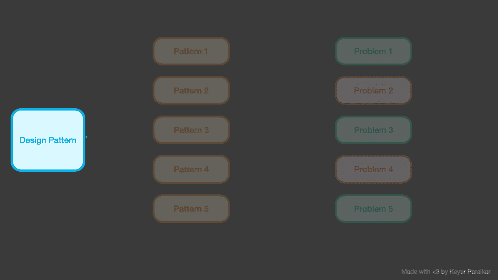
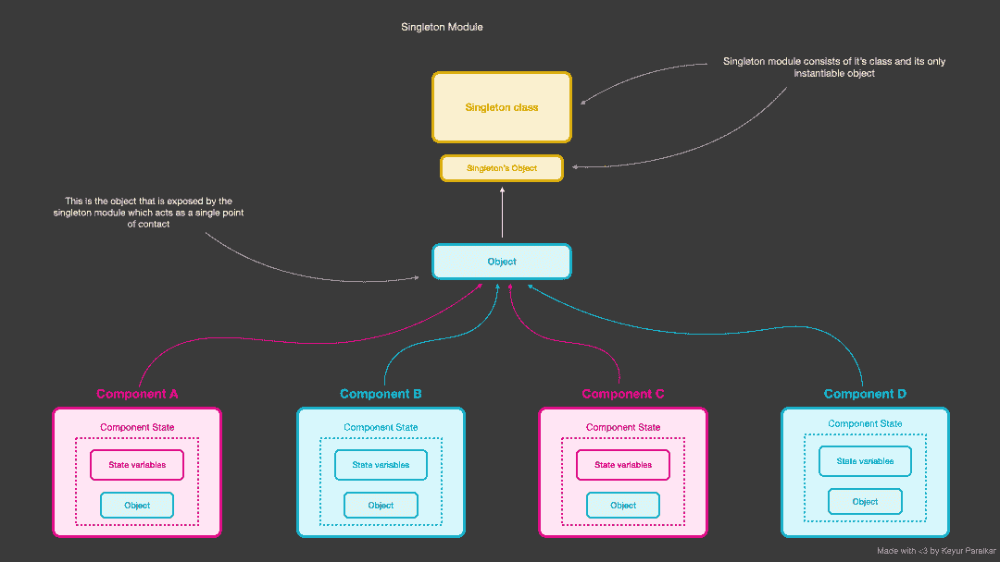

# 单例设计模式——如何在 JavaScript 中使用示例代码

> 原文：<https://www.freecodecamp.org/news/singleton-design-pattern-with-javascript/>

有时，您可能需要在 React 应用程序中使用全局状态。这使您可以将数据放在一个地方，并确保所需的组件可以访问它。

为了帮助您做到这一点，您通常会使用某种状态管理库，如 Redux、React Context 或反冲。

但是在这篇文章中，我们将借助设计模式来学习全局状态管理。

我们将看看什么是设计模式，我们将特别关注单例设计模式。最后，我们将看一个单例设计模式的例子以及它的优点和缺点。

所以事不宜迟，让我们开始吧。

## 目录

*   [先决条件](#prerequisites)
*   [什么是设计模式](#what-is-a-design-pattern)？
*   [什么是单体设计模式](#what-is-the-singleton-design-pattern)？
*   [单例设计模式的利弊](#pros-and-cons-of-the-singleton-design-pattern)
*   [总结](#summary)

## 先决条件

在阅读本文之前，我强烈建议您熟悉以下文章中的内容:

*   [JavaScript](https://www.freecodecamp.org/news/javascript-classes-how-they-work-with-use-case/)中有哪些类？
*   [如何访问 DOM 元素](https://developer.mozilla.org/en-US/docs/Web/API/Document_Object_Model/Introduction#accessing_the_dom)
*   [对象冻结如何工作](https://developer.mozilla.org/en-US/docs/Web/JavaScript/Reference/Global_Objects/Object/freeze)

## 什么是设计模式？



Design patterns provide conceptual solutions to common problems

设计模式是一组通用的指令，为软件设计中经常出现的问题提供解决方案。

您可以将设计模式视为一个由多个设计模板组成的网站，您可以使用这些模板根据您的特定需求来构建站点。

所以，现在的问题是——为什么知道设计模式很重要？使用设计模式有几个好处，比如:

*   这些模式是经过验证的——也就是说，这些指令是经过试验和测试的，它们反映了许多开发人员的经验和见解。
*   它们是您可以轻松重用的模式。
*   它们极具表现力。

请注意，设计模式只是以优化的方式为重复出现的问题提供了一个概念性的解决方案。它没有提供您可以在项目中使用的一段代码。

现在我们知道了什么是设计模式，让我们开始研究我们的第一个设计模式。

## 什么是单体设计模式？



Singleton design pattern exposes a single instance that can be used by multiple components

Singleton 是一种设计模式，它告诉我们只能创建一个类的实例，并且这个实例可以被全局访问。

这是设计模式的基本类型之一。它确保该类作为所有想要访问该状态的消费者组件的单一入口源。换句话说，它提供了使用全局状态的公共入口点。

所以单例类应该是这样的:

*   确保它只创建该类的一个实例
*   提供状态的全局访问点。
*   确保仅在第一次创建实例。

### 单例设计模式的例子

为了更好地理解这个概念，我们来看一个例子。这个例子是一个简单的 React 应用程序，它演示了如何在组件之间使用全局状态值，如何改变它，以及如何在所有组件中更新相同的值。让我们开始吧。

在我们开始实际实现之前，让我们看一下文件夹结构:

```
.
├── index.html
├── package.json
└── src
    ├── componentA.js
    ├── componentB.js
    ├── globalStyles.js
    ├── index.js
    ├── styles.css
    └── utilities.js
```

Project folder structure

以下是每个文件的详细信息:

*   `componentA.js`是一个消费者组件，它使用 singleton 类来访问全局状态对象并对其进行操作。
*   `componentB.js`类似于上面的组件，因为它必须访问全局状态对象并能操作它。
*   是一个模块，由单例类组成，并导出这个类的实例。
*   管理全局 JS 操作，即其他 DOM 元素所需的 JavaScript 更改。
*   管理应用程序的样式。由基本的 CSS 组成。
*   `utilities.js`是一个导出一些实用函数的模块。
*   `index.html`包含项目所需组件的 HTML 代码。
*   `package.json`是由`npm init`命令发出的样板配置。

现在我们知道了每个文件的作用，我们可以开始逐个实现它们。

但是在我们深入这个例子之前，我们需要理解代码流。我们示例的目的是构建一个 JavaScript 应用程序，演示每个组件如何使用全局样式`color`以及每个组件如何改变它。

每个组件由一个`color-picker`组成。当您通过每个组件内部的颜色选择器更改全局样式`color`属性时，它会自动出现在其他组件和全局状态中。

首先，我们来创建一个文件:`index.html`。然后将以下代码粘贴到该文件中:

```
<!DOCTYPE html>
<html>
  <head>
    <title>Parcel Sandbox</title>
    <meta charset="UTF-8" />
    <link rel="stylesheet" href="./src/styles.css" />
  </head>

  <body>
    <div class="global-state">
      <h3>Global State</h3>
      <h4>Color</h4>
      <span id="selected-color"></span>
    </div>
    <div class="contents">
      <div class="component-a">
        <strong>Component A</strong>
        <div>Pick color</div>
        <span id="selected-color">black</span>
        <input type="color" id="color-picker-a" />
      </div>
      <div class="component-b">
        <strong>Component B</strong>
        <div>Pick color</div>
        <span id="selected-color">black</span>
        <input type="color" id="color-picker-b" />
      </div>
    </div>
    <script src="src/index.js"></script>
    <script src="src/componentA.js"></script>
    <script src="src/componentB.js"></script>
  </body>
</html> 
```

在顶部，我们通过`<link rel="stylesheet" href="./src/styles.css" />`加载 CSS。

然后，我们通过两个类将应用程序分为两个部分:

*   `.global-state`:这将代表展示应用程序当前全局状态的 HTML 代码。
*   `.contents`:这将表示代表两个组件的 HTML 代码。

每个组件(`component-a`和`component-b`)都有一个颜色选择器输入元素。

这两个组件都有一个带有类`selected-color`元素的`span`，它将帮助显示全局状态变量`color`的当前值。

正如您在`componentA`中颜色选择器的变化上看到的，以下值也在变化:

*   在`componentB`和全局状态中的`.selected-color` span 元素中的值。
*   `componentA`和`componentB`的拾色器的值。

我们将在后面看到所有这些价值观是如何变化的。但是现在，重要的是我们要理解，如果我们从一个组件改变全局状态值，那么单例类确保实例值被更新，并且所有使用这个实例的组件得到相同的值，因为它们引用相同的实例。

接下来，我们创建一个名为`globalStyles.js`的文件。将以下代码复制粘贴到其中:

```
let instance;
let globalState = {
  color: ""
};

class StateUtility {
  constructor() {
    if (instance) {
      throw new Error("New instance cannot be created!!");
    }

    instance = this;
  }

  getPropertyByName(propertyName) {
    return globalState[propertyName];
  }

  setPropertyValue(propertyName, propertyValue) {
    globalState[propertyName] = propertyValue;
  }
}

let stateUtilityInstance = Object.freeze(new StateUtility());

export default stateUtilityInstance; 
```

上面这段代码是一个模块，它有一个单独的类`StateUtility`，默认导出同一个类的实例。

让我们更深入地研究类`StateUtility`,以理解它是如何成为单例类的:

*   它由`constructor`和两个名为`getPropertyByName`和`setPropertyValue`的类方法组成。这两个类方法都是不言自明的:一个获取属性值，另一个设置属性值。
*   接下来，我们有了`constructor`函数。每当我们创建一个新的这个类的对象时，这个函数就会被调用。
*   但是这里有一个问题:对于一个单例类，我们需要确保它只创建一个实例，仅此而已。
*   为了确保这一点，我们简单地创建了一个名为`instance`的全局变量。我们在模块的顶部定义它。这个变量作为一个检查器。我们在`constructor`函数中添加了一个条件，如果`instance`变量有任何值(即`StateUtility`类的对象)，那么抛出一个错误，否则将`instance`赋给当前的类实例(即`this`对象)。
*   在这个例子中，我们实现了类`StateUtility`,这样它就可以公开和改变变量`globalState`。
*   我们确保不暴露`globalState`。我们使用`StateUtility`的类方法来公开它们。这样，我们保护全局状态不被直接改变。
*   最后，我们创建类的实例如下:`let stateUtilityInstance = Object.freeze(new StateUtility());`。
*   我们已经使用了`Object.freeze`，所以没有其他类/组件/模块能够修改暴露的`stateUtilityInstance`。

然后让我们在`src`文件夹中创建一个名为`componentA.js`的文件。将以下代码复制粘贴到该文件中:

```
import {
    setAllSelectedColor
} from "./utilities";
import globalStyle from "./globalStyles";

// Get respective dom elements
const selectedColor = document.querySelectorAll("#selected-color");
const colorPickerA = document.getElementById("color-picker-a");
const colorPickerB = document.getElementById("color-picker-b");

// Event handler whenever a change event occurs
colorPickerA.onchange = (event) => {
    // set the color property of the global state with current color picker's value;
    globalStyle.setPropertyValue("color", event.target.value);
    const color = globalStyle.getPropertyByName("color");

    // A function thats sets the value of all the #selection-color dom elements;
    setValueOfSimilarElements(selectedColor, color);

    // make sure to set the component B's color picker value is set to color picker A;
    // this is done to make sure that both of the color picker have same value on change;
    colorPickerB.value = color;
};
```

下面是上面这段代码的明细:

*   这段代码的目的是确保我们为出现在`component-a`中的颜色选择器附加了`onChange`处理程序。在这种情况下，componentA 的拾色器由 id 来标识:`#color-picker-a`。

*   我们需要确保这个处理程序:
    1.  设置 globalState 的属性颜色的值。
    2.  再次获取相同的属性。
    3.  对 DOM 的不同区域应用相同的值。
    4.  还确保我们将另一个颜色选择器的值设置为全局状态。

现在，让我们一个接一个地看看所有这些步骤:

*   首先，让我们获取所有需要的 DOM 元素。
*   我们在这里计划的是，每当 on change 事件发生时，用当前 globalState 属性 color 的值更新 id 为`#selected-color`的所有颜色选择器和 span 元素。
*   在`componentA`的情况下，一旦我们通过颜色选择器改变颜色，我们需要在 2 个 span 元素(`#selected-color`)中更新相同的值——也就是说，`componentB`的一个 span 元素和`.global-state` div 容器中的一个 span 元素。
*   我们这样做是因为我们希望保持所有组件同步，并演示全局状态的值在所有组件中保持不变。
*   然后我们继续使用`StateUtility`的类方法`setPropertyValue`更新全局状态的`color`属性。我们传递给它`event.target.value`，因为它包含了`#color-picker-a`颜色选择器输入中的当前值。
*   一旦设置了值，我们通过使用`getPropertyByName`再次获取相同的属性。我们这样做是为了证明全局状态的属性`color`已经被更新并且可以使用了。
*   然后，我们使用`setValueOfSimilarElements`实用函数来更新所有具有相同 class/id 名称的元素。在这种情况下，我们用值`color`更新所有的`#selected-color`元素。
*   最后，我们更新对面颜色选择器的值，即 componentB 的颜色选择器`#color-picker-b`。

我们为`componentB`做同样的事情。我们创建一个名为`componentB.js`的文件，并用下面的代码更新它:

```
import {
    setValueOfSimilarElements
} from "./utilities";
import globalStyle from "./globalStyles";

// Get respective dom elements
const selectedColor = document.querySelectorAll("#selected-color");
const colorPickerA = document.getElementById("color-picker-a");
const colorPickerB = document.getElementById("color-picker-b");

/**
 * Event handler whenever a change event occurs
 */
colorPickerB.onchange = (event) => {
    // set the color property of the global state with current color picker's value;
    globalStyle.setPropertyValue("color", event.target.value);

    const color = globalStyle.getPropertyByName("color");

    // A function thats sets the value of all the #selection-color dom elements
    setValueOfSimilarElements(selectedColor, color);

    // make sure to set the component A's color picker value is set to color picker B;
    // this is done to make sure that both of the color picker have same value on change;
    colorPickerA.value = color;
};
```

我们做了与在`componentA`文件中相同的事情，但是在这种情况下，我们更新了`componentA`中颜色选择器的值(也就是说，我们更新了元素`#color-picker-a`的值)。

下面是我们的应用程序的外观:

[https://www.canva.com/design/DAFGQsDz_cU/watch?embed](https://www.canva.com/design/DAFGQsDz_cU/watch?embed)

[以下是代码](https://zqbo69.csb.app/)的链接:

[https://codesandbox.io/embed/singleton-js-example-zqbo69?fontsize=14&hidenavigation=1&theme=dark](https://codesandbox.io/embed/singleton-js-example-zqbo69?fontsize=14&hidenavigation=1&theme=dark)

## 单体设计模式的利弊

以下是使用单体设计模式的一些优点:

*   它确保只创建该类的一个实例。
*   我们获得了可以全局访问的实例的单一访问点。

以下是单例设计模式的一些缺点:

*   它违反了单一责任原则。也就是说，它试图同时解决两个问题。它试图解决以下问题:*确保一个类只有一个实例*，以及*为单例类实例分配一个全局访问点。*
*   为单例类编写单元测试用例是很困难的。这是因为执行顺序可以改变全局状态中的值，所以执行顺序很重要。
*   编写单元测试时，存在另一个组件或模块可能更改全局状态值/实例的风险。在这种情况下，调试错误变得很困难。

## 摘要

单例设计模式在创建任何组件都可以访问的全局状态时非常有用。

简单地说一下单例模式:

*   这是一种限制类只能创建一个实例的模式。
*   单例模式可以被认为是全局状态管理库的基础，如 Redux 或 React 上下文。
*   它们可以被全局访问，并作为访问全局状态的单一访问点。

仅此而已。

感谢您的阅读！

在 [Twitter](https://twitter.com/keurplkar) 、 [GitHub](https://github.com/keyurparalkar) 和 [LinkedIn](https://www.linkedin.com/in/keyur-paralkar-494415107/) 上关注我。