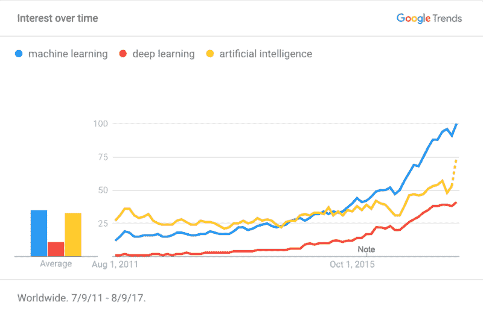
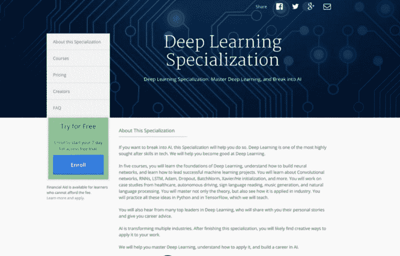

# 六年后，Coursera 的吴恩达带着新的深度学习课程回归

> 原文：<https://www.freecodecamp.org/news/six-years-later-courseras-andrew-ng-returns-with-new-deep-learning-courses-3c41b1e00647/>

2011 年 8 月 15 日，斯坦福大学教授吴恩达上传了一段视频到 YouTube 上，介绍他的免费在线机器学习课程。同一天,《纽约时报》[报道了他的课程](http://www.nytimes.com/2011/08/16/science/16stanford.html)(以及其他两门斯坦福课程)。

他的机器学习课程的受欢迎程度让他和达芙妮·柯勒(另一位斯坦福大学教授)在几个月后创建了 Coursera。

[https://www.youtube.com/embed/e0WKJLovaZg?feature=oembed](https://www.youtube.com/embed/e0WKJLovaZg?feature=oembed)

整整六年后的 2017 年 8 月 15 日，Coursera 上吴恩达深度学习专业[的第一堂课将上线。](http://bit.ly/2wuxj3P)

### 在过去的六年里发生了很多变化

已经有 800 万学习者注册了他的机器学习课程。吴恩达不再全职在 Coursera 工作，但担任董事会联合主席。他于 2014 年 5 月离开 Coursera[加入百度](https://www.class-central.com/report/coursera-co-founder-andrew-ng-to-join-baidu-as-chief-scientist/)。

当安德鲁第一次推出他的机器学习课程时，“深度学习”并不是我们词汇的一部分。但在过去几年中，深度学习在普及和现实世界应用方面出现了爆炸式增长。这可能解释了为什么吴恩达离开 Coursera 加入百度并领导其人工智能实验室。

src: [Google Trends](https://trends.google.com/trends/explore?date=2011-07-09%202017-08-09&q=machine%20learning,deep%20learning,artificial%20intelligence)

如果你有兴趣了解更多关于这些主题的信息，请查看 [**Class Central**](https://www.class-central.com/) 在[人工智能](https://www.class-central.com/subject/ai)、[机器学习](https://www.class-central.com/subject/machine-learning)和[数据科学](https://www.class-central.com/subject/data-science)中列出的数百门免费在线课程，或者阅读[深入学习 15 门免费在线课程](https://medium.freecodecamp.org/dive-into-deep-learning-with-these-23-online-courses-bf247d289cc0)。

### Deeplearning.ai

安德鲁今年早些时候离开百度，从事自己的人工智能项目。在 Medium 上的一篇[帖子中，他宣布他正在从事三个不同的人工智能项目，其中](https://medium.com/@andrewng/deeplearning-ai-announcing-new-deep-learning-courses-on-coursera-43af0a368116) [Deeplearning.ai](https://www.deeplearning.ai/) 是第一个。他将其描述为“一个致力于传播人工智能知识的项目。”

安德鲁的 Coursera [深度学习专业](http://bit.ly/2wuxj3P)将在 deeplearning.ai 而不是[斯坦福大学](https://www.class-central.com/university/stanford)下推出。它还将英伟达列为行业合作伙伴。

### 深度学习专业化

深度学习专业由五门不同的课程组成。这些课程是免费的，但如果你想获得分级作业或获得证书，你需要每月订阅 49 美元。有七天的免费试用期。个别课程是免费的，但您需要单独访问课程页面(您不能从专业化页面注册)。

虽然课程于 8 月 15 日正式开始，但前三门课程的教材已经提供。个别课程可以免费审核，但您需要单独访问课程页面。您不能从专业化页面注册这些课程。点击以下链接，免费单独注册课程:

1.  [神经网络和深度学习](https://www.class-central.com/mooc/9058/coursera-neural-networks-and-deep-learning)
2.  [改进深度神经网络:超参数调整、正则化和优化](https://www.class-central.com/mooc/9058/coursera-neural-networks-and-deep-learning)
3.  [构建机器学习项目](https://www.class-central.com/mooc/9056/coursera-structuring-machine-learning-projects)
4.  [卷积神经网络](http://bit.ly/2fvTDWQ)
5.  [序列模型](http://bit.ly/2vSR6Mf)

专业化是针对那些试图进入人工智能职业生涯的学习者。与他以前使用 Octave(Matlab 的开源替代品)的机器学习课程不同，Andrew 的新专业使用 Python。

> 。 [@AndrewYNg](https://twitter.com/AndrewYNg?ref_src=twsrc%5Etfw) 的深度学习课程使用 [@Coursera](https://twitter.com/coursera?ref_src=twsrc%5Etfw) 托管的 Jupyter 笔记本进行编程作业。
> 
> 代码来自你的浏览器。[pic.twitter.com/0BGfjiQUDY](https://t.co/0BGfjiQUDY)
> 
> — Dhawal Shah (@dhawalhshah) [August 9, 2017](https://twitter.com/dhawalhshah/status/895377929898647552?ref_src=twsrc%5Etfw)