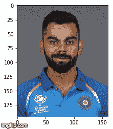
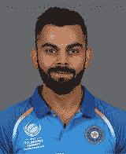
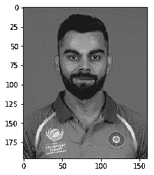
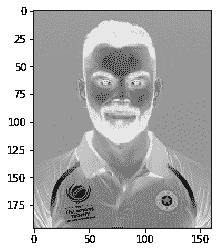
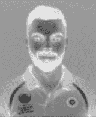
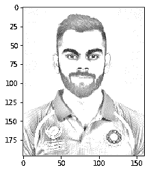
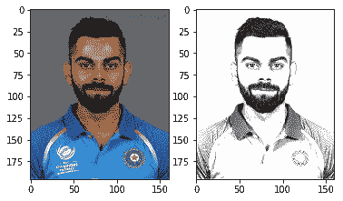
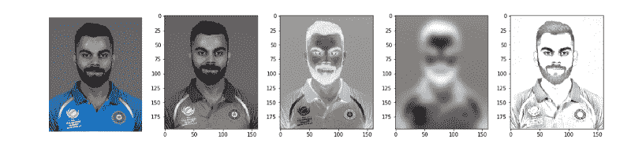
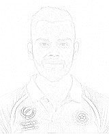

# 如何用 10 行代码将任何图像变成铅笔素描

> 原文：<https://www.freecodecamp.org/news/sketchify-turn-any-image-into-a-pencil-sketch-with-10-lines-of-code-cf67fa4f68ce/>

作者里沙夫·阿加瓦尔

# 如何用 10 行代码将任何图像变成铅笔素描

#### *使用基本计算机视觉和 Python 的 Numpy 库*

我一直对计算机视觉很着迷，尤其是它处理图像的能力。

对 Python 来说，图像基本上是一组数字。因此，我们可以执行各种矩阵操作，以获得一些非常有趣的结果。在这篇文章中，我将讨论如何将一幅图像简化成一个“铅笔”轮廓。

#### 台阶

这个过程非常简单:

1.  将图像灰度化
2.  倒转过来
3.  模糊反转的图像
4.  减淡混合模糊和灰度图像。

我们可以从互联网上挑选任何图像。我会选择印度板球运动员维拉特·科勒的这张照片:



#### **1。加载图像**

```
import imageioimg="http://static.cricinfo.com/db/PICTURES/CMS/263600/263697.20.jpg"start_img = imageio.imread(img)
```



Initial image

您可以看到 Python 如何看待这个带有`shape`属性的图像:

```
start_img.shape(196, 160, 30)
```

这是一个 196x160 大小的三通道图像。

#### **2。灰度**

然后我们把图像变成黑白的。

Numpy 没有任何内置的灰度函数，但是我们可以使用公式轻松地转换图像。你可以在这里了解为什么这个公式正确的[。](https://www.w3.org/Graphics/Color/sRGB)

```
Y= 0.299 R + 0.587 G + 0.114 B
```

所以我们的函数看起来像这样:

```
import numpy as npdef grayscale(rgb): return np.dot(rgb[...,:3], [0.299, 0.587, 0.114])
```

应用灰度:

```
gray_img = grayscale(start_img)
```



Grayscaled Image

#### **3。反转图像**

我们可以简单地通过减去 255 来反转图像，因为灰度图像是 8 位图像或者最多有 256 个色调。

```
inverted_img = 255-gray_img
```



Inverted Image

#### **4。模糊图像**

我们现在模糊反转的图像。通过对反转图像应用[高斯滤波器](https://en.wikipedia.org/wiki/Gaussian_blur)来进行模糊处理。这里的关键是高斯函数或 sigma 的方差。

随着 sigma 的增加，图像变得更加模糊。适马控制变化的程度，从而控制模糊的程度。

```
import scipy.ndimageblur_img = scipy.ndimage.filters.gaussian_filter(inverted_img,sigma=5)
```



More blurring on increasing sigma

#### **5。闪避和合并**

[颜色减淡](https://en.wikipedia.org/wiki/Blend_modes)混合模式通过反转的顶层来划分底层。这将根据顶层的值使底层变亮。我们有模糊的图像，突出了最大胆的边缘。

因为我们所有的图像都是使用 Numpy 读取的，所以所有的矩阵计算都非常快。

```
def dodge(front,back): result=front*255/(255-back)  result[result>255]=255 result[back==255]=255 return result.astype(‘uint8’)
```

```
final_img= dodge(blur_img,gray_img)
```



Final image

就是这样！

#### **6。绘制并保存**

我们可以使用`plt.imgshow`绘制最终图像。注意，我们需要保持参数`cmap`等于`“gray”`。

```
import matplotlib.pyplot as pltplt.imshow(final_img, cmap=”gray”)
```

我们可以使用以下方式保存图像:

```
plt.imsave(‘img2.png’, final_img, cmap=’gray’, vmin=0, vmax=255)
```

#### 决赛成绩



#### 整个代码都在运行



Each stage of the algorithm

在这里，我们没有太多的空间来玩，除了与西格玛参数，而模糊。

随着 sigma 的增加，pic 变得更加清晰，但运行时间也会增加。所以西格玛 5 对我们来说很好。



effect of increasing sigma

#### 精简代码:

我承诺 10 行或更少，所以你去吧:

和往常一样，你可以在我的 [GitHub](https://github.com/rra94/sketchify/tree/master) 上找到完整的详细代码。

PS 这就是我如何创建我的中型 DP 的。如果你喜欢这个博客，展示一些❤️:)

此外，我不拥有这个维拉特的形象。希望他不要介意！