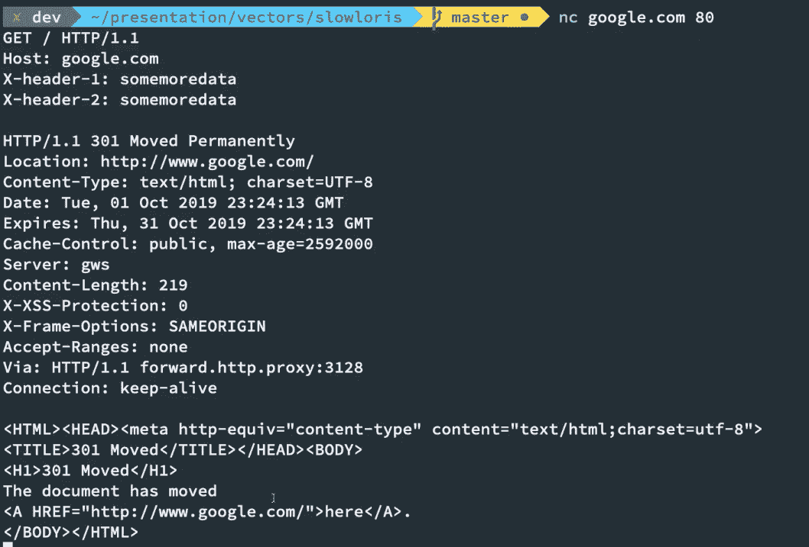
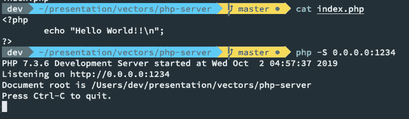
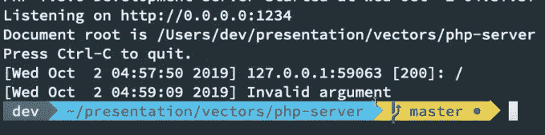

# 在 PHP 服务器上使用 JavaScript 的慢速洛里斯攻击[及其防范！]

> 原文：<https://www.freecodecamp.org/news/slow-loris-attack-using-javascript-on-php-server/>

先别管这个帖子，让我们从这个标题的内容开始吧！这是一篇基于 web 安全的文章，将深入了解 HTTP 如何工作的基础知识。我们还将看到一个简单的攻击，它利用了 HTTP 协议的工作方式。

## 什么是 HTTP？

**HTTP，**超文本传输协议，是网络用于通信的协议。当您使用浏览器时，您的设备使用这种特定的协议向远程服务器发送请求，以从它们那里请求数据。

这基本上就像你对你妈妈说，“嘿，妈妈，我需要吃冰箱里 2 号货架上的东西，你能给我吗？”

你妈妈说，“当然，给你”，然后把那个东西送给你。现在，HTTP 是你和你妈妈交流信息的方式，更像是你用来交流的语言。

## HTTP 如何工作

这里有一个 TL；视频博士如果你是一个视频人。否则，请继续阅读文章:

[https://www.youtube.com/embed/aE75gHVK16A?feature=oembed](https://www.youtube.com/embed/aE75gHVK16A?feature=oembed)

HTTP(第 7 层)建立在 TCP 协议(第 4 层)之上。我们可以使用`nc` (netcat)实用程序向任何运行在 HTTP(通常是端口 80)上的网站打开一个原始的 TCP 套接字。请参见以下示例，了解我们如何使用 netcat 连接到 google.com 的 HTTP 端口 80:



查看我们发送的数据:

```
GET / HTTP/1.1
Host: google.com
X-header-1: somemoredata
X-header-2: somemoredata
<empty line>
```

忽略额外的`X-header-*`标题，它们只是你可以随你的请求一起发送的随机标题。HTTP/1.1 规范中包含的重要头部是`Host`头部。

我们得到的回应是:

```
HTTP/1.1 301 Moved Permanently
Location: http://www.google.com/
Content-Type: text/html; charset=UTF-8
Date: Tue, 01 Oct 2019 23:24:13 GMT
Expires: Thu, 31 Oct 2019 23:24:13 GMT
Cache-Control: public, max-age=2592000
Server: gws
Content-Length: 219
X-XSS-Protection: 0
X-Frame-Options: SAMEORIGIN
Accept-Ranges: none
Via: HTTP/1.1 forward.http.proxy:3128
Connection: keep-alive

<HTML><HEAD><meta http-equiv="content-type" content="text/html;charset=utf-8">
<TITLE>301 Moved</TITLE></HEAD><BODY>
<H1>301 Moved</H1>
The document has moved
<A HREF="http://www.google.com/">here</A>.
</BODY></HTML>
```

因此，HTTP 是一个明文协议，由客户端发送的请求信息和如上所示的响应组成。

## 缓慢的洛里斯攻击

缓慢的洛里斯攻击利用了我可以非常非常缓慢地发出 HTTP 请求的事实。换句话说，我可以向服务器发起一个 HTTP 请求，然后非常缓慢地向服务器发送数据，以便保持连接。同时，它永远不会结束该连接并打开多个这样的连接来耗尽服务器的连接池。

**免责声明** -渗透测试未经事先书面许可，任何不属于您的在线/离线服务都是**非法的**，我对由此造成的任何损害概不负责。**仅将本内容用于教育目的。**

## 慢速洛里斯演示:

[https://www.youtube.com/embed/KUxd7FFDwTM?feature=oembed](https://www.youtube.com/embed/KUxd7FFDwTM?feature=oembed)

这意味着，我可以继续以头的形式向服务器发送额外的数据。现在，我将在我的机器上启动一个简单的 PHP 开发服务器:



我使用一个简单的节点脚本在我的本地服务器上执行我们上面讨论的内容:


你可以在这里找到[使用的节点脚本。](https://gist.github.com/mehulmpt/49eee6cc0e84d6770b904336d0ad7f3e)

一段时间后，你会看到我们的 PHP 服务器实际上崩溃了！



这是因为打开的连接太多了，PHP 无法处理更多的打开的连接(由于内存/硬件的限制)。

现在，这当然可以在本地开发服务器上完美地工作。但是，如果你能找到一个服务器，它没有实现对慢吞吞的攻击的保护，这对他们来说是一个大问题。

## 抵御懒猴的攻击

*   在您的服务器前使用像 Cloudflare 这样的解决方案来防止来自 Cloudflare 网站的 DoS/DDoS
    引用:

> Cloudflare **在开始向源服务器发送任何内容之前缓冲传入的请求**。因此，像 Slowloris 攻击这样的“低而慢”的攻击流量永远不会到达预定目标。了解有关 Cloudflare 的 DDoS 保护如何阻止 slowloris 攻击的更多信息。

*   将特定 IP 地址同时打开的连接数限制在一个较小的数目。这可以使用简单的前端反向代理服务器来实现，如 nginx，使用他们的漏桶算法实现。如何工作，是另一天的事情！
*   增加服务器容量——现在，这可能会减轻小规模攻击，但老实说，攻击者可以而且会很容易地扩大/扩大原始攻击，因为实施这种攻击所需的带宽更少。

## 结论

很多服务器(nginx/apache2 新版本)默认带有 slow loris 攻击保护。但是对于许多内部服务来说，服务器可能容易受到这种简单的攻击。

您可能想要检查您的服务并实现修复。网络安全是一个令人兴奋的领域，我计划在 [codedamn](https://www.youtube.com/codedamn) 上做一个关于它的网络系列。你也可以在[推特](https://twitter.com/mehulmpt)上联系我了解最新消息。在那之前，注意安全！