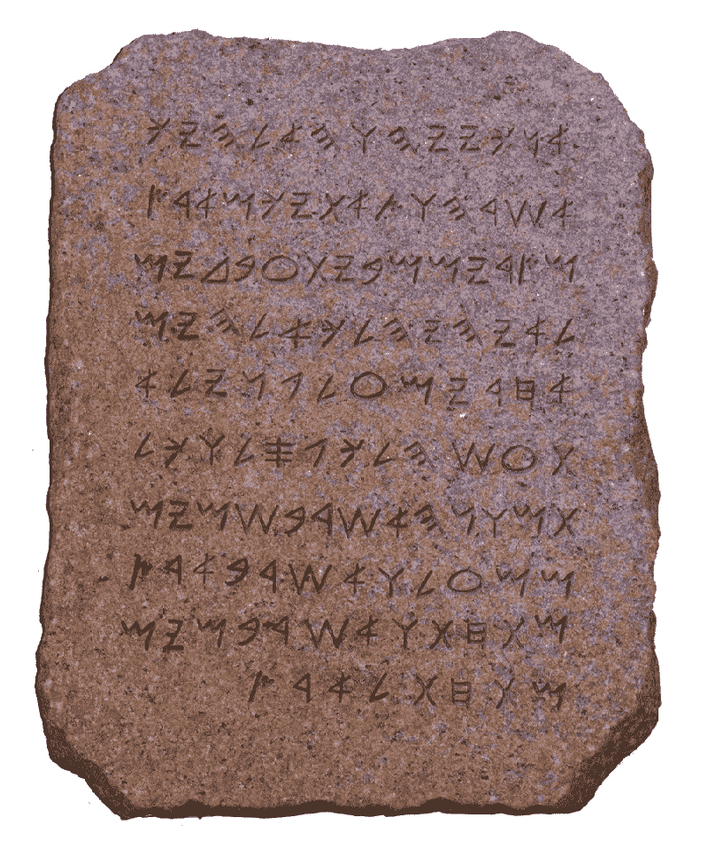
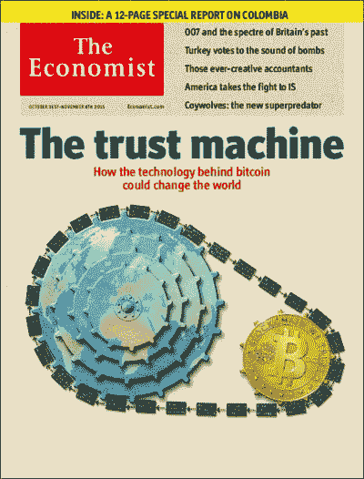
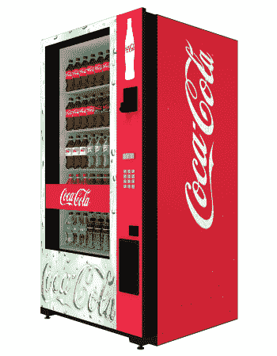
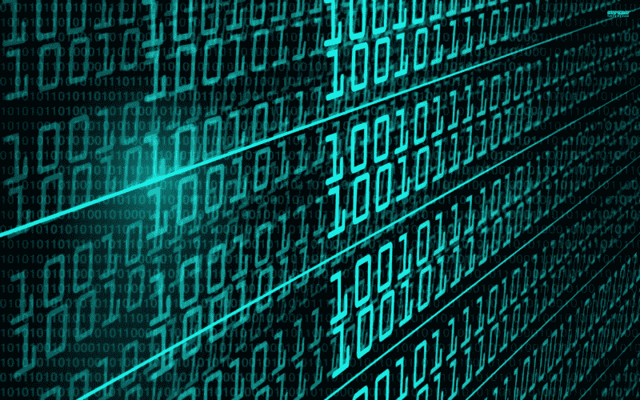

# 傻瓜的智能合同

> 原文：<https://www.freecodecamp.org/news/smart-contracts-for-dummies-a1ba1e0b9575/>

尼克·库斯托迪奥

# 傻瓜的智能合同

#### **如果你仍然不明白智能合约到底是什么…**


好了，你对比特币有所了解(见:[像我五](https://medium.com/@nik5ter/explain-bitcoin-like-im-five-73b4257ac833)一样解释比特币)。你一直在新闻上看到区块链。

但是这个新的 [**以太坊**](https://www.nytimes.com/2017/02/27/business/dealbook/ethereum-alliance-business-banking-security.html) 是什么东西呢？显然，你可以用这种加密货币来建立“智能合约”。听起来不错。那么，呃…他们是什么来着？(剧透:他们没那么聪明。它们不是真正的合同！)

让我们试着得到一个直觉，而不是一个简单的定义。首先，我们将重温*区块链*和“信任”这个词。然后，我们再来谈谈“合同”这个词。理解这两个词是秘诀。

### 第一部分:我们所说的“信任(少)”是什么意思

大多数时候，当我们想到比特币(或以太坊)时，我们的脑海中会出现一个图像，嗯… *硬币*。

这些*到底是不是加密货币*？这不就是重点吗？在我们的头脑中，我们看到物体——数字黄金，或者白银(或者怀疑论者的郁金香)。

因为这些图像很容易理解，我们忘记了一些隐藏在它下面的东西。所以，我说我们应该换一种方式来思考这个问题。

### ***数码石***



真的吗？数字摇滚？实际上，石头很有用。

在英语中我们有这样一句习语:“把它放在石头上”

> “鲍勃，我已经看过合同了。看起来不错。让我们把这刻在石头上！”

> "爱丽丝，别太激动，一切都还没定下来。"

> “这是神。我在这两块石碑上写下了我的十诫。你知道的。以防你开始有什么有趣的想法。”

这个比喻在现代世界仍然有意义，因为在物质(古代)世界，石头有一些有趣的特性:

1.  当你在石头上雕刻某物时，它就有了物理上的 ***终结性和永久性*** 。你不能就这样改变。
2.  如果你以后试图“抹去”一些东西，那就很明显了。你对它所做的任何改变都是透明的，防篡改的(可证明的) 。
3.  这些规则同样适用于所有人。石头是 ***中性*** 。它遵守的是物理定律，而不是人。它不在乎你是强大的国王还是农民——它对每个人都一视同仁。

因为所有这些属性，我们对石头中的*有着相当高的信任度。*

*我的意思是——我们从来不说“让我们在 ***沙*** *设定这个协议”是有原因的*石头是那种我将来可以指向它作为证据的东西。石头等于坚实的证据——不是任何材料都可以！*

*

[The Economist](http://www.economist.com/news/leaders/21677198-technology-behind-bitcoin-could-transform-how-economy-works-trust-machine) agrees!* 

*说到底，一个【区块链】其实就是上面的:*一种材料，通过加密和分散化的特殊混合，具有永久、透明和中立的特性——无论你把它放在什么地方。**

*不管是你给乔送了多少苹果。或者说“我爱珍妮”没关系。当你把它放在区块链上时——它在上*。**

> *在区块链上镶嵌东西就像在石头上镶嵌东西一样。这让信任变得更容易。*

*除了现在我们可以用数字技术来做这件事。这很特别。*

*把区块链想象成一块可以写字的石头(而不是一张钞票)也有助于我们理解它的广阔潜力。这就引出了…合同！*

### *第二部分:我们所指的“合同”*

*“合同”这个词有很多包袱。我们开始思考:法律文件和律师。*

*新闻中使用的直接描述更好一些:那些*自执行*或*自动执行*的事情。不过，这似乎有点熟悉。毕竟，*自动化*或*执行真的没什么新鲜的。**

#### *智能合约的鼻祖*

*以你的好 ol' office [**自动售货机**](https://perma.cc/V6AZ-7V8W) 为例。这是一个“愚蠢”的机器，它做它被告知的事情，自动执行事情。已经几十年了！*

*

Behold, the magical machine that spits out high-fructose sustenance.* 

*假设有一天下午你发现自己在这台机器前。上面写着:**“如果你给我 2.5 美元，然后按下这个按钮，你就会得到一杯健怡可乐。”***

*它实际上可能不会在任何地方说*这些话。但这是这个小小互动的承诺。有人甚至可以称之为一种简单的 [***协议***](http://internetofagreements.com/files/InternetOfAgreements.pdf) *。*(你能猜到这是要去哪里。)**

**你把钱投进去了。按下按钮。转眼间。手里拿着瓶子，两秒钟后你忘记了生活中这件毫无意义的事情，又开始担心那些你忘记做的该死的 TPS 报告。**

**好吧，你没有注意到，但这整个事情实际上是一个小程序(“合同”)，事先编码(“写”)到机器中，当你按下按钮(“签字”)时，它就会运行。类似于:**

```
**`&gt; if money received == $2.50 >     && the button pressed is "Diet Coke"> then release Diet__Coke`**
```

**如你所见，计算机代码是*种*像 ***合同*** 。**

**它在发表声明和宣言。有条款(如果你这样做…那么…)。就像你信任的人一样——它甚至实现了交易的目的！**

**瞧。合同只是代码。但与英语中的“合同”不同，这是人类和机器都能读懂的东西。额外的乐趣！**

#### **好吧，但是…**

**现在你对这个智能合约业务更加困惑了。我们说过，这没什么特别的。事实上，正如自动售货机所展示的，这种代码*就是*已经在我们的日常生活中无处不在。如果智能合约只是“如果…那么”的代码(或者*任何与此相关的*代码)，那么有什么好大惊小怪的呢？什么是真正的*新？***

### **自动售货机 2.0**

****

**一个阳光明媚的日子，你看到街角有一台自动售货机。你从来没见过这个！**

**你走过去看看。这台机器说:“如果你投入 1000 美元，这台机器会给你 5000 美元。”**

**哇哦。组装这台机器的人一定非常富有和慷慨。(或者愚蠢至极……)。不管怎样。1k 换 5k？不用想——这是你随时都会接受的交易！对吗？**

**这就像我们的老式健怡可乐机。同样的逻辑。相同的 if-then 过程。**

**只不过现在赌注不同了。你伸手去掏口袋，但突然，你感到犹豫不决。到底是谁把这台机器组装起来的？如果它吃了你的钱呢？1，000 美元不是一个小数目——你已经存了几个月了。关于健怡可乐你没有三思。但是现在呢？现在你意识到也许自动售货机不是那么简单。**

**你开始考虑信任。**

> **我们怎么知道它有足够的资金吐出承诺的 5000 美元？**

> *****我们怎么知道代码将要*运行*？*****

> *****有什么办法可以公开透明的验证这个代码？*****

### **结论**

**5000 美元的自动售货机是一个极端的、理论上的例子，但它确实暗示了扩大信任的问题。在一个不断扩大的数字世界中，人们可以匿名联系——信任变得很棘手。因为这个原因，我们通常依赖第三方和其他中间人。我们必须这么做。尤其是如果我们要搬运比健怡可乐更有价值的东西。你知道，就像新奇的金融产品。或者说[“价值”和“所有权”这个概念本身](http://nikcustodio.tumblr.com/post/150500263430/why-blockchains-an-eli21)。**

**嗯。如果你能把传统编程的自动化 ***和*** 与*数字石头值得信赖的属性结合起来，那该多好啊。***

**嗯，这正是一个聪明的合同是什么！它只是代码——有一种非常特殊的支持。**

> **请记住，我们以前既有计算又有执行。但是从来没有一个是在(数字)石头上以中立的、可证明的、可信任的方式完成的。**

#### **现实世界怎么样？一些想法。**

****网络游戏:**打击[赌博网站诈骗](http://money.cnn.com/2012/07/31/technology/online-poker-settlement/)。你刚刚掷骰子的概率*实际上是六分之一吗？我们怎么知道他们会付钱呢？那么，为什么不“把代码刻在石头上”并证明它呢？一个活生生的[例子](https://etheroll.com/#tab7)。***

****供应链:**也许[会追踪和核实东西是在哪里以及如何制造的？](https://www.provenance.org/whitepaper)**

****投票:**也许是防篡改的[投票](http://www.govtech.com/blogs/lohrmann-on-cybersecurity/can-blockchain-technology-secure-your-vote.html)过程？**

****去中心化、自主化的公司:**科幻时间。**

**纵观历史，自动化总是应用于*公司的*底层*。*装配线。工厂工人。但是如果一个公司的规则只是一种操作性的*逻辑*——那么是否有可能翻转金字塔，取而代之的是[自动化*顶端*](https://blog.ethereum.org/2014/05/06/daos-dacs-das-and-more-an-incomplete-terminology-guide/) ？**

*这些只是你可以用以太坊的[图灵完整编程语言](https://www.wikiwand.com/simple/Turing_complete)在区块链上编码的几个例子。我们才刚刚开始。如果你梦见它，你也许能编码它。*

*从很多方面来说，这就是整件事令人兴奋的地方。我们有一些猜测，但老实说，我们不知道在未来几年或几十年里会建造什么。*

*我们只知道积木在这里。它对所有人开放。剩下的就看你的了。*

#### ***准备好下兔子洞了吗？***

*   *以太坊入门指南*
*   *[加密令牌:开放网络设计的突破 *(*](https://medium.com/@cdixon/crypto-tokens-a-breakthrough-in-open-network-design-e600975be2ef) *【克里斯·迪克森】**
*   *[智能合约的理念*(尼克·萨伯，1997)*](https://perma.cc/V6AZ-7V8W)*
*   *[硬币的另一面:对加密货币的不同看法](https://medium.com/@nik5ter/the-other-side-of-the-coin-f293b65b1eda?source=linkShare-2d6f142ff3cc-1513820863)*