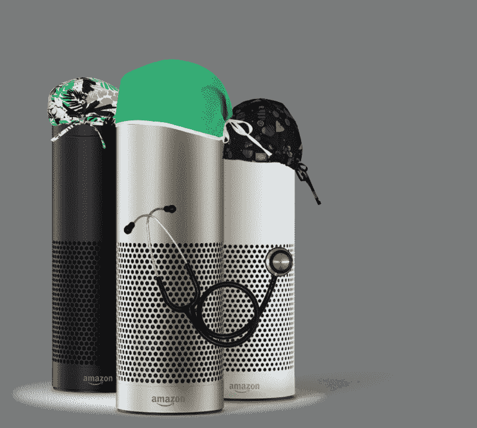

# 智能扬声器和人工智能会给你的医生带来超能力

> 原文：<https://www.freecodecamp.org/news/smart-speakers-and-a-i-will-give-your-physician-superpowers-38c17bc2f133/>

凯文·希尔

# 智能扬声器和人工智能会给你的医生带来超能力

作为一名混合医师/工程师，我花了很多时间思考新平台如何赋予医生权力。

我对智能扬声器的潜力以及人工智能和自然语言处理的进步感到特别兴奋(也看着你，[区块链](https://www.forbes.com/sites/bernardmarr/2017/11/29/this-is-why-blockchains-will-transform-healthcare/#749ff171ebe3))。总的来说，我看好对话代理，之前我制作了一个由沃森驱动的 iOS 聊天机器人，[模拟了一个人类放射学家](https://www.healthline.com/health-news/artificial-intelligence-car-radiology)。聊天机器人很酷也很有用，但是声音——那可能是**的魔法**。

感觉到这种潜力，我决定和我信任的柯基蹲下来，喝一杯咖啡，开始制作我想在自己的临床实践中使用的酷语音工具。这次经历让我更加兴奋。

在本文中，我将综合我的发现，展示一些有趣的演示视频，并解释为什么智能扬声器代表了医疗保健领域的一项变革性技术。

为什么关心医疗创新的人应该开始考虑智能音箱？嗯…

### 智能扬声器极大地增强了外科医生的能力

想象一下你是一名外科医生。你小心翼翼地擦洗双手，经历漫长而复杂的手术准备过程，有条不紊地戴上无菌手套，穿上手术衣，手拿手术刀，腹部暴露在手术台上，走进手术室。

你已经进入了不育的世界。你现在不能检查你的手机，这很糟糕。更重要的是，你不能再使用计算器，查阅医学参考资料，检查病人的记录，草草记下笔记——你甚至不能*谷歌*东西。

因此，智能扬声器为所有外科医生和程序医生提供了巨大的价值:**他们将现代技术还给他们**。许多重要的应用可以围绕无菌需求而构建，从允许医生在手术停工期间口述文书工作的软件到这个简单(但有用)的测量工具:

我正在制造的工具使用声音来增强不育者的能力。智能扬声器允许外科医生快速确定特定支架或其他设备是否适合特定导管。使用导管部署了数百个设备，记住什么适合什么变得不可能。目前的工作流程包括不断要求支持人员检查参考资料…这是一个尴尬而痛苦的电话游戏。

作为一个主要无菌需求的案例研究，考虑确定特定器械是否可用的工作流程(例如，特定尺寸的支架)。

外科医生说，“嘿…我们有 5 毫米的支架吗？”然后，一名人类助手离开房间，走一段距离到一个存储区，在成堆的盒子中翻找支架。宝贵的几分钟后，他们回来报告他们的发现。

这是非常低效的，允许外科医生快速查询库存的语音应用程序将会改变游戏规则。当这让你赚了 10 亿美元时，请考虑给我一点佣金。

### 智能扬声器有助于眼神交流和患者沟通

接下来，想象你是一名在繁忙的急诊室里的医生。午饭前你要见 20 个病人，见完病人后，你要完成堆积如山的文件记录你的发现。

这种记录通常发生在下午 5-8 点，因为你错过了与妻子的晚餐预约，并努力记住第三位咳嗽患者的详细信息。你也应该和你的柯基一起玩捡球游戏，但是你错过了。

He is a good boy and he deserves fetch. Shame on you.

这些时间压力使得医生们埋头于电脑屏幕，而他们本应专注于他们的病人，进行眼神交流，并建立对医患关系至关重要的联系。病人们开始抓狂了:

智能音箱解决了这个问题。它们允许医生在临床诊疗过程中实时记录数据，同时**继续与患者**进行眼神交流。这是巨大的。它不仅提高了数据的准确性(您不必在以后记住它)，还创造了更好的患者体验。

这也创造了更好的医生体验:我们成为医生不是为了通过文件的束缚，而是为了照顾人们，提供优秀的、人性化的护理。每个人都赢了。

### 智能扬声器允许零摩擦访问高质量的信息

摩擦对忙碌的医生来说是毁灭性的。当你要负责 40 个医院病人，时间延迟可能是致命的，多点击一次或打开一个程序就会变得令人抓狂。

因此，医疗保健非常重视无缝访问即时信息。当然，你*可以*花 3 分钟查找肺结节管理的最新建议，但是如果你能简单地“问房间”并在 5 秒钟内得到答案，那就**好得多了。**

这一逻辑启发我构建了一个放射科助手，帮助放射科医生(我的专业)快速访问有用的信息:

这个工具允许放射科医生快速访问重要的，但很难记住的，经常查找的信息。它让他们只需“询问房间”就能在瞬间完成

超高效的信息检索在医疗紧急情况下尤其有价值。

想象一下心脏骤停，一名重症患者接受胸部按压和电击来重启心脏——使用智能手机会很尴尬，而且可能不安全，但你可以很容易地咨询 Alexa。她可能会从医疗记录中检索关键信息，确保胸外按压的最佳时机，协调分布在医院各处的大型团队，以及做许多其他有用的事情。

零摩擦信息检索也有利于使用更高质量的信息。试着问问你的医生，你在机场接受了多少人体扫描仪的辐射，他们很可能会用困惑的笼统回答。

但是想象一下，如果他们可以简单地“询问房间”并在瞬间得到更好的答案:

人类的大脑是不完美的，语音工具有助于推动医生获得更好的信息和提供更好的护理。他们让事情变得简单。

### 结论

嘿，工程师和医疗保健创新者们:我鼓励你们思考如何利用这个平台来建造一些帮助人们的又酷又重要的东西。如果你想知道我是如何开发语音应用的，请看这里的实现细节。

如果你对一个项目有想法，或者想从医生的角度了解科技领域的任何事情，请随时联系 Twitter 或 T2 LinkedIn。感谢阅读！

如果你喜欢这篇文章，认为演示视频很酷，或者只是欣赏我的狗，请点击“鼓掌”按钮和/或分享…这很有帮助！谢了。—凯文