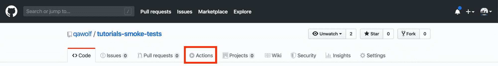
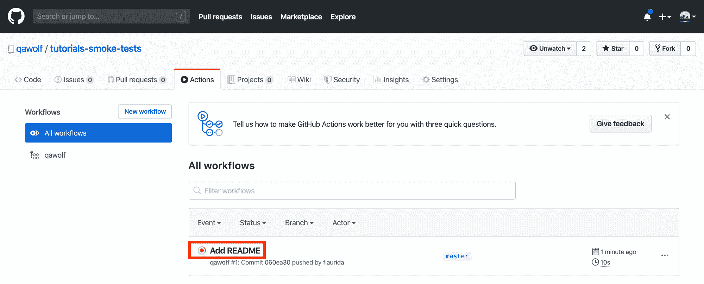
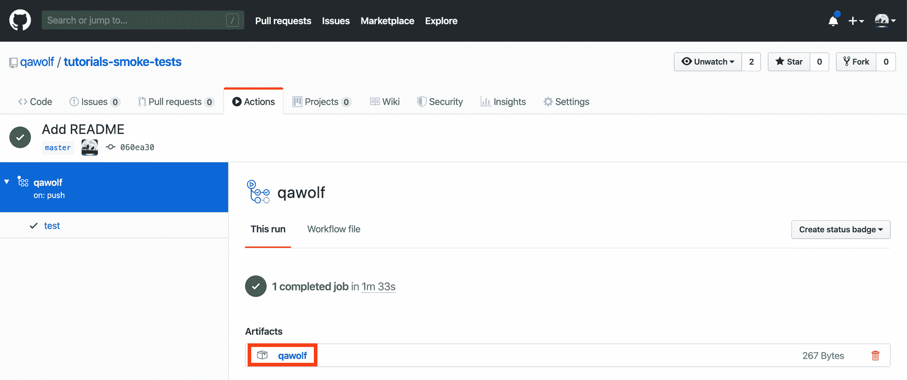
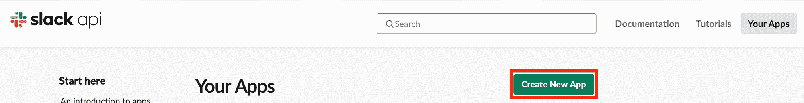
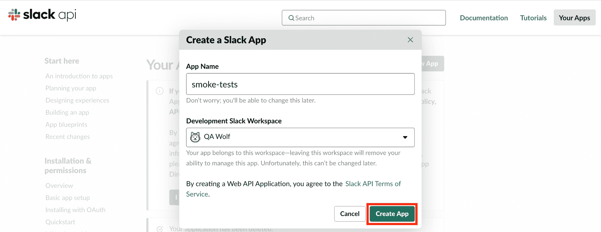
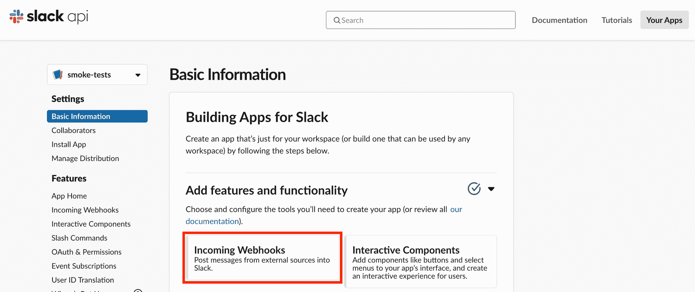
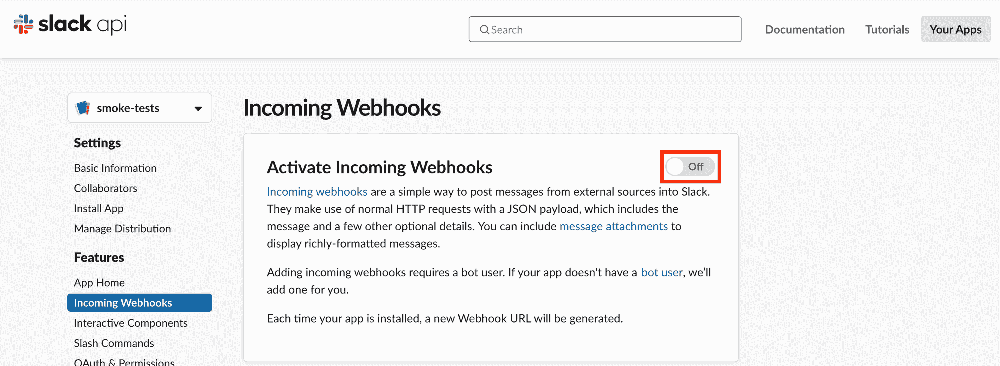
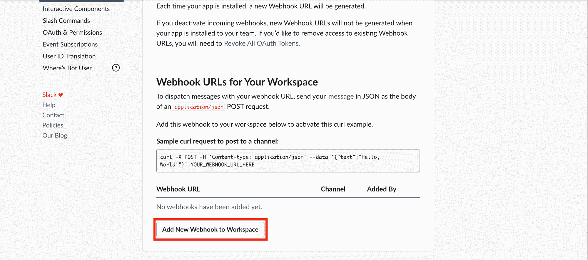
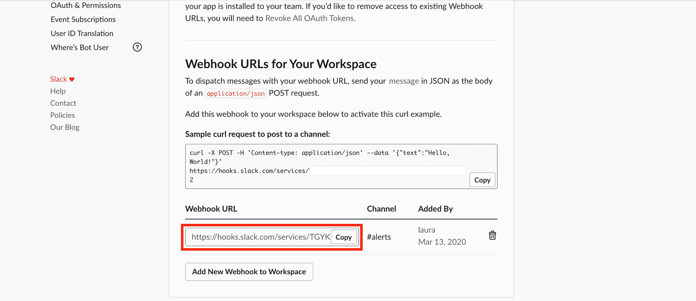

# 什么是烟雾测试？用例子解释构建验证测试

> 原文：<https://www.freecodecamp.org/news/smoke-testing/>

这听起来可能很熟悉:有人将代码推向生产，现在一个关键特性被破坏了。你如何防止将来发生这种情况？

[https://giphy.com/embed/143vPc6b08locw](https://giphy.com/embed/143vPc6b08locw)

[通过 GIPHY](https://giphy.com/gifs/fail-code-boat-143vPc6b08locw)

在本教程中，您将了解烟雾测试以及它如何帮助捕捉错误。然后，您将按照计划对 web 应用程序进行冒烟测试，并在测试失败时发送警报。我们开始吧！

# 目录

1.  [什么是烟尘测试？](#what-is-smoke-testing)
2.  你为什么要在乎？
3.  [设置您的项目](#set-up-your-project)
4.  [创建冒烟测试](#create-a-smoke-test)
5.  [审查测试代码](#review-test-code)
6.  [在本地运行您的测试](#run-your-test-locally)
7.  [在 GitHub 动作中运行测试](#run-tests-in-github-actions)
8.  [设置时差提醒](#set-up-alerts-with-slack)
9.  [结论](#conclusion)

# 1.什么是烟雾测试？

术语“冒烟测试”起源于硬件维修。一个设备被打开，如果它着火，将无法通过烟雾测试。？冒烟测试有时被称为“构建验证测试”。

当应用于 web 应用程序时，冒烟测试验证最重要的功能正在工作。例如，网飞的烟雾测试可能包括登录和播放视频。

按照设计，冒烟测试不会覆盖所有排列和边缘情况。相反，他们会检查您的应用程序是否有问题，否则额外的测试将是浪费时间。

# 2.你为什么要在乎？

相对于创建冒烟测试所需的努力，冒烟测试提供了很多价值。[根据微软](https://docs.microsoft.com/en-us/previous-versions/ms182613(v=vs.80))的说法，冒烟测试是代码评审之后“识别和修复软件缺陷的最具成本效益的方法”。

[https://giphy.com/embed/l3V0wpHLf2qOEwegE](https://giphy.com/embed/l3V0wpHLf2qOEwegE)

[通过 GIPHY](https://giphy.com/gifs/chuber-possum-opossum-awesome-l3V0wpHLf2qOEwegE)

只需对登录等关键功能进行一些测试，就能显著提高质量。测试用户最常做的事情有助于确保应用程序的主要用例得到支持。

冒烟测试也给你的团队发布新代码的信心。对代码库的更改通常会产生意想不到的未知后果。冒烟测试提供了额外的安心，当您发布这个令人敬畏的新特性时，您的应用程序不会崩溃。

如果您在产品上运行冒烟测试，您还可以捕获早期测试遗漏的 bug。即使是环境之间的微小差异，如试运行和生产，也会导致问题。冒烟测试可以在客户之前发现这些问题。

简而言之，冒烟测试为您提供了针对糟糕用户体验的又一层保护。平稳运行的应用程序有助于您的团队、公司和客户取得更大的成功。 **✨**

# 3.设置您的项目

现在我们已经了解了什么是烟雾测试，让我们建立一个烟雾测试管道！

[https://giphy.com/embed/Q6p2n7oHvEjok](https://giphy.com/embed/Q6p2n7oHvEjok)

[通过 GIPHY](https://giphy.com/gifs/dog-tower-blocks-Q6p2n7oHvEjok)

本教程假设你[了解命令行](https://guide.freecodecamp.org/linux/the-command-prompt)，[安装了 Node.js 和`npm`，](https://docs.npmjs.com/downloading-and-installing-node-js-and-npm)[了解 JavaScript](https://guide.freecodecamp.org/javascript/additional-javascript-resources) 和 [Git](https://guide.freecodecamp.org/git) 的基础知识。

您可以在现有项目中设置测试，或者创建一个新项目。要创建新项目，请在命令行中运行以下命令。

```
mkdir smoke_tests
cd smoke_tests
```

如果您还没有初始化您的项目，那么您可以安装 [Node.js](https://nodejs.org/en) 包。

```
npm init -y
```

现在让我们安装创建冒烟测试所需的工具。本教程将在一个 web 应用程序上创建[剧作家](https://github.com/microsoft/playwright)和[笑话](https://jestjs.io)测试。剧作家是微软为自动化 [Chromium](https://www.chromium.org/Home) 、 [Firefox](https://www.mozilla.org/en-US/firefox) 和 [WebKit](https://webkit.org) 浏览器而构建的库。Jest 是一个创建和运行 JavaScript 测试的框架。

为了快速创建和运行我们的测试，我们将使用我帮助维护的开源 QA Wolf 库。QA Wolf 将您的浏览器动作转换为剧作家/笑话测试代码。它还在 CI 提供者中运行您的测试，如 [GitHub Actions](https://github.com/features/actions) 。

如果您喜欢使用另一个测试框架，您仍然可以按照本教程在 CI 中运行您的测试并设置警报。

要为冒烟测试设置项目，请在项目目录中运行以下命令。

```
npm init qawolf
```

系统将提示您指定保存测试的目录。按 Enter 键使用默认目录`.qawolf`，或者键入不同的名称。

```
? rootDir: Directory to create tests in (.qawolf)
```

然后，您将在命令行中看到一个注释，指示您的测试是否将使用 [TypeScript](https://www.typescriptlang.org/) 。我们的示例项目没有“tsconfig.json”文件，所以我们的测试不会使用 TypeScript。

```
TypeScript ✖️ tsconfig.json not found
```

最后一步是选择您的配置项提供商。本教程将使用 GitHub 操作，但是如果您愿意，您可以选择另一个提供者。在命令行中选择您的 CI 提供程序，然后按 Enter。

```
? Choose CI Provider (Use arrow keys)
  Azure DevOps 
  Bitbucket Pipelines 
  CircleCI 
❯ GitHub Actions 
  GitLab CI/CD 
  Jenkins 
  Skip CI setup 
```

然后将安装冒烟测试所需的包(剧作家、笑话和 QA 狼)。

还将在您的项目中创建两个文件。第一个是在 CI 中运行测试的工作流文件。因为我们选择了 GitHub Actions，所以这个文件保存在”。github/workflows/qawolf.yml”。我们将在稍后讨论这个文件[。](#run-tests-in-github-actions)

还有一个在“qawolf.config.js”创建的配置文件。我们不需要编辑这个文件，但是你可以[在这里](https://docs.qawolf.com/docs/configure_qa_wolf)了解更多。

依赖项安装完成后，检查安装是否成功。

```
npx qawolf howl
```

# 4.创建冒烟测试

既然我们的项目已经建立，让我们创建我们的第一个冒烟测试。在本教程中，我们将在 [TodoMVC](http://todomvc.com/examples/react) 上创建一个冒烟测试，这是一个简单的应用程序。具体来说，我们将测试我们可以

1.  创建一个待办事项，
2.  完成它，然后
3.  清除已完成的待办事项。

为了创建我们的测试，我们将使用 [`npx qawolf create`命令](https://docs.qawolf.com/docs/api/cli#npx-qawolf-create-url-name)。这个命令接受应用程序的 URL 和一个可选的测试名称。运行这个命令将打开一个 [Chromium](https://www.chromium.org/Home) 浏览器，在那里你的动作将被转换成剧作家/笑话代码。

在命令行中，运行以下命令。您可以选择用不同的 URL 替换 [`http://todomvc.com/examples/react`](http://todomvc.com/examples/react) ，用不同的名称替换`myFirstTest`。

```
npx qawolf create http://todomvc.com/examples/react myFirstTest
```

打开您的代码编辑器并找到您的测试文件(".qawolf/myFirstTest.test.js)。这是您使用浏览器时创建测试代码的地方。

一旦 Chromium 浏览器向 TodoMVC 打开，采取以下行动。

1.  单击 todo 输入来聚焦它
2.  键入“创建测试！”
3.  按回车键
4.  单击以完成待办事项
5.  点击“清除已完成”以清除已完成的待办事项
6.  在命令行中，高亮显示`? Save and Exit`并按回车键保存测试

下面的视频提供了一个例子。

[https://www.youtube.com/embed/KP4tpilrOOE?feature=oembed](https://www.youtube.com/embed/KP4tpilrOOE?feature=oembed)

Create a smoke test

# 5.审查测试代码

现在让我们看看我们的测试代码。在代码编辑器中，打开测试文件(“。qawolf/myFirstTest.test.js)。

在我们测试的开始，我们导入`qawolf`。我们还从"中导入元素`selectors`。QA wolf/selectors/my first test . JSON”，我们稍后将对此进行讨论。

```
const qawolf = require("qawolf");
const selectors = require("./selectors/myFirstTest.json");
```

测试然后启动一个[剧作家`browser`](https://github.com/microsoft/playwright/blob/master/docs/api.md#class-browser) ，在我们的例子中是一个 Chromium 浏览器。它创建了一个新的[剧作家`browserContext`](https://github.com/microsoft/playwright/blob/master/docs/api.md#class-browsercontext) ，这是一个隐姓埋名的浏览器会话。QA Wolf 可以访问`context`,因此它可以检测你的行为。最后，创建一个新的[剧作家`page`](https://github.com/microsoft/playwright/blob/master/docs/api.md#class-page) ，在浏览器中打开一个新标签。

```
let browser;
let page;

beforeAll(async () => {
  browser = await qawolf.launch();
  const context = await browser.newContext();
  await qawolf.register(context);
  page = await context.newPage();
});
```

测试本身包含在一个具有您指定名称的 [Jest `test`块](https://jestjs.io/docs/en/api#testname-fn-timeout)中。测试首先导航到 TodoMVC URL。然后，它会检查您采取的操作:创建一个待办事项，完成它，并清除已完成的待办事项。每个动作都使用剧作家的`page`方法之一，比如`click`和`type`。

```
test('myFirstTest', async () => {
  await page.goto("http://todomvc.com/examples/react");
  await page.click(selectors["0_what_needs_to_b_input"]);
  await page.type(selectors["1_what_needs_to_b_input"], "create test!");
  await page.press(selectors["2_what_needs_to_b_input"], "Enter");
  await page.click(selectors["3_input"]);
  await page.click(selectors["4_button"]);
});
```

传递给每个`page`方法的第一个参数是一个 [HTML](https://developer.mozilla.org/en-US/docs/Web/HTML) 选择器。这个选择器告诉剧作家应该与什么元素交互，比如 todo 输入或“清除已完成”按钮。这些选择器是从。QA wolf/selectors/myfirstest . JSON "文件，如下所示。

```
{
 "0_what_needs_to_b_input": "html=<div data-reactid=\".0\" qaw_innertext=\"todos\"><header class=\"header\" data-reactid=\".0.0\" qaw_innertext=\"todos\"><input class=\"new-todo\" placeholder=\"What needs to be done?\" value=\"\" data-reactid=\".0.0.1\" /></header></div>",
// ...
} 
```

您与之交互的元素的每个属性，以及它的两个[祖先](https://developer.mozilla.org/en-US/docs/Web/API/Node/parentElement)的属性，都存储在这个文件中。当您运行测试时，它会尽最大努力找到与指定 HTML 足够匹配的内容。通过不依赖单一属性，您的测试对前端代码的变化更加健壮。

剧作家`page`的方法[也支持](https://github.com/microsoft/playwright/blob/master/docs/api.md#working-with-selectors)其他类型的选择器，比如 [CSS 选择器](https://developer.mozilla.org/en-US/docs/Web/CSS/CSS_Selectors)或者文本选择器。例如，你可以用 CSS 选择器`'.clear-completed'`替换最后一步中的`selectors["4_button"]`。

```
test('myFirstTest', async () => {
  // ...
  // change this
  await page.click(selectors["4_button"]);
  // to this (CSS selector)
  await page.click('.clear-completed');
});
```

您可以有选择地配置 QA Wolf，尽可能在生成的代码中使用类似于`data-qa`的测试属性。参见[本指南](https://docs.qawolf.com/docs/use_custom_selectors)了解更多信息。

测试运行结束后，QA Wolf 会停止录制浏览器的任何视频(如果适用)。浏览器也关闭了。

```
afterAll(async () => {
  await qawolf.stopVideos();
  await browser.close();
});
```

将所有这些放在一起，完整的测试代码如下所示。

```
const qawolf = require("qawolf");
const selectors = require("./selectors/myFirstTest.json");

let browser;
let page;

beforeAll(async () => {
  browser = await qawolf.launch();
  const context = await browser.newContext();
  await qawolf.register(context);
  page = await context.newPage();
});

afterAll(async () => {
  await qawolf.stopVideos();
  await browser.close();
});

test("myFirstTest", async () => {
  await page.goto("http://todomvc.com/examples/react");
  await page.click(selectors["0_what_needs_to_b_input"]);
  await page.type(selectors["1_what_needs_to_b_input"], "create test!");
  await page.press(selectors["2_what_needs_to_b_input"], "Enter");
  await page.click(selectors["3_input"]);
  await page.click(selectors["4_button"]);
});
```

如果测试无法完成工作流，它将失败。欢迎您编辑您的测试代码，比如通过添加断言。我们不会在本教程中深入探讨，但如果你想了解更多，这里有一个指南。

现在我们已经理解了我们的测试代码，让我们运行我们的测试吧！

# 6.在本地运行您的测试

让我们在本地运行我们的测试，以确保它的工作。在命令行中，运行以下命令，用 Jest 运行您的测试。

```
npx qawolf test
```

您应该看到 Chromium 浏览器打开并运行测试。您的测试将尽可能快地运行，所以如果它运行得很快，不要感到惊讶。

下面的视频提供了一个例子。

[https://www.youtube.com/embed/JRcR-d6Yfdw?feature=oembed](https://www.youtube.com/embed/JRcR-d6Yfdw?feature=oembed)

# 7.在 GitHub 操作中运行测试

在本教程中，我们将按计划运行测试，比如每小时一次。按计划运行测试可以确保您的应用程序持续工作。它还可以暴露只是偶尔出现的周期性问题或“碎片”。

在本教程中，我们使用 [GitHub 动作](https://github.com/features/actions)来运行我们的测试。GitHub Actions 是一个自动化软件工作流的工具，例如部署 web 服务或测试应用程序。

## 查看工作流文件

当我们[建立我们的项目](#set-up-your-project)时，一个[的 YAML 文件](https://help.github.com/en/actions/reference/workflow-syntax-for-github-actions)被调用。github/workflows/qawolf.yml”已创建。我们将首先简要地浏览一下这个文件的不同部分。然后，我们将更新它，以便我们的测试按计划运行。

工作流文件的第一行命名为我们的工作流。这是将在 GitHub 操作中显示的名称，如果您愿意，您可以更改它。

```
name: qawolf
```

然后， [`on`键](https://www.freecodecamp.org/news/p/ad7d7d20-5b22-4ae2-84a1-07b00eb0cdb3/The%20first%20part%20of%20the%20workflow%20file%20names%20our%20workflow%20name:%20qawolf.%20This%20is%20the%20name%20that%20will%20show%20up%20in%20GitHub%20Actions,%20and%20you%20can%20change%20it%20if%20you%20like.)指定什么事件应该触发我们的测试运行。默认情况下，只要有人推送到任何分支，您的测试就会运行。我们将很快对此进行编辑，以便按计划运行我们的测试。

```
on:
  push:
    # test every branch
    # edit below if you only want certain branches tested
    branches: "*"
  # schedule:
  #   # test on schedule using cron syntax
  #   - cron: "0 * * * *" # every hour
```

文件的其余部分定义了 GitHub 操作在运行时应该做什么。GitHub Actions 将运行 [`jobs`键](https://help.github.com/en/actions/reference/workflow-syntax-for-github-actions#jobs)下列出的任何作业。在我们的例子中，我们只有一个运行测试的作业。

具体来说，我们的`test`任务安装依赖项，检查我们的代码，并运行我们的测试命令`npx qawolf test`。测试运行后，控制台日志和视频等调试工件被保存。

```
jobs:
  test:
    runs-on: ubuntu-18.04

    steps:
      - name: Install dependencies
        run: |
          sudo apt update
          # chromium dependencies
          sudo apt-get install libgbm1
          # webkit dependencies
          sudo apt-get install libwoff1 libopus0 libwebp6 libwebpdemux2 libenchant1c2a libgudev-1.0-0 libsecret-1-0 libhyphen0 libgdk-pixbuf2.0-0 libegl1 libgles2 libevent-2.1-6 libnotify4 libvpx5 libxslt1.1

      - uses: actions/checkout@v2

      - uses: actions/setup-node@v1

      - uses: actions/cache@v1
        with:
          path: ~/.npm
          key: ${{ runner.os }}-node-${{ hashFiles('**/package-lock.json') }}
          restore-keys: |
            ${{ runner.os }}-node-

      - run: npm install

      # - name: Start local server
      #   run: npm run start & npx wait-on http://localhost:3000

      - run: npx qawolf test --headless
        env:
          # configure tests with environment variables
          QAW_ARTIFACT_PATH: ${{ github.workspace }}/artifacts
          # you can also use GitHub secrets for environment variables
          # https://help.github.com/en/actions/automating-your-workflow-with-github-actions/creating-and-using-encrypted-secrets
          # LOGIN_PASSWORD: ${{ secrets.PASSWORD }}

      - name: Upload Artifacts
        if: always()
        uses: actions/upload-artifact@master
        with:
          name: qawolf
          path: ${{ github.workspace }}/artifacts
```

## 在 GitHub 操作中运行测试

现在我们对工作流文件有了更好的理解，让我们在 GitHub Actions 中运行它。如果您还没有，为您的项目创建一个 Git 存储库。确保忽略您的[中的`node_modules/`。gitignore”文件](https://guide.freecodecamp.org/git/gitignore//)。

```
git init
git add .
git commit -m "Initial commit"
```

确保您已经在 GitHub 上为您的项目创建了一个资源库。然后把你的代码推送到 GitHub。

```
git remote add origin YOUR_REPOSITORY_URL
git push -u origin master
```

请看[这个 GitHub 库](https://github.com/qawolf/tutorials-smoke-tests)的例子。

现在转到您的 GitHub 存储库，点击“动作”选项卡，它在“拉请求”选项卡的旁边。



GitHub Actions tab in repository

您将看到您的测试正在运行。这是因为我们的工作流文件告诉 GitHub 无论何时任何人进入任何分支都要运行我们的测试。单击工作流运行以查看详细信息。请注意，该名称将根据您的提交消息而有所不同。



GitHub Actions workflows

测试运行后，您应该会看到一个绿色的复选标记，指示工作流成功。您还应该在“工件”下看到一个下载工件(视频和日志)的链接。点击这个链接来下载测试工件。



Download artifacts in GitHub Actions

每个测试都用一个文件夹来组织工件。在我们的示例中，我们只有一个名为“myFirstTest.test.js”的测试。打开此文件夹以查看文件“logs_0_${timestamp}中的浏览器日志。txt”和一个视频“video_0_${timestamp}.mp4”。文件名中的`0`是指页面索引。如果你的测试涉及到不止一个页面，那么每个额外的页面都会有相应的日志和视频。

现在，让我们更新我们的工作流文件，以便按照计划运行我们的测试。在”。github/workflows/qawolf.yml”文件，第 7-9 行的注释。

```
name: qawolf
on:
  push:
    # test every branch
    # edit below if you only want certain branches tested
    branches: "*"
  schedule:
    # test on schedule using cron syntax
    - cron: "0 * * * *" # every hour
```

这几行告诉 GitHub 按照使用 [cron 语法](https://crontab.guru)指定的时间表运行测试。默认值为`"0 * * * *"`，表示每小时整点运行。如果您想使用不同的时间间隔，请更新此值。

我们将改变我们的工作流文件的另一件事。GitHub Actions 对工件有存储限制，所以我们不想每次都上传。相反，我们只会在测试失败时上传日志和视频。将第 51 行从`if: always()`更新为`if: failure()`。

```
# ...
      - name: Upload Artifacts
        if: failure()
        uses: actions/upload-artifact@master
        with:
          name: qawolf
          path: ${{ github.workspace }}/artifacts 
```

提交您的更改并将它们推送到 GitHub。

```
git add .
git commit -m "Run tests on a schedule"
git push
```

现在你的冒烟测试将在 GitHub Actions 上每小时运行一次！

# 8.设置时差提醒

我们管道的最后一部分是一个警报系统，当我们的测试失败时，它会让我们知道。在本教程中，我们使用 [Slack](https://slack.com) ，因为它有一个自由计划。你也可以使用类似于 [PagerDuty](https://www.pagerduty.com) 的服务，它会有一个类似的设置过程。

[https://giphy.com/embed/Tdpbuz8KP0EpQfJR3T](https://giphy.com/embed/Tdpbuz8KP0EpQfJR3T)

[通过 GIPHY](https://giphy.com/gifs/memecandy-Tdpbuz8KP0EpQfJR3T)

如果您还没有 Slack 账户和工作空间，[现在就创建它们](https://slack.com/create#email)。

## 创建松弛的网钩

我们现在将创建一个 Slack webhook，这是一个允许我们以编程方式发送 Slack 消息的 URL。当我们的测试失败时，我们将向这个 URL 发出一个 [`POST`请求](https://developer.mozilla.org/en-US/docs/Web/HTTP/Methods/POST)。

首先，我们需要创建一个 Slack 应用程序，它将负责发送我们的警报消息。从访问 [Slack API 网站](https://api.slack.com/apps)开始。右上角是一个绿色按钮“创建新应用程序”。



Create new Slack app

点击此按钮，系统会提示您命名 Slack 应用程序并选择一个工作空间。在我们的例子中，我们称我们的应用程序为“冒烟测试”。填写完表格后，点击绿色的“创建应用程序”按钮。



Name Slack app and choose workspace

你应该会被重定向到你的应用在 Slack 的页面。确保您位于“设置”下的“基本信息”页面。在“添加特性和功能”下，有一个“传入网页挂钩”的链接。点击此链接。



Incoming Webhooks for Slack app

在 Incoming Webhooks 页面上，单击开关打开 incoming webhooks。



Active Incoming Webhooks

然后，您将能够在页面底部看到“向工作区添加新的 Webhook”按钮。点击此按钮添加新的网页挂钩。当我们的测试失败时，我们将使用这个 webhook 发送一个 Slack 消息。



Add new webhook to Slack workspace

然后，系统会提示您选择发布消息的渠道。在我们的示例中，我们选择“alerts”通道。选择频道后，点击绿色的“允许”按钮。


Choose channel for alerts and grant permission

您将被重定向到 webhooks 页面。在“工作区的 webhook URL”下，您现在应该可以看到您的 web hook URL。



View webhook URL in Slack

要测试你的 webhook，复制“样本 curl 请求发布到一个频道”下的代码。它看起来会像下面这样。

```
curl -X POST -H 'Content-type: application/json' --data '{"text":"Hello, World!"}' https://hooks.slack.com/services/SECRET
```

将它粘贴到命令行中，然后按 Enter 键。你会看到信息“你好，世界！”发布到您指定的频道。

## 测试失败时发送警报

现在我们有了 Slack webhook，我们需要更新 GitHub Actions 工作流文件。我们将添加一个步骤，在测试失败时向我们的 webhook 发出一个`POST`请求。

我们不会将我们的 webhook URL 直接粘贴到我们的工作流文件中，而是将它添加到我们的[存储库 secrets](https://help.github.com/en/actions/configuring-and-managing-workflows/creating-and-storing-encrypted-secrets) 中。机密是存储敏感信息的加密环境变量。保持我们的 webhook URL 的秘密可以防止其他人看到它，并可能利用它来作恶。**？**

在您的存储库设置下添加新密码。调用您的秘密`SLACK_WEBHOOK_URL`，并将其值设置为您的 Slack webhook URL。下面的视频提供了一个例子。

[https://www.youtube.com/embed/urhpqJgpxGY?feature=oembed](https://www.youtube.com/embed/urhpqJgpxGY?feature=oembed)

Add secret to GitHub repository

现在让我们更新我们的工作流文件。“在底部。github/workflows/qawolf.yml "文件中，添加以下几行。这几行告诉 GitHub 在测试失败时向 Slack webhook 发出一个`POST`请求。我们将传递给`"text"`的值从“Hello，World！”到“冒烟测试失败！”，但是你可以使用任何你喜欢的信息。

注意，我们没有直接使用 Slack webhook URL 的值，而是用`${{ secrets.SLACK_WEBHOOK_URL }}`替换它。

```
# ...
      - name: Upload Artifacts
        if: failure()
        uses: actions/upload-artifact@master
        with:
          name: qawolf
          path: ${{ github.workspace }}/artifacts

# add the following lines 
      - name: Post Slack Message
        if: failure()
        run: |
          curl -X POST -H 'Content-type: application/json' --data '{"text":"Smoke tests failed!"}' ${{ secrets.SLACK_WEBHOOK_URL }}
```

如果你想测试你的 webhook 是否工作，在你的测试文件中抛出一个错误。qawolf/myFirstTest.test.js "。然后把你的改动推送到 GitHub。

```
test("myFirstTest", async () => {
  await page.goto("http://todomvc.com/examples/react");
  await page.click(selectors["0_what_needs_to_b_input"]);
  await page.type(selectors["1_what_needs_to_b_input"], "create test!");
  await page.press(selectors["2_what_needs_to_b_input"], "Enter");
  await page.click(selectors["3_input"]);
  await page.click(selectors["4_button"]);
  // add this line
  throw new Error("demogorgon!");
});
```

您的测试将失败，并将在 Slack 中发布一条消息。您还可以下载工件。

测试完 webhook 后，确保从测试代码中删除错误。

# 9.结论

如果你能走到这一步，恭喜你！**？**

[https://giphy.com/embed/BMR4cgypuglVu](https://giphy.com/embed/BMR4cgypuglVu)

[通过 GIPHY](https://giphy.com/gifs/cat-kitten-party-BMR4cgypuglVu)

在本教程中，我们学习了烟雾测试，并建立了一个烟雾测试管道。现在你可以成为你的团队的烟雾测试英雄！**？**

如果你的团队需要 QA 方面的帮助，或者如果你只是想聊天，请给我发短信到[laura@qawolf.com](mailto:laura@qawolf.com)。？