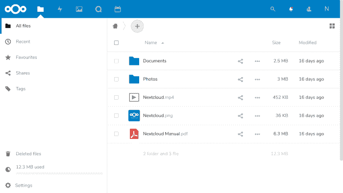

# snapd 使管理 Nextcloud 变得轻而易举

> 原文：<https://www.freecodecamp.org/news/snapd-nextcloud/>

正如我在我的 [Linux in Action book](https://www.manning.com/books/linux-in-action?a_aid=bootstrap-it&a_bid=4ca15fc9) 和 [Linux in Motion course](https://www.manning.com/livevideo/linux-in-motion?a_aid=bootstrap-it&a_bid=0c56986f&chan=motion1) 中所描述的，Nextcloud 是一种强大的方式，只使用运行在您自己的安全基础设施上的开源软件来构建文件共享和协作服务。它集 DropBox、Skype 和 Google Docs 于一身，但没有供应商锁定、安全性和隐私担忧。

虽然这个平台确实是精心设计和完善的，但初始安装可能会很棘手。寻找证据？尝试在 Ubuntu 18.04 服务器上手动安装 Nextcloud，使用互联网上的任何一个详细说明。有时候一切都很顺利，但并不总是如此。您可能会遇到官方上游存储库不再支持的包，或者改变了依赖关系。不要责怪写这些指南的人:要怪就怪官方 Linux 软件库的变化速度。

## 使用 snapd 安装 Nextcloud

有一个更好的方法，但它有自己的黑暗面。

正如我在本文中所写的，Canonical 的 snapd 包管理系统旨在简化跨多个 Linux 发行版和发行版的软件的安全和可预测的分发。这很有效。拍摄下一个云快照。在服务器上为 Nextcloud 准备底层软件堆栈只需一个命令，而不是投入 15 分钟、大量的终端输入和一些严重的故障排除(当事情不按您希望的方式进行时):

```
snap install nextcloud
```

就是这样。不真的。snap 系统将为您建立一个工作的 Nextcloud 服务器，包括运行 MySQL、Apache、Redis 和 PHP 独立实例的后端层。在您的 [snap-enabled](https://docs.snapcraft.io/installing-snapd/6735) Linux 机器上亲自尝试一下。

到目前为止一切顺利。现在，您可以手动设置一个管理员帐户并分配一个密码(希望比本例中的更好):

```
nextcloud.manual-install admin password
```

再走一步。默认情况下，Nextcloud 将接受从服务器本身发送到 *localhost* 的 HTTP 请求。但是，通常情况下，您可能会在远程或虚拟服务器上进行设置(比如 AWS EC2 实例)。因此，你需要告诉 Nextcloud，期待对你的 IP 地址或域名的远程浏览器请求。这可能是它看起来的样子。请注意如何为每个域分配一个单独的 ID 号(本例中为 1 和 2)。

```
nextcloud.occ config:system:set trusted_domains 1 \
    --value=nextcloud.bootstrap-it.com$ nextcloud.occ \ 
    config:system:set trusted_domains 2 \
    --value=192.168.2.45
```

这些值将被保存到 config.php 文件中，您可以自己阅读。

```
cat /var/snap/nextcloud/current/nextcloud/config/config.php
```

完成后，您现在应该能够浏览到 Nextcloud 服务器的 IP 地址(或域名),并使用之前设置的管理员凭据登录到管理控制台。我将让您自己探索这个界面。



The Nextcloud UI

## Nextcloud 故障排除和管理

但是我说过下一个云快照有它的黑暗面，不是吗？好吧，假设出了问题。假设有一天天气很好，您的用户意外地无法正常登录 Nextcloud UI。甚至管理员用户的登录尝试也会失败。此时，您的第一个也是唯一的选择是 SSH 到服务器。

我相信这不会是您在 Linux 服务器上的第一次管理经历。你带着一条储备齐全的工具带，老实说，你真的很期待挑战。

但是等等！这是什么？ */etc/* 目录不包含任何与 Apache、Redis 和 MySQL 服务有明显联系的文件，并且 */var/log/* 中的日志都神秘地安静下来。甚至*系统状态*也不提供任何希望。您的库存充足的 Linux 工具带到此为止。

然后，就像众所周知的一吨砖块一样，它击中了你:你使用 snapd 安装了 Nextcloud。所有的旧规则都不适用。你打算去哪里寻求帮助呢？嗯，如果我可以谦虚地建议，你可以从阅读我的管理 Ubuntu 快照文章开始。这将解释 snapd 将重要的基于 snap 的配置文件隐藏在文件系统的什么位置。它还将向您介绍一些有用的快照管理工具。

然而，本文的其余部分将关注 Nextcloud 项目自己的命令行工具——这些工具可以帮助您完成一些重要的管理工作。

当您创建管理员用户并添加一两个新的受信任域时，您已经看到了 Nextcloud CLI 的工作情况。一个更重要的设置步骤是将 TLS 加密添加到 web 服务中。你通常会使用电子自由前沿的 [certbot 工具](https://certbot.eff.org/)从 Let's Encrypt 获得免费证书。但这在这里行不通…因为 snap。相反，您将运行 Nextcloud 自己的工具来请求和安装一个加密证书:

```
nextcloud.enable-https lets-encrypt
```

但是要全面了解所有可用的 CLI 操作，请运行 *nextcloud.occ.* 您将看到一长串功能及其描述和一些语法指导。花几分钟时间浏览该命令在您的机器上显示的内容。

```
nextcloud.occ
```

例如，您可以按启用或禁用列出 Nextcloud 当前可用的所有应用程序。

```
nextcloud.occ app:list
Enabled:
  - accessibility: 1.1.0
  - activity: 2.8.2
  - calendar: 1.6.4
  - cloud_federation_api: 0.1.0
  - comments: 1.5.0
  - dav: 1.8.1
  - federatedfilesharing: 1.5.0
  - federation: 1.5.0
[..]
```

您的下一步可能是禁用一个当前启用的应用程序(反之亦然):

```
nextcloud.occ app:disable calendar
```

您可以使用 *app:update* 手动更新所有或指定的应用:

```
nextcloud.occ app:update --all
spreed new version available: 5.0.3
spreed updated
```

有人忘记密码了吗？您可以重置它:

```
nextcloud.occ user:resetpassword admin2
Enter a new password: 
Confirm the new password: 
Successfully reset password for admin2
```

我相信你已经明白了:你使用顶级命令——比如 *app* 、*用户*和*维护*——并添加一个冒号，然后添加一个二级命令，比如 *list。一切都被很好地安排到相当直观的领域中。以下是一些例子:*

```
nextcloud.occ app:list
nextcloud.occ user:add
nextcloud.occ maintenance:repair
```

最后，*状态*命令将打印一些基本的版本信息:

```
nextcloud.occ status
  - installed: true
  - version: 15.0.7.0
  - versionstring: 15.0.7
  - edition:
```

我想你已经具备了找到路所需的基本条件。剩下的就看你的了。

*寻找更多？你可能会喜欢我的关于 Linux、AWS 和 Docker 相关主题的* [*书籍和 Pluralsight 课程*](https://bootstrap-it.com/) *。*