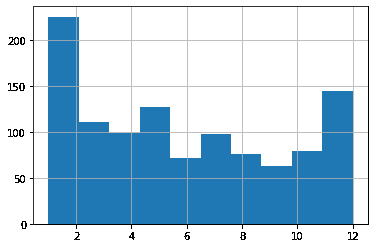
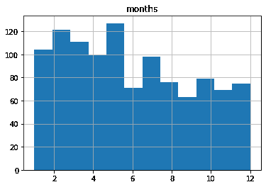
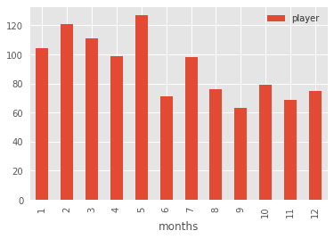

# 所以马尔科姆·格拉德威尔得到的数据都是错的...或者他有吗？

> 原文：<https://www.freecodecamp.org/news/so-malcolm-gladwell-was-wrong-or-was-he/>

在这篇文章中，我将分享我在数据分析和职业曲棍球领域的一些新手探索。

最近，我踏上了进入数据分析世界的疯狂旅程。请注意，数据分析并没有那么疯狂。我的旅程有点奇怪。

你看，[我在云和 Linux 管理方面为自己建立了一个不错的职业生涯](https://bootstrap-it.com/davidclinton)，但我不是开发人员。此外，除了一些明显的重叠，数据是管理之外的一个整体——在这个整体中，某种级别的编程是不可避免的。

但是我工作的一部分要求我密切关注技术发展的大趋势。而数据是大的。多年来，我看着所有(不)酷的孩子玩着让现代世界运转的数字，坦率地说，我很嫉妒。

所以我来了。我要在一些非常陌生的领域摸索前进，犯一些愚蠢的错误，并从中获得乐趣。想加入我吗？

本文不会从绝对的*基础*基础开始。如果你还在寻找 Python 的第一步，[看看这个](https://www.python.org/about/gettingstarted/)。如果你想知道如何开始使用像我使用的 Jupyter 笔记本这样的编程环境，[看这里](https://jupyter-notebook-beginner-guide.readthedocs.io/en/latest/)。我想你已经习惯了这一切。

## 生日在体育界很重要吗？

我将从我试图回答的问题开始:

> 如果你的生日恰好在日历年的早些时候，你更有可能成为一名优秀运动员吗？

据称，青少年体育将参与者按年龄划分，并将每年的截止日期定在 12 月 31 日，这无意中让下半年的球员更难取得成功。那是因为他们将与比他们大几个月的选手竞争。

在更年轻的时候，这几个月会在体力、体型和协调性方面产生很大的差异。如果你是一个小联盟教练，希望在一个更强的联盟中为一支更好的球队投资人才，你会选择谁？从长远来看，谁会从你的额外关注中受益？

这就是著名作家、思想家(也是加拿大人)马尔科姆·格拉德威尔的用武之地。格拉德威尔实际上并不是这种洞察力的最初来源，尽管他是最常与之联系在一起的人。

相反，这些荣誉属于心理学家罗杰·巴恩斯利(Roger Barnesly ),他在参加一场精英少年曲棍球比赛时注意到球员的生日分布模式很奇怪。为什么这么多有天赋的运动员在年初出生？格拉德威尔刚刚在他的书 *Outliers* 中提到了巴恩斯利的洞察力，这是我偶然发现的。

但这都是真的吗？巴恩斯利的观察只是一个有趣的猜测，还是真实世界的数据证实了他的说法？

## NHL 把数据藏在哪里？

我的几个孩子还是青少年，所以，不管是好是坏，在我家都逃不过曲棍球迷的阴影。为了满足他们对这些东西的无尽欲望，我发现了一个由国家曲棍球联盟维护的强大的官方但未记录的 API 的存在。此 URL:

```
https://statsapi.web.nhl.com/api/v1/teams/15/roster 
```

...例如，将生成一个 JSON 格式的数据集，其中包含华盛顿首都的官方当前名册。将 URL 中的`15`更改为例如`10`，将会为您提供关于多伦多枫叶的相同信息。

作为 API 的一部分，有很多很多这样的端点。此外，许多端点可以使用 URL 扩展语法进行修改。

> 有趣的事实:如果你在 NHL API 生成的网页上查看浏览器标签中的站点图标，你会看到**美国职业棒球大联盟**商标。 ***那个*** 是怎么发生的？

## 如何使用 Python 抓取 NHL 统计数据

知道了所有这些，我就可以为每个球员的 ID 号抓取每个球队名单的端点，然后使用这些 ID 查询每个球员的唯一端点并读取他的生日。然后，我可以将每个 NHL 球员的出生月份提取到一个熊猫数据帧中，整个数据集可以被计算并显示为直方图。

以下是我为实现这一切而编写的代码。我不打算在这里详细讨论它，尽管那可能在以后的某个时候发生。

```
import pandas as pd
import requests
import json
import matplotlib.pyplot as plt
import numpy as np

df3 = pd.DataFrame(columns=['months'])
for team_id in range(1, 11, 1):
    url = 'https://statsapi.web.nhl.com/api/v1/teams/{}/roster'.format(team_id)
    r = requests.get(url)
    roster_data = r.json()
    df = pd.json_normalize(roster_data['roster'])
    for index, row in df.iterrows():
        newrow = row['person.id']
        url = 'https://statsapi.web.nhl.com/api/v1/people/{}'.format(newrow)
        newerdata = requests.get(url)
        player_stats = newerdata.json()
        birthday = (player_stats['people'][0]['birthDate'])
        newmonth = int(birthday.split('-')[1])
        df3 = df3.append({'months': newmonth}, ignore_index=True)
df3.months.hist() 
```

在继续之前，我应该补充几点:

*   注意你使用这些代码的方式和频率。有嵌套的 for/loops，所以即使运行一次脚本，也会用超过一千个查询来攻击 NHL 的 API。这是假设一切都按照它应该的方式进行。如果你犯了一个错误，你可能会让你不想惹的人很烦。
*   这个代码(`for team_id in range(1, 11, 1):`)实际上只从 NHL 的 30 支队伍中的 11 支队伍中抓取数据。出于某种原因，某些 API 名册端点无法响应我的查询，实际上导致脚本崩溃。因此，为了获得尽可能多的数据，我多次运行该脚本。这是第一次。如果您想自己尝试，从后续迭代中删除`df3 = pd.DataFrame(columns=['months'])`行，这样您就不会不小心将 DataFrame 的值重置为零。
*   一旦你成功地收集了你的数据，使用类似于`df3.to_csv('player_data.csv')`的东西将你的数据复制到一个 CSV 文件中，即使原始数据帧丢失，你也可以进一步分析内容。避免给 API 源代码带来不必要的负担总是好的。

## 如何可视化原始数据

好的。我说到哪了？没错。我已经得到了我的数据——近 1100 名当前 NHL 球员的出生月份——我想看看它是什么样子的。不要再等了，这是它最辉煌的时刻:



这里有什么？在我看来，一月出生的玩家确实占了不成比例的高玩家数量，但是，十二月出生的也是如此。总的来说，我没有看到格拉德威尔的想法所预测的模式。啊哈！在火焰中被击落。永远不要相信知识分子！

呃。别急，年轻人。我们确定我们没看错这个直方图吗？记住:我在这个领域刚刚起步，正在“工作”中学习。

默认设置可能实际上并没有给我们所想的那样。例如，请注意，我们是如何测量 12 个月内的出生频率的，但图表中只有 10 个柱！

这是怎么回事？

## 直方图真正告诉我们什么？

让我们看看这个直方图背后的实际数字。您可以通过加载之前使用`df3.to_csv('player_data.csv')`导出的 CSV 文件来获得这些数字。你可以这样做:

```
import pandas as pd
df = pd.read_csv('player_data.csv')
df['months'].value_counts() 
```

下面是我的输出(我手动添加了列标题):

```
Month Frequecy
5     127
2     121
3     111
1     104
4      99
7      98
10     79
8      76
12     75
6      71
11     69
9      63 
```

看起来五月出生了 127 人，二月 121 人，三月 111 人。十二月只有 75。

哎呦。抱歉马尔科姆。我应该更有信心。看看出生频率最高的五个月是如何成为一年中的前五个月的？这正是格拉德威尔的预测所期待的。那么直方图是怎么回事？

让我们再次运行它，但是这一次，我将指定 12 个 bin，而不是默认的 10 个。

```
import pandas as pd
df = pd.read_csv('player_data.csv')
df.hist(column='months', bins=12); 
```

“bin”实际上是数据集之间的统计适当间隔的近似值。bin 试图猜测最能代表您实际使用的值的*概率密度函数(PDF)* 。但是它们可能不会完全按照您的想法显示——尤其是当您使用默认值时。这是我们用 12 个箱子展示的内容:



这一个可能以我们期望的方式向我们展示了数据的准确表示。我说“可能”，因为直方图划分它们的条块的方式可能有一些我不知道的特质。

## 确保使用正确的工具来完成这项工作

但事实证明，不起眼的直方图实际上是不符合我们需求的可视化工具。

直方图非常适合通过将数据点分组到箱中来显示频率分布。这可以帮助我们快速可视化一个非常大的数据集的状态，其中粒度精度将成为障碍。但是对于像我们这样的用例，这可能会产生误导。

相反，让我们用一个包含了`groupby`和`count`参数的简单的旧条形图。

```
df.groupby('months').count().plot(kind='bar')
```

运行它会给我们一些更容易阅读，也更直观可靠的东西:



这样更好，不是吗？我们可以看到，出生月份频率最高的五个月是在一年的开始。

这个故事的寓意是什么？数据不错。直方图很好。但是知道如何阅读和何时使用它们也是很好的。

****************在我的***************网站: ******上还有更多管理方面的书籍、课程和文章*******