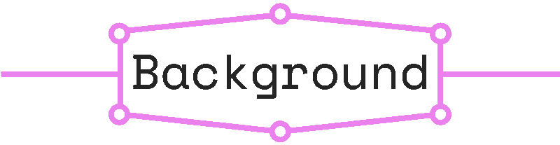
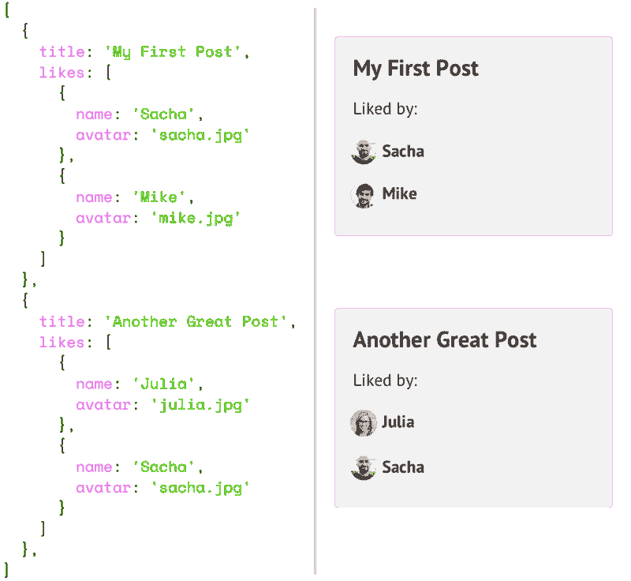
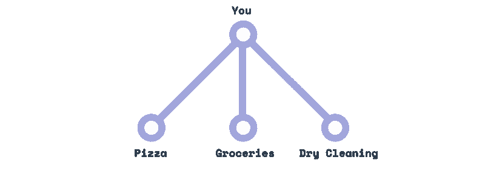
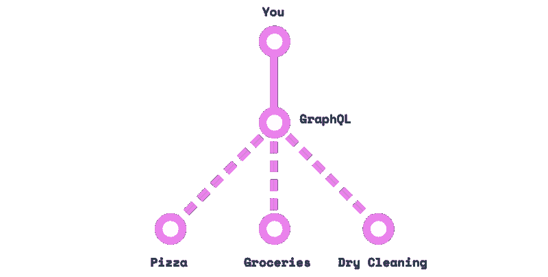
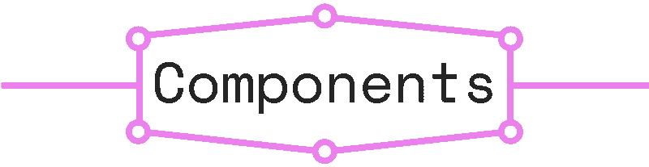
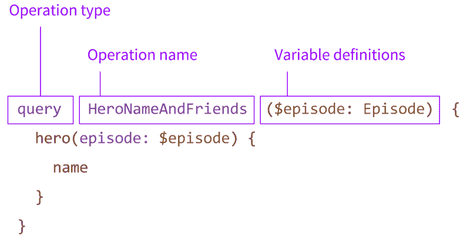
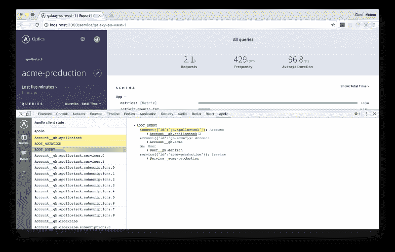
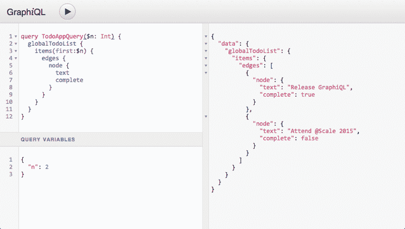
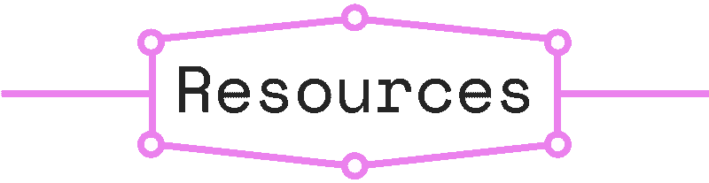
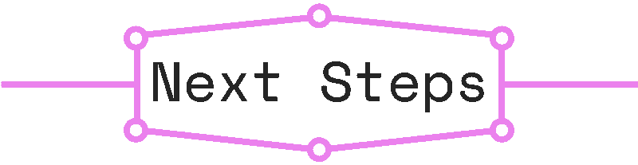

# 我一直听说的 GraphQL 是什么？

> 原文：<https://www.freecodecamp.org/news/so-whats-this-graphql-thing-i-keep-hearing-about-baf4d36c20cf/>

萨沙·格里菲


# 我一直听说的 GraphQL 是什么？

如果你像我一样，当听到一项新技术时，你可能会经历三个阶段:

#### 1.解雇

> 再来一个 JavaScript 库？！已经使用 jQuery 了！

#### 2.兴趣

> 嗯，也许我应该去看看这个我一直听说的新图书馆…

#### 3.恐慌

> 救命啊！我需要马上学习这个新库**否则我会完全被淘汰！**

**在这个快速变化的时代，保持头脑清醒的诀窍是在第二和第三阶段之间学习新的东西，一旦你的兴趣被激起，但你仍然走在曲线的前面。**

**这就是为什么现在是了解你一直听到的 GraphQL 到底是什么的最佳时机。**

### **基础知识**

**简而言之，GraphQL 是一种描述如何请求数据的语法，通常用于从服务器向客户端加载数据。GraphQL 有三个主要特点:**

*   **它让客户端确切地指定它需要什么数据。**
*   **这使得从多个来源汇总数据变得更加容易。**
*   **它使用类型系统来描述数据。**

**那么 GraphQL 是怎么入门的呢？实际上是什么样的？你如何开始使用它？请继续阅读，寻找答案！**

****

### **问题是**

**GraphQL 始于古老的大脸书，但即使简单得多的应用程序也经常会遇到传统 REST APIs 的限制。**

**例如，假设您需要显示一个`posts`列表，在每个帖子下显示一个`likes`列表，包括用户名和头像。很容易，您调整您的`posts` API 来包含一个包含用户对象的`likes`数组:**

****

**但现在，是时候使用你的移动应用程序了，事实证明加载所有额外的数据会减慢速度。所以你现在需要*两个*端点，一个带`likes`，一个不带。**

**现在再增加一个因素:结果是`posts`存储在 MySQL 数据库中，而`likes`存储在 Redis 存储中！你现在做什么？！**

**将这个场景推广到脸书必须管理的众多数据源和 API 客户端，您就可以想象为什么优秀的 REST APIs 开始显示出它们的局限性了。**

### **解决方案**

**脸书提出的解决方案在概念上非常简单:与其拥有多个“笨”端点，不如拥有一个可以接受复杂查询的“智能”端点，然后将数据输出调整为客户需要的任何形状。**

**实际上，GraphQL 层位于客户端和一个或多个数据源之间，接收客户端请求并根据您的指令获取必要的数据。迷茫？隐喻时间到了！**

**旧的 REST 模式就像订购披萨，然后送货上门，然后打电话给干洗店取衣服。三家商店，三个电话。**

****

**另一方面，GraphQL 就像有了一个私人助理:一旦你给了他们所有三个地方的地址，你就可以简单地要求你想要的(“帮我拿干洗的衣服、一个大披萨和两打鸡蛋”)，然后等待他们回来。**

****

**换句话说，GraphQL 建立了与这个神奇的个人助理对话的标准语言。**

**

According to Google Images, the typical personal assistant is an eight-armed alien** ****

**在实践中，GraphQL API 是围绕三个主要构件组织的:模式**、**查询**和**解析器**。****

### **问题**

**您向 GraphQL 个人助理发出的请求是**查询**，它看起来像这样:**

```
`query {  stuff}`
```

**我们使用关键字`query`声明一个新的查询，然后请求一个名为`stuff`的字段。GraphQL 查询的伟大之处在于它们支持嵌套字段，因此我们可以更深入一层:**

```
`query {  stuff {    eggs    shirt    pizza  }}`
```

**如您所见，进行查询的客户机不需要关心数据来自哪个“商店”。只需提出您需要的东西，让 GraphQL 服务器处理剩下的事情。**

**值得注意的是，查询字段也可以指向**数组**。例如，以下是查询文章列表时的常见模式:**

```
`query {  posts { # this is an array    title    body    author { # we can go deeper!      name      avatarUrl      profileUrl    }  }}`
```

**查询字段也支持**参数**。如果我想显示一篇特定的文章，我可以在`post`字段中添加一个`id`参数:**

```
`query {  post(id: "123foo"){    title    body    author{      name      avatarUrl      profileUrl    }  }}`
```

**最后，如果我想让那个`id`参数动态化，我可以定义一个**变量**，然后在查询中重用它(注意，这里我们也将查询命名为**):****

```
`query getMyPost($id: String) {  post(id: $id){    title    body    author{      name      avatarUrl      profileUrl    }  }}`
```

**将所有这些付诸实践的一个好方法是使用 GitHub 的 GraphQL API Explorer。例如，尝试以下查询:**

```
`query {  repository(owner: "graphql", name: "graphql-js"){    name    description  }}`
```

**

GraphQL autocomplete in action** 

**注意，当您尝试在`description`下面键入一个新的字段名时，IDE 会自动提供可能的字段名，这些字段名是由 GraphQL API 本身自动完成的。整洁！**

**

[The Anatomy of a GraphQL Query](https://dev-blog.apollodata.com/the-anatomy-of-a-graphql-query-6dffa9e9e747)** 

**您可以在优秀的[GraphQL 查询剖析](https://dev-blog.apollodata.com/the-anatomy-of-a-graphql-query-6dffa9e9e747)文章中了解关于 graph QL 查询的更多信息。**

### **下决心者**

**即使是世界上最好的私人助理也不能去取你干洗的衣服，除非你给他们一个地址。**

**类似地，除非您使用**解析器**告诉 GraphQL 服务器如何处理传入的查询，否则它不会知道。**

**解析器告诉 GraphQL 如何以及在哪里获取对应于给定字段的数据。例如，上面的`post`字段的解析器可能是这样的(使用 Apollo 的 [GraphQL-Tools](https://github.com/apollographql/graphql-tools) 模式生成器):**

```
`Query: {  post(root, args) {    return Posts.find({ id: args.id });  }}`
```

**我们将解析器放在`Query`上，因为我们想在根级别直接查询`post`。但是您也可以拥有子字段的解析器，比如一个`post`的`author`字段:**

```
`Query: {  post(root, args) {    return Posts.find({ id: args.id });  }},Post: {  author(post) {    return Users.find({ id: post.authorId})  }}`
```

**请注意，您的解析器不仅限于返回数据库文档。例如，也许您想在您的`Post`类型中添加一个`commentsCount`:**

```
`Post: {  author(post) {    return Users.find({ id: post.authorId})  },  commentsCount(post) {    return Comments.find({ postId: post.id}).count()   }}`
```

**这里要理解的关键概念是，使用 GraphQL，**您的 API 模式和数据库模式是解耦的**。换句话说，我们的数据库中可能没有任何`author`和`commentsCount`字段，但是我们可以通过解析器来“模拟”它们。**

**如您所见，您可以在解析器中编写任何代码。这就是为什么你也可以让他们*修改*你的数据库的内容，在这种情况下，他们被称为**突变**解析器。**

### **(计划或理论的)纲要**

**所有这些好东西都是由 GraphQL 的类型化模式系统实现的。我今天的目标是给你一个快速的概述，而不是详尽的介绍，所以我不会在这里赘述。**

**也就是说，如果你想了解更多，我鼓励你查看 GraphQL 文档。**

****

### **常见问题**

**下面休息一下，回答几个常见问题。**

**你在后面。是的，你。我看得出你想问点什么。去吧，不要害羞！**

#### **GraphQL 和图数据库有什么关系？**

**不多，真的，GraphQL 和 [Neo4j](https://en.wikipedia.org/wiki/Neo4j) 之类的图数据库没有任何关系。“图形”部分来自于通过使用字段和子字段在 API 图形中爬行的想法；而“QL”代表“查询语言”。**

#### **我对 REST 非常满意，为什么要切换到 GraphQL 呢？**

**如果您还没有碰到 GraphQL 想要解决的其他痛点，那么我会说这是一件好事！**

**使用 GraphQL 而不是 REST 可能不会对你的应用程序的整体用户体验产生太大影响，所以切换到它无论如何都不是生死攸关的事情。也就是说，如果有机会的话，我肯定会推荐在一个小项目中尝试 GraphQL。**

#### **不使用 React/Relay/*在此插入库*可以使用 GraphQL 吗？**

**是的，你可以！由于 GraphQL 只是一个规范，所以你可以在任何平台上的任何库上使用它，要么使用客户端(例如， [Apollo](http://dev.apollodata.com/) 拥有用于 web、iOS、Angular 等的 GraphQL 客户端。)或者自己调用 GraphQL 服务器。**

#### **GraphQL 是脸书做的，我不信任脸书**

**同样，GraphQL 是一个规范，这意味着您可以使用 GraphQL 实现，而无需运行脸书编写的一行代码。**

**虽然有脸书的支持对 GraphQL 生态系统来说绝对是一个很好的补充，但在这一点上，我相信这个社区足够大，即使脸书停止使用它，GraphQL 也能茁壮成长。**

#### **这整个“让客户要求他们需要的数据”的业务对我来说听起来不太安全…**

**因为您编写了自己的解析器，所以由您来解决这个级别的任何安全问题。**

**例如，如果您让客户机指定一个`limit`参数来控制它接收的文档数量，您可能希望限制这个数量，以避免拒绝服务式的攻击，在这种攻击中，客户机反复请求数百万个文档。**

#### **那么我需要什么来开始呢？**

**一般来说，运行基于 GraphQL 的应用程序至少需要两个组件:**

*   **一个为你的 API 服务的 GraphQL 服务器。**
*   **一个连接到您的端点的 **GraphQL 客户端**。**

**请继续阅读，了解更多可用选项。**

****

**现在您对 GraphQL 的工作原理有了一个大致的了解，让我们来谈谈这个领域的一些主要参与者。**

### **GraphQL 服务器**

**您需要的第一块砖是 GraphQL 服务器。GraphQL 本身毕竟只是一个规范，所以这为一些竞争的实现敞开了大门。**

#### **[GraphQL-JS](https://github.com/graphql/graphql-js) (节点)**

**这是 GraphQL 的原始参考实现。你可以和 [express-graphql](https://github.com/graphql/express-graphql) 一起使用[来创建你的 API 服务器](http://graphql.org/graphql-js/running-an-express-graphql-server/)。**

#### **[GraphQL-Server](http://dev.apollodata.com/tools/graphql-server/) (节点)**

**阿波罗团队也有他们自己的一体化 GraphQL 服务器实现。它还不像最初的版本那样广泛，但是有很好的文档记录和支持，并且正在迅速普及。**

#### **[其他平台](http://graphql.org/code/)**

**GraphQL.org 有一个针对各种其他平台的 GraphQL 实现列表。).**

### **GraphQL 客户端**

**虽然从技术上来说，你可以直接查询你的 GraphQL API，而不需要一个专用的客户端库，但它肯定会让你的生活变得更加轻松。**

#### **[继电器](https://facebook.github.io/relay/)**

**Relay 是脸书自己的 GraphQL 工具包。我自己没有用过，但据我所知，它主要是根据脸书自己的需求定制的，对于大多数用途来说可能有点过度设计了。**

#### **[阿波罗客户端](http://www.apollodata.com/)**

**这个领域的新进入者是[阿波罗](http://apollostack.com)，它很快就被占领了。典型的 Apollo 客户端堆栈由两部分组成:**

*   **[Apollo-client](http://dev.apollodata.com/core/) ，让你在浏览器中运行 GraphQL 查询并存储它们的数据(也有自己的 [devtools 扩展](https://github.com/apollographql/apollo-client-devtools))。**
*   **一个为你的前端框架选择的连接器( [React-Apollo](http://dev.apollodata.com/react/) 、 [Angular-Apollo](http://dev.apollodata.com/angular2/) 等)。).**

**注意，默认情况下，Apollo-client 使用 [Redux](http://redux.js.org) 存储数据，这很好，因为 Redux 本身是一个非常成熟的状态管理库，具有丰富的生态系统。**

**

The Apollo Devtools Chrome extension** 

### **开源应用**

**尽管 GraphQL 相当新，但已经有一些有前途的开源应用程序在使用它。**

#### **[火神](http://vulcanjs.org)**

****

**首先，声明:我是 [VulcanJS](http://vulcanjs.org) 的主要维护者。我创建 VulcanJS 是为了让人们利用 React/GraphQL 堆栈的强大功能，而不必编写这么多样板文件。你可以认为它是“现代网络生态系统的轨道”，因为它让你在几个小时内构建 CRUD 应用程序(比如一个 [Instagram 克隆](https://www.youtube.com/watch?v=qibyA_ReqEQ))。**

#### **盖茨比**

**Gatsby 是一个 React 静态站点生成器，从[版本 1.0](https://www.gatsbyjs.org/docs/) 开始，它现在由 GraphQL 提供支持。虽然乍一看这似乎是一个奇怪的组合，但它实际上非常强大。在其构建过程中，Gatsby 可以从多个 GraphQL APIs 获取数据，然后使用它们创建一个完全静态的客户端专用 React 应用程序。**

### **其他 GraphQL 工具**

#### **[图 QL](https://github.com/graphql/graphiql)**

**GraphQL 是一个非常方便的浏览器内 IDE，用于查询 graph QL 端点。**

**

GraphiQL** 

#### **[数据加载器](https://github.com/facebook/dataloader)**

**由于 GraphQL 查询的嵌套性质，单个查询可以很容易地触发几十个数据库调用。为了避免性能下降，可以使用批处理和缓存库，比如脸书开发的 DataLoader。**

#### **[创建 GraphQL 服务器](https://blog.hichroma.com/create-graphql-server-instantly-scaffold-a-graphql-server-1ebad1e71840)**

**Create GraphQL Server 是一个命令行实用程序，它使快速搭建由节点服务器和 Mongo 数据库支持的 GraphQL 服务器变得容易。**

#### **[图表 QL-up](https://www.graph.cool/graphql-up/)**

**与创建 GraphQL 服务器类似，GraphQL-up 允许您快速引导一个由 [GraphCool](https://www.graph.cool) 的服务支持的新的 GraphQL 后端。**

### **GraphQL 服务**

**最后，也有一些“GraphQL-backend-as-a-service”公司为您处理整个服务器方面的事情，这可能是您涉足 GraphQL 生态系统的一个好方法。**

#### **[Graphcool](http://graph.cool)**

**一个灵活的后端平台，结合了 GraphQL 和 AWS Lambda，并提供免费的开发者计划。**

#### **[Scaphold](https://scaphold.io/)**

**另一个 GraphQL 后端即服务，也有免费计划。它提供了许多与 Graphcool 相同的功能。**

****

**已经有不少地方可以刷 GraphQL 了。**

#### **[GraphQL.org](http://graphql.org/learn/)**

**GraphQL 官方网站提供了一些很好的文档来帮助您入门。**

#### **[LearnGraphQL](https://learngraphql.com/)**

**LearnGraphQL 是一门互动课程，由 Kadira 的员工共同开发。**

#### **[LearnApollo](https://www.learnapollo.com/)**

**LearnGraphQL 的一个很好的后续，LearnApollo 是 Graphcool 制作的免费课程。**

#### **[阿波罗博客](https://dev-blog.apollodata.com/)**

**Apollo 博客有大量关于 Apollo 和 GraphQL 的详细的、写得很好的文章。**

#### **[图表 QL 周刊](https://graphqlweekly.com/)**

**由 Graphcool 团队策划的关于 GraphQL 的时事通讯。**

#### **[哈什邦周刊](http://hashbangweekly.okgrow.com/)**

**另一个很棒的时事通讯，除了 GraphQL 之外还包括 React 和 Meteor。**

#### **[Freecom](https://www.graph.cool/freecom/)**

**这是一个系列教程，教你如何使用 GraphQL 构建一个内部通信克隆。**

#### **[牛逼的 GraphQL](https://github.com/chentsulin/awesome-graphql)**

**一个非常详尽的 GraphQL 链接和资源列表。**

****

**那么如何把新学到的 GraphQL 知识付诸实践呢？以下是一些你可以尝试的食谱:**

#### **[阿波罗+ Graphcool + Next.js](https://github.com/zeit/next.js/tree/master/examples/with-apollo)**

**如果您已经熟悉 Next.js 和 React，[这个示例](https://github.com/zeit/next.js/tree/master/examples/with-apollo)将让您使用 Graphcool 设置 GraphQL 端点，然后使用 Apollo 查询它。**

#### **[火神](http://docs.vulcanjs.org/)**

**Vulcan 教程将带你在服务器和客户端建立一个简单的 GraphQL 数据层。由于 Vulcan 是一个一体化平台，所以这是一个无需任何设置就可以开始使用的好方法。如果你需要帮助，不要犹豫[通过我们的松弛频道](http://slack.vulcanjs.org/)下降！**

#### **[图 QL &反应教程](https://blog.hichroma.com/graphql-react-tutorial-part-1-6-d0691af25858#.o54ygcruh)**

**Chroma 博客有一个关于遵循组件驱动开发方法构建 React/GraphQL 应用的六部分教程。**

****

### **结论**

**GraphQL 初看起来可能很复杂，因为它是一种跨越现代开发许多领域的技术。但是如果你花时间去理解潜在的概念，我想你会发现很多都是有意义的。**

**因此，无论您最终是否真正使用它，我相信花时间熟悉 GraphQL 是值得的。越来越多的公司和框架正在采用它，它很可能在未来几年成为 web 的关键构件之一。**

**同意吗？不同意？有问题吗？请在评论中告诉我。如果你喜欢这篇文章，请考虑？ing 并分享吧！**