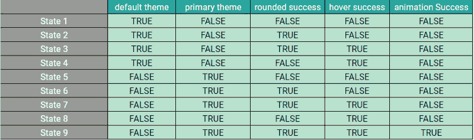
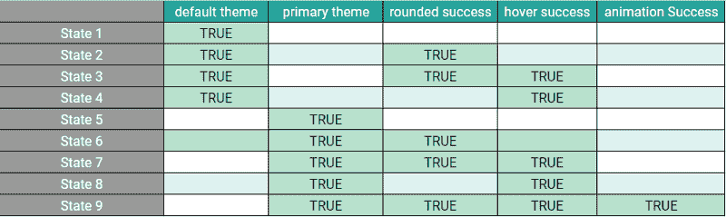

# 所以你陷入了如果/否则的地狱——以下是如何摆脱它的方法

> 原文：<https://www.freecodecamp.org/news/so-youre-in-if-else-hell-here-s-how-to-get-out-of-it-fc6407fec0e/>


Photo by [Markus Spiske](https://unsplash.com/@markusspiske?utm_source=ghost&utm_medium=referral&utm_campaign=api-credit) / [Unsplash](https://unsplash.com/?utm_source=ghost&utm_medium=referral&utm_campaign=api-credit)

### 这个话题是关于什么的？

如果你来自一个`javascript`背景，你可能听说过术语`callback hell`或`async/await hell`。它看起来像这样:


The horror.

仅仅使用`if/else`也有类似的情况。你可能会认为这是开发人员的强迫症，或者忽略它，认为这在某些情况下是可以的。

恕我不能苟同。就像俗话说的……只要假装下一个维护你代码的人知道你在哪里工作，并且可以过来吼你。

出于本文的目的，我将使用 ReactJS 演示一个示例。这个原则本身可以在 Javascript 或任何语言中应用。

**在我们开始**之前，`*<MyButton*` / >的例子可能不是解释 if/else 嵌套问题的最佳例子。但是希望它能给你一个好的指导方针，告诉你问题是什么&如何避免它。

让我们画一幅画。给你一个按钮在`React` &中实现，这个按钮有两个主题选项，或者是`default`或者是`primary`。你觉得简单&你写你的`<MyButton` / >组件:

```
const MyButton = ({ theme, content }) => {
  let className = '';                
  if (theme === 'default') {
    className = 'default-btn';
  } else if (theme === 'primary') {
    className = 'primary-btn';
  }

  return (
    <button className={className}>{content}</button>
  );
}
```

MyButton.1.jsx

过了一段时间，另一个开发人员被分配了一个任务，为默认主题和主主题的按钮添加圆角功能。接任务的开发人员非常喜欢使用三元运算符。他们最终会做如下事情:

```
const MyButton = ({ theme, rounded, content }) => {
  let className = '';                
  if (theme === 'default') {
    className = rounded ? 'default-btn rounded' : 'default-btn';
  } else if (theme === 'primary') {
    className = rounded ? 'primary-btn rounded' : 'primary-btn';
  }

  return (
    <button className={className}>{content}</button>
  );
}
```

MyButton.2.jsx

随着时间的推移&另一个开发人员被分配了一个任务，为两个`default` & `primary`按钮添加一个`hover`状态。现在，另一个开发人员不想对已经实现的代码进行更改，担心他们可能会破坏某些东西。

所以他们写了一个单独的 if 语句:

```
const MyButton = ({ theme, rounded, hover, content }) => {
  let className = '';                
  if (theme === 'default') {
    className = rounded ? 'default-btn rounded' : 'default-btn';
  } else if (theme === 'primary') {
    className = rounded ? 'primary-btn rounded' : 'primary-btn';
  }

  if (hover) {
    className = className + ' hover';
  }

  return (
    <button className={className}>{content}</button>
  );
}
```

MyButton.3.jsx

到目前为止一切顺利…

#### 这就是有趣的地方

继续，几个月后，当用户**将**悬停在具有**主**主题&为**圆形**类型的按钮上时，最后一个要求是添加动画。

现在基于这个需求，整个 API 结构改变了`<MyButto` n/ >组件。开发人员在代码上的工作以这样的逻辑结束:

```
const MyButton = ({ theme, rounded, hover, animation, content }) => {
  let className = '';                
  if (theme === 'default') {
    className = rounded ? 'default-btn rounded' : 'default-btn';
    if (hover) {
      className = className + ' hover';
    }
  } else if (theme === 'primary') {
    if (rounded) {
      if (hover) {
        if (animation) {
           className = 'primary-btn rounded hover my-custom-animation';
        } else {
          className = 'primary-btn rounded hover';
        }
      } else {
        className = 'primary-btn rounded';
      }
    } else {
      if (hover) {
        className = 'primary-btn hover';
      } else {
        className = 'primary-btn';
      }
    }
  }

  return (
    <button className={className}>{content}</button>
  );
}
```

MyButton.4.jsx

太快失控了…不是吗？


and you think to yourself, there was nothing you could have done :(

为了使这段代码更简单，我们需要理解这段代码所有可能的状态。我为按钮做了一个某个时间所有可能组合的可能性图表。



All the possible combinations of values that <MyButton /> component can have at a time

如果这看起来有点复杂，你可以试着看下一张图来理解。



This is the same as the previous one, the FALSE values are omitted here for simplicity sake

编写代码的关键是理解代码的数据流。一旦你对它有了完整的了解，一切都变得简单了。

#### 解决办法

基于上面给出的标准，我可以这样写我的代码来简化它。

```
const MyButton = ({ theme, rounded, hover, animation, content }) => {
  const isThemeDefault = theme === 'default'
  const isThemePrimary = theme === 'primary';
  const isRounded = rounded === true;
  const isHover = hover === true;
  const isAnimated = animation === true;

  const isPrimaryAnimated = isThemePrimary && isAnimated;

  let className = isThemePrimary ? 'primary-btn' : 'default-btn';

  if (isRounded) {
    className = `${className} rounded`;
  }
  if (isHover) {
    className = `${className} hover`;
  }
  if (isPrimaryAnimated) {
    className = `${className} animated`;
  }

  return (
    <button className={className}>{content}</button>
  );
}
```

MyButton.5.jsx (As a bonus feature, it also ends up handling an edge case where, if the wrong theme is passed to MyButton, it ends up ignoring it & assigning it the value of default.

这段代码现在可读性更好了。任何使用这段代码的开发人员都可以轻松地扩展它的功能&继续他们的生活，因为他们知道自己已经很好地完成了这段代码。

如果您愿意，您可以尝试使用这些代码，看看它是否匹配所有的用例。

[https://codesandbox.io/embed/0pl6xvqrnw?from-embed](https://codesandbox.io/embed/0pl6xvqrnw?from-embed)

codesandbox demo https://codesandbox.io/s/0pl6xvqrnw

使用类似自动机(有限状态机)的编码方法:

*   代码现在可读性更好了
*   代码更易于维护

请随意分享你的想法。感谢您的阅读。

你也可以通过推特 [**@adeelibr**](https://twitter.com/adeelibr) 联系我

> 参考与启发:[栈交流论坛](https://softwareengineering.stackexchange.com/questions/205803/how-to-tackle-a-branched-arrow-head-anti-pattern)