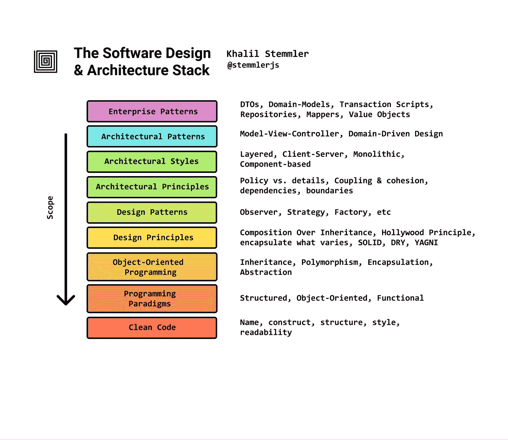

# 如何学习软件设计和架构——路线图

> 原文：<https://www.freecodecamp.org/news/software-design/>

> 这篇文章是我在我的最新项目中所写内容的总结， [solidbook.io -带打字稿的软件设计和架构手册](https://solidbook.io)。如果你喜欢这篇文章，看看吧。

想到脸书曾经是某个人电脑上的一个空文本文件，我觉得很疯狂。

Lol。

在过去的一年里，我一直在努力研究软件设计和架构、[领域驱动设计](https://khalilstemmler.com/articles/domain-driven-design-intro/)和[写一本关于它的书](https://solidbook.io)，我想花一点时间尝试把它拼凑成一些有用的东西，我可以与社区分享。

这是我学习软件设计和架构的路线图。

我已经把它分成了两个工件:堆栈和 T2 地图。

## 堆栈

与网络中的 [OSI 模型](https://en.wikipedia.org/wiki/OSI_model)类似，每一层都建立在前一层的基础之上。

## 地图

虽然我认为堆栈有助于看到所有东西如何协同工作的更大画面，但地图更详细一些(并且受到了 [web 开发者路线图](https://github.com/kamranahmedse/developer-roadmap)的启发)，因此，我认为它更有用。

就在下面！要进行回购，阅读我的详细报道并下载成高清版，请点击此处。

## 阶段 1:干净的代码

创建持久软件的第一步是弄清楚如何编写干净的代码。

干净的代码是易于理解和更改的代码。在低层次上，这体现在一些设计选择中，如:

*   保持一致
*   比起写注释，更喜欢有意义的变量、方法和类名
*   确保代码适当缩进和间隔
*   确保所有测试都可以运行
*   编写没有副作用的纯函数
*   不传递空值

编写干净的代码非常重要。

把它想象成一个叠衣服的游戏。

为了使我们的项目结构随着时间的推移保持稳定，像缩进、小型类和方法以及有意义的名称这样的东西，从长远来看会有很大的回报。

学习如何编写干净代码的最佳资源是鲍勃大叔的书，《干净代码》。

## 阶段 2:编程范例

既然我们正在编写易于维护的可读代码，那么真正理解 3 个主要编程范例以及它们影响我们编写代码的方式将是一个好主意。

在 Bob 叔叔的书“干净的建筑”中，他提到了这样一个事实:

*   面向对象编程是最适合定义我们如何用多态和插件跨越架构边界的工具
*   函数式编程是我们用来将数据推到应用程序边界的工具
*   结构化编程是我们用来编写算法的工具

这意味着有效的软件在不同的时间使用混合的所有 3 种编程范例风格。

虽然你*可以*采用严格的函数式或严格的面向对象的方法来编写代码，但是了解每种方法的优势将会提高你的设计质量。

> 如果你只有一把锤子，那么一切看起来都像钉子。

### 资源

对于**功能编程**，请查看:

*   弗里斯比教授的函数式编程指南
*   [领域建模使功能化](https://pragprog.com/book/swdddf/domain-modeling-made-functional?fbclid=IwAR0NHoyVrMoSRIE-EJMUOdsb3bhivow6JXKyUeg4FPHE8QmeOQG4L77HzMo)

## 阶段 3:面向对象编程

了解每种范式如何工作以及它们如何促使你在其中构建代码是很重要的，但是对于架构来说，面向对象编程显然是完成任务的工具。

面向对象的编程不仅使我们能够创建一个插件架构并在我们的项目中建立灵活性；OOP 附带了 OOP 的 4 个原则(封装、继承、多态和抽象)，帮助我们创建**丰富的领域模型**。

大多数学习面向对象编程的开发人员永远也到不了这一步:学习如何创建问题域的软件实现，并将其置于**分层** web 应用的中心。

在这个场景中，函数式编程看起来像是达到所有目的的手段，但是我建议熟悉模型驱动设计和[领域驱动设计](https://khalilstemmler.com/articles/domain-driven-design-intro/)，以了解对象建模者如何能够在零依赖领域模型中封装整个业务的更大图景。

> 为什么这是一件大事？

这是巨大的，因为如果你能创建一个业务的心智模型，你就能创建该业务的软件实现。

## 阶段 4:设计原则

至此，您已经理解了面向对象编程对于封装丰富的领域模型和解决第三类“硬软件问题”非常有用——复杂的领域。

但是 OOP 会带来一些设计挑战。

什么时候应该用构图？

什么时候应该使用继承？

什么时候应该使用抽象类？

设计原则实际上是公认的、久经考验的面向对象的最佳实践，您可以将其用作防护栏。

您应该熟悉的一些常见设计原则示例如下:

*   继承之上的组合
*   封装变化的内容
*   编程反对抽象，而不是具体化
*   好莱坞原则:“不要打电话给我们，我们会打电话给你”
*   [坚实原则](https://khalilstemmler.com/articles/solid-principles/solid-typescript/)，特别是[单一责任原则](https://khalilstemmler.com/articles/solid-principles/single-responsibility/)
*   干(不要重复)
*   [YAGNI(你不会需要它的)](https://khalilstemmler.com/wiki/yagni/)

不过，一定要得出自己的*结论。不要只是按照别人说的去做。确保它对你有意义。*

## 阶段 5:设计模式

几乎软件中的每个问题都已经被分类和解决了。实际上，我们称这些模式为:设计模式。

设计模式有三类:**创意**、**结构**和**行为**。

### 创造型的

创建模式是控制如何创建对象的模式。

创造模式的例子包括:

*   **单例模式**，用于确保一个类只能有一个实例
*   **抽象工厂模式**，用于创建几个类族的实例
*   **原型模式**，用于从一个从现有实例克隆的实例开始

### 结构的

结构模式是简化我们如何定义组件之间关系的模式。

结构设计模式的例子包括:

*   **适配器模式**，用于创建一个接口，使通常不能一起工作的类能够一起工作。
*   **桥模式**，用于将一个实际上应该是一个或多个的类拆分成一组属于一个层次结构的类，使得实现可以彼此独立地开发。
*   **装饰模式**，用于动态地向对象添加职责。

### 行为的

行为模式是促进对象间优雅交流的常见模式。

行为模式的例子有:

*   **模板模式**，用于将算法的精确步骤推迟到子类。
*   **中介模式**，用于定义类之间允许的确切通信通道。
*   **观察者模式**，用于使类能够订阅感兴趣的内容，并在发生变化时得到通知。

### 设计模式批评

设计模式是伟大的，但有时它们会增加我们设计的复杂性。记住 YAGNI 并试图让我们的设计尽可能简单是很重要的。只有当你真的确定需要设计模式时，才使用它们。你什么时候会知道的。

如果我们知道这些模式中的每一个是什么，什么时候使用它们，什么时候*甚至不用费心*使用它们，我们就能很好地开始理解如何构建更大的系统。

这背后的原因是因为**架构模式仅仅是放大到高级**的设计模式，而设计模式是低级的实现(更接近于类和功能)。

### 资源

[重构大师——设计模式](https://refactoring.guru/design-patterns)

## 阶段 6:架构原则

现在我们在一个超越阶级的更高层次上思考。

我们现在明白，我们对组织和构建高层和低层组件之间的关系所做的决策，将对我们项目的可维护性、灵活性和可测试性产生重大影响。

学习指导原则，帮助您建立代码库所需的灵活性，以便能够以尽可能少的努力对新的功能和需求做出反应。

以下是我建议立即学习的内容:

*   组件设计原则:[稳定抽象原则](https://khalilstemmler.com/wiki/stable-abstraction-principle/)、[稳定依赖原则](https://khalilstemmler.com/wiki/stable-dependency-principle/)和非循环依赖原则，针对如何组织组件、它们的依赖、何时耦合它们，以及意外创建依赖循环和依赖不稳定组件的含义。
*   [策略与细节](https://khalilstemmler.com/articles/enterprise-typescript-nodejs/clean-nodejs-architecture/)，了解如何将应用程序的规则与实现细节分开。
*   边界，以及如何识别应用程序特性所属的[子域](https://khalilstemmler.com/articles/enterprise-typescript-nodejs/application-layer-use-cases/)。

Bob 叔叔发现并最初记录了许多这些原则，所以学习这些原则的最好资源是，“ [Clean Architecture](https://www.amazon.ca/Clean-Code-Handbook-Software-Craftsmanship/dp/0132350882/ref=asc_df_0132350882/?tag=googleshopc0c-20&linkCode=df0&hvadid=292982483438&hvpos=1o2&hvnetw=g&hvrand=13521899336201370454&hvpone=&hvptwo=&hvqmt=&hvdev=c&hvdvcmdl=&hvlocint=&hvlocphy=9000834&hvtargid=pla-435472505264&psc=1) ”。

## 阶段 7:建筑风格

建筑是关于重要的东西。

它是关于识别一个系统需要什么才能成功，然后通过选择最符合要求的架构来累积成功的几率。

例如，一个具有大量业务逻辑复杂性的系统将受益于使用 T2 分层架构来封装这种复杂性。

像优步这样的系统需要能够同时处理大量的实时事件并更新司机的位置，所以 T2 发布订阅 T3 风格的架构可能是最有效的。

我将在这里重复我自己，因为重要的是要注意到 3 类架构风格与 3 类设计模式相似，因为**架构风格是高层次**的设计模式。

### 结构的

具有*不同层次*的组件和广泛功能的项目，要么受益，要么遭受采用结构化架构的痛苦。

这里有几个例子:

*   **基于组件的**架构强调系统内*个体组件*之间的关注点分离。想一想谷歌一下。考虑他们的企业中有多少应用程序(Google Docs、Google Drive、Google Maps 等)。对于具有大量功能的平台，基于组件的架构将关注点划分为松散耦合的独立组件。这是一种*水平*分离。
*   **Monolithic** 意味着应用程序被组合到一个平台或程序中，一起部署。*注意:如果你适当地分离你的应用程序，你可以拥有一个基于组件的整体架构，但是要把它作为一个整体来部署*。
*   **分层**架构通过将软件分为基础设施、应用程序和领域层，垂直*分离关注点*。

> 一个通过使用分层架构垂直切割应用程序关注点的例子。阅读[此处](https://khalilstemmler.com/articles/software-design-architecture/organizing-app-logic/)了解更多关于如何做的信息。

### 信息发送

根据您的项目，消息传递可能是系统成功的一个非常重要的组成部分。对于这样的项目，基于消息的架构建立在函数式编程原则和行为设计模式(如 observer 模式)之上。

下面是一些基于消息的架构风格的例子:

*   **事件驱动**架构将状态的所有重大变化视为事件。例如，在一个[黑胶交易应用](https://github.com/stemmlerjs/white-label)中，当双方同意交易时，要约的状态可能会从“待定”变为“已接受”。
*   **发布-订阅**架构建立在观察者设计模式的基础上，使其成为系统本身、最终用户/客户端以及其他系统和组件之间的主要通信方法。

### 分布的

分布式体系结构简单地说就是系统的组件被分别部署，并通过网络协议进行通信。分布式系统对于扩展吞吐量、扩展团队以及将(潜在昂贵的任务或)责任委托给其他组件非常有效。

分布式架构风格的几个例子是:

*   **客户端-服务器**架构。最常见的架构之一，我们在客户机(表示)和服务器(业务逻辑)之间划分工作。
*   **点对点**架构在同等特权的参与者之间分配应用层任务，形成点对点网络。

## 阶段 8:架构模式

架构*模式*更详细地解释了如何实际实现那些架构*风格*中的一种。

下面是一些架构模式和它们所继承的风格的例子:

*   **[领域驱动设计](https://khalilstemmler.com/articles/domain-driven-design-intro/)** 是一种针对真正复杂问题领域的软件开发方法。为了使 DDD 最成功，我们需要实现一个**分层架构**，以便将领域模型的关注点从使应用程序实际运行的基础设施细节中分离出来，如数据库、web 服务器、缓存等。
*   **模型-视图控制器**可能是开发基于用户界面的应用程序的最著名的架构模式。它的工作原理是将应用程序分为 3 个部分:模型、视图和控制器。当你第一次开始时，MVC 是非常有用的，它帮助你搭载到其他架构上，但是当我们意识到 [MVC 不足以](https://khalilstemmler.com/articles/enterprise-typescript-nodejs/when-crud-mvc-isnt-enough/)处理大量业务逻辑的问题时，这是一个关键点。
*   **事件源**是一种功能方法，我们只存储事务，从不存储状态。如果我们需要状态，我们可以从一开始就应用所有的事务。

## 阶段 9:企业模式

您选择的任何架构模式都将引入大量的构造和技术术语，以便您熟悉并决定是否值得努力使用。

举一个我们很多人都知道的例子，在 **MVC** 中，*视图*保存所有的表示层代码，*控制器*将来自*视图*的命令和查询翻译成由*模型*处理并由*控制器*返回的请求。

我们在模型(M)的什么地方处理这些事情？：

*   验证逻辑
*   不变规则
*   域事件
*   用例
*   复杂的查询
*   和业务逻辑

如果我们简单地使用一个 ORM(对象关系映射器)像  或  作为*模型*，所有重要的东西都留给解释它应该去哪里，并且它发现自己在(应该是丰富的)*模型*和*控制器*之间的某个未指定的层。

> 摘自 [solidbook.io](https://solidbook.io) 中的“3.1 - Slim(无逻辑)型号”。

如果说我在超越 MVC 的旅程中学到了什么的话，那就是**每件事都有一个构造**。

对于 MVC 未能解决的每一个问题，都有其他的企业模式来解决它们。例如:

*   **[实体](https://khalilstemmler.com/articles/typescript-domain-driven-design/entities/)** 描述有身份的模型。
*   **[值对象](https://khalilstemmler.com/articles/typescript-value-object/)** 是没有标识的模型，可以用来封装验证逻辑。
*   **[领域事件](https://khalilstemmler.com/articles/typescript-domain-driven-design/chain-business-logic-domain-events/)** 是表示一些相关业务事件发生的事件，可以从其他组件订阅。

根据您选择的架构风格，将会有大量其他企业模式供您学习，以便最大限度地实现该模式。

### 集成模式

一旦您的应用程序启动并运行，随着用户越来越多，您可能会遇到性能问题。API 调用可能需要很长时间，服务器可能因为请求过载而崩溃，等等。为了解决这些问题，你可能会读到集成像**消息队列**或**缓存**这样的东西来提高性能。

这可能是最具挑战性的事情:*扩展、审计和绩效*。

为*规模*设计一个系统可能极具挑战性。它需要对体系结构中每个组件的局限性有深刻的理解，并需要一个行动计划来减轻对您的体系结构的压力，并在高流量的情况下继续为请求提供服务。

还需要*审核*你的应用程序中发生了什么。大型企业需要能够执行审计，以识别潜在的安全问题，了解用户如何使用他们的应用程序，并拥有曾经发生的一切的日志。

这可能很难实现，但通用架构最终看起来**基于事件**并建立在广泛的软件和系统设计概念、原则和实践上，如事件风暴、DDD、CQRS(命令查询响应分离)和事件源。

* * *

我希望这对你有用！

如果你有任何建议或问题，请告诉我。

干杯！

[叉在 GitHub 上](https://github.com/stemmlerjs/software-design-and-architecture-roadmap)

[看软件设计的书&架构](https://solidbook.io)

[读取记录](https://khalilstemmler.com/articles/software-design-architecture/full-stack-software-design/)

* * *

> [khalilstemmler.com](https://khalilstemmler.com)——我教授高级 TypeScript & Node.js 大型应用程序的最佳实践，以及如何编写灵活、可维护的软件。