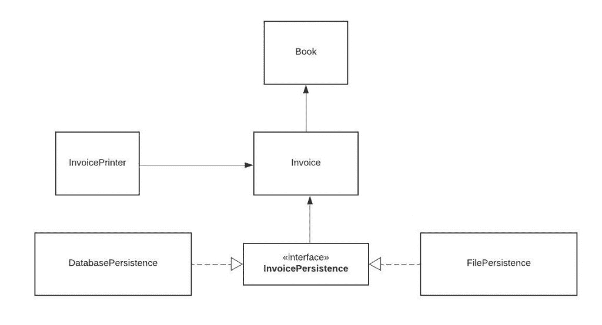
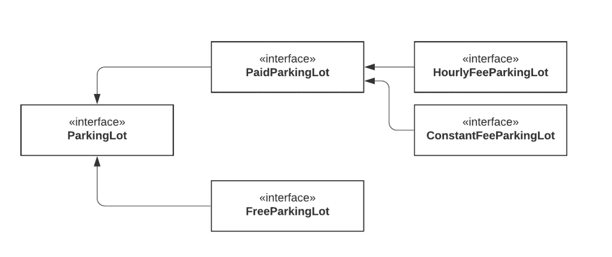

# 用简单的英语解释面向对象编程的坚实原理

> 原文：<https://www.freecodecamp.org/news/solid-principles-explained-in-plain-english/>

坚实的原则是面向对象类设计的五个原则。它们是设计类结构时要遵循的一组规则和最佳实践。

这五个原则帮助我们理解某些设计模式和软件架构的需求。所以我相信是每个开发者都应该学习的课题。

这篇文章将教会你将坚实的原则应用到你的项目中所需要知道的一切。

我们先来看看这个术语的历史。然后，我们将通过创建一个类设计并一步一步地改进它，进入本质细节——每个原则的为什么和如何。

所以，拿起一杯咖啡或茶，让我们马上开始吧！

## 背景

著名计算机科学家罗伯特·j·马丁(又名鲍勃大叔)在 2000 年的论文中首次介绍了这些坚实的原理。但是这个缩写词后来被迈克尔·费哲引入。

鲍勃大叔还是畅销书*清洁代码*和*清洁架构*的作者，也是[“敏捷联盟”](https://agilemanifesto.org/history.html)的参与者之一。

因此，所有这些干净编码、面向对象架构和设计模式的概念在某种程度上是相互联系和互补的，这并不奇怪。

它们都服务于相同的目的:

> "创建可理解的、可读的和可测试的代码，许多开发人员可以合作工作."

让我们一个一个地看看每个原理。在实心首字母缩写词之后，它们是:

*   单一责任原则
*   笔闭合原理
*   **L** 伊斯可夫替代原理
*   **I** 界面偏析原理
*   依赖反演原理

## 单一责任原则

单一责任原则规定**一个类应该做一件事，因此它应该只有一个改变**的理由。

用更专业的方式来表述这个原则:只有一个潜在的变化(数据库逻辑、日志逻辑等等。)在软件的规范中应该能够影响类的规范。

这意味着如果一个类是一个数据容器，比如一个 Book 类或者一个 Student 类，并且它有一些关于那个实体的字段，那么它应该只在我们改变数据模型的时候才改变。

遵循单一责任原则非常重要。首先，因为许多不同的团队可以在同一个项目上工作，并且出于不同的原因编辑同一个类，这可能导致不兼容的模块。

第二，它使版本控制更容易。例如，假设我们有一个处理数据库操作的持久性类，我们在 GitHub 提交中看到该文件发生了变化。通过遵循 SRP，我们将知道它与存储或数据库相关的东西有关。

合并冲突是另一个例子。当不同的团队更改同一个文件时，它们就会出现。但是，如果遵循 SRP，将会出现更少的冲突——文件将只有一个更改的理由，并且确实存在的冲突也将更容易解决。

### 常见陷阱和反模式

在这一节中，我们将看看一些违反单一责任原则的常见错误。然后我们再来讲一些修复的方法。

我们将看看一个简单的书店发票程序的代码作为例子。让我们首先定义一个在发票中使用的 book 类。

```
class Book {
	String name;
	String authorName;
	int year;
	int price;
	String isbn;

	public Book(String name, String authorName, int year, int price, String isbn) {
		this.name = name;
		this.authorName = authorName;
		this.year = year;
        this.price = price;
		this.isbn = isbn;
	}
} 
```

这是一个简单的 book 类，包含一些字段。没什么特别的。我没有将字段设为私有，这样我们就不需要处理 getters 和 setters，而是可以专注于逻辑。

现在让我们创建 invoice 类，它将包含创建发票和计算总价的逻辑。现在，假设我们的书店只卖书，不卖别的。

```
public class Invoice {

	private Book book;
	private int quantity;
	private double discountRate;
	private double taxRate;
	private double total;

	public Invoice(Book book, int quantity, double discountRate, double taxRate) {
		this.book = book;
		this.quantity = quantity;
		this.discountRate = discountRate;
		this.taxRate = taxRate;
		this.total = this.calculateTotal();
	}

	public double calculateTotal() {
	        double price = ((book.price - book.price * discountRate) * this.quantity);

		double priceWithTaxes = price * (1 + taxRate);

		return priceWithTaxes;
	}

	public void printInvoice() {
            System.out.println(quantity + "x " + book.name + " " +          book.price + "$");
            System.out.println("Discount Rate: " + discountRate);
            System.out.println("Tax Rate: " + taxRate);
            System.out.println("Total: " + total);
	}

        public void saveToFile(String filename) {
	// Creates a file with given name and writes the invoice
	}

}
```

这是我们的发票类。它还包含一些关于开票的字段和 3 种方法:

*   **calculateTotal** 方法，即计算总价、
*   **printInvoice** 方法，该方法应该将发票打印到控制台，并且
*   **saveToFile** 方法，负责将发票写到一个文件中。

在阅读下一段之前，你应该给自己一秒钟的时间来思考这个类设计有什么问题。

好吧，这是怎么回事？我们班在多方面违反了单一责任原则。

第一个违规是 **printInvoice** 方法，它包含了我们的打印逻辑。SRP 声明我们的类应该只有一个更改的原因，并且该原因应该是我们类的发票计算中的更改。

但是在这个架构中，如果我们想改变打印格式，我们需要改变类。这就是为什么我们不应该将打印逻辑与业务逻辑混合在同一个类中。

我们的类中还有另一个违反 SRP 的方法: **saveToFile** 方法。将持久性逻辑与业务逻辑混在一起也是一个极其常见的错误。

不要只考虑写入文件——它可以是保存到数据库，进行 API 调用，或者其他与持久性相关的事情。

你可能会问，我们如何修复这个打印功能呢？

我们可以为打印和持久性逻辑创建新的类，这样我们就不再需要为这些目的修改 invoice 类。

我们创建两个类， **InvoicePrinter** 和 **InvoicePersistence，**并移动方法。

```
public class InvoicePrinter {
    private Invoice invoice;

    public InvoicePrinter(Invoice invoice) {
        this.invoice = invoice;
    }

    public void print() {
        System.out.println(invoice.quantity + "x " + invoice.book.name + " " + invoice.book.price + " $");
        System.out.println("Discount Rate: " + invoice.discountRate);
        System.out.println("Tax Rate: " + invoice.taxRate);
        System.out.println("Total: " + invoice.total + " $");
    }
}
```

```
public class InvoicePersistence {
    Invoice invoice;

    public InvoicePersistence(Invoice invoice) {
        this.invoice = invoice;
    }

    public void saveToFile(String filename) {
        // Creates a file with given name and writes the invoice
    }
}
```

现在我们的类结构遵循单一责任原则，每个类负责应用程序的一个方面。太好了！

## 开闭原理

开闭原则要求**类应该对扩展开放，对修改关闭。**

修改意味着改变现有类的代码，扩展意味着添加新的功能。

所以这个原则想说的是:我们应该能够在不触及类的现有代码的情况下添加新的功能。这是因为每当我们修改现有的代码时，我们都在冒产生潜在错误的风险。因此，如果可能的话，我们应该避免接触经过测试的、可靠的(主要是)生产代码。

但是你可能会问，我们如何在不影响类的情况下添加新的功能呢？这通常是在接口和抽象类的帮助下完成的。

既然我们已经介绍了这个原则的基础，让我们将它应用到我们的发票应用程序中。

假设我们的老板找到我们，说他们希望将发票保存到数据库中，以便我们可以轻松地搜索它们。我们认为好吧，这很简单，老板，给我一秒钟！

我们创建数据库，连接到它，并向我们的 **InvoicePersistence** 类添加一个保存方法:

```
public class InvoicePersistence {
    Invoice invoice;

    public InvoicePersistence(Invoice invoice) {
        this.invoice = invoice;
    }

    public void saveToFile(String filename) {
        // Creates a file with given name and writes the invoice
    }

    public void saveToDatabase() {
        // Saves the invoice to database
    }
}
```

不幸的是，作为书店的懒惰开发人员，我们没有将这些类设计成在未来易于扩展的。所以为了添加这个特性，我们修改了 **InvoicePersistence** 类。

如果我们的类设计遵循开闭原则，我们就不需要改变这个类。

因此，作为书店的懒惰但聪明的开发人员，我们看到了设计问题，并决定重构代码以遵守原则。

```
interface InvoicePersistence {

    public void save(Invoice invoice);
}
```

我们将 **InvoicePersistence** 的类型改为 Interface，并添加一个保存方法。每个持久性类都将实现这个保存方法。

```
public class DatabasePersistence implements InvoicePersistence {

    @Override
    public void save(Invoice invoice) {
        // Save to DB
    }
}
```

```
public class FilePersistence implements InvoicePersistence {

    @Override
    public void save(Invoice invoice) {
        // Save to file
    }
}
```

所以我们的类结构现在看起来像这样:



现在我们的持久性逻辑很容易扩展。如果我们的老板要求我们添加另一个数据库，并有两个不同类型的数据库，如 MySQL 和 MongoDB，我们可以很容易地做到这一点。

你可能认为我们可以创建多个没有接口的类，并为它们添加一个保存方法。

但是，假设我们扩展了我们的应用程序，拥有多个持久性类，如 **InvoicePersistence** 、 **BookPersistence** ，并且我们创建了一个 **PersistenceManager** 类来管理所有持久性类:

```
public class PersistenceManager {
    InvoicePersistence invoicePersistence;
    BookPersistence bookPersistence;

    public PersistenceManager(InvoicePersistence invoicePersistence,
                              BookPersistence bookPersistence) {
        this.invoicePersistence = invoicePersistence;
        this.bookPersistence = bookPersistence;
    }
}
```

我们现在可以借助多态将任何实现了 **InvoicePersistence** 接口的类传递给这个类。这就是接口提供的灵活性。

## 利斯科夫替代原理

利斯科夫替换原则指出子类应该可以替换它们的基类。

这意味着，假设类 B 是类 A 的子类，我们应该能够将类 B 的对象传递给任何需要类 A 的对象的方法，并且该方法在这种情况下不应该给出任何奇怪的输出。

这是预期的行为，因为当我们使用继承时，我们假设子类继承了超类的所有东西。子类扩展了行为，但从未缩小范围。

因此，当一个类不遵守这个原则时，就会导致一些难以察觉的讨厌的 bug。

利斯科夫的原理很容易理解，但很难在代码中检测出来。让我们来看一个例子。

```
class Rectangle {
	protected int width, height;

	public Rectangle() {
	}

	public Rectangle(int width, int height) {
		this.width = width;
		this.height = height;
	}

	public int getWidth() {
		return width;
	}

	public void setWidth(int width) {
		this.width = width;
	}

	public int getHeight() {
		return height;
	}

	public void setHeight(int height) {
		this.height = height;
	}

	public int getArea() {
		return width * height;
	}
}
```

我们有一个简单的 Rectangle 类和一个返回矩形面积的函数。

现在我们决定为正方形创建另一个类。正如你可能知道的，正方形是一种特殊类型的矩形，宽度等于高度。

```
class Square extends Rectangle {
	public Square() {}

	public Square(int size) {
		width = height = size;
	}

	@Override
	public void setWidth(int width) {
		super.setWidth(width);
		super.setHeight(width);
	}

	@Override
	public void setHeight(int height) {
		super.setHeight(height);
		super.setWidth(height);
	}
}
```

我们的方形类扩展了矩形类。我们在构造函数中将高度和宽度设置为相同的值，但是我们不希望任何客户端(在代码中使用我们的类的人)以违反 square 属性的方式更改高度或重量。

因此，只要其中一个属性发生变化，我们就会覆盖 setters 来设置这两个属性。但是这样做，我们就违反了里斯科夫替代原理。

让我们创建一个主类来对 **getArea** 函数执行测试。

```
class Test {

   static void getAreaTest(Rectangle r) {
      int width = r.getWidth();
      r.setHeight(10);
      System.out.println("Expected area of " + (width * 10) + ", got " + r.getArea());
   }

   public static void main(String[] args) {
      Rectangle rc = new Rectangle(2, 3);
      getAreaTest(rc);

      Rectangle sq = new Square();
      sq.setWidth(5);
      getAreaTest(sq);
   }
}
```

您团队的测试人员刚刚提出了测试函数**getaretest**，并告诉您您的 **getArea** 函数未能通过方形对象的测试。

在第一个测试中，我们创建了一个宽度为 2、高度为 3 的矩形，并调用**getaretest。**输出如预期的是 20，但是当我们在广场中通过时，事情出错了。这是因为测试中对 **setHeight** 函数的调用也设置了宽度，导致了意外的输出。

## 界面分离原理

分离意味着保持事物的分离，而接口分离原则是关于分离接口的。

该原则指出，许多特定于客户端的接口比一个通用接口更好。不应该强迫客户实现他们不需要的功能。

这是一个易于理解和应用的简单原则，所以我们来看一个例子。

```
public interface ParkingLot {

	void parkCar();	// Decrease empty spot count by 1
	void unparkCar(); // Increase empty spots by 1
	void getCapacity();	// Returns car capacity
	double calculateFee(Car car); // Returns the price based on number of hours
	void doPayment(Car car);
}

class Car {

}
```

我们模拟了一个非常简单的停车场。这是一种按小时付费的停车场。现在考虑我们想要实现一个免费的停车场。

```
public class FreeParking implements ParkingLot {

	@Override
	public void parkCar() {

	}

	@Override
	public void unparkCar() {

	}

	@Override
	public void getCapacity() {

	}

	@Override
	public double calculateFee(Car car) {
		return 0;
	}

	@Override
	public void doPayment(Car car) {
		throw new Exception("Parking lot is free");
	}
}
```

我们的停车场接口由两部分组成:停车相关逻辑(停车、不停车、获取容量)和支付相关逻辑。

但是太具体了。正因为如此，我们的免费停车类被迫实现与支付相关的方法，这是不相关的。让我们分离或隔离接口。



我们现在已经把停车场分开了。借助这一新模式，我们甚至可以更进一步，将 **PaidParkingLot** 拆分，以支持不同类型的支付。

现在，我们的模型更加灵活，可扩展，客户端不需要实现任何不相关的逻辑，因为我们在停车场接口中只提供与停车相关的功能。

## 从属倒置原则

依赖倒置原则声明我们的类应该依赖于接口或抽象类，而不是具体的类和函数。

鲍勃大叔在他的文章 (2000)中总结了这个原则:

> 如果 OCP 陈述了面向对象架构的目标，DIP 陈述了主要的机制。

这两个原则实际上是相关的，我们以前在讨论开闭原则时已经应用了这种模式。

我们希望我们的类对扩展开放，所以我们重新组织了依赖关系，使之依赖于接口而不是具体的类。我们的 PersistenceManager 类依赖于 InvoicePersistence，而不是实现该接口的类。

## 结论

在本文中，我们从坚实原则的历史开始，然后我们试图清楚地了解每个原则的原因和方法。我们甚至重构了一个简单的发票应用程序，以遵守可靠的原则。

我想感谢你花时间阅读整篇文章，我希望上述概念是明确的。

我建议在设计、编写和重构您的代码时牢记这些原则，这样您的代码将更加整洁、可扩展和可测试。

如果你有兴趣阅读更多这样的文章，你可以订阅我的[博客的](https://erinc.io/)邮件列表，以便在我发表新文章时得到通知。