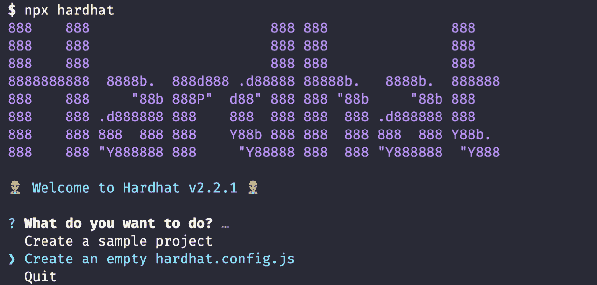
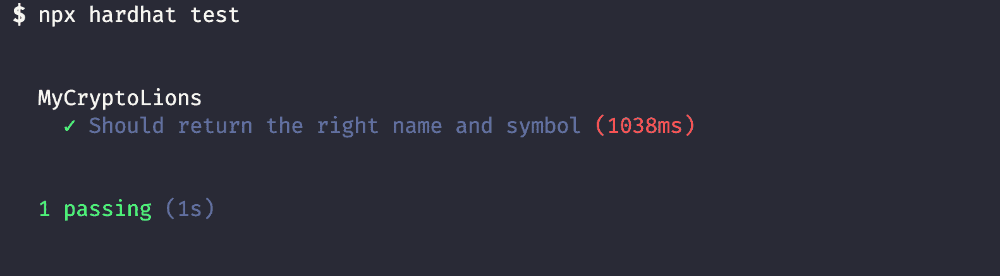
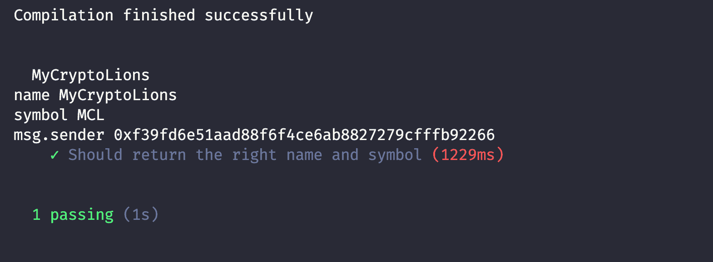

# Solidity 教程——如何用 Hardhat 创建 NFT

> 原文：<https://www.freecodecamp.org/news/solidity-tutorial-hardhat-nfts/>

我是一名开发人员，大部分时间都在编写 JavaScript，所以 Solidity 开发环境有点难学。

大约四个月前，我从松露换成了安全帽。这个很酷的新成员极大地改善了我的编码体验。所以今天我想和我的 Solidity 开发者伙伴们分享一下。

在这篇文章中，我将带您完成初始设置、编译、测试、调试，最后是部署。

在这篇文章的最后，你将能够理解如何使用 Hardhat 将 NFT 合同部署到本地网络。

这篇文章的目的是让你熟悉安全帽。我不会谈论如何写一个 test 或 Solidity 语法。然而，如果你知道如何编写 JavaScript，你应该能够在没有任何扎实知识的情况下理解。

代码见[本回购](https://github.com/taisukemino/hardhat-nft-tutorial)。

## 如何设置项目

让我们首先开始一个 npm 项目:

```
npm init --yes 
```

然后安装 Hardhat 包:

```
npm install --save-dev hardhat 
```

酷！现在，您已经准备好创建一个新的 Hardhat 项目:

```
npx hardhat 
```

选择`Create an empty hardhat.config.js`:



这将在您的根目录中创建`hardhat.config.js`,并指定 solidity 编译器版本:

```
/**
 * @type import('Hardhat/config').HardhatUserConfig
 */
module.exports = {
  solidity: "0.7.3",
}; 
```

## 如何撰写和编制合同

好的，我们将开始写一个简单的合同，然后我们将编译它。

在新的`contracts`目录下创建一个新的实体文件:

```
 mkdir contracts && cd contracts && touch MyCryptoLions.sol 
```

我们将使用开放式齐柏林飞船包裹来写我们的 NFT 合同。首先，安装 open-zeppelin 软件包:

```
npm install --save-dev @openzeppelin/contracts 
```

下面是我们将要编译的合同代码:

```
pragma solidity ^0.7.3;

import "@openzeppelin/contracts/token/ERC721/ERC721.sol";

contract MyCryptoLions is ERC721 {
    constructor(string memory name, string memory symbol)
        ERC721(name, symbol)
    {}
} 
```

在任何 solidity 文件中，你需要做的第一件事就是声明编译器版本。然后我们可以从 open-zeppelin 导入 ERC721 契约(NFT 契约),就像在 JavaScript 中一样。

Solidity 是一种面向契约的语言。就像面向对象语言一样，契约可以有函数和变量等成员。在我们的代码中，我们只有构造函数，它将在我们部署契约时被调用。

我们的契约继承了 ERC721，然后传递将要传递给 ERC721 契约的`name`和`symbol`参数。他们从字面上决定你的 NFT 令牌的名称和符号。

我们将在部署时向`name`和`symbol`传递我们想要的任何值。

要编译它，请运行:

```
npx hardhat compile 
```

您可能会收到一些警告，但为了简单起见，我们会忽略它们。你应该在底部看到`Compilation finished successfully`。

您还应该注意到生成了`/arfifacts`和`/cache`目录。在这篇文章中，你不必担心它们，但是最好记住，如果你想在构建前端时与契约交互，可以在工件中使用`abi`。

## 如何检验合同

由于智能合约大多是金融应用程序，而且也很难更改，因此测试至关重要。

我们将使用一些包进行测试。使用下面的命令安装:

```
npm install --save-dev @nomiclabs/hardhat-waffle ethereum-waffle chai @nomiclabs/hardhat-ethers ethers 
```

是一个智能合约的测试框架。`chai`是断言库。我们将使用摩卡和 Chai 在华夫饼中编写测试。`ethers.js`是一个用于与以太坊区块链交互的 JavaScript SDK。另外两个包是 Hardhat 的插件。

现在，让我们在根目录中创建一个新目录`test`，并在其中创建一个名为`test.js`的新文件:

```
mkdir test && cd test && touch test.js 
```

确保在`hardhat.config.js`中需要`@nomiclabs/hardhat-ethers`,以使其在任何地方都可用:

```
require("@nomiclabs/hardhat-ethers"); 
```

这里有一个简单的测试:

```
const { expect } = require("chai");

describe("MyCryptoLions", function () {
  it("Should return the right name and symbol", async function () {
    const MyCryptoLions = await hre.ethers.getContractFactory("MyCryptoLions");
    const myCryptoLions = await MyCryptoLions.deploy("MyCryptoLions", "MCL");

    await myCryptoLions.deployed();
    expect(await myCryptoLions.name()).to.equal("MyCryptoLions");
    expect(await myCryptoLions.symbol()).to.equal("MCL");
  });
}); 
```

这段代码将我们的契约部署到本地 Hardhat 网络，然后检查`name`和`symbol`值是否是我们所期望的。

运行测试:



太棒了，它通过了测试！

### 如何在 Hardhat 中使用 console.log()

这是你可以用安全帽做的最酷的事情。你可以像在 JavaScript 中一样使用`console.log()`，这在以前是不可能的。`console.log()`光是换安全帽就绰绰有余了。

让我们回到你的 solidity 文件，使用`console.log()`。

```
pragma solidity ^0.7.3;

import "@openzeppelin/contracts/token/ERC721/ERC721.sol";
import "hardhat/console.sol";

contract MyCryptoLions is ERC721 {
    constructor(string memory name, string memory symbol) ERC721(name, symbol) {
        console.log("name", name);
        console.log("symbol", symbol);
        console.log("msg.sender", msg.sender); //msg.sender is the address that initially deploys a contract
    }
} 
```

并使用`npx hardhat test`再次运行测试。然后，该命令将再次编译协定，然后运行测试。您应该能够看到从契约中记录的一些值。



这使得调试对您来说容易多了。

需要注意的是，它仅支持以下数据类型:

*   uint
*   线
*   弯曲件
*   地址

但是除此之外，你可以像写 JavaScript 一样使用它。

## 如何部署合同

好吧！现在，让我们部署我们的合同。我们可以将我们的合同部署到测试网络之一，Mainnet，或者甚至是本地 Mainnet 的镜像版本。

但是在本文中，为了简单起见，我们将部署到 Hardhat 网络的本地内存实例中。默认情况下，此网络在启动时运行。

在根目录下新建一个名为`scripts`的目录，并在其中添加`deploy.js`。

```
mkdir scripts && cd scripts && touch deploy.js 
```

下面是部署脚本。您随构造函数值一起部署:

```
async function main() {
  const MyCryptoLions = await hre.ethers.getContractFactory("MyCryptoLions");
  const myCryptoLions = await MyCryptoLions.deploy("MyCryptoLions", "MCL");

  await myCryptoLions.deployed();

  console.log("MyCryptoLions deployed to:", myCryptoLions.address);
}

main()
  .then(() => process.exit(0))
  .catch((error) => {
    console.error(error);
    process.exit(1);
  }); 
```

您可能希望在部署之前删除`console.log()`。然后使用以下命令运行这个部署脚本:

```
npx hardhat run scripts/deploy.js
MyCryptoLions deployed to: 0x5FbDB2315678afecb367f032d93F642f64180aa3 
```

嘣！现在，您的 NFT 合同已部署到本地网络。

根据您的需要，您可以将在`hardhat.config.js`中配置的任何网络作为目标。你可以在这里找到更多关于配置[的信息。](https://hardhat.org/config/)

## 包扎

Hardhat 还有一些其他很酷的特性，比如有用的堆栈跟踪、对多个 Solidity 编译器版本的支持、健壮的 Mainnet 分叉、强大的类型脚本支持和 Etherescan 中的契约验证。但那是以后的事了！