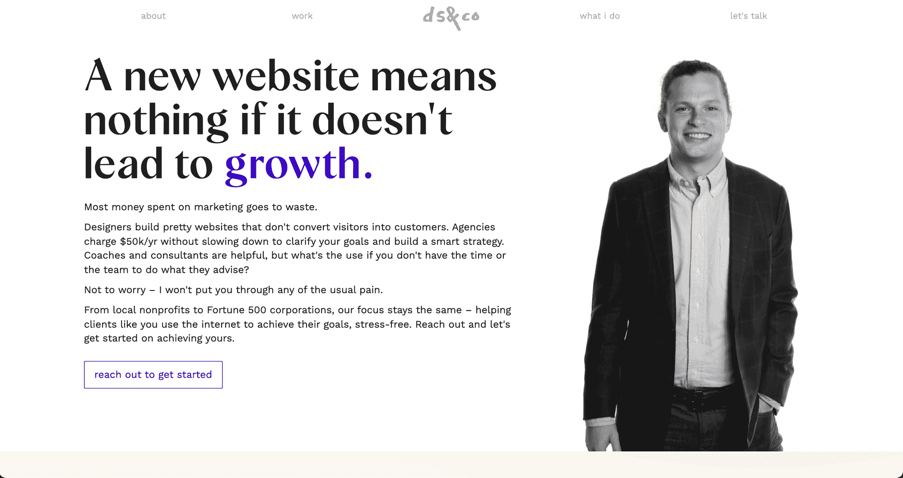

# 个体自由职业者和代理人——有什么区别？

> 原文：<https://www.freecodecamp.org/news/solo-freelancing-vs-agency/>

人们经常问我:

> 我应该把自己描述成一个独立的自由职业者还是一个代理人？

在这篇文章中，我将和你一起探讨这个想法，并希望给你留下一个更清晰的方向感。

TL；大卫:你可以两者兼得。

## 单干和代理自由职业的好处

无论你是将自由职业视为个人事业还是代理机构，毫无疑问，自由职业有很多好处。

首先，自由职业有一些更加客观和不可知的好处:

### 自由职业给你自由

从这个好处列表中的自由开始，就是简单地把它拿出来。这是最广为人知的好处，也是许多自由职业者成为自由职业者的原因之一。

简而言之，你是自己的老板，掌控自己的时间。

### 自由职业让你控制客户互动

作为一名全职员工或网络顾问为一家公司工作意味着你对自己得到什么样的工作几乎没有控制权。换句话说，你不能对客户说不，因为你实际上不是在和客户打交道。

这会导致你从事自己不喜欢的项目。当然，如果你是一名员工，你可以换工作或要求一个特定类型的项目，但这有内在的风险，并不总是一个选项。

自由职业在很大程度上解决了这个问题。一旦你成功了，如果你喜欢一个项目，你就接受它。如果你对客户想要做的事情感到厌烦或不感兴趣，你会拒绝他们的项目。你的财务状况和未来抱负将决定你拒绝客户的回旋余地，但最终决定权在你。

让这个决定在你的控制之下不仅仅意味着接受或拒绝一个客户。这意味着你能够缩小视野，根据你希望作为自由职业者而出名的工作类型，决定自己的方向。

这对你的整体工作满意度和找到特定领域的网络自由职业收入的盈利途径的能力有影响。

### 自由职业消除了收入上限

没有与雇主的工资合同打开了一个全新的学习机会的世界。

虽然给客户开账单可能是一个复杂的问题，但它确实可以让你摆脱正常工作时的收入上限。实现这一点的最佳方式是对[收取你添加的](https://studywebdevelopment.com/hourly-billing-vs-value-pricing.html)价值，而不是按小时计费。

## 单干和代理自由职业有什么区别？

至于你将要执行的任务，真的没有什么不同。

自由职业者和中介可以做完全一样的事情。

主要区别在于:

*   单干自由职业者一般会接较小的项目。
*   代理公司通常有一个团队，所以他们可以承担更多的项目。
*   代理商可以被出售，所以这是自由职业者应该努力的方向。

你选择的方法不会改变这样一个事实:你将与客户打交道，设计和建立网站，添加功能，照顾客户关系，以及管理使客户项目正常运行所需的所有其他细节。

你可以看看自由职业者和代理公司的网站。

如果你浏览一个自由职业者的网站，你会发现它通常由很多部分组成，包括技能、工作经历和联系方式。

自由职业者通常试图传达的信息是“我是谁，这是我擅长的，这是你联系我的方式。”

这里有两个很好的例子:

### 杰西卡·海恩斯-教练和顾问的自由职业者

### 迪伦·斯潘塞——多面手自由职业者

代理网站将展示他们如何以专家的方式解决你的特殊问题。

代理机构也经常专注于特定的利基市场，这是真正盈利的途径。

这里有两个很好的例子:

### PaperStreet -律师事务所代理

### 水管工职业介绍所

这类网站的整体氛围通常比个体自由职业者组合网站更专业，因此，它们吸引了不同类型的客户。

## 自然进程:从独奏到代理

自由职业之旅的开始可能会令人生畏，并给那些没有正确指导的人带来许多不确定性。有一点肯定不是不确定的，就是关于开始自由职业之旅是否需要网站的问题。

答案是响亮的“是”。

作为一名自由职业者，你的个人网站就像一个在线作品集，展示你所做的优秀作品。它还能让潜在客户看到你的技能是否符合他们的要求，如果你愿意，它还能让你一窥自己的为人。

公平地说，许多(如果不是大多数的话)个体自由职业者网站实际上只是个人作品集网站。

这是开始自由职业之旅的一个合乎逻辑的方式，因为它给了人们一个中心位置来看待你的专业自由职业能力，也是大多数人开始自由职业之旅时选择的路线。

随着你开始接触越来越多的客户，你可能会觉得需要更多的人来帮助你完成工作。这可能会给你带来外包一些工作的机会，也是一个很好的时机来转变你作为一个代理商的网络形象。

同样，这里的区别很大程度上是表面上的，但我知道，如果我被视为一家代理公司，我会更愿意外包工作并将其用于客户交付。

另一个原因是，一旦你熟悉了自由职业的来龙去脉，你就可以开始过渡到代理工作，因为你现在可以很容易地在你的专业服务中增加额外的服务，而不用担心你是否真的能够做这项工作。

## 你应该选择独唱还是代理的方式？

人们经常过于关注选择建立一个独立的自由职业者网站还是一个代理网站，而实际上他们应该只关注其中的一个。

随着初级自由职业者转变为更有经验的经营者，转变为代表代理机构的在线存在是有意义的。

然而，如果你想走建立个人品牌的道路，这可能不是正确的方法。

如果执行得当，个人品牌会非常强大，因此一个伟大的投资组合网站可以成为这条道路上的催化剂。

大多数自由职业者会更好地从个人网站开始，然后随着他们的信心、团队和能力的增长，过渡到代理网站。

为你自由职业的成功干杯，

狭海峡