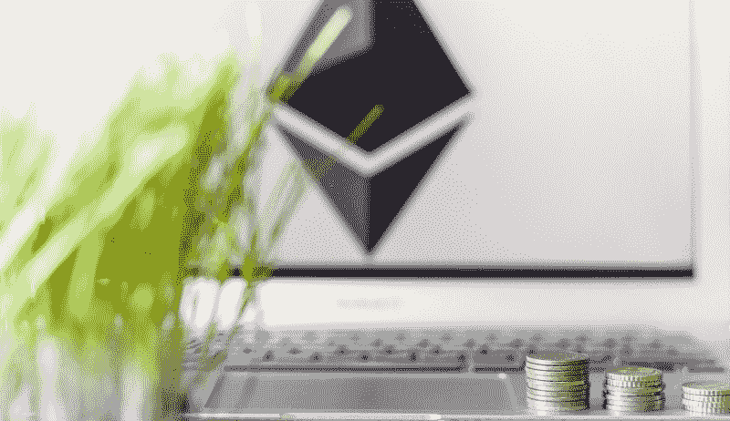
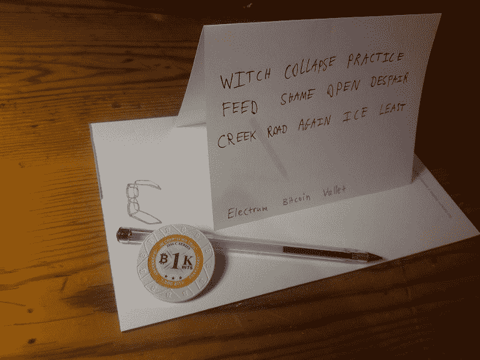
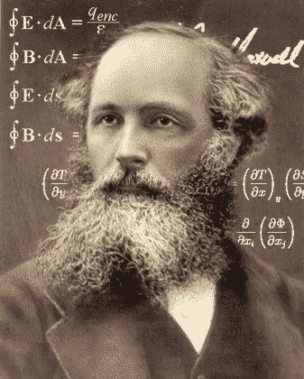

# 如何让 DApp 用户找回丢失的私钥

> 原文：<https://www.freecodecamp.org/news/solutions-for-private-key-management-in-decentralized-apps-d20b25c7474a/>

皮埃尔-玛丽·里维埃尔

# 如何让 DApp 用户找回丢失的私钥

在以太坊上，私钥用于访问帐户、签署消息等。一旦您无法访问您的私钥，您将无法访问该帐户中存储的所有资金。

这和丢失信用卡密码有什么不同？你不能要求银行给你一个新的代码，因为以太坊上不存在银行。你的资金仍然存在你在区块链的账户上，但是你无法提取。

区块链以太坊的账户和[DApp-]服务旨在去中心化，没有人代表你保管访问密码。

将你的私钥存储在数据库中的服务将能够随时访问你的资金——就像银行一样——而这恰恰与以太坊社区试图实现的目标背道而驰。

那么，我们如何协调以太坊的去中心化呼吁和用户对支持服务的需求呢？

对于分散的服务提供商来说，成为金融托管人也有很大的法律影响。看看我们自己的案例:DApact 正在低收入国家现有的贷款代理基础上建立一个信贷即服务平台。我们将自己定义为一家软件公司——一个面向合法注册的本地贷款机构的即插即用技术平台。

获得用户的资金将使我们成为一家金融服务提供商，而不是一家软件公司，这将意味着当地金融监管机构的审查。这最终将转化为要求在每个有 DApact 的国家拥有某种银行执照和资本存款。

在纯粹的 DApps 服务中，一旦你丢失了你的私钥，绝对没有办法重新获得你的资金。用户需要自己将恢复密码备份到安全的地方。实际上最有效的方法是逐字记下密码三次，并将硬拷贝放在不同的地方。

No joke

某些用户倾向于丢失这个密码短语，或者根本不备份它。这对所有 DApps 开发人员来说都是一个重大问题，特别是对 DApact 来说，因为我们面对的人群往往不太了解技术。因此，必须为我们的用户提供可恢复性解决方案。

必须向用户提供适合他们对分散式系统的理解的私钥可恢复性解决方案。

此类可恢复性解决方案应遵循以下三个标准:

*   **外部:**分散的服务提供商不能访问私钥。
*   **可定制:**即使在私钥丢失的情况下，用户也应该能够理解和配置恢复选项。
*   **安全:**通过恢复选项劫持另一个人的账户应该不容易。只有实际拥有该帐户的人才能恢复它。

### 现有解决方案

以下是以太坊社区中 UX 设计师正在实施、增强或探索的解决方案的概述，从最广泛的开始。

#### 多个所有者

MultiSig 钱包允许设置多个所有者 *n* 。如果需要的所有者少于 *n* 个，剩下的所有者可以在失去访问权的情况下替换所有者。然而，这种解决方案需要至少 3 个所有者或所有者设备(交易需要 2 次确认)以及所有者之间的高度信任。

#### 记忆的

助记符(又名种子短语或密码短语)是一系列可以通过加密方式获得私钥的单词。用户需要自己备份他们的恢复助记符，并确保其安全，以便他们可以在丢失时重新生成他们的私钥。

这个恢复选项现在是以太坊地址和钱包的标准。在高级 DApps 用户中，助记符已经成为一种很好理解的机制，然而，不太了解的用户应该有不同的选项。记忆术就像保存它们的地方一样安全。写在一张纸上，他们暴露于火灾和洪水，盗窃和摇摇欲坠。

#### 生物特征数据

该行业的首选解决方案是生物特征数据，如指纹、虹膜扫描或面部识别。生物特征数据不能像一张纸上的密码一样“丢失”。如果苹果和三星在生物识别上投入这么多，这一定是一个很好的解决方案，对吗？

这个选项的问题是，一旦一个人的生物特征数据暴露在公众面前，就没有办法再用它来保护一个帐户，因为你不能像更改密码或转换帐户那样真正地更改你的指纹。随着人脸识别成为主流，这种可能性变得越来越有可能，Github 上甚至有一个基于 [OpenCV 的回购。](https://github.com/ageitgey/face_recognition)

生物识别技术的另一个缺点是，不同的指纹传感器可能会变得非常模糊，并且不完全匹配，例如，如果用户割伤自己，那么可能会出现问题。

#### 社会恢复

用户可以确定能够代表他们恢复对其账户的访问的一组朋友(即，他们中的每一个都持有签名的一部分，这些签名组合在一起将授权对账户的访问)。只有在所有好友都同意的情况下，才更换账号所有人。

这种解决方案的最大问题是，即使所有者没有要求，该组朋友也可能一起工作，窃取所有者的帐户访问权限。这就是为什么理想情况下，该组的成员不应该知道还有谁是该组的一部分。

微信已经成功实现了某种社交恢复解决方案，允许密码恢复:当用户丢失密码时，微信会要求他们在一个大名单中选择联系人列表中的人。知道微信包含了明智的银行信息，这对于 DApps 来说绝对是一个很好的引子。

#### 标准 KYC 程序

与现代银行对新客户执行 KYC 程序的方式类似，用户可以向 KYC 提供商表明自己的身份，以便重新获得他们的资金。然而，用户需要执行一次该过程来设置它，以便提供商知道地址背后的身份。

该解决方案已用于令牌交换操作(例如 Nimiq)。KYC 验证通常由像 IDnow 这样的第三方提供者处理，这是昂贵的，并且有些违背区块链原则。

#### 防瘫痪

这个新概念也被称为*时间锁定恢复*和*最后手段恢复*。如果帐户的访问权限丢失，可以将其标记为丢失。此外，将它标记为丢失的人可以放入押金。现在开始一段时间，在此之后帐户被替换。在此期间，实际的账户所有者可以通过进行交易来证明账户实际上没有丢失。如果是这样的话，攻击者就失去了转移到该账户的存款。

随着越来越多的设计者进入区块链空间，有希望出现一个伟大的头脑，为密钥管理想出杀手 UX。或者谁知道呢，也许会是一个中年历史学家提出一些古老的骑士技巧来保护黄金…

目前，根据我们的 3 个标准(外部性、可定制性、安全性)，许多解决方案(或它们的组合)显示出良好的潜力。一旦社区就可接受的可恢复性解决方案达成一致，就需要在整个生态系统中一致采用通用设计语言和标准化最佳实践，以便 DApps 用户习惯可恢复性模式。

**DApact 是一个针对小额信贷业务的区块链框架。**

**你可以在推特上关注我们[或者加入](https://twitter.com/TheDapact)[电报](https://t.me/thedapact)**