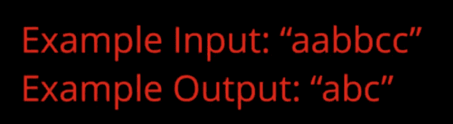
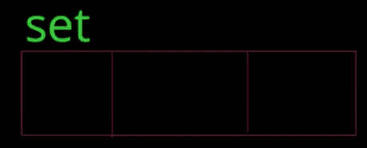

# 谷歌面试问题指南:用 Python 删除重复出现的字符

> 原文：<https://www.freecodecamp.org/news/solving-a-google-interview-question-python-2-code-included-eddefcaeffb2/>

安东尼·西斯蒂利

# 谷歌面试问题指南:用 Python 删除重复出现的字符


Photo by Tim Gouw from Pexels

如今，谷歌面试风靡一时。但是有时候，面试可以让我们变得更好。尤其是如果是为了一个我们真正想要的职位。

作为一名学生，我有幸在多家顶级公司面试，并在硅谷找到了一份软件工程师的工作。

我的目标是帮助你得到你梦寐以求的工作！

我们将讨论一个经典问题，这个问题可能会出现在你的下一次谷歌面试中。

警告:如果你是编码老手，你可能已经知道如何解决这个问题了！

如果你想在明年得到一份**实习**或**全职**工作，那么你肯定会从这篇文章中受益。？？？

### 问题:给定一个字符串作为输入，删除任何重复出现的字符，并返回新的字符串。

如果你喜欢用视频来解释这个问题，[我在这里做了一个](https://www.youtube.com/watch?v=EaNX2PG6PEM)。



从上面的例子中我们可以看到，输出是“abc”，因为我们删除了第二个“a”、“b”和“c”。

首先，让我们在 Python 2.7 中设置我们的函数。

```
def deleteReoccurringCharacters(string):
```

为了解决这个问题，我们将使用一种称为 HashSet 的特定数据结构。



A Set

您可以将集合视为类似于数组，但有两个主要的例外。

1.  **完全无序**
2.  **不能有重复**

因为它是无序的，我们还需要一个空字符串来存储我们按顺序添加到集合中的字符。这将是我们返回的字符串。

让我们把这两样东西都设置好。

```
def deleteReoccurringCharacters(string):    seenCharacters = set()    outputString = ''
```

现在我们已经建立了我们需要的数据结构，让我们来谈谈我们的算法。

由于集合在内存中的工作方式，它的查找时间复杂度为 0(1)。

这意味着我们可以用它来检查我们是否已经访问了一个角色！

### 我们的算法

**遍历初始字符串中的所有字符，并执行以下操作:**

> 第一步:检查角色是否已经在我们的集合中

> 第二步:如果它不在集合中，将它添加到集合中并附加到字符串中

让我们看看这在代码中是什么样子的？？？

```
for char in string:    if char not in seenCharacters:        seenCharacters.add(char)        outputString += char
```

我们不必担心“else”情况，因为我们不会对重复出现的字符本身做任何事情。

现在剩下要做的就是返回 outputString。

**完成后的代码看起来是这样的:**

```
def deleteReoccurringCharacters(string):    seenCharacters = set()    outputString = ''    for char in string:        if char not in seenCharacters:            seenCharacters.add(char)            outputString += char    return outputString
```

现在你知道了！

如果这是一次面试，你的招聘人员会问你时间和空间的复杂性。

我们来做一点分析。

### 时间复杂度

遍历整个输入字符串的时间复杂度为 O(n)，因为字符串本身有 *n* 个字符。

对于这些字符中的每一个，我们必须检查我们是否已经看到了……然而，由于 HashSet 的查找时间为 O(1 ),我们的时间复杂度不受影响。

留给我们一个最终的时间复杂度为 O(n)。

### 空间复杂性

最坏的情况是，我们得到一个包含所有唯一字符的字符串。比如“abcdef”。

在这种情况下，我们将在我们的字符串和集合中存储所有的 *n* 元素。

然而，我们也受限于英文字母的大小。

这是一个很好的机会问我们的面试官什么类型的字符在字符串中是唯一的(大写/小写/数字/符号)。

假设初始字符串将包含字母表中的小写字母，因为字母表是有限的，所以我们的集合和输出字符串永远不会大于 26 个字符。

留给我们最坏情况的空间复杂度为**O(1)。**

### 你现在知道如何解决谷歌面试问题了！

这个问题很可能在面试的早期出现，因为它很直接…就像在线测试，或者第一个电话。

如果你和我一样是视觉学习者，请看我制作的视频，进一步解释解决方案。 **我每天都在制作一个新的教程视频，围绕着开始你的软件生涯。**

我也在 Github [这里](https://github.com/AtotheY/YoutubeTutorials/blob/master/InterviewPrep/deleteReoccuringCharacters.py)发布了完成的代码。

感谢收看，祝你好运！

。甲#33