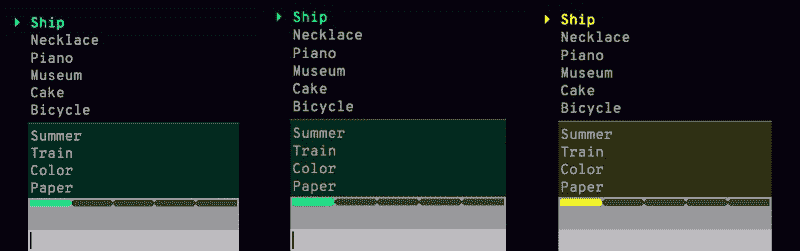
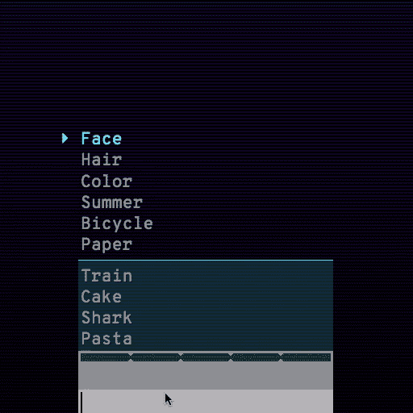
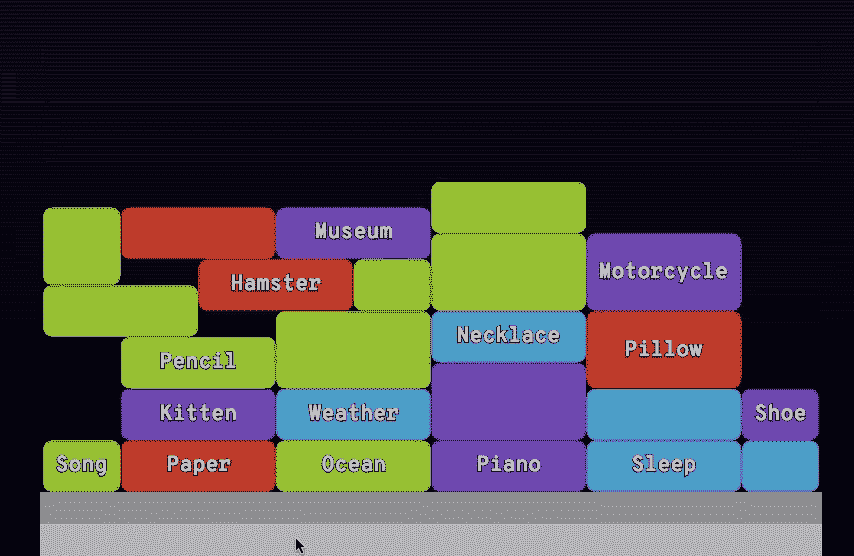
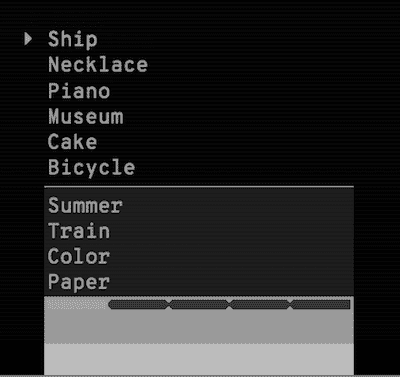
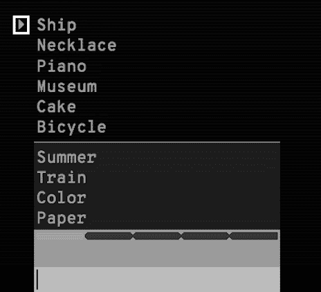
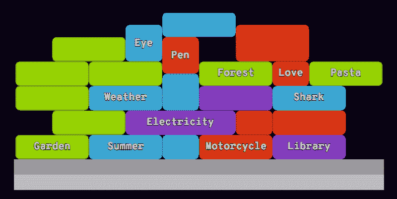
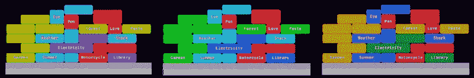
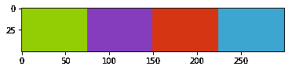
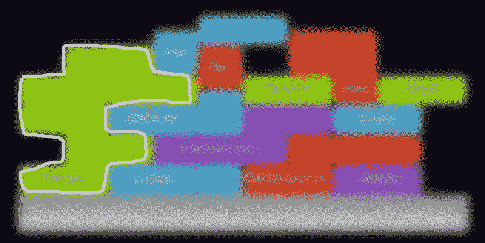
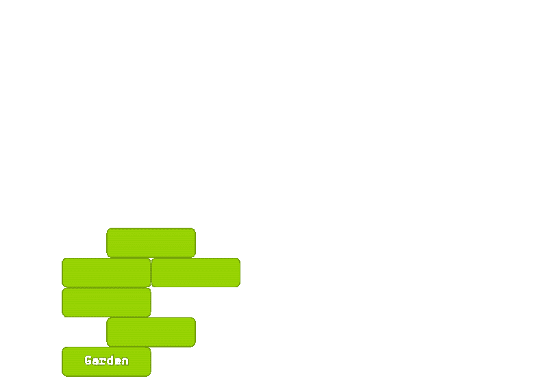

# 如何用 OpenCV 和 Word2Vec 解决 Google 的 Semantris 游戏

> 原文：<https://www.freecodecamp.org/news/solving-googles-semantris-using-opencv-and-word2vec-7ea5eb36d0c7/>

作者 Pravendra Singh

# 如何用 OpenCV 和 Word2Vec 解决 Google 的 Semantris 游戏

#### 编写一个程序来播放 Google Semantris

> 自动化是好的，只要你知道机器该放在哪里。-埃利亚胡·戈德拉特

> [Semantris](https://research.google.com/semantris/) 是 Google 开发的一套单词联想游戏，它使用语义搜索，根据玩家的输入来预测游戏中的一个相关单词。

游戏中有两种模式。

**街机**

街机模式要求玩家想出特定单词的关联单词。在越来越多的单词填满你的屏幕之前，你应该尽可能快的思考和输入。

Semantris ARCADE mode

**块**

积木是一种回合制游戏模式。你可以慢慢想出不同类型的线索，看看游戏最理解哪些。

Semantris BLOCKS mode

玩了一会儿后，我意识到这两种游戏模式都使用[模式识别作为主要的游戏机制](http://www.peachpit.com/articles/article.aspx?p=98123&seqNum=2)。这时候我开始想它是否可以自动化。

### 事实证明，这是可能的

Semantris-Solver 使用以下程序来玩游戏:

*   **使用计算机视觉技术捕捉当前游戏状态**
*   **识别要输入的单词以获得更高的奖励/更长的游戏时间**
*   **使用单词嵌入找到相关单词**

在接下来的几节中，我们将深入研究两种游戏模式下的 Semantris-Solver 的工作原理。

### 拱廊

人类玩家将使用以下动作来玩街机模式:

*   在游戏中找到一个或多个突出显示的单词
*   通过输入这些单词的相关单词，在突出显示的区域获得这些单词
*   在你用尽屏幕上的空间来输入新单词之前，继续这样做

> 另外，街机模式有三种主题颜色。

Semantris ARCADE theme colors

你会意识到主题颜色在这里不起任何作用——如果我们改变主题颜色，游戏的运行机制将保持不变。改变的是高亮单词的定义。

> *如果一个单词的左边有一个指针形状，那么这个单词就会被**高亮显示**，在这种情况下就是**船**。*

#### 色彩空间转换

Semantris-Solver 的 ARCADE 模式首先捕获笔记本电脑屏幕的截图，并将其转换为灰度图像，不知道实际的颜色。

*Semantris ARCADE mode (gray-scale)*

#### 模板匹配

我们的下一步将是在捕获的图像中找到突出显示的单词。OpenCV 提供了一种叫做[模板匹配](https://docs.opencv.org/3.3.0/d4/dc6/tutorial_py_template_matching.html)的方法，用于在更大的图像中搜索并找到模板图像的位置。

我们将使用指针形状(◔)的裁剪版本作为模板图像，以在捕获的屏幕中找到它的位置。

*Semantris ARCADE highlighted word selection*

#### 光学字符识别(OCR)

Highlighted word image

根据指针的位置，会在其旁边裁剪一个部分，并带有高亮显示的单词。

使用 [Tesseract OCR](https://github.com/tesseract-ocr/tesseract) 将裁剪后的图像转换成文本；在这种情况下，它会给我们**飞船**。

> 在不止一个高亮单词的情况下，它们被一个接一个地输入以保持游戏继续进行。

#### 关联单词选择(使用单词嵌入)

[在谷歌新闻语料库](https://github.com/mmihaltz/word2vec-GoogleNews-vectors)上预先训练的 Word2Vec 被用作单词嵌入模型，以找到给定单词的[最相似的](https://radimrehurek.com/gensim/models/word2vec.html#gensim.models.word2vec.Word2Vec.most_similar)单词(关联)。

在这种情况下，它将返回“**vessel”**作为“**ship”**(去掉形态相似词后的*)的关联词输入。*

> 该程序将输入这个相关的单词，并捕获更新的游戏屏幕以继续。

### 阻碍

在这种模式下，对于给定的主题，有四种可能的颜色的单词块。单词块中可能包含也可能不包含单词。

输入单词块的相关单词将会移除与之相连的相同颜色的块，就像古老的俄罗斯方块一样。

人类玩家将使用以下动作来玩街机模式:

*   输入单词块的相关单词，与大多数相同颜色的单词块连接(如果可能)
*   在你用尽屏幕上的空间来输入新单词之前，继续这样做

Semantris BLOCKS mode captured screen

你会意识到单词块的颜色在这次扮演着重要的角色。您必须输入与更多相同颜色区块相连的单词区块的相关单词才能获得更高的分数。

> 除此之外，blocks 模式中还有三种主题颜色。

Semantris BLOCKS theme colors

#### 调色板生成

这一次我们不能将捕获的图像转换成它的灰度版本。我们需要知道颜色属性来区分不同的单词块。

对捕获屏幕的像素运行 **K-mean 聚类**将在排除背景色(如白色(文本颜色)、黑色(背景颜色)和灰色(文本输入)后，给出图像中所有突出的颜色。

*Semantris BLOCKS theme color palette*

#### 轮廓检测

现在我们已经有了当前主题中的所有四种颜色，我们需要知道选择哪个单词块来获得最大分数。

换句话说，如果我们计算每个连接单词块组的面积(*彼此连接的相同颜色的单词块*)并选择具有最大面积的一个，我们将得到期望的连接单词块组。

> [*轮廓*](https://docs.opencv.org/3.4/d4/d73/tutorial_py_contours_begin.html) *是连接沿一条边界的所有连续点的曲线，具有相同的颜色或强度。*

单词块组可以被认为是该颜色的轮廓；如果它连接到相同颜色的更多块，轮廓的面积将是连接的单词块的总和。

Semantris BLOCKS mode with maximum area contour highlighted

分别为所有字块颜色计算轮廓(使用 OpenCV 的 [findCountours](https://docs.opencv.org/3.3.1/d3/dc0/group__imgproc__shape.html#ga17ed9f5d79ae97bd4c7cf18403e1689a) 函数),并选择面积最大的颜色。

我们可以通过在捕获的屏幕和轮廓遮罩之间进行按位 and 运算来选择最大面积轮廓。

Maximum area contour

#### 单词检测(使用 Tesseract 和 Word2Vec)

使用 [Tesseract OCR](https://github.com/tesseract-ocr/tesseract) 将轮廓图像转换成文本；在这种情况下，它会给我们**花园**。

和街机模式类似，我们会用 Word2Vec 找到和它最相似的词，这次会是**花坛**。

### 丰富

Contour with failing OCR

在某些情况下，当前的 OCR 进程无法正确识别单词。

例如，对于该轮廓，它将返回“**eloctrlctly”**，而不是“**电力”**。

鉴于这是一个无效的单词建议，Word2Vec 模型不会为它返回任何类似的单词。在这种情况下，建议单词本身作为关联单词输入，只是为了让游戏继续进行。

> 一个拼写纠正模型可以帮上忙，把**eloctrlity**改成 **Electricity。**

> *我已经在 GitHub 知识库上创建了一个[问题](https://github.com/pravj/semantris-solver/issues/7)，如果你喜欢，请随意投稿。？*

### 源代码

#### [Semantris-Solver](https://github.com/pravj/semantris-solver) (GitHub)

它被实现为一个 CLI 工具，允许你在游戏模式之间切换。你可以查看实现这两种模式的 IPython 笔记本。

*   [街机模式](https://github.com/pravj/semantris-solver/blob/master/notebooks/Semantris%20Arcade%20Mode.ipynb)
*   [块模式](https://github.com/pravj/semantris-solver/blob/master/notebooks/Semantris%20Block%20Mode.ipynb)

#### 属国

如果没有以下软件工具，就不可能构建 Semantris-Solver。

*   OpenCV
*   Word2Vec (gensim)
*   pyautogui(截图并输入相关单词)
*   宇宙魔方(OCR)

希望你喜欢我的周末黑客故事。请随时提供您的反馈。

在推特上关注我或者查看我的个人网站 hackpravj.com T2。