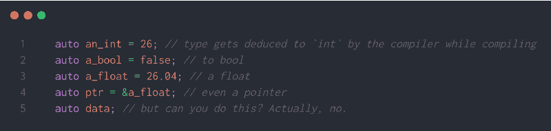
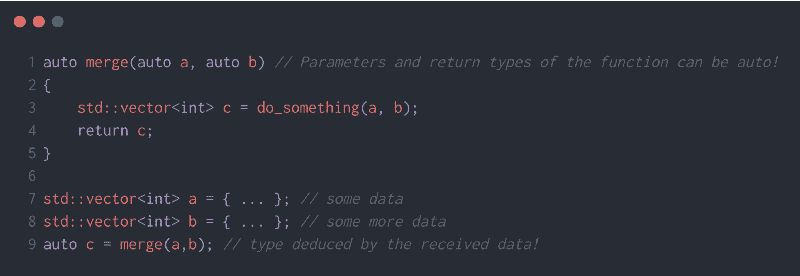
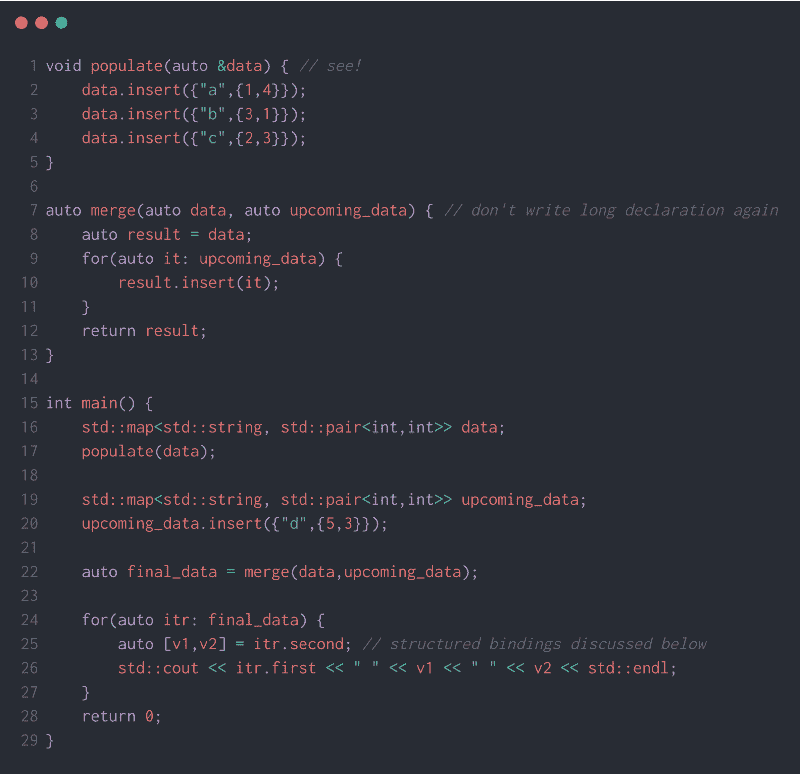
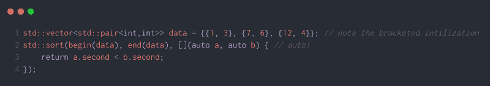
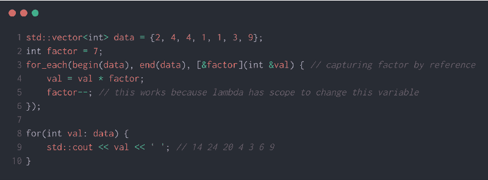
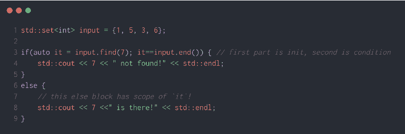
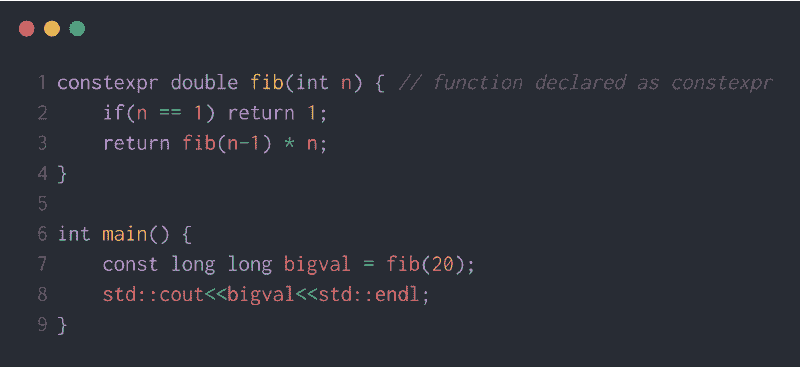
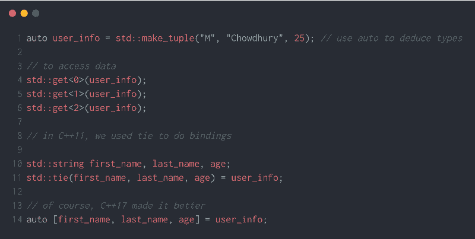

# 每个开发人员都应该知道的一些非常棒的现代 C++特性

> 原文：<https://www.freecodecamp.org/news/some-awesome-modern-c-features-that-every-developer-should-know-5e3bf6f79a3c/>

作为一门语言，C++已经进化了很多。

当然，这不是一夜之间发生的。曾经有一段时间，C++缺乏活力。喜欢这种语言很难。

但是当 C++标准委员会决定加快速度时，事情发生了变化。

自 2011 年以来，C++已经成为一种动态的、不断发展的语言，这是很多人所希望的。

不要错误地认为语言变得更容易了。它仍然是广泛使用的最难的编程语言之一，如果不是最难的话。但是 C++也变得比以前的版本更加用户友好。

在我的上一篇文章中，我谈到了在过去几年中得到丰富的 C++算法库。

今天，我们将研究一些每个开发人员都想知道的新特性(从 C++11 开始，顺便说一下，c++ 11 已经 8 岁了)。

还要注意的是，我在本文中跳过了一些高级特性，但是我愿意在以后再写。？️

走吧。

#### auto 关键字

当 C++11 第一次引入`**auto**`时，生活变得更加容易。

`**auto**`的想法是让 C++编译器在编译时推断出你的数据类型——而不是让你每次都声明类型*。当你拥有像`**map<string,vector<pair<i**` nt，int > > >这样的数据类型时，这是多么的方便？*



看第 5 行。你不能声明没有`**initializer**`的东西。这实际上很有道理。第 5 行没有让编译器知道数据类型是什么。

最初，`**auto**`有些受限。然后在后来的语言版本中，增加了更多的功能！



在第 7 行和第 8 行，我使用了带括号的初始化。这也是 C++11 中增加的一个新特性。

请记住，在使用`**auto**`的情况下，编译器必须有一些方法来推断您的类型。

现在一个非常好的问题，*如果我们写* `**auto a = {1, 2, 3}**`会发生什么？这是编译错误吗？那是矢量吗？


smh ?

实际上，C++11 引入了`**std::initializer_list<ty**` pe >。如果 dec `**lare**` d auto，带括号的初始化列表将被视为这个轻量级容器。

最后，正如我前面提到的，当您有复杂的数据结构时，编译器的类型推断非常有用:



别忘了看看第 25 行！表达式`**auto [v1,v2] = itr.second**`实际上是 C++17 中的一个新特性。这被称为**结构化绑定**。在该语言的早期版本中，您必须单独提取每个变量。但是结构化绑定使它变得更加方便。

此外，如果您想通过引用获得数据，只需添加一个符号— `**auto &[v1,v2] = itr.second**`。

干净利落。

#### λ表达式

C++11 引入了 lambda 表达式，类似于 JavaScript 中的匿名函数。它们是函数对象，没有任何名称，它们基于一些简洁的语法捕获各种*范围*上的变量。它们也可以赋给变量。

如果你需要在代码中快速完成一些小事情，但是你不愿意为此写一个完整的独立函数，那么 Lambdas 是非常有用的。另一个非常常见的用途是将它们用作比较函数。



上面的例子有很多要说的。

首先，请注意花括号初始化是如何为您提升权重的。然后是泛型`**begin(), end()**`，这也是 C++11 中的一个新增功能。然后是 lambda 函数，作为数据的比较器。lambda 函数的参数声明为`**auto**` ，这是在 C++14 中添加的。在此之前，我们不能使用`**auto**`作为函数参数。

注意我们如何用方括号`**[]**`开始 lambda 表达式。它们定义了 lambda 的范围——它对局部变量和对象拥有多少权限。

正如在现代 C++上的这个[令人敬畏的存储库](https://github.com/AnthonyCalandra/modern-cpp-features#lambda-expressions)中所定义的:

*   `[]` —不捕捉任何内容。所以你不能在你的 lambda 表达式中使用任何外部作用域的局部变量。您只能使用参数。
*   `[=]` —通过值捕获范围内的本地对象(本地变量、参数)。您可以使用它们，但不能修改它们。
*   `[&]` —通过引用捕获范围内的局部对象(局部变量、参数)。您可以修改它们。比如下面这个例子。
*   `[this]` —通过值捕获`this`指针。
*   `[a, &b]` —按值捕捉对象`a`，按引用捕捉对象`b`。

所以，如果在 lambda 函数中，你想把数据转换成其他格式，你可以通过利用作用域来使用 lambda。例如:



在上面的例子中，如果您已经通过 lambda 表达式中的值(`**[factor]**`)捕获了局部变量，那么您不能更改第 5 行中的`**factor**`。因为很简单，你没有权利这么做。不要滥用你的权利！？

最后，注意我们把`**val**`作为参考。这确保了 lambda 函数内部的任何变化都会实际改变`**vector**`。


They feel joyous after learning about modern C++! (Photo by [Ian Schneider](https://unsplash.com/@goian?utm_source=medium&utm_medium=referral) on [Unsplash](https://unsplash.com?utm_source=medium&utm_medium=referral))

#### if & switch 中的 Init 语句

我真的很喜欢 C++17 的这个特性，在我了解它之后。



显然，现在你可以在`**if/switch**`块中同时初始化变量和检查条件。这对于保持代码简洁和干净非常有帮助。一般形式是:

```
if( init-statement(x); condition(x)) {
    // do some stuff here
} else {
    // else has the scope of x
    // do some other stuff
}
```

#### 在编译时由 constexpr 完成

`**constexpr**`爽！

假设你有一个表达式要计算，它的值一旦初始化就不会改变。您可以预先计算该值，然后将其用作宏。或者如 C++11 所提供的，可以使用`**constexpr**`。

程序员倾向于尽可能减少他们程序的运行时间。因此，如果你能让编译器做一些操作，并减轻运行时的负担，那么运行时就能得到改善。



上面的代码是一个很常见的`**constexpr**`的例子。

由于我们将斐波那契计算函数声明为`**constexpr**`，编译器可以在编译时预先计算`**fib(20)**` 。所以在编译之后，它可以替换这一行

`**const long long bigval = fib(20);**` 同

`**const long long bigval = 2432902008176640000;**`

注意，传递的参数是一个`**const**`值。这是声明为`**constexpr**`的函数的一个要点——传递的参数也应该是`**constexpr**`或`**const**`。否则，该函数将表现为普通函数，这意味着在编译时没有预先计算。

变量也可以是`**constexpr**`。在这种情况下，正如您所猜测的，这些变量必须在编译时可求值。否则，您会得到一个编译错误。

有趣的是，后来在 C++17 中，`[**constexpr-if**](https://hackernoon.com/a-tour-of-c-17-if-constexpr-3ea62f62ff65)``[**constexpr-lambda**](https://docs.microsoft.com/en-us/cpp/cpp/lambda-expressions-constexpr?view=vs-2019)`**被引入。**

#### **元组**

**与`**pair**`非常相似，`**tuple**`是各种数据类型的固定大小值的集合。**

****

**有时候用`**std::array**`代替`**tuple**`更方便。 **`array`** 类似于普通的 C 类型数组以及 C++标准库的一些功能。这个数据结构是在 C++11 中添加的。**

#### **类模板参数推导**

**一个非常冗长的特性名称。这个想法是，从 C++17 开始，模板的参数演绎也会发生在标准的类模板上。以前，只有函数模板支持它。**

**因此，**

```
`std::pair<std::string, int> user = {"M", 25}; // previous
std::pair user = {"M", 25}; // C++17`
```

**演绎的类型是隐式的。这对`**tuple**`来说变得更加方便。**

```
`// previous
std::tuple<std::string, std::string, int> user ("M", "Chy", 25);
// deduction in action! 
std::tuple user2("M", "Chy", 25);`
```

**如果你不太熟悉 C++模板，上面的这个特性就没有任何意义。**

#### **智能指针**

**指针可以是地狱。**

**由于像 C++这样的语言给程序员提供的自由，有时候搬起石头砸自己的脚会变得非常容易。在许多情况下，指针是造成伤害的原因。**

**幸运的是，C++11 引入了智能指针，这种指针比原始指针方便得多。它们通过尽可能释放内存来帮助程序员防止内存泄漏。它们还提供异常安全。**

**我想在这篇文章中写一写 C++中的智能指针。但是很明显，关于它们有很多重要的细节。他们应该有自己的帖子，我当然愿意在不久的将来写一篇关于他们的帖子。**

**今天到此为止。请记住，C++实际上在语言的最新版本中添加了很多更新的特性。如果你感兴趣，你应该去看看。这里有一个非常棒的现代 C++库，字面意思是[棒极了的现代 C++](https://github.com/rigtorp/awesome-modern-cpp) ！**

**再见！**