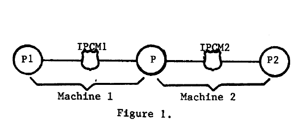
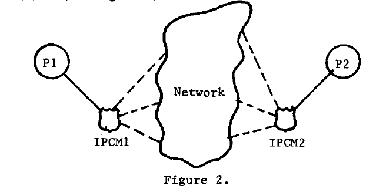
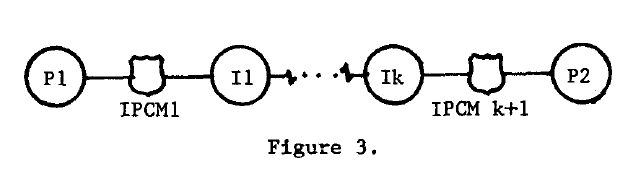
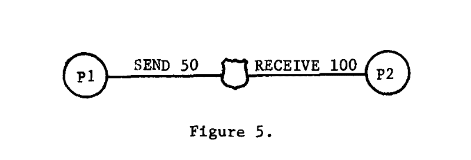
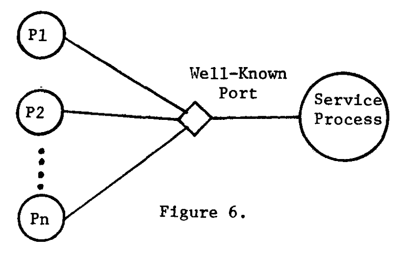
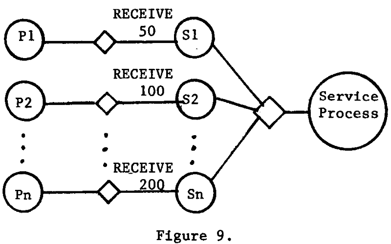

# 网络通信设计中的一些约束和权衡:综述

> 原文：<https://www.freecodecamp.org/news/some-constraints-trade-offs-in-the-design-of-network-communications-a-summary-19589efd55d9/>

本文摘录了 E. A. Akkoyunlu 等人于 1975 年发表的论文[“网络通信设计中的一些限制和权衡”](http://dsg.tuwien.ac.at/linksites/teaching/courses/AdvancedDistributedSystems/download/1975_Akkoyunlu,%20Ekanadham,%20Huber_Some%20constraints%20and%20tradeoffs%20in%20the%20design%20of%20network%20communications.pdf)中的内容。

本文重点介绍进程间通信(IPC)原语的包含以及这样做的后果。具体来说，它探索了下面针对没有系统缓冲和中断的顺序进程的分布式系统详细描述的超时和插入属性特征。

它还涉及到两个将军的问题，即两个进程不可能在一个不可靠的网络上达成一致的决定。

### 简介:

进程间通信机制(IPCM)的设计可以通过陈述系统的行为和所需的服务来描述。IPCM 中包含的功能非常关键，因为它们可能相互依赖，因此设计过程应该从详细的规格开始。这涉及到对每个决定的后果的透彻理解。

> 本文的主要目的是指出系统中要包含的各种功能的相互依赖性。

该论文指出，有时功能之间的不兼容性从一开始就显而易见。然而，有时看起来完全不相关的两个特性最终会严重影响彼此。如果一开始没有探索所涉及的权衡，就不可能包含想要的特性。试图适应相互冲突的特性会导致代码混乱，而代价是优雅。

#### 中间过程:

让我们假设一个系统不允许不能建立连接的进程之间的间接通信。用户只关心消息的逻辑发送者和接收者:他们不关心消息通过什么路径或者经过多少过程才能到达最终目的地。在这种情况下，中间过程来拯救我们。它们不是 IPCM 的一部分，而是插入在两个进程之间，当连接建立时，这两个进程不能通过目录或代理进程直接通信。他们是唯一意识到进程间间接通信本质的人。

### 集中式与分布式系统:

#### 集中式通信设施

1.  具有能够维护与系统中发生的通信相关的所有状态信息的单个代理
2.  代理还可以以明确定义的方式改变系统的状态

例如，如果我们认为 IPCM 是集中式代理，它将负责匹配两个进程的发送和接收请求，在它们的缓冲区之间传输数据，并将适当的状态传递给两个进程。

#### 分布式通信设施

1.  没有一个代理在任何时候都有完整的状态信息
2.  IPCM 由几个独立的组件组成，这些组件协调、交换和处理它们所拥有的部分状态信息。
3.  全球变化可能需要相当长的时间
4.  如果其中一个组件崩溃，其他组件的活动仍然会引起我们的兴趣

**案例 1:**

在图 1 中，P1 和 P2 是通过网络在不同机器上进行通信的两个进程，它们有自己的 IPCMs，P 是实现这一点的接口，部件位于两台机器上。p 处理网络线路的细节。

> 如果一台机器或一条通信链路崩溃，我们希望幸存的 IPCM 公司继续运营。至少一个组件应该检测到故障并能够通信。(在通信链路故障的情况下，两端都必须知道。)

**案例二:**

如果有一个或多个中间进程参与系统，分布式通信也可以发生在同一台机器上。在这种情况下，P、P1 和 P2 将是具有相同 IPCMs 的同一系统上的进程。p 是促进 P1 和 P2 之间交流的中间过程。

P1 和 P2 之间的交易包括两个步骤:P1 到 P，P 到 P2。通常情况下，返回到 P1 的状态将反映 P1 到 P 的转换结果，但是 P1 对从 P1 到 P2 的所有事务的状态感兴趣。

处理这种情况的一种方法是**延迟状态返回**。事务发生后，状态不会立即发送给发送方，而是仅在发送方发出 SEND STATUS 原语时发送。在上面的例子中，收到来自 P1 的消息后，P 进一步将它发送给 P2，没有发送任何状态给 P1，而是等待接收来自 P2 的状态。当它从 P2 收到适当的状态时，它使用 SEND STATUS 原语将其转发给 P1。

#### 分布式设备的特殊情况

这一节首先陈述一些事实并围绕这些事实进行推理。

> 事实 0:一个完全可靠的分布式系统可以表现得像一个集中式系统。

理论上，这是可能的，如果:

1.  系统不同组件的状态在任何给定时间都是已知的
2.  每次交易后，状态通过进程间的 IPCMs 使用可靠的通信在进程间正确传递。

然而，这在实践中是不可能的，因为我们没有一个完美可靠的网络。因此，上述事实的更现实的版本是:

> 事实 1:分布式 IPCM 可以模拟集中式系统，前提是:

> 1.整个系统始终保持连接，并且

> 2.当通信链路出现故障时，与之相连的组件 IPCM 知道这一情况，并且

> 3.与网络上的平均事务时间相比，两次连续故障之间的平均时间很长。

该论文指出，如果满足上述条件，我们可以建立足够可靠的通信链路来模拟集中式系统，因为:

1.  从发送者到接收者总有一条路径
2.  在由于链路故障检测而出现故障的情况下，系统将只保留未送达消息的一个副本。因此，消息不会因为无法传递而丢失，并且会在传递时从系统中删除。
3.  路由策略和对失败率的限制确保了如果目标节点不在子集中，在节点子集中移动的消息将最终在有限时间内发出。

上面描述的情况是特例，因为它们做了很多假设，使用了低效的算法，并且没有考虑导致不连接组件的网络分区。

### 分布式系统中的状态

#### 完整状态

完整状态是传递消息最终结果的状态，例如消息是否到达了目的地。

> 事实 2:在任意分布的设施中，不可能提供完整的状态。

**案例 1:**

假设一个系统被划分成两个不相交的网络，使 IPCMs 断开连接。现在，如果 IPCM1 正在等待来自 IPCM2 的状态，就没有办法获取它并将结果转发给 P1。

**案例二:**

考虑图 2，如果系统中没有可靠的故障检测机制，并且 IPCM2 向 IPCM1 发送状态消息，那么在没有确认的情况下，它永远无法确定它是否到达。这导致了无限的信息交换。

#### **暂停**

需要暂停，因为系统的资源是有限的，不能永远处于死锁状态。该文件指出:

> 事实 3:在有超时的分布式系统中，不可能提供完整的状态(即使系统是绝对可靠的)。

在图 3 中，P1 试图通过一系列 IPCMs 向 P2 发送消息。

假设 I1 从 P1 获得数据，但在它听到交易状态之前，P1 的请求超时了。IPCM1 现在已经知道最终结果，即 P2 是否成功接收到数据。无论它以何种身份回到 P1，都可能被证明是不正确的。因此，不可能在有超时的分布式设施中提供完整的状态。

#### 插入属性

如果我们在两个进程 P1 和 P2 之间插入一个中间进程 P，IPCM 具有插入属性，这两个进程希望进行如下通信:

1.  P1 和 P2 都看不见 p
2.  如果直接连接，中继到 P1 和 P2 的状态是相同的

> 事实 4:在具有超时的分布式系统中，只有当 IPCM 保留它所知道的一些状态信息时，才能拥有插入属性。

需要延迟状态来满足插入属性。假设消息是从 P1 发送到 P2 的。如果 P 收到 P1 的消息，它进入`await-status`状态，但在 P 了解状态之前超时，会发生什么？

我们不能告诉 P1 交易的最终结果，因为现在还不知道。我们也不能让 P 知道它处于`await-status`状态，因为那意味着消息被某人收到了。P2 也不可能从未收到数据，因为如果 P1 和 P2 直接相连&就不会出现这种情况，因此违反了插入属性。

解决这一问题的办法是给 P1 一个模糊的地位，如果这两个进程直接联系起来，这种地位也是可能的。

> 因此，通过提供相同的状态来覆盖等待状态时发生的超时和传输错误，引入了对所发生事件的故意抑制。

### 逻辑和物理消息

IPCM 的基本功能是在两个进程之间传输和同步数据。这可以通过将最初由发送方进程作为单个操作的一部分发送的物理消息分成更小的消息来实现，为了便于传输，也称为逻辑消息。

#### 缓冲区大小注意事项

如图 5 所示，如果出现缓冲不匹配，我们可以采取以下方法来解决:

1.  定义系统范围的缓冲区大小。这是非常严格的，尤其是在异构系统的网络中。
2.  用较小的缓冲区大小满足请求，并通知涉及的两个进程发生了什么。这种方法要求进程知道通信的底层细节。
3.  允许部分转移。在这种方法中，只唤醒发出较小请求(50 个字)的进程。所有其他进程都处于休眠状态，等待进一步的传输。如果接收者的缓冲区没有满，就需要一个 EOM(消息结束)指示器来唤醒它。

#### 部分传输和已知端口

在图 6 中，一个使用已知端口的服务进程正在接受服务器用户进程的请求，P1…Pn。如果 P1 向服务进程发送一个不完整的消息，并且没有填充它的缓冲区，我们需要考虑以下情况:

1.  这个著名的港口是留给 P1 的。在 P1 完成之前，任何其他进程都不能与使用它的服务进程进行通信。
2.  当 P1 准备发送消息的第二部分也是最后一部分时，服务进程超时，我们需要在不通知 P1 第一部分已被忽略的情况下处理它。P1 没有监听来自服务进程的传入消息。

因为如果没有部分转让，这些问题都不会出现，所以一个解决办法是完全禁止它们。例如:

> 这是 ARPANET 中采用的方法，在 ARPANET 中，到众所周知的端口的通信被限制为短而完整的消息，这些消息用于为后续通信建立单独的连接。

#### 缓冲过程

This solution is modeled around the creation of dynamic processes.

每当 P1 希望向服务进程传输数据时，就会创建一个新的进程 S1，它从 P1 接收消息，直到逻辑消息完成，并根据需要休眠。然后，它将完整的物理消息发送给设置了 EOM 标志的服务进程。因此，在 S1 和服务流程之间不会发生部分传输，它们在此之前都被过滤掉了。

然而，这种解决方案对于众所周知的端口是不可能的。当连接初始化时，S1 被插入到 P1 和服务进程之间。在已知端口的情况下，不进行初始化。

> 在讨论返回给用户的状态时，我们已经指出了某些其他特性的存在如何限制了可以提供的信息。

> 事实上，我们已经展示了必须返回不确定状态的情况，几乎没有提供关于事务结果的任何信息。

即使包含插入属性会使事情变得复杂，使用它的较弱版本也是有益的。

> 最后，我们列出了一组可用于 IPCM 的功能:

> (1)暂停

> (2)弱插入性和部分转移

> (3)缓冲过程允许

> (4)众所周知的港口——用适当的方法处理向它们的部分转让。