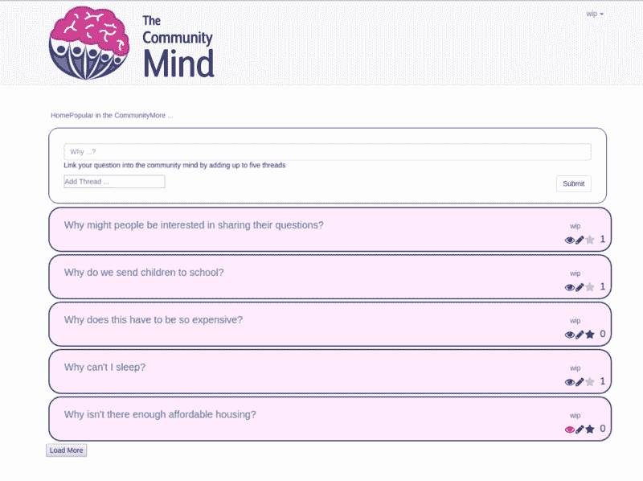
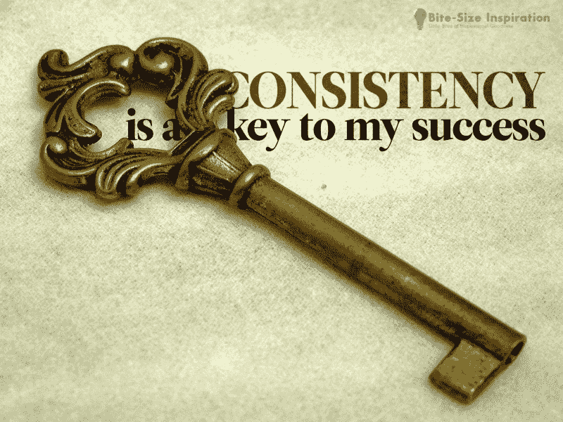

# 关于我的副业项目一周年的一些思考

> 原文：<https://www.freecodecamp.org/news/some-reflections-on-my-side-projects-first-anniversary-f1d78bdd2793/>

威尔·艾布拉姆森

# 关于我的副业项目一周年的一些思考

Photo by [Joseph Chan](https://unsplash.com/photos/iMxsCt2rxAQ?utm_source=unsplash&utm_medium=referral&utm_content=creditCopyText) on [Unsplash](https://unsplash.com/search/photos/celebration?utm_source=unsplash&utm_medium=referral&utm_content=creditCopyText)

我的副业这个月就满一岁了。这是一次真正的学习过山车。

基本上，副业就是你在业余时间做的事情——至少我是这么认为的。这是一个项目，你是自我激励的，而不是承包的。

尽管兼职项目可以有各种各样的风格，但在本文中，我将谈论我的一个软件开发兼职项目。所以让我们开始吧。

### 一些背景

副业应该是你的爱好，你喜欢的事情。

它当然成了我的。

我的兼职项目是在我大学的最后几个月开始的，在我周游东南亚的时候又持续了五个月。既然我已经找到了一份工作，我希望在积极就业的同时继续下去。

在过去的一年里，我已经看到我最初的想法开花结果，开始类似于一个全功能的 web 应用程序。

My live application!

回想起来，我从来没有想到我能走这么远。

我以一年的 Java 开发经验和对普通 JavaScript 的一知半解开始了我的项目。我的目标是能够胜任 React，这是一个每个人都在谈论的新奇的库。我现在就是这些人中的一员。React 超级爽！

我不仅实现了我的目标，而且通过我的项目，我学到了更多:

*   [Node.js](https://nodejs.org/en/) :用于开发我的后端。
*   [Redux](https://redux.js.org/docs/introduction/) :与 React 完美结合的状态管理库。
*   [GraphQL](http://graphql.org/) :一种号称新 REST 的数据查询语言。
*   [ApolloClient](https://www.apollographql.com/docs/react/) :一个 GraphQL 客户端，使构建使用 GraphQL 获取数据的 UI 组件变得容易。同样，这与 React 配合得非常好。
*   认证/授权:我最大的障碍之一。
*   数据库设计:学习如何设计我的模式
*   部署实时 web 应用程序:另一个噩梦般的挑战。
*   宝贵的项目经验，包括组织我的时间和规划发展。
*   Git 的使用。
*   UI/UX 设计:绝对不是我的强项。

开始时试图学习一个单独的库，后来螺旋上升到软件开发的所有其他领域。

为什么？

因为我的项目需要进一步发展。为了实现我最初的想法，我必须学会如何识别最好的技术来解决我的问题。然后走出去，真正地学习它们。

我学得越多，进步就越大。我取得的进步越多，我就越受鼓舞，越想学习。

我的副业创造了一个强大的，积极的反馈循环。这有助于推动我的学习，让我在挑战中保持动力。

看到你所创造的东西在你眼前发展和演变，这确实是需要亲身经历的事情。它缓慢地发生，然后突然发生。

突然你意识到你做了一些让你自豪的事情。

在这篇文章中，我想分享一些我一路走来学到的技巧。

### 从创造中学习，不要学习创造

你不是学习创造什么，而是通过实际创造来学习。这听起来可能相似，但它们是两个不同的世界。为了真正学到东西，我推荐以下高级步骤:

*   选择一个项目。
*   想出一个主意——一些能激励你并且你确实想去做的事情。
*   那就出去努力吧。

你不知道如何走到最后，这并不重要。重要的是你已经迈出了第一步。

当你需要新知识来推进你的项目时，学习新知识。

这样做的最大好处是，你将学到的东西应用到一个真实的项目中，而不仅仅是跟着别人的教程写代码。

我不是说不要跟着教程走。教程是学习基础知识的好方法，但是要确保你自己能够应用你所学的知识。这有助于你巩固理解，巩固知识。

一个副业给了你一个绝佳的机会。

这也给了你一个很好的方法来引导你的学习。这是您的项目，您可以使用您选择的任何库、框架和技术。

例如，在工作中的一个朋友推荐我使用 GraphQL 后，我选择了使用它。这很自然地导致学习一个非语言的客户端。它们是相辅相成的，尤其是在使用 React 时。我非常喜欢在我的项目中使用和学习这两者。

让你的副业成为一个学习、实验和享受的平台。

通过创造来学习。相信我，回报要多得多。

### 挑战自我

我认为，最好的兼职项目想法是那些你梦想的最终项目在项目开始时似乎完全无法实现的想法。

复杂且具有挑战性的事情。

你想拓展你知识的边界，最好的方法就是生活在不可能的边缘。

如果你相信一个有挑战性的项目，它会做得更好。当大多数人放弃的时候，一个强有力的想法会让你保持动力。它会让你经历最艰难的挑战。而且，看到你的想法变成现实也更有意义。

即使你的最终目标看起来不可能实现，你只需要朝着它迈出下一步。确保你的项目具有足够的挑战性将确保你一年后仍在采取措施完成和改进它。对我很有效。

每个人都有想法。软件开发人员很幸运，他们有工具来尝试将他们的想法变成现实！

### 下定决心，始终如一

软件开发很难。会有几天，几周，有时甚至几个月的时间，你在努力寻找你正在寻找的解决方案。

有时候事情就是这样。

这可能会令人沮丧。

你可能会想放弃。

每个人都去过那里，但是…

**不要放弃！**

这些挑战是你学习最多的地方。你把自己延伸到了学习能力的边缘。学会热爱挑战。以此为生。

每当你解决了这些复杂问题中的一个，它就会为下一次建立你的信心。

我明白了，持之以恒地解决一个问题最终会产生一个解决方案。

没有什么是不可学的。没有什么是不可能的。

这是每个开发人员都应该尝试进入的良好心态。

如果你发现自己碰壁了，这里有一些对我有用的方法:

*   休息一下:休息一下会对你如何看待问题产生奇迹。
*   反思:想想你已经取得的成就。这很可能比你意识到的要多。这通常有助于重新激励我。
*   做点别的事情:如果可能的话，做一个不同的问题。我发现，当你把注意力转移到一个新问题上时，答案有时会不知不觉地显露出来。至少，在你项目的另一个领域取得的进展可以鼓舞你的士气，迎接下一次挑战。

永远不要放弃。

### 尽可能多地记录

Anyone can be!

无论是写博客，记下你学到的东西，还是写发展日记。不一定要很多，但也要有所为。

这真的很重要。这是我现在才开始欣赏和应用的东西。

拥有一份你的进展记录可以突出你已经走了多远。这无疑会比你想象的更远。

此外，书面笔记会提醒你上次做项目时的思考过程。

我建议每当你完成一天的发展，给自己写一个小纸条。你今天做了什么，你被什么卡住了，你希望下次做什么。

然后，下次当你回到你的项目时，你将能够很容易地刷新你的记忆。这将允许更多的实际开发，并且你将花费更少的时间来弄清楚你到底在做什么。

为你的业余项目找时间可能很难。无论是一个月还是一天，你都希望尽可能容易地从你停止的地方重新开始。写作是一个很好的解决方法。

我也开始记录问题。每当我遇到一些我不知道的东西，一些让我搜索或学习的东西，我会写下对问题的简要描述。这本身往往有助于澄清问题究竟是什么。然后，一旦我找到了解决方案，我就把它和我使用的任何有用的链接都记录下来。

这就产生了一种解决问题的日记，确保每当我遇到相同或类似的问题时，我都有东西来唤起我的记忆。没有人想两次解决同一个问题。

写作帮助我巩固我的学习。通过写作你必须理解。所以写作是对你理解能力的一个很好的测试，也是对你所学知识的一个快速回顾。

每个人都有最适合自己的不同方法。但是考虑把写作作为你兼职项目的一部分，即使只是为了你的利益。我保证，你会喜欢的。

### 一步一步来

最好尽可能小。

Baby steps

把你的项目想象成一系列的迭代。你可能在迭代 10，所以不要考虑迭代 100。专注于 11 号。

如果你需要学习一些新知识来进步，那么这里就是你学习的地方。完成一个教程，读一篇博客，等等。然后将它应用到你的项目环境中。只学习你前进需要的东西。尝试一次只学习一项新技术。

如果你卡住了，试着分解你的迭代。我发现当我试图解决一个太大的问题时，我经常会被卡住。

随着时间的推移，我逐渐学会问自己，我能尝试解决的最小的问题是什么？通常完成一小步会开启下一步，或者至少给我一个更好的下一步可能是什么的想法。

记住，解决许多小问题远比解决一个大问题容易。

过去的一年是一次充满挑战的学习经历，但也是我非常享受并从中获益良多的一年。

我是一名刚毕业的软件开发人员，我将我现在所知道的许多事情归功于我的副业项目。

兼职项目给你解决实际问题和构建实际应用的信心。这是无价的！

我不能推荐有一个足够的副业。

我热爱软件开发。这都是关于建立想法。我鼓励你走出去，开始建立自己的生活。

你可以在这里查看我最近部署的副项目[，在](http://thecommunitymind.com) [GitHub](https://github.com/wip-abramson/TheCommunityMind) 查看它的源代码。它还有很长的路要走，我欢迎建议，评论或贡献。