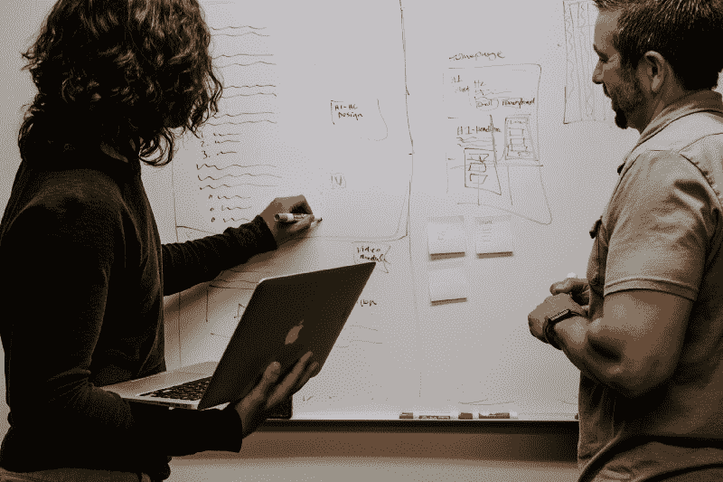
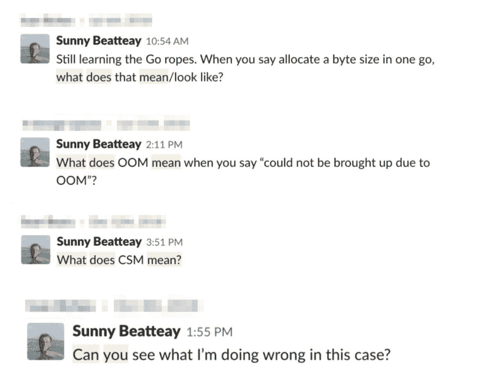
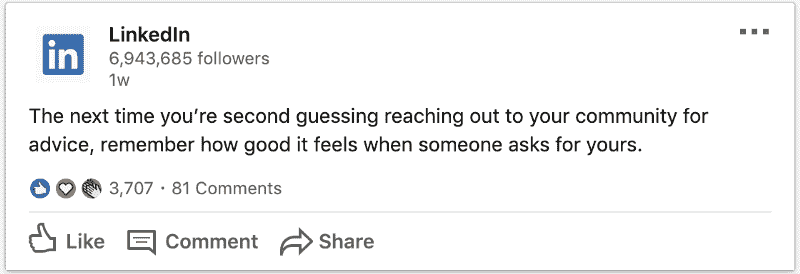

# 快速学习的关键是保持沉默

> 原文：<https://www.freecodecamp.org/news/sometimes-the-key-to-learning-fast-is-looking-dumb-9166fb78c234/>

作者:孙李贝蒂

# 快速学习的关键是保持沉默

Photo by [Nick Fewings](https://unsplash.com/photos/1iesvNXsuZs?utm_source=unsplash&utm_medium=referral&utm_content=creditCopyText) on [Unsplash](https://unsplash.com/search/photos/stupid?utm_source=unsplash&utm_medium=referral&utm_content=creditCopyText)

我在新开发人员身上看到的一个共同特点是害怕看起来很笨。我知道是因为我也有同样的担心。我认为看起来愚蠢会导致别人质疑我的能力，影响我的职业发展。

没有比这更偏离事实的了。为了解释为什么让我讲一个简短的故事。

作为软件工程师，我的首要任务之一是为一个重要客户调查一个 bug。他们在我们的一个 API 端点遇到超时，这影响了他们的工作负载。由于我还是公司的新人，我想向我的团队证明我不需要手把手。向他们表明他们雇对了人。

我花了几个小时解析源代码，直到找到问题的根源:一个低效的 SQL 查询。要修复超时，我需要优化它。不幸的是，这个查询很复杂，需要一些时间来理解它做了什么。但是我决定自己解决这个问题。我绝不是 SQL 专家，但我知道的够多了。毕竟，优化一个 SQL 查询有多难呢？

非常辛苦。

那天剩下的时间和第二天，我都在试图改进它。我被卡住了，几次用头撞墙。但是最终，利用堆栈溢出和大量的手工测试，我能够拼凑出一个解决方案。它甚至比原来的更复杂，但它完成了任务。当我把我的拉取请求放在一起并发给我的队友审阅时，我感到非常满意和高兴。

这种快乐的感觉并没有持续多久。

在打开我的拉动请求时，我的队友注意到有一个简单得多的解决方案。我的脸立刻涨得通红。所有这些努力只是为了让我丢脸。

我不情愿地问他能否解释一下他更简单的解决方案。我担心他会嘲笑我的无能，但他非常乐意陪我度过难关。当我们对它进行基准测试时，它的执行速度比我的弗兰肯斯坦解决方案快得多。

我的队友很有耐心和理解。他甚至给了我一些资源，让我可以继续跟进，了解更多信息。尽管如此，我还是为浪费了两天的工作而感到尴尬。更糟糕的是，在这两天里，我几次考虑向他寻求帮助。我每次都决定反对，因为我不想看起来很傻。结果我看起来更笨了。

当我向他表达这一点时，他表示同情，并说了一些让我难忘的话。

> 下次，不要犹豫问任何你不明白的事情——我们不期望你知道所有的事情。对我来说，花 10 分钟解释某事比让你绕着圈子跑几个小时要好。最终会节省每个人的时间。

Photo by [Kaleidico](https://unsplash.com/photos/3V8xo5Gbusk?utm_source=unsplash&utm_medium=referral&utm_content=creditCopyText) on [Unsplash](https://unsplash.com/?utm_source=unsplash&utm_medium=referral&utm_content=creditCopyText)

虽然这个故事对我来说很特别，但许多新开发人员正在经历类似的磨难。这是可以理解的。当我开始我的第一份工作时，我周围的人似乎都是专家。这是可怕的地狱。我认为达到他们水平的最好方法是坚持，靠自己奋斗。毕竟作为一个自学成才的开发者，我也是这样习惯的。

事实是，如果你想达到同龄人的水平，你需要寻求他们的帮助。如果这听起来像是显而易见的建议，那是因为它确实如此。我们很多人已经直观地知道了这一点。但提醒自己这一点很重要。常识很少变成普遍的实践。

你曾经阻止过自己寻求帮助吗？即使情况变得越来越糟，你也拒绝寻求帮助吗？很有可能你得了 T1。

你为什么停下来？也许现在不是问这个的时候。也许你不想惹麻烦。或者，如果你像我一样，恐惧是一个重要因素。然而，这种恐惧阻碍了我们学习的一个重要部分:反馈。

Photo by [Charles ?? o](https://unsplash.com/photos/Lks7vei-eAg?utm_source=unsplash&utm_medium=referral&utm_content=creditCopyText)n Un[splash](https://unsplash.com/search/photos/feedback?utm_source=unsplash&utm_medium=referral&utm_content=creditCopyText)

### [反馈至关重要](https://unsplash.com/search/photos/feedback?utm_source=unsplash&utm_medium=referral&utm_content=creditCopyText)

在这种情况下，我将反馈定义为你从同事那里得到的任何建议。它可以以团队成员评审您的代码、一起讨论某个特定的 bug 或者简单地问他们“这是做什么的”的形式出现

虽然自学很重要，但这只是学习的一个方面。 [反馈是拼图的另一个重要部分](https://books.google.com/books?hl=en&lr=&id=Yy9EBgAAQBAJ&oi=fnd&pg=PA67&dq=student+feedback+learning+development&ots=bsl5g1jIci&sig=q_FrdMcI-I4Gp4BC87eB7ZbT1pw#v=onepage&q=student%20feedback%20learning%20development&f=false):

> 研究人员和从业人员早已认识到，反馈在学习和发展中起着决定性的作用[……]当我们清楚地知道自己做得有多好，以及需要做些什么来改进时，我们会学得更快、更有效。

然而，很难要求反馈。接受负面的批评会感觉像是对个人的侮辱。你可能会觉得你“应该已经知道了”，寻求帮助是对你幼稚的承认。但是独自努力完成一项任务会导致压力，而压力会让你变得愚蠢。

不愿意在短期内显得愚蠢，从长远来看只会让你显得更愚蠢。因此，与其反复思考一时的不安，不如专注于你的长期目标。负面评论的刺痛是短暂的，但学习的益处是永恒的。

### 直接结果

反馈最大的好处是效果立竿见影。你会立刻比以前知道更多。不断地寻求反馈会让你的学习速度突飞猛进。你会发现自己问问题的频率更高了。

相信我。搜索短语*有什么用？*或*是什么意思？*在我的搜索中，我发现了一连串我问过的“愚蠢”问题。

我问这些问题是不是觉得很蠢？哦是的。我是否因此学到了很多东西？绝对的。

### 问问题让你看起来更聪明

如果我还没有说服你，那么我把最好的留到了最后。事实是提问不会让你变笨。[完全相反](https://hbr.org/ideacast/2016/06/asking-for-advice-makes-people-think-youre-smarter.html):

> 事实上，我们认为寻求我们建议的人比放弃寻求建议机会的人更有能力。这是因为被人征求意见是一种恭维，这种感觉很好。他们在征求我的意见，因为他们认为我很聪明，我知道答案。我认为他们很聪明，因为我会告诉他们有用的东西，帮助他们更好地完成任务。

征求同事的意见会让他们觉得自己很重要，被需要。事实证明，人们喜欢这种感觉。作为回报，他们认为你有能力有勇气去问。这是戴尔·卡耐基的《如何交友和影响他人》中的一页**。**

**

*最后，你将是那些正在为同样的问题而奋斗的人的天赐之物。我不止一次在某个具体问题上寻求帮助，结果却是另一位工程师私下感谢我的请求。他们一直在同一个问题作斗争，但太害羞而不敢问。每个人在某方面都是“小三”。*

*最终，对看起来愚蠢的恐惧就是:由不安全感支撑的毫无根据的恐惧。不仅寻求反馈和表现脆弱会让你看起来更有能力，而且还会让你更有能力。*

*所以下次你发现自己陷入困境时，帮自己一个忙，寻求帮助。你现在可能会觉得很笨，但是给它时间。他们很快就会向你寻求建议。*

### *我的更多信息:*

*[***我是“真正的”软件工程师了吗？***](https://medium.freecodecamp.org/am-i-a-real-software-engineer-yet-a0f38a2248c0)
[**两个网站的故事**](https://medium.freecodecamp.org/a-tale-of-two-websites-the-importance-of-slow-progress-and-self-reflection-4a09ffcbd059)
[*缓慢进步和自我反省的重要性*medium.freecodecamp.org](https://medium.freecodecamp.org/a-tale-of-two-websites-the-importance-of-slow-progress-and-self-reflection-4a09ffcbd059)[**如何获得我梦想中的软件工程工作**](https://hackernoon.com/what-it-took-to-land-my-dream-software-engineering-job-17c01240266b)
[*甚至在 2018 年 1 月开始求职之前，我就知道自己想去数字海洋工作。文化，学习……*hackernoon.com](https://hackernoon.com/what-it-took-to-land-my-dream-software-engineering-job-17c01240266b)*